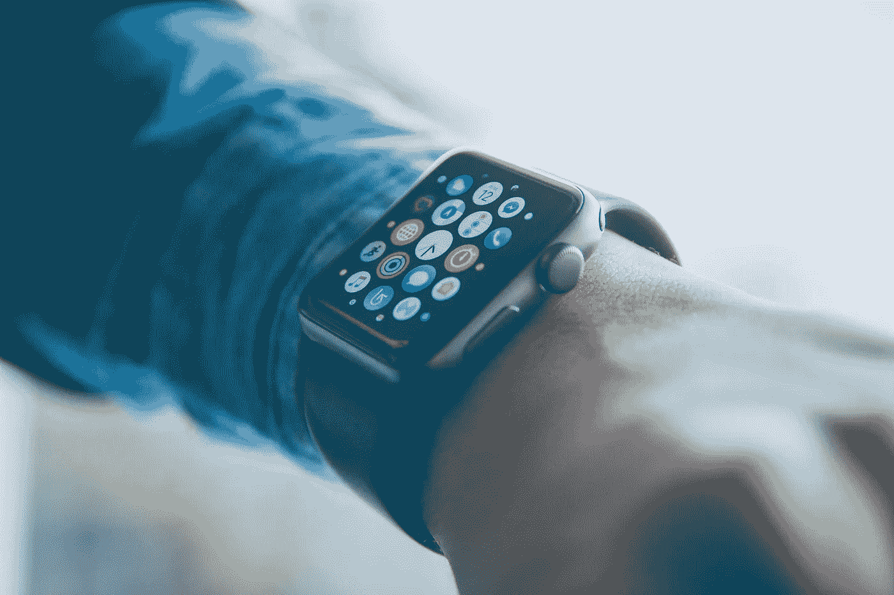
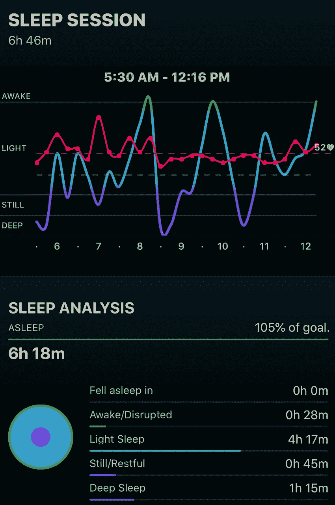
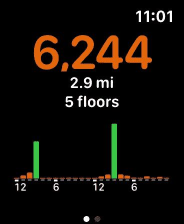
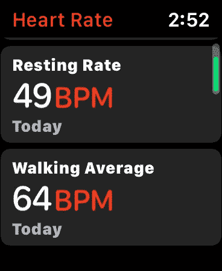
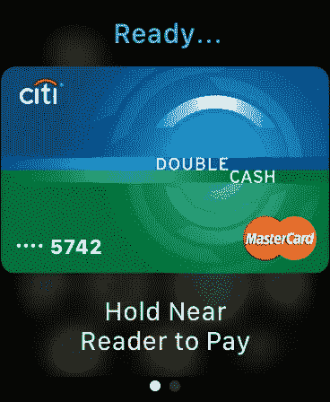
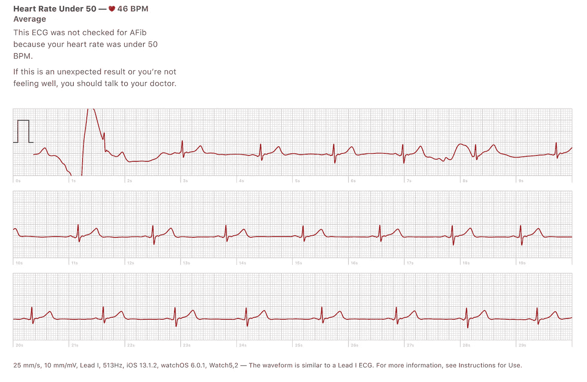
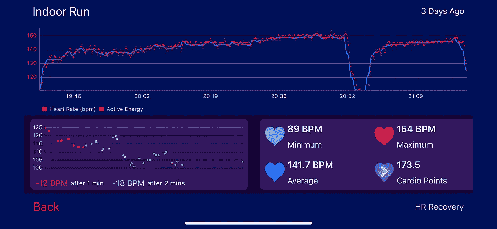
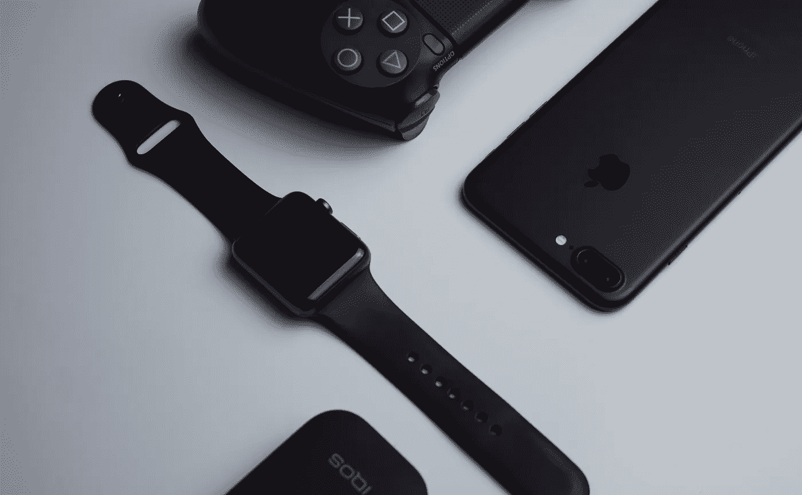

# Apple Watch 如何改变我的生活以及可穿戴设备的颠覆性潜力

> 原文：<https://medium.datadriveninvestor.com/how-apple-watch-changed-my-life-and-the-disruptive-potential-of-wearables-6792bbac64f2?source=collection_archive---------1----------------------->

## 许多小事情累积起来会带来颠覆性的变化

直到最近，我都忽略了苹果手表和智能手表这两个噱头。起初，我无法理解这有什么大不了的，因为它们只是手表，所以我忽略了它。然后随着它们变得越来越强大，越来越被炒作，我开始明白为什么它们很重要，但我仍然没有得到一个，原因如下:

*   **我觉得充电太麻烦了，因为这又是我要担心的一件事**
*   **我不想在手腕上戴任何东西**
*   **我不想花 400 多美元去买它**

随着 Apple Watch 的每一个新版本都推出了稍微好一点的功能，我越来越感兴趣，也越来越渴望得到一款。我甚至去苹果商店试了几次，但我觉得自己没有理由花那么多钱买一个用途不明的设备。

我已经对花 100 美元买一支苹果铅笔感到失望了，我只用它在我 iPad 上的绘画指导应用程序上画了一只袋鼠。我担心购买苹果手表会有类似的经历。

最后，我屈服了，买了最新的 Apple Watch Series 5，我的日常生活已经发生了巨大的变化。

我将描述我是如何得到一个的，以及从那以后我的生活是如何改变的。

# 购买苹果手表的动力

## 心率生物标志物的重要性

我偶然看到抗衰老研究人员文森特·朱利亚诺关于健康变量效用的两部分视频演示([第一部分](https://www.youtube.com/watch?v=kg1GbXk9yEk)，[第二部分](https://www.youtube.com/watch?v=4oe1rK6xZpA))。

演示中的一张幻灯片显示了夜间静息心率(ERHR)和早晨静息心率(MRHR)之间的差异或比率是一种很好的生物标记，可用于测量身体因睡眠而恢复的情况。

这只是通过 Apple Watch 使用心率追踪器以及运动传感器和 GPS 获得的可能衍生生物标志物的一小部分样本，例如:

*   不同情况下的心率，如睡眠、休息、行走和跑步
*   聚合指标，如一天内和多个时间段的平均心率、趋势和异常值
*   精确到毫秒的心率变异性

如果你触摸手表来完成一个电路，甚至还有一个心脏心电图(ECG)。

## 心率监测器的使用

我知道心率的重要性，但我只能非常粗糙地使用它，因为我有粗糙的方法来确定它。

例如，有许多心率监测应用程序使用我的 iPhone 7 Plus 上的硬件，可以获得心率。特别是，相机可以用来跟踪被手机闪光灯照亮的手指，以观察皮肤下表示血液流动的细微颜色变化，从而确定脉搏。

但这种心率跟踪方法远没有这么复杂，因为当我的手指贴在摄像头上时，它每 20-30 秒才读取一次数据。我不能做像下面这样复杂或高级的事情。

*   无法全天测量心率
*   无法在入睡时、睡着时或醒来时测量心率
*   无法精确到毫秒来测量心率变异性
*   没有巨大的努力，我无法记录所有这些
*   跑步时无法记录心率
    作为一个每周跑 42 英里的人([我讨厌跑步，但仍然每周跑 42 英里](https://medium.com/@postbio/i-hate-running-yet-still-run-42-miles-per-week-708a6ae787d8))，我也可以将它用于心率训练区。

由于我最近也买了一部新的 iPhone 11 Pro Max，我认为现在是购买最新款 Apple Watch 的最佳时机。

**所以我终于这样做了，我的日常生活已经发生了很大的变化，这很可能会改变我的生活。**

# 日常使用

为了更好地解释 Apple Watch 如何改变了我的日常生活，我将介绍一下在一天中我可以使用 Apple Watch 的最重要的方式。

一个核心主题是，没有一种功能可以完全改变我的日常生活，而是将睡眠跟踪和心率监测等更引人注目的事情与移动支付等一些更小的事情结合起来，所有这些事情都相互作用，产生巨大的影响。

## 醒来

醒来后，我可以立即看到我整晚睡觉时的心率，以及通过手表传感器检测到的运动在每个睡眠阶段花费的时间。

这太不可思议了，通过我以前使用的心率监测器根本无法实现。在这里，我们可以看到每个数据点都绘制在一个信息丰富的图表中。

Sleep stages plotted with heart rate data with some summary statistics.

## 步行

以前，我可以使用内置的 iPhone 计步器来确定一天的步数，但手表允许以更容易访问的方式实时跟踪和查看步数以及心率。

Left: Pedometer. Right: heart rates in different contexts.

## 支付

到处都有节省时间的人。比如我再也不用掏出钱包，掏出信用卡。这可能需要一点时间，因为我把钱包放在背包里，这可能需要几秒钟，并且需要使用双手。

这里显示的移动支付方法利用了 2%的花旗双现金卡，但它也可以链接到 PayPal、礼品卡和借记卡。我甚至从未想过使用 Apple Pay，因为掏出手机作为支付系统感觉很不自然，但有了手表，感觉非常自然。

Payments on the Apple Watch are more intuitive

## 不看手机的通知

通知可以直接发送到 Apple Watch，这样你就可以在那里看到它们。

它是理想的，因为大多数通知本质上是信息性的，不需要太多的信息来阅读，即使它们很重要。对于特别重要或更多的内容，参考手机也不是太多额外的工作。

这可能最多节省 1-2 秒，但从长远来看意义重大，因为:

*   这 1-2 秒钟累积起来可能会占用很多时间
*   更重要的是，这 1-2 秒钟不会转移对其他地方的注意力

## 心电图

通过用手指触摸手表的表冠(圆形金属表盘)，你可以完成一个电路，从而获得心电图读数。除了苹果的内置分析和标记不良情况(如心房除颤或其他情况)之外，所有这些数据都可以下载并在其他地方进行分析。

当与心率数据的其余部分结合时，该数据对于检测任何潜在的心脏问题至关重要。目前，我计划每天或每周读取一次心电图，只是为了获得足够的数据用于统计分析，甚至可能在以后使用机器学习。

Electrocardiogram (ECG) readings

## 运转

这就是 Apple Watch 在我自己的生活中闪耀的地方，与睡眠跟踪不相上下。这是心率监测器在最近一次跑步中每隔几秒钟采集的数据。这是我日程中的一次普通跑步，每隔一天以每小时 8 英里的速度跑 12 英里，持续大约 96 分钟，中间有一个短暂的休息。

这一趋势中特别有趣的是逐渐上升的心率。这与跑步的持续时间有关，跑步导致身体越来越疲劳，需要更多的心脏血液，这是由我推动跑步来看看如何提高我的心率而激发的。

对于这个追踪和 Apple Watch 的其他部分，它从测量和追踪的能力开始，从中可以制定计划进行改进。如果没有对有形数据的跟踪和记录，你甚至可能不知道问题出在哪里，也就无法制定策略来改善它。

因为在这里，我确切地知道我的心率训练区是什么，以及在每个训练区的感觉如何，所以我更有动力在未来的跑步中推动自己达到这些训练区，而我可能没有这样的动力。

这种跑步心率跟踪在很多层面上都是不可思议的，很少有文章可以深入探讨。我只是想展示它的完整性。

## 混合物

Apple Watch 在我的日常生活中还有其他各种各样的用途，我将在这里列出来。这不是一个全面的列表，尤其是因为在其他地方有许多很好的综合指南，这可能包括女性专用的应用程序，如周期跟踪，我个人显然不需要。

*   **计算器** —保存到任何计算设备的快速访问或在浏览器的搜索栏中查找。
*   **地图**——好到足以取代完整的智能手机版本。
*   **天气**——可以直接显示在表盘上。
*   发短信——阅读收到的信息并快速回复很不错。它还可以让你不至于分散注意力，因为你只限于非常简洁的回复，并鼓励你等到以后可以在智能手机上更全面地打字时再回复，从而更有效地利用你的注意力和时间来一次性回复所有未完成的信息。
*   **股票**——链接到雅虎财经，可以直接存在于表盘上，这样你就可以随时了解最新动态。如果你一直关注价格，这实际上可能是一件坏事。
*   **活动环** —这些环一开始很棒，但它们的用途是在后台无缝工作，通过一个不显眼的提醒来捕捉你的运动、锻炼和站立活动。
*   **无线耳机控制—** 对我来说，这很有用，因为我的 Jabra 65t Elite 有源无线耳机有一个很酷的功能，叫做“听穿”，它通过耳机传递环境声音，所以你仍然可以听到环境噪音，就像你没有戴耳机一样。
*   **相机控制** —允许你通过 Apple Watch 查看取景器。有用，这样可以拍远程照片，也可以拍自己的照片

我想重申的是，这些功能本身都不是游戏规则的改变者，但是它们的协同组合确实是游戏规则的改变者，这让我非常兴奋地写了这篇文章，并思考了对未来的影响。

# 只有开始

我们在这里看到的只是 Apple Watch 的开始。在硬件更新的后续版本中，可能会有更多的特性、功能和优势。我已经告诉我妈妈，我会给她手表系列 5，并购买手表系列 6 时，它出来了。

## **未来的一些改进**

*   **始终开启(或关闭)的 Apple Watch
    —电池寿命**
    Apple Watch Series 5 的电池寿命在正常使用情况下可持续约 18-24 小时，绝对够用一整天，但或许电池寿命在未来可能会提高到持续 48 小时以上，这样就有可能佩戴更长时间，从而获得更完整的数据集。
    **——戴着充电**
    相关的，可能是开着也能给 Apple Watch 充电的东西。这将有助于获得更高质量和更全面的数据。
*   **使用柔性印刷电子产品的 Apple Watch**
    ——也许手表本身可以从一个“笨重”的电子设备中消失，变成一个可以类似纹身的薄膜。
    —这意味着身体感应可以更加精确，因为现在您可以在腿上、另一只手腕上以及身体的任何部位安装额外的“手表”，以获得更大的可能性，例如更精确的能量计数或增强对步态或肢体使用的物理跟踪。
*   **从研究中获得更好的见解**
    ——随着 Apple Watch 变得越来越普及、越来越便宜、越来越强大，它将允许大规模数据的宝库可用于更好的机器学习模型。
    —例如，谷歌的一项研究使用视网膜扫描数据集来识别 5 年内可能会患心脏病或类似疾病的患者，准确率约为 70%，与使用血液和胆固醇水平的准确率相似。这项研究“只”涉及 30 万名患者，但想象一下，对于 3 亿或 30 亿或更多的人来说会存在什么。

## 数据收集的重要性

有趣的是，即使我们还不知道我们将如何使用这些数据，简单地拥有这些数据本身就是有用的。

我认为这类似于开采贵金属。

虽然可以实时筛选地球并开采这些贵金属，但另一种方法是将整个岩体挖掘到一些大型先进设施中，然后再筛选地球上的贵金属。这可能优于现场采矿，因为更先进的工具可以做到更精确，更完整，更便宜，更快。

这种类比是有局限性的，因为运输大量的灰尘本身可能是一项昂贵的操作，比简单地以电子方式收集所有数据并存储在数据库中要昂贵得多。

## 前进

我非常兴奋地看到苹果手表和可穿戴设备的发展。

有很多无意中使用技术的例子，只是后来才变得清晰，或者在不同的环境中变得更有价值。

在这种情况下，当超越硬件本身并进入收集的数据时，Apple Watch 的意义可能会变得更加广泛和更有价值。例如，我们可以在未来使用数据挖掘和机器学习，可以使用现有的数据来更好地洞察涉及我们在收集数据时尚未概念化的过程或想法。

不用说，Apple Watch 的所有这些用途已经极大地改变了我的日常生活。