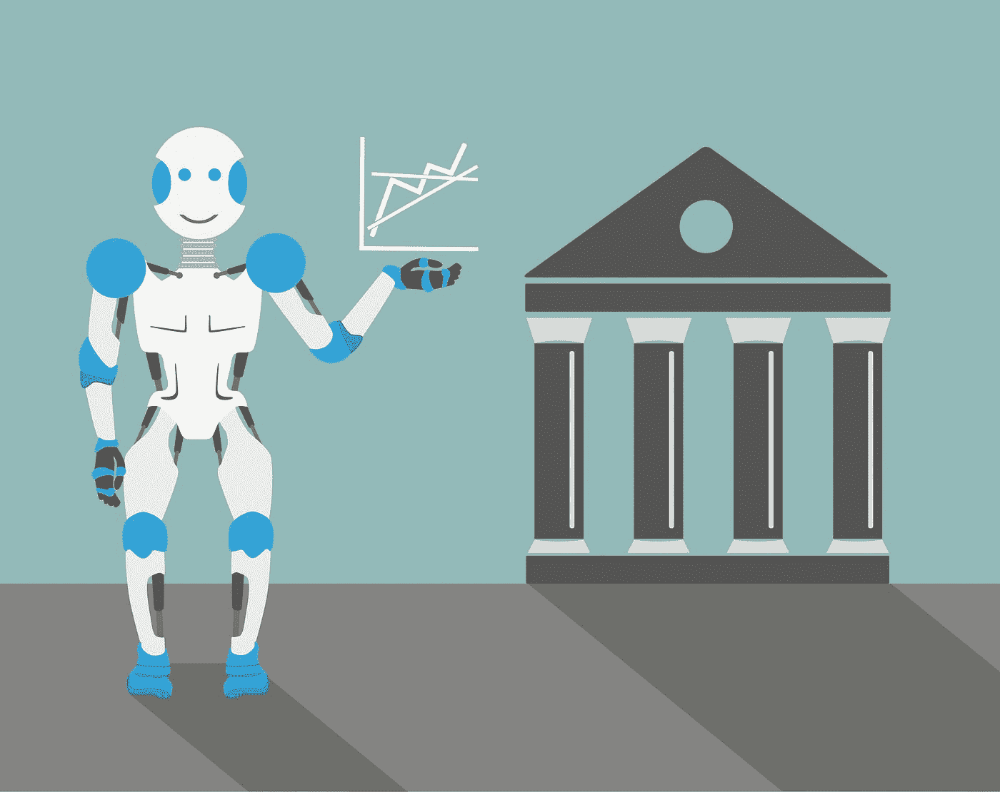

# 人工智能(AI)将如何改变银行业

> 原文：<https://medium.datadriveninvestor.com/how-artificial-intelligence-ai-will-change-banking-80ad1fc470ea?source=collection_archive---------2----------------------->

人工智能是计算机科学的一个领域，专注于通过开发可以在一定程度上复制人类智能并有可能超越人类智能的计算机程序来使机器变得智能。

这项备受关注的技术在金融行业也有许多可能的应用。人工智能最常见的四个金融用例是客户服务、金融建议、反洗钱模式识别和欺诈检测。

**客服聊天机器人**

根据[埃森哲银行技术愿景 2017](https://www.accenture.com/t20170530T164033Z__w__/us-en/_acnmedia/Accenture/next-gen-4/tech-vision-2017/pdf/Accenture-TV17-Full.pdfla=en?la=en) 报告，“人工智能正在成为公司的代言人”。对于金融服务公司来说，这意味着利用人工智能聊天机器人，这些机器人可以处理企业每天必须处理的客户服务查询浪潮。最简单的人工智能形式已经存在多年，即自动客服热线上的语音识别，但随着客户转向实时聊天，人工智能将通过聊天机器人在客户服务中发挥越来越大的作用。

聊天机器人是基于人工智能的自动化实时聊天系统，可以在没有人类干预的情况下模拟人类对话。聊天机器人通过识别客户所写文本的情感和上下文来发挥作用，并以最恰当的回复做出回应。聊天机器人还收集大量关于用户行为和习惯的数据，它们学习这些数据以适应未来的客户查询，包括能够更好地衡量客户的情绪。

聊天机器人使金融机构能够降低其客户服务运营的成本，而不会降低所提供的客户服务的数量或质量。在竞争日益激烈的银行业环境中，移动银行初创企业正在与成熟的商业银行争夺存款，高质量的客户服务对于客户的获取和保留比以往任何时候都更加重要。

据[埃森哲](https://www.accenture.com/us-en/insight-disruptive-technology-trends-2017)称，在全球范围内，79%的金融服务专业人士认为人工智能将改变金融机构收集数据和与客户互动的方式，而 76%的人认为在未来三年内，金融机构将使用人工智能作为与客户互动的主要方法。

**定制理财建议**

今天，人工智能可以超越纯粹处理客户服务查询。人工智能还可以通过使用涵盖金融机构产品和客户过去数据的大数据，提供定制的金融建议。

例如，如果银行客户想要申请个人贷款，人工智能可以整合广泛的客户数据点，如信用评分、社交媒体反馈、消费模式等，以确定合适的利率和客户可以借款的金额。

或者，投资管理公司可以利用先进的[自然语言生成(NLG)](http://resources.narrativescience.com/h/i/124944227-what-is-natural-language-generation) 自动撰写投资评论，向投资者通报其基金的表现。通过应用这种形式的人工智能，投资经理可以实时发布报告，并与他们的分销渠道共享，从而节省分析数据和制作这些报告的时间和金钱。最重要的是，这些报告还可以为每个个人投资者量身定制。

定制的金融建议也可以以人工智能驱动的投资建议的形式出现。例如，金融科技初创公司 Pefin 使用前馈神经网络来分析消费者的答案，以提供定制的投资建议，从而为“不太富裕的人”提供负担得起的个人理财建议。

Pefin 创始人兼首席执行官 Ramya Joseph 告诉[美国消费者新闻与商业频道](https://www.cnbc.com/2017/09/08/fintech-start-up-pefin-uses-a-i-to-offer-financial-advice.html):【机器人顾问】正试图执行一项交易，而我们正试图管理你的财务。投资对我们来说是可有可无的，如果我们认为这对您来说是正确的选择，我们会帮助您[…]。你在这个系统中呆的时间越长，我们学到的东西就越多，我们就能更好地预测和建议你，因为我们可以把它与你的习惯和对你有效的东西联系起来。”

**反洗钱模式检测**

虽然商业中面向客户的一面可能是人工智能最常被谈论的应用，但该技术也可以在反洗钱(AML)模式检测中提供有用的服务。洗钱一直是金融监管机构和执法机构关注的重点，这也是银行总是试图在潜在的洗钱活动发生时立即发现它们的原因。在人工智能的帮助下，这将变得更加容易。

在大多数洗钱案件中，犯罪分子通过一系列步骤来隐藏他们的行为，使其看起来像是来自非法来源的资金是合法获得的。其中一个主要原因是银行客户必须经历漫长的入职和 KYC 流程。然而，犯罪分子建立合法的企业，可以通过这些程序，然后通过金融系统洗钱。

直到最近，金融机构一直使用基于规则的软件程序来识别潜在的洗钱活动。现在，他们正在转向基于人工智能的程序，这些程序部署了一种更加智能的方法来发现反洗钱模式。

根据合规周刊的 Jose Tabuena 所说，“机器学习的进步和大规模计算资源的可负担性使得更复杂的异常检测成为可能。”这是新的人工智能系统所能提供的。然而，Tabuena 还认为，“为了实现这种新的威胁检测方法，合规专业人员需要更多的核心运营流程知识，以了解潜在合规事件的业务背景。简而言之，人的因素仍然至关重要。”

**欺诈检测**

欺诈检测是人工智能将能够在金融服务业发挥关键作用的另一个领域。根据[尼尔森报告](https://www.nilsonreport.com/index.php)，到 2020 年，仅全球信用卡欺诈就将使金融业损失超过 350 亿美元。这是金融机构投资新技术以最小化这些损失的充分理由。

人工智能可以通过使用[神经网络](http://pages.cs.wisc.edu/~bolo/shipyard/neural/local.html)、[机器学习](https://www.sas.com/en_us/insights/analytics/machine-learning.html)和大数据，以比人类或传统系统更快的速度识别欺诈案件。

基于人工智能的欺诈检测工具的一个例子是 [FICO Falcon 欺诈评估系统](http://www.fico.com/en/products/fico-falcon-fraud-manager)。它基于神经网络，部署深度学习方法来“防止、检测和管理整个企业的欺诈行为”，涉及信用卡、借记卡、移动和电子支付。FICO Falcon 欺诈管理器可用于检测欺诈，制定防止欺诈的策略，并在机构的产品套件中执行与欺诈相关的决策。

FICO 的系统是将人工智能技术融入欺诈检测的早期项目之一，但鉴于欺诈对金融业的负面影响，许多类似的基于人工智能的系统可能会随之出现。

人工智能有望在未来五到十年内成为扰乱金融服务业的最具影响力的技术之一。人工智能将帮助金融机构与客户沟通，建立更好的客户关系，并减少洗钱和欺诈案件。

*原载于 2018 年 2 月 23 日*[*【www.datadriveninvestor.com】*](http://www.datadriveninvestor.com/2018/02/23/how-artificial-intelligence-ai-will-change-banking/)*。*