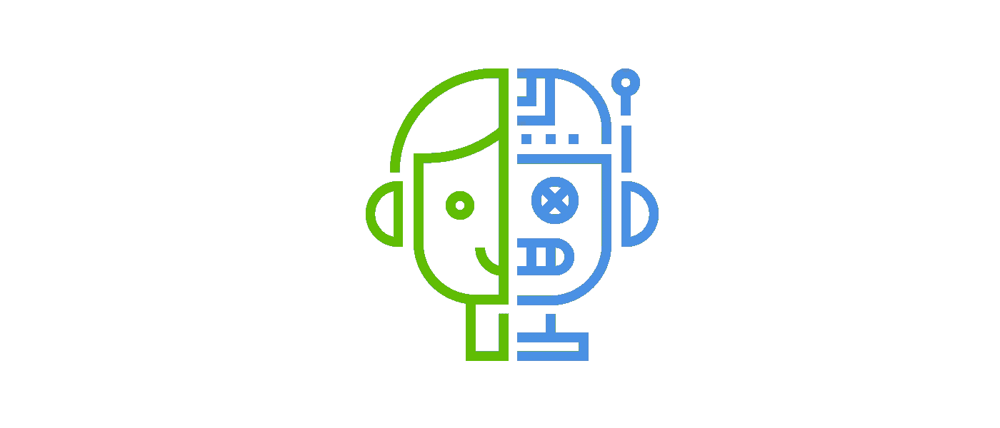
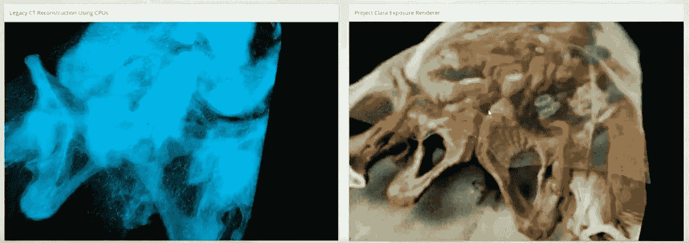
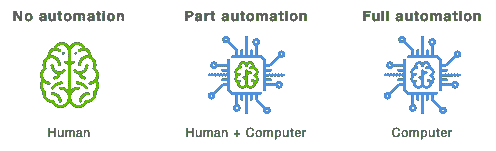
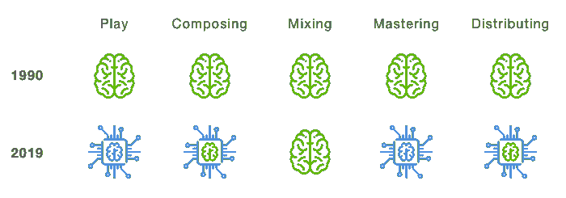
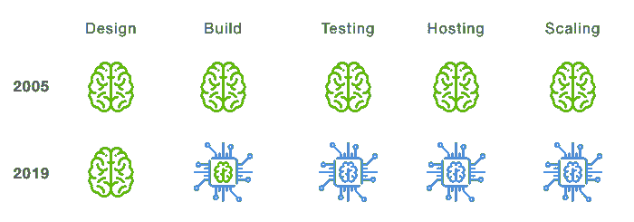
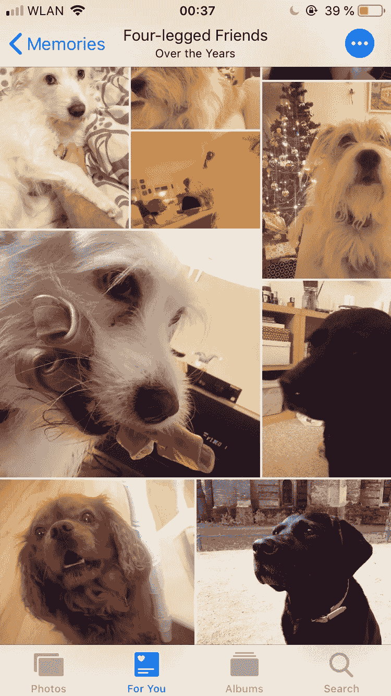
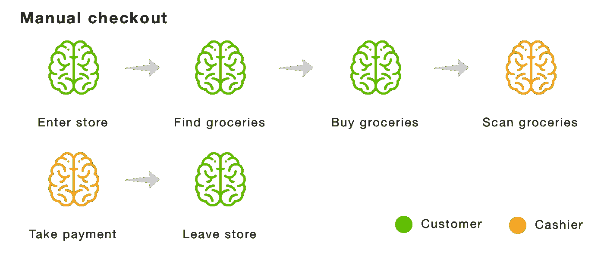
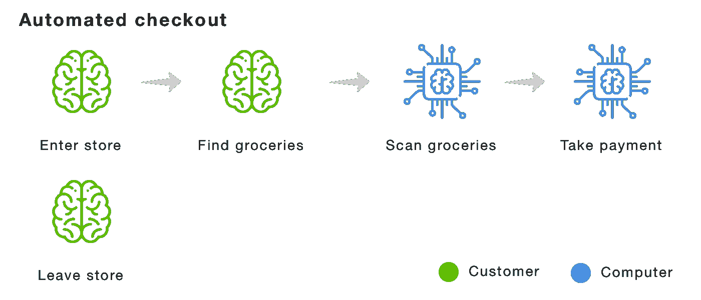

# 人工智能和自动化如何使工作民主化

> 原文：<https://medium.datadriveninvestor.com/how-artificial-intelligence-and-automation-is-democratizing-work-6e1c54b2d71c?source=collection_archive---------14----------------------->

Human and Machine. Icon from Flaticon

太好了，正是你所需要的，又一篇关于人工智能、自动化和地球即将毁灭的文章。

每个人都会失业，拿着干草叉跑到街上，然后机器接管世界，把我们都变成电池！

不完全是。

但我认为自动化和人工智能将会使我们所做的事情民主化，并降低未来工作的门槛。

# 工业革命

自 18 世纪以来，世界一直在经历一些对社会产生重大影响的工业革命。

第一次革命主要是关于从农业社会到工业社会和城市社会。我们有钢铁和纺织工业，还有值得信赖的老式蒸汽机。

**第二次革命**是在此基础上的扩展。钢铁、石油、电力、模拟电子、大规模生产、灯泡、电话、留声机和内燃机。

**第三次革命**仍在进行，但与前两次完全不同，因为它带来了数字电子时代，使计算机、互联网、智能手机等技术以及随之而来的所有魔力成为可能。这项技术允许我们在物质现实的基础上创造一个新的非物质现实。到目前为止，我们主要是自动化和优化不同类型的流程和不同类型的制造。

第四次革命已经开始，现在是时候让我们的大脑自动化了。谷歌现在可以通过给你的发廊打电话预约理发，并和你的理发师交谈。你的手机知道你的照片上有什么。没有你汽车也能行驶。目标知道你何时怀孕。脸书知道你是否聪明是因为你喜欢什么和你的朋友是谁。谷歌可以在 99%的测试案例中检测到转移癌。你的 Apple Watch 可以告诉你是否患有房颤。DeepMind 将谷歌数据中心的冷却费用降低了 40%。NVIDIA 现在可以将 CT 扫描的斑点变成正常人可以理解的人体内部的真实 3D 模型。我们才刚刚开始。

Regular CT on the left. NVIDIA Project Clara on the right. — NVIDIA

# 工作是如何民主化的？

通过把要做的工作抽象到计算机中，让我们做决定，工作正在民主化。

Icons from Flaticon

当我们这样做的时候，我们降低了那些没有技术的人的进入门槛，实质上允许他们走捷径。我们仍然需要知道我们做事情的原因和目的，但更不用说如何做了。我们来看几个例子。

现在是 1990 年，你正在录制一张专辑。在你到达这里之前，你首先要学习。你报名参加了吉他课程和乐理课程，几年后你就能记住歌曲，并用吉他弹奏。如果你是一个幸运而有才华的人，一些有影响力的人不知何故听到了你的音乐，你最终得到了一份唱片合约。他们花大价钱租了一个工作室，里面全是昂贵的硬件和知道如何操作这些设备的人。在你的音乐被录制后，它会被发行到你所在国家的商店和电台。

**现在是 2019 年，你正在录制专辑。你不知道如何演奏乐器，所以你使用你的电脑可以演奏的虚拟乐器，你不知道音乐理论到底是什么。你有一部智能手机，一个麦克风和许多想法。因为你不懂乐理，所以你用和弦进行 app 找到你喜欢的和弦，让你自己决定怎么安排。几天后你对你的歌很满意，但你不知道如何混音。你可以去 YouTube 上学习，而不必带着录音室咖啡的调音师去学两年手艺。当你完成混音后，你会意识到你也必须掌握音轨。你不想把时间花在学习这些上，你也不想付给一个大师级的工程师 100€一小时，所以你把你的音乐上传到云端，在那里一个人工智能每月为你制作 5€的音乐。然后，你只需点击一个按钮，就可以免费向全世界分发音乐，并开始在网上推广自己，确切地知道在哪个城市演奏，因为你知道人们在哪里听你的音乐。**

Then vs now. A simplified view of the music making process. Icons from Flaticon

**现在是 2005 年，你正在网上开始你的第一个软件生意。你已经准备好了你的商业计划，而且你知道如何编程。你必须编写你软件的每一部分。你需要知道至少两种编程语言，一种用于服务器，一种用于浏览器。你雇了一个设计师来设计一切。然后构建您的应用程序。除了开发您的应用程序之外，您还花了两个月的时间创建了一个用户管理系统，意识到当涉及到安全性时，这是一个多么复杂的陷阱。你的申请终于准备好了。你意识到你对设置服务器一无所知。你开始自己做这件事，但是注意到这是一个比你糟糕的用户管理系统更深的兔子洞，所以你最终雇佣了一个知道如何设置服务器的人。8 个月后，你终于推出了你的产品，它变得如此受欢迎，以至于你遇到了可伸缩性的问题。你需要更多的服务器，主机提供商需要订购新的硬件并进行安装，这需要两周时间。**

与此同时，你要处理因为你的软件太慢而抱怨的客户，同时重写你的软件的一部分，以便能够在多个服务器上扩展和运行，这本身就是一种职业。你开始怀疑你是否能走出这个兔子洞。你不知道。这是你现在的生活。

现在是 2019 年，你正在开始你的第一个在线软件业务。你已经准备好了你的商业计划，你知道如何编程。你只需要知道一种编程语言。你可以下载一个免费的预先设计好的模板，它足以让你入门。您将云服务用于用户管理、支付和分析。两个月后，你将你的应用上传到云中，云将随着你的应用的增长而自动扩展，让你专注于建立业务和改进你的产品。

Then vs now. A simplified view of the changes in the process of software development. Icons from Flaticon

这种将知识抽象成计算机软件的过程并无新意。我们已经做了几十年了。

我们通过学习和绘制模式做到了这一点。一旦它们建立起来，我们就把这些模式变成计算机可以理解的规则。但是这些规则的复杂程度是有限的。

近年来发生的根本性转变是，我们现在能够给计算机答案，它会找到模式，并编写如何在野外发现这些模式的规则；这叫做 [*监督学习*](https://www.mathworks.com/discovery/supervised-learning.html) 。这就是我的智能手机如何让我想起我的四条腿的朋友。

My four-legged friends ❤

然后我们有 [*无监督学习*](https://www.mathworks.com/discovery/unsupervised-learning.html) 让计算机自己寻找模式。这就是为什么 AlphaZero 在 34 小时内成为世界上最好的围棋手。

这些技术允许我们自动化比以前更复杂的模式。

不涉及任何智能，只是非常好的*模式识别和预测。*

这给我们留下了一个基本问题。

# 我们如何知道我们可以自动化什么？

没有简单的答案。这是对要做的工作的理解和当今技术局限性的结合。

如果我们确定了要做的工作，我们可以看看这项工作需要什么，并考虑我们需要什么才能完全自动化。

当我听说亚马逊开设了一家没有人结账的商店时，我感到很困惑。我根本没想到会有这一天。让我们来看看从人工结账到全自动结账需要什么。

Icons from Flaticon

首先，我们要了解收银员的工作。当顾客来到收银台时，收银员会:

*   识别顾客和他们带来的食品
*   将顾客的食品扫描进电脑
*   接受顾客的付款

Icons from Flaticon

那么，如果我们把收银台拿掉，换成一台电脑，会是什么样子呢？

让我们先来画出计算机必须具备什么样的能力来做和收银员一样的工作。

*   认识顾客
*   识别顾客拿的是什么产品
*   识别顾客拥有的产品
*   识别顾客退回的产品
*   当顾客离开时，接受他们的付款

既然我们已经理解了我们必须解决的高层次问题，那么让我们来考虑如何解决它们。

**为了在顾客进入时认出他们**我们需要能够将走进来的人与他们在亚马逊的账户联系起来。我们可以通过给顾客一个独特的条形码来做到这一点，当他们进入商店时，他们可以扫描。当他们这样做时，我们使用安装在天花板上的摄像头和计算机视觉算法来唯一识别这个人，并将代码绑定到他们身上。现在我们可以在商店里追踪他们。

**为了识别顾客拿了什么产品，我们建造了专门的货架，每个货架上都有重量传感器。我们确保知道哪些产品放在哪个货架上，以及它们的重量。然后我们用摄像机能识别的独特代码标记每个产品。结合顾客的位置、货架和产品的重量，我们可以通过观察货架的重量变化来确定用户拿的是哪种产品。为了提高准确性，我们还将使用摄像头来识别产品。然后，我们将产品与客户联系起来。**

**为了识别顾客退回了什么产品**我们可以观察顾客从包里拿出了什么产品。如果客户将产品退回到不同的货架，我们总是知道它的重量，因此我们可以使用该信息来识别客户退回的产品。

从顾客那里接受付款很容易。一旦他们走出大门，我们就向他们的卡收费，我们已经将卡存储在他们的个人资料中。

这并不复杂，是吗？显然，说起来容易做起来难，但如果我们没有人工智能的能力，这一切都不可能实现。

# 减去

很明显，自动化和人工智能将使一些工作过时，但它将使未来的工作民主化，使它们更容易获得。

现在的问题是:你工作的哪一部分将被自动化？