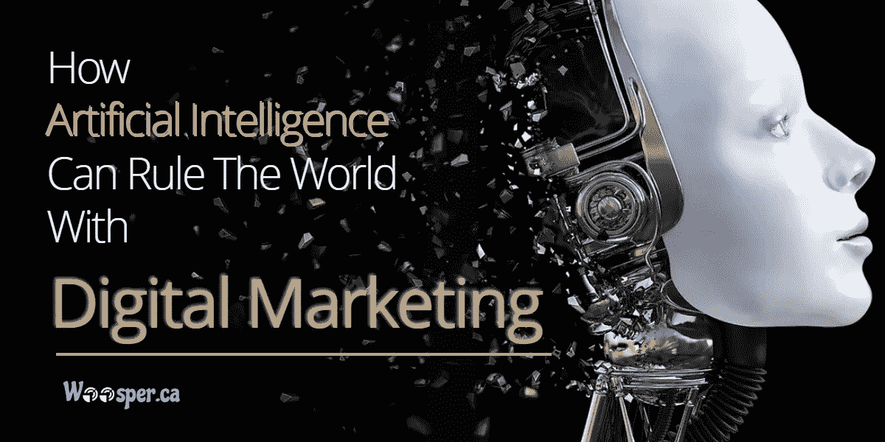

# 人工智能如何用数字营销统治世界？

> 原文：<https://medium.datadriveninvestor.com/how-artificial-intelligence-can-rule-the-world-with-digital-marketing-cac1c69b2e77?source=collection_archive---------9----------------------->

AI 或人工智能是一门研究开发能够像人类一样思考和回答的智能机器的科学。它包含了数字营销领域的极好的未来机会。机器学习和人工智能的影响远不止于此。许多组织都依赖人工智能进行尖端应用，并拥有压倒一切的优势。

作为一名营销人员或商业人士，是时候认识到你的商业广告正在经历的问题以及精确的洞察力如何解决这些问题了。将各种应用程序中流通的所有信息收集到一个地方将有助于您获得清晰的理解。

在人工智能的帮助下，技术可以改变你与用户互动的方式。它可以帮助你驱动相关的流量，获得新的用户，提高销售额，并保留你的主要消费者。

以下是一些要点，说明人工智能及其应用如何帮助您的企业与数字营销战略一起成长:-

# 更新客户体验

由于用户在商业中起着至关重要的作用，同样，内容对于营销人员来说也是至关重要的。示例性的内容广告可以通过对收集的信息负责而被系统化，例如，用户对购买的行为，以及用户关心什么和她/他进行的搜索。

个性化客户体验是一个非常挑剔的领域，如果人工智能进入，它可以通过增强数字营销和搜索引擎优化的改进技术来产生重大影响。

# 程序化广告

数字营销的另一个重要领域是程序化广告。它基本上是利用信息向一个精确的目标客户提供广告。当人工智能被纳入程序时，程序化广告投放只会日益增强。NLP 或自然语言处理具有理解精确数据的消息和实际含义的潜力，并见证广告如何成为该数据的理想匹配。

# 标准方式——聊天机器人

我们都知道聊天机器人可以有各种各样的应用，从抽取销售额到基本的用户服务查询。

如今，由于 Alexa 和 Siri 等虚拟助手越来越受欢迎，用户已经习惯了聊天机器人，并对与它们交流感到舒适。

不仅如此，聊天机器人现在变得如此精致，以至于它们很难找到与真人的区别。事实上，三分之二的用户不知道他们已经在与人工智能工具进行交流。

事实上，它们变得越来越精致，可能需要统治一段时间。去年，在机器人开发出自己的语言后，脸书被迫放弃了一个试验性的聊天机器人项目。

目前，各种不同的组织正在花费资源和时间来创建聊天机器人技术，因此我们将见证到 2019 年和未来更多年的增强。当聊天机器人成为每个应用程序和网站的标准和预期时，这不会令人惊讶。还没有实践它们的组织应该注意，以便保持一致。

# 内容的创造和管理将会更加有效

虽然开发内容确实属于人类智力服务的范畴，但我们怎么能指望机器做到这一点呢？事实上，大量的内容创作具有惊人的重复性，与此同时，机器增强了写作，以至于很难区分它们。显然，由于人工智能，机器现在可以变得可靠，以便制作内容。例如，人工智能已经可以撰写与信息和记录相关的新闻和报告。

当谈到内容营销时，创造内容是人工智能升级的可理解的结果。它可以扫描网络，寻找合适的数据进行管理。现在可以想象自动生成电子邮件营销的规模，其中每个收件人都得到他们自己的特别定制的策划内容与他们的具体关注。营销人员现在可以在特定网站上更好地与访问者互动，并为他们提供更相关的数据。

# 预测性产品推荐

如果你用过网飞或亚马逊，很可能你已经熟悉了预测性的产品推荐。为了提高用户体验，各种组织通过人工智能来关注用户的习惯和偏好，然后对他们认为用户可能感兴趣的产品提出建议。这就像是从软件数据库中模拟的追加销售。

迎合用户的推荐是一种真实而有经验的营销技巧，人工智能只是让它变得简单。凭借检测和分析用户消费行为的能力，人工智能可以比几乎任何人类检查更快、更准确地为组织提供有价值的营销信息。

有了这些数据，组织不仅可以个性化他们的客户体验，他们还可以实践反馈，以增强他们的营销技术、设施和产品，从而吸引他们的用户并提高销售额。

# 语音搜索

这是另一种人工智能技术，但当谈到为了营销而实践它时，它是关于利用首席玩家(亚马逊、苹果、谷歌)创造的技术，而不是创造你自己的能力。语音搜索将改变未来的搜索引擎优化技术，品牌需要跟上。由于人工智能驱动的虚拟个人支持者增强了语音搜索流量，钉钉语音搜索的公司将获得具有高购买意向的有机流量的进步。

# 线索评分

机器学习和人工智能产生的倾向模型可以被训练成根据明确的标准对相关的线索进行评分，以便你的销售团队可以确定某个线索有多“热门”，以及是否值得花时间去关注。在一些采用咨询式销售程序的商业广告中，销售线索评分尤为重要，因为每次销售都要花费销售团队大量的时间。通过联系最相关的销售线索，销售团队可以节省时间，并将他们的精力用在最有效的地方。对潜在顾客购买倾向的理解也可以用来瞄准最有效的销售和优惠。

# 基于人工智能的网站建设者

数字营销中的人工智能确保在设计网站时减少劳动时间。人工智能相关的网站设计平台，网格，可以为你开发一个基于客户信息以及他们如何与你的数据连接的网站。

借助这个平台，商业主唯一要练的就是网站数据。从内容块和颜色到网页，一切都在他们的人工智能设计师莫莉的考虑之中。

与 Siri 和 Alexa 类似，人们可以与 Molly 进行对话，以最终确定他们网站的设计。在网格的帮助下，网站所有者可以预期快速完成他们的网站设计。

其他基于人工智能的网站设计平台包括 Wix 和 FireDrop 人工设计智能(ADI)。FireDrop 的人工智能设计师 Sacha 可以协助网站所有者创建登陆页面。这款 FireDrop 的人工智能设计器旨在接受你的指令，使设计程序更加简单。

此外，网页设计师 Wix ADI 可以在不影响现有网站的情况下寻找人工智能设计师。它旨在向网站持有者提供人工智能设计师可以做什么的感觉。

Wix ADI 从网上获取您的广告数据。与此相关，它将数据分离到设计页面和设计段中。

目前，许多基于人工智能的网站建设者仍处于早期阶段。不过，你可以预期他们在接下来的时间里会变得更加精致。这样的网站建设者就是人工智能数字营销的未来。

# 视频的激增

说到社交媒体，那些利用 Twitter、脸书和 Instagram 进行营销的公司将会坚持下去。这些领奖台也是针对视频的。特别是，视频直播是社交媒体讲台上的一颗新星。根据一项调查，到明年，世界各地观看在线视频的用户将增加 25%。这为品牌提供了另一个机会，让它们掌握主动权，用自己关心的数据取悦用户。顺便说一下，这是数字营销的重点。

# 电子邮件营销

公司正在实践人工智能的力量，根据消费者的态度和偏好定制电子邮件营销活动。这使得更好地与他们接触并幸运地将他们转化为客户成为可能。

此外，自动学习和机器学习可以检查用户的丰富信息，然后调整一周中与消费者联系的最佳日期和时间，最能抓住他们注意力的数据的建议频率，以及哪些电子邮件标题和主题产生更多点击。A/B 测试耗费时间，并且可能有一定的误差。因此，在这些条件下，人工智能在为每个订户定制电子邮件内容方面成为你最好的朋友。

# 定论

今年和未来几年，人工智能将在数字营销领域发挥至关重要的作用。营销人员需要更好的用户体验、定制的覆盖范围和最相关的数据，以便在竞争中领先于竞争对手。基于人工智能的技术对所有这些问题都有回应，这将使商业走上盈利、效率和生产力的道路。营销人员是时候登上人工智能驱动的新范式了。

人工智能一直在扩展和增强，暂时不会退缩。将人工智能运用到你的数字营销技术中，将有助于用户获得更好的体验，并为你的商业提供成功所需的理解。

来源:[http://www . woos per . ca/blog/how-artificial-intelligence-can-rule-the-world with-digital-marketing/](http://www.woosper.ca/blog/how-artificial-intelligence-can-rule-the-world-with-digital-marketing/)