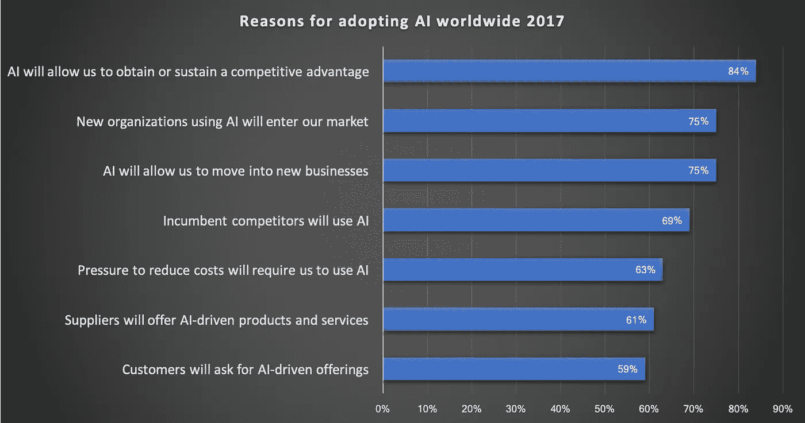
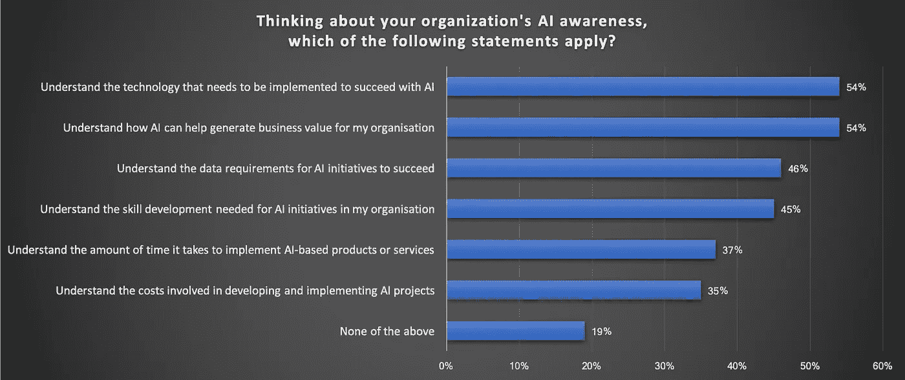
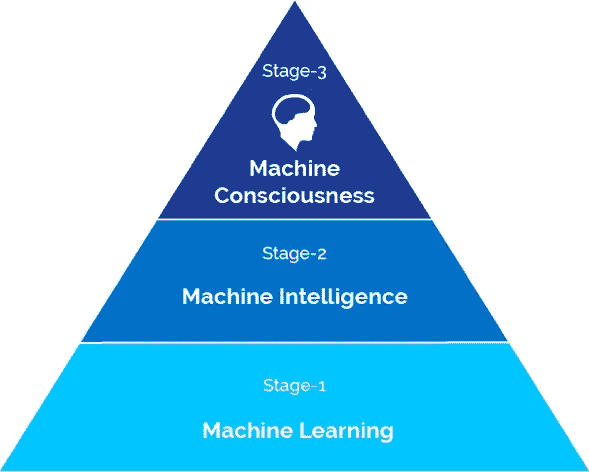
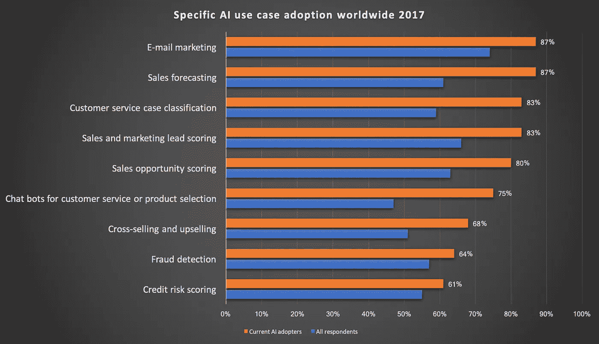
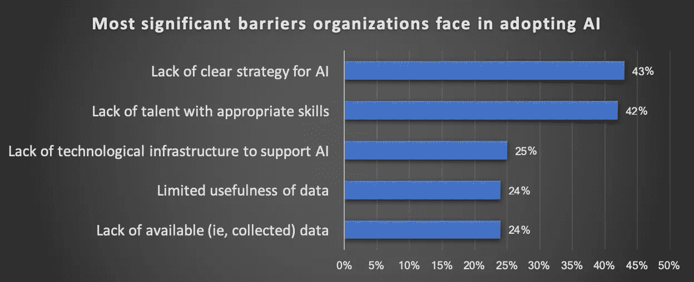

# 人工智能如何为您的企业服务

> 原文：<https://medium.datadriveninvestor.com/how-artificial-intelligence-can-work-for-your-business-a4b581ff5d13?source=collection_archive---------3----------------------->

对许多人来说，人工智能仍然是一项神奇的新技术，几乎无所不能。它为自动驾驶汽车提供动力，使智能个人助理成为可能，并决定申请人是否可能偿还贷款。

由于其巨大的潜力，人工智能引起了所有行业企业的兴趣，其关键驱动力是“人工智能将允许(我们)获得或保持竞争优势”的承诺[1]。

Reasons for adopting AI

Adobe 最近的一项研究显示，2018 年只有大约 15%的企业表示已经开始采用人工智能技术。这听起来可能是一个小数字，但同一项研究还显示，31%的企业计划在未来 12 个月投资人工智能技术，这将使企业总数增加到近 50%。

尽管这些数字清楚地表明，人工智能正成为企业未来的重要工具，但在运营和执行层面，技能、培训和整体知识仍存在很大差距。当被问及他们组织的人工智能意识时，大多数高管承认，由于缺乏知识或他们组织中的用例，他们现在还没有完全理解人工智能的价值[3]。

AI awareness inside organizations

## 理解人工智能和机器学习

为了理解人工智能到底是如何工作的，最好考虑一下“机器学习”，而不是描绘某种类似人类的智能。这听起来不像人工智能那么神奇，但它在解释这项技术实际上做了什么方面更有帮助。

The stages of Artificial Intelligence

同样，随着学习使人类智能随着时间的推移而发展，机器学习赋予计算机系统学习执行特定任务的能力，而无需显式编程。因此，机器学习可以被认为是人工智能所有进一步阶段所依赖的基础技术。

与经典的基于规则的算法相比，机器学习的核心是处理大数据集，并从数据中发现的模式中自动学习。这些模式然后形成一个“人工智能模型”，可以用来处理未来的数据。

Are you seeing the pattern here?

由于这种方法，今天所有的“人工智能”系统都专注于解决范围非常狭窄的单一问题。它们因此被归类为“狭义人工智能”，有时也称为“弱人工智能”。尽管它们可以产生远优于传统的基于规则的系统的结果，但它们并没有表现出任何真正的智能，甚至没有自我意识。

从商业角度来看，机器学习技术的优势在于它能够发现大型数据集内部的规则和模式，这些数据集过于复杂，无法用传统算法描述。它的预测性允许组织使用过去和现在的数据来预测未来的行为和趋势。因此，人工智能有潜力提供关于您的业务或客户的见解和可操作信息，这在以前是不可见的。

## 人工智能和机器学习技术在今天是如何使用的

随着机器学习的快速发展，人工智能现在已经成为各行各业数字化转型的关键驱动力，从银行到保险，从制造到零售，汽车，医疗保健和政府。

毫不奇怪，传统上混合使用统计和其他数据挖掘方法的用例现在是最常引用的[4]:

然而，人工智能技术不应仅仅被视为一种复杂的数据处理技术，因为有大量其他用例，它可以成为企业提高效率和生产力的强大工具，同时通过数字和移动渠道与客户积极互动。这里有一些值得注意的例子来启发你:

**肯德基“智能餐厅”** 肯德基与中国科技巨头百度合作，为他们的餐厅开发了这一创新的点餐系统。它使用面部识别和自然语言输入，根据客户的年龄和情绪等因素，就他们可能点的菜提出建议。百度的一份新闻稿给出了一些例子:一名 20 岁出头的男性顾客将获得“香酥鸡汉堡、烤鸡翅和可乐套餐”，而一名 50 岁的女性顾客将获得“早餐粥和豆浆”。

Image credit: Baidu, KFC China

**梅西的店内助手** 或许最好的描述是一种“零售店的 Siri”，梅西百货正在推出他们基于人工智能的服务“梅西随叫随到”，允许顾客询问关于商店库存、产品和设施的问题，并接收定制的响应。例如，个人可以询问平台，“女鞋部在哪里？并接收其确切位置。

Image credit: Macy’s

## 让您的企业为人工智能做好准备

无论你的目标是改善客户服务，减少供应链中的浪费，还是加快创新进程，想想你在哪些方面缺少可以帮助你实现这些目标和转变业务的见解。拥有你希望你的企业通过人工智能和人工智能实现的愿景只是一个开始。你想要完成的目标和你实际拥有的操作和组织能力可能会大相径庭。

Most significant barriers organizations face in adopting AI (Source: McKinsey [5])

大多数企业将面临的一个挑战是收集强大的数据来训练他们的人工智能模型，因为必要的数据通常是分散的，分散在不同的位置，被困在基础设施的孤岛中，或者根本不可用。因此，除了建立一些基础的机器学习知识，“大数据”和“数字化转型”现在成为企业获得“人工智能就绪”的关键战略。如果您的企业尚未开始其数字化转型，这里有另一个开始的好理由。

一旦你明确了你的目标和能力，并且有了必要的数据，你就可以开始构建和迭代了。你可以从一个小的试点项目开始，然后从那里开始，或者在一个大的想法上全力以赴。

**来源和参考文献**

[1][https://www . statista . com/statistics/747775/world wide-reasons-for-adopting-ai/](https://www.statista.com/statistics/747775/worldwide-reasons-for-adopting-ai/)

[2][https://www . CMO . com/features/articles/2018/2/26/adobe-2018-digital-trends-report-findings . html # GS . bsgkkng](https://www.cmo.com/features/articles/2018/2/26/adobe-2018-digital-trends-report-findings.html#gs.bSGkKNg)

[3][https://www . itweb . co . za/surveys/vedzq 58 mvy 7 zxy2b/about-results](https://www.itweb.co.za/surveys/VeDZQ58MVy7zXy2B/about-results)

[4][https://www . statista . com/statistics/737865/world wide-specific-ai-use-cases-2017/](https://www.statista.com/statistics/737865/worldwide-specific-ai-use-cases-2017/)

[5][https://www . McKinsey . com/featured-insights/artificial-intelligence/ai-adoption-advances-but-fundamental-barriers-remain](https://www.mckinsey.com/featured-insights/artificial-intelligence/ai-adoption-advances-but-foundational-barriers-remain)