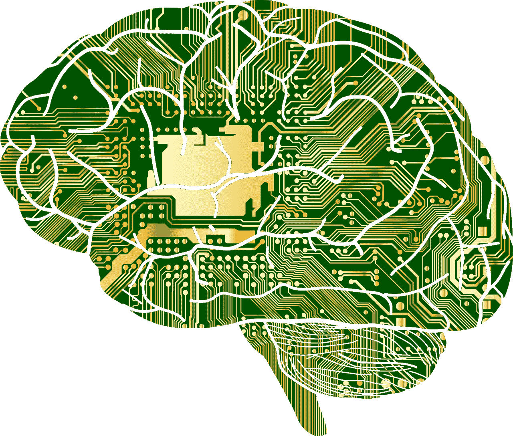

# 人工智能如何改变世界

> 原文：<https://medium.datadriveninvestor.com/how-artificial-intelligence-is-changing-the-world-343df8fe1d17?source=collection_archive---------1----------------------->

## 人工智能对我们的未来意味着什么。

AI 的技术在过去的 20 年里每年都在进步，今天已经是非常成熟的技术了。许多公司和组织都在以不同的方式积极地使用人工智能。

[人工智能也正在发展成为下一代计算](http://aibusinessbook.com)，在这里可以产生伟大的想法，许多人可以成为一个新学科的专家。今天，有许多公司在从事各种人工智能项目，这些项目正在塑造技术的[未来。](http://datasciencerush.com)

# 什么是人工智能？

虽然 AI 通常是人工智能的代名词，但技术上更复杂的系统可以被描述为“人工通用智能”。这些系统能够以极其快速和可扩展的方式解决与机器所能解决的问题截然不同的问题。

 [## 人工智能预测能力的神话|数据驱动的投资者

### AI(人工智能)最有前途的优势之一似乎是它预测未来的能力…

www.datadriveninvestor.com](https://www.datadriveninvestor.com/2019/03/01/the-myth-of-ais-predictive-power/) 

由于计算机硬件不断改进，变得令人难以置信地高效和强大，许多公司都在寻求提高机器学习能力——以神经网络的形式。神经网络是简单的算法，通过结合它们的经验来训练彼此，以执行许多不同的任务。

神经网络现在可以用来执行曾经由人脑专门执行的任务，例如自动识别图像中的人脸和语音，以及根据一组数据(如一个人以前的经历或他们在社交网络上的喜欢次数)做出决定。因此，使用神经网络处理大量数据以得出答案的可能性是无限的。

# 什么是机器学习？

对于我们大多数人来说，机器学习的想法听起来像科幻小说，但它已经被广泛应用。机器学习的第一个好例子是教人工神经网络如何在数据库中识别人脸。

更多的应用包括我们理解在线文本的方式和一个人在纸上写的东西。人工智能可以在几乎无限多种场景和情况下学习。

这个领域被比作互联网本身，因为它可以被用来改善我们的生活。

机器思维是一个适用于能够从信息中学习的机器的术语。这是一种计算信息的方式，允许计算机以新的、通常令人惊讶的方式处理数据。

该术语使用了“从错误中学习”的概念，这意味着机器能够使用数据来避免错误或从错误中学习，例如当用户查看网站时，他们看到的图像不是完美的图像，或者当人类阅读文本时看到拼写错误。

# 什么是深度学习？

深度学习是一种通用的、基于人工智能的计算机方法，将数据集分类为包含“有趣”或“不有趣”的特征，并产生可以应用于特定示例的训练算法。

机器自己学习做数学和物理。它学习它所看到的材料和数据的每一点。这一过程被普遍称为“深度学习”，但该术语本身在“深度神经网络”的上下文中更为熟悉——基于非常复杂的数学原理的网络。深度神经网络可以产生惊人的结果；他们可以通过学习发现数据中隐藏的模式，比如说，识别文本中一两个字母的频率。这被称为反向传播，由于人工智能技术，它夺走了许多人类的工作。

这台机器不是传统意义上的智能。它更像是一个超级大脑。它发展出如此巨大的大脑的唯一原因是它被训练去做数学，去记忆，并且已经持续了很长时间。

# AI 公司如何使用机器学习？

公司有许多方式使用人工智能和 ML 来自动化工作场所和其他地方的任务。以下是公司使用机器学习的几种方式。

亚马逊亚马逊的人工智能技术和机器学习能力已经对其业务产生了重大影响，首先是帮助其更有效地销售云计算和其他产品。它自己的人工智能产品使用基于人工智能的方法，例如，包括基于公司客户搜索历史的推荐。与传统的基于人类和计算机的决策技术和算法相比，他们能够通过更全面地了解客户偏好和客户行为，更好地预测人们想要什么。他们还使用人工智能技术来更好地访问 Kindle 电子书商店的内容，并提供优惠券。亚马逊亚马逊的人工智能技术和机器学习能力已经对其业务产生了重大影响，首先是帮助其更有效地销售云计算和其他产品。它自己的人工智能产品使用基于人工智能的方法，例如，包括基于公司客户搜索历史的推荐。

深度学习成为运行谷歌研究实验室的核心工具之一。谷歌使用机器学习为其 Google Now 语音助手提供动力，最近推出了特别版的谷歌助手，没有提到搜索引擎及其搜索算法。

广告公司已经使用机器学习来创建更好的广告，这些广告可以针对更广泛的用户，包括广告商和网站合作伙伴。

所使用的机器学习技术的主要目的是改进广告定位。

许多人工智能公司也发表了论文，探索在目前由于计算和/或内存资源有限而效率较低的领域使用机器学习技术。

# 使用 AI 最大的好处是什么？

AI 可以帮助你更高效地思考你产生的数据。例如，它可以产生更准确的预测。使用机器学习算法根据一组事实生成建议的人可能有错误的信念，或者错误的直觉，或者对数据的错误理解。但是如果你用人工智能来做基于数据的推荐，就不用那么做了。你会得到完全自然的，自然语言的体验。这就像当我们想到谷歌助手时，但当我们想到 Siri 时，我们不会想到如何做一件事，而 Siri 会做另一件事，我们会想到每个项目可能会做什么，以及它可能在什么环境中。

它还有机会帮助创造更好的用户体验。人工智能仍然是一个非常粗糙的工具——它的能力仍在不断完善和磨练。当涉及到做决定和选择行动时，没有什么可以代替人类给用户提供上下文。

# AI 进化的有多快？

诚然，我们已经看到了非常有趣的趋势，从人工智能驱动的无人驾驶汽车到面部识别软件，再到工作场所的深度学习神经网络。

人工智能有潜力改变这个行业，但我们目前不会看到它自己发生。为了创造一个更美好的世界，我们首先需要它拥有必要的资源和专业知识来帮助它有效地工作。人工智能需要正确的人的帮助，这些人在正确的时间知道正确的工具。

很多人期待人工智能在 2020 年或更晚的时候取得重大突破。然而，那可能离我们完全自主并能在未来生活的那一天还有几年的时间。与此同时，许多研究人员正在探索各种方法，最终帮助我们跟上人工智能的发展。例子包括自动驾驶汽车、深度神经网络和强化学习。一般来说，大多数研究人员认为，更复杂的机器学习技术，包括在这些领域使用的技术，还需要一段时间才能发展。但即使在这个人工智能快速发展的时代，研究人员也在寻找意想不到的方法来改善事情。

# 使用人工智能的无限可能性

未来人类将如何与 AI 合作？AI 会取代人类吗？AI 会和人类有什么不同？如果它开始达到大规模并变得无处不在，那么有很多问题需要回答。

下一代人工智能将会更加复杂和智能。这些新的智能系统中最明显的区别将是，它们将能够学习，而不是做人类被教导的事情。还会有其他技术差异，比如语音到文本的使用以及计算机视觉、机器学习算法和深度学习的集成。这些技术将在科学、工程和技术领域创造新的机会。

技术的未来不仅仅是为了讨论。随着技术的不断进步，没有什么能阻止它超越人类的极限。问题是人类是否能够成为故事的一部分。

下一代人工智能可以定义为至少和我们一样智能，但更聪明、更有弹性的系统。他们可以完成今天需要人类水平的技术才能完成的技术壮举。它们可以做人类做不到的工作。

第一代 AI 来了。我们知道未来可能是什么样子，也知道如何让它发生。

我们希望，在未来的几年里，人们会将人工智能视为一个令人兴奋的机会，并将帮助创造未来的就业机会。

—

*本文是* [*综合内容*](https://medium.com/swlh/synthetic-content-9cf5838d8e80) *系列的一部分:我完全通过深度学习模型生成的文章，只做了编辑和剪切，以实现最佳呈现，并确保没有写不真实的说法。*