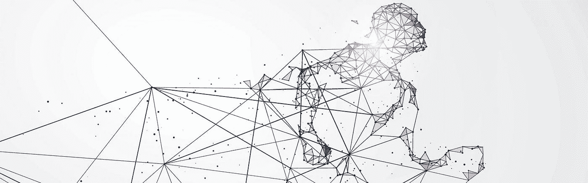

# 人工智能如何在营销和令人难忘的客户体验设计中推动竞争优势

> 原文：<https://medium.datadriveninvestor.com/how-artificial-intelligence-is-driving-competitive-advantage-in-marketing-and-the-design-of-ae0a94092db1?source=collection_archive---------2----------------------->

在这个数字时代，我们生活在我们的客户可以无限制地获取关于我们、我们的品牌、产品和服务的信息。他们希望在整个价值链中获得全天候全渠道可用性和无缝服务。大数据为我们提供了每次互动中客户的 360 度视角，这促使我们设计难忘的体验并保持 24/7 的主动对话。因此，我们必须建立一个运营模式，充分了解我们的客户以及他们贡献的生命时间价值。这需要一个独特而统一的 360 度客户视角，允许在所有渠道和部门中实现最佳互动。结合来自多个来源(私人和公共)的数据可以进行微细分，这有助于我们更好地了解我们的客户，提高转化率和销售额。提供真正独特的一对一客户体验依赖于以数据为中心。因此，数据驱动的方法将客户置于我们业务的中心，这是成功的数字化战略的基础。

这就是为什么客户体验管理和营销越来越成为数据驱动的学科，以及为什么利用数据的使用是改善交互、个性化、目标定位等的关键。无论在哪个行业，作为一名商务人士，你都很可能发现有必要让你的业务适应最新的技术和趋势，否则就会被竞争对手甩在后面。无论是社交网络、数字广告、内容营销还是成千上万种新解决方案中的任何一种，作为营销人员，你都需要在日益个性化的层面上与潜在客户和客户互动，以设计令人难忘的客户体验。美国专业人士需要在任何渠道的每次客户互动中适应并保持无缝的一对一个性化体验，否则就干脆消失。一刀切的以客户为中心的战略不再是一种选择

 [## 今年值得关注的人工智能趋势|数据驱动的投资者

### 预计 2019 年人工智能将取得广泛的重大进展。从谷歌搜索到处理复杂的工作，如…

www.datadriveninvestor.com](https://www.datadriveninvestor.com/2019/02/19/artificial-intelligence-trends-to-watch-this-year/) 

这就是为什么有前瞻性思维的公司(也许像你的？)正在转向机器学习和人工智能(AI)来预测客户和潜在客户在个人层面的行为，这转化为与客户、运营和投资回报(ROI)的更好关系。机器学习是人工智能系统背后的技术，可以产生高度准确的商业 KPI 预测，正在迅速取代所有行业的传统统计建模。机器学习允许创新的营销团队在大型数据仓库中发现隐藏的商业见解:这些数据可能来自客户调查、网站流量、购买行为等来源。通过机器学习，作为客户体验经理的您可以发起高效优化的目标活动，增加组织的收入并改善客户服务。

# 其他像你一样的 CX 经理和营销人员是如何使用人工智能的

M achine learning 可成功用于在客户旅程中的任何接触点提供智能、个性化的客户体验。这将最终导致重新设计的端到端客户旅程，客户自然会感到更加个性化。

## **漏斗建模**

像您这样的 CX 经理和营销人员想知道网站访问者提供联系信息、询问更多产品细节的可能性有多大，或者他们需要多长时间来决定和购买特定产品。营销漏斗模型提供了对访问者行为的洞察，允许企业相应地优化其网页设计和产品供应，并创建高效的再营销活动。

## **下一个最佳行动**

电子邮件、短信、博客文章、白皮书、网络研讨会和折扣券只是营销活动的几种选择，但哪一种才是最有效的呢？你需要了解哪些活动会推动潜在客户进一步购买，而不会将他们的时间和预算浪费在不相关或不需要的沟通上。接下来，最佳行动模型决定了哪些活动将推动每个人向下购买，从而优化沟通策略和销售。

## **个性化广告**

可用的客户数据越多，您就越能了解导致产品购买的因素。动态创意优化模型决定了哪种类型的横幅广告最能吸引每个潜在客户，使您能够为网站访问者或搜索网络开发高度个性化的广告，从而提高他们的参与度，进而提高转化率。

## **产品和内容推荐**

客户只对高度相关的产品和内容推荐做出回应。有了大量可用的客户数据，包括人口统计数据、网站行为、购买历史和最新的搜索信息，机器学习模型可以预测哪个产品或类似的内容推荐最有可能导致每个客户的转化。

## **下一个最佳报价、交叉销售和追加销售**

保持和发展现有消费者的成本效益比获得新消费者高十倍，享受过体验的客户会增加从现有客户那里购买的产品，从而提供最高的终身价值。使用客户人口统计数据和以前的购买数据，机器学习模型可以识别哪些客户会对其他产品感兴趣，哪些客户会对升级现有产品感兴趣。

## **客户关系**

聊天机器人是基于人工智能的对话代理，被用于许多不同的客户参与场景。它们旨在通过使用自然语言处理算法来模拟人类对话，并可以提供即时的个性化响应。这消除了客户服务中令人沮丧的延迟和错误，尤其是在处理客户投诉时。

通过与客户的互动，聊天机器人在营销漏斗中也非常有用。在认知阶段解决对品牌或产品的简单疑问。考虑到给出产品操作过程的细节，通过电子邮件发送信息(线索)或提供详细信息。在转化阶段，完成销售；在忠诚阶段，提供客户服务。

## **早期参与和流失预测**

通过分析早期参与人员的行为，你可以让他们关注新客户，了解促使他们与公司度过快乐“蜜月”的驱动力，并提高他们的参与度。类似地，业务经理可以研究离开的客户，并通过机器学习技术识别那些也很有可能离开的客户，因此，将保留策略推广到更高价值的客户。

## **情感分析**

消费者经常在社交媒体和客户服务渠道中自由表达他们对公司产品、服务和运营的感受。情绪分析模型预测哪些单词和短语表示满意或不满意，以及这如何影响未来的购买。这使您能够确定客户满意度随着时间的推移发生了怎样的变化。

## **净推介值**

得益于客户满意度调查的数据，人工智能模型可以揭示最有助于客户净推介值的因素。然后，您可以预测其他客户可能的得分，并将他们的努力集中在那些可能最忠诚的客户身上。此外，您还可以在您的分析中加入我的公开评论部分，以发现客户满意度的根本原因。这些见解使您能够了解客户体验的真正驱动因素，并有效地将您的资源投入到改善客户体验上。

## **终身客户价值**

确定每个客户的价值，包括可能的未来支出和由此产生的利润率，是决定个性化客户体验工作目标的关键因素。终身客户价值模型决定了每个客户在整个客户关系中可能产生的利润，让您可以将最大的精力放在可能最赚钱的客户身上。

国王客户端是一个由 120 多名优秀人才组成的团队，在 WPP 集团旗下的一家全球性公司工作。作为数字情报团队，我们可以帮助您和您的公司通过使用数据，在营销和设计令人难忘的超个性化客户体验方面获得竞争优势。