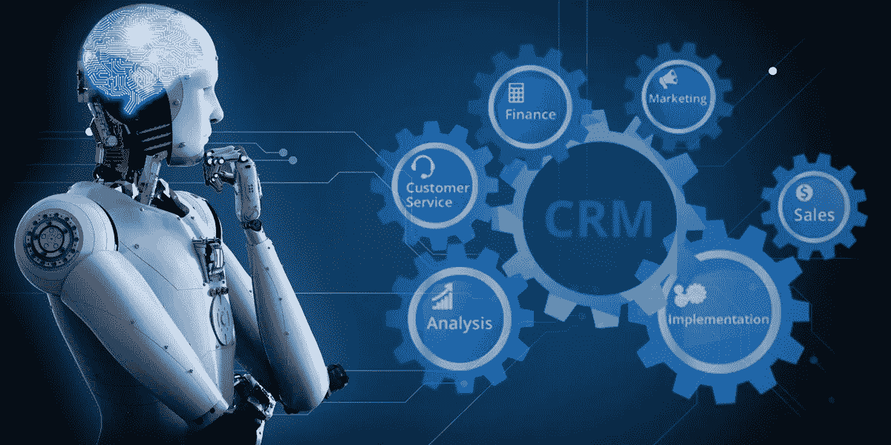

# 人工智能如何改变 CRM 运营？

> 原文：<https://medium.datadriveninvestor.com/how-artificial-intelligence-is-transforming-crm-operations-d2f5080f9e00?source=collection_archive---------7----------------------->

为了解决客户问题，有效的信息管理和人工智能一起被证明是组织的一个极好的结合。理解用户行为对于任何企业的生存和发展都至关重要，而不仅仅是交付产品。

任何与客户的交流都可以被视为一个巨大的数据源。它可以用于分析他们的行为，解决问题，改变过程方法和操作，从而改变用户的旅程。然而，将人工智能与 CRM 集成是迄今为止最具革命性的一步。当你推出一款产品时，人工智能被用来预测客户行为以及他们对该产品的预期。

 [## 今年值得关注的 5 大人工智能趋势|数据驱动的投资者

### 预计 2019 年人工智能将取得广泛的重大进展。从谷歌搜索到处理复杂的工作，如…

www.datadriveninvestor.com](https://www.datadriveninvestor.com/2019/02/19/artificial-intelligence-trends-to-watch-this-year/) 

CRM，又名客户关系管理，是世界上最受欢迎的软件。它基本上是公司用来简化、管理和分析客户互动的策略和技术的组合。其他信息和流程包括在整个用户生命周期中收集数据、改善客户服务关系、获取新用户、留住新用户以及最终推动销售。简而言之，将人工智能添加到 CRM 中，通过自动化客户拓展，可以更容易、更有效地处理客户。这培养了与客户的长期关系。

智能基本上是用来理解机器像人类一样学习、研究和协助的能力。 [AI 开发服务](https://www.signitysolutions.com/blog/ai-change-web-development/)主要由 2 部分组成——深度学习和机器学习。深度学习是一个计算过程，通过将一些预定义的参数级联在一起进行预测。另一方面，机器学习更复杂，机器使用算法来学习程序，而没有任何外部帮助或人类干预。

# 人工智能如何改变 CRM 运营:

技术和创新使我们能够制造出非常规的机器，尽管如此，人工智能仍然面临一些担忧。下面提到的几点将有助于您理解人工智能如何改变 CRM 运营:

# 1.每个人的个人虚拟助理

客户关系管理，当与人工智能集成时，将提高你的员工的效率和生产力。它将基本上为您的所有代理填补虚拟助理的职位，并充当远程助手。它可以帮助管理和自动化客户反应、互动、安排会议、跟进和其他重复性的手动任务。例如，可以捕捉讨论并在会议中做笔记的工具、访问日历并安排会议等。

CRM 基本上依赖于客户数据，如人口统计、用户行为、生命周期交易等。它智能地处理并注入高级算法来学习和指导上述功能。用通俗的语言来说，它消除了所有的管理职责，隔离了工作流程，从而最大限度地减少了人为错误。

# 2.自动化数据采集

由于自动数据采集功能，CRM 工具使新客户的获取变得更加简单。在没有任何人工交互的情况下收集用户信息有很多好处。Whatsapp、脸书、Twitter 等社交媒体平台是目前最热门的联络点。CRM 将这些平台视为与客户联系和积累信息的机会，而无需实际输入任何信息。

这种自动化的数据捕获有助于预先预测用户行为，从而帮助组织相应地制定策略和定制活动。在人工智能开发人员的帮助下，这种定制可以帮助提升积极的品牌形象和对每个客户的真诚热情。所有这些最终都有助于产生销售线索、扩展业务和改善整体服务。

# 3.数据分段和通信定制

如果不使用算法来理解所有的原始数据库，前面提到的数据捕获过程将是徒劳的。所有信息，如购买历史、人口统计、网络行为等。可以被机器算法接管。这将有助于根据用户的不同特征和属性对其进行细分。

人工智能与 CRM 的集成使系统能够从过去的经验中学习，并通过适当的用户细分带来更多优质的线索。客户关系管理软件将通过优化定制信息、正确的时间选择和通过正确的渠道及时响应等功能来帮助收集具体数据。因为你将确切地知道什么与他们合拍，你将有数据来证明这一点。

千禧一代喜欢一切定制和个性化。通过直接称呼用户的名字，你更有可能获得新的交易，例如，“嗨，Paul。你吃饭了吗？”将在推送通知中比仅仅“嘿，你好。你吃饭了吗？”

许多[云 CRM 解决方案](http://encaptechno.com/)有助于这种隔离。例如，网站流量将是一个不同的部分，有多少用户达到了结帐页面将是一个不同的设置。现在交流的方式和语言应该是不同的，一个用户设置将得到一个消息“你试过 XYZ 吗？”另一组将收到一条关于“产品在购物车中等待”的消息这将个性化整个用户旅程。

# 4.用户保留和客户维护

在获得新用户后，组织面临的主要问题是用户保留。然而，有了 CRM，你已经从各种活动中收集了数据，你可以很好地利用这些数据。处理这些数据以及人工智能可以帮助您完成必填字段，并根据用户的通信模式、首选时间、性别、货币价值等创建用户角色。

因为人物角色，你将知道何时以及如何联系用户。您甚至可以获得关于死亡用户群或热门线索的更新和提醒。以及与他们取得联系的最佳媒介，如短信、电子邮件、搜索引擎广告等。这将提升交易和运营效率，同时提高客户忠诚度和维护度。这将最终提高用户保持率，同时减少花费在客户端维护上的时间。

# 5.通过数据分析实现群组和终身价值

如前所述，模拟智能通过将参与过程计算机化来帮助理解设计、预测方法和结果。但是让组织脱颖而出和更聪明的是与客户一对一接触的能力，不管你公司的规模有多大。但是，如果您有大量数据，这可能会有点困难。

为了简化流程，必须对收集的数据进行清理、排列、校准和调查，以便更好地了解用户群并计算他们的生命周期价值。群组可以被定义为共享可以在分析中识别的共同特征的一组用户。在市场营销中，客户终身价值(LTV)是对与用户完全关系相关的净利润的预测。这将有助于区分您所有活动的成功和失败，直到客户与您建立联系。对这些元数据进行适当的分析将有助于预测未来的进程，并大幅提高销售额。

## 结论

人工智能正在通过取代传统方法，迅速改变业务获取和保留技术。当人工智能与 CRM 工具相连时，它通过消除重复任务的需要，使过程更加顺畅和高效。借助 CRM 强大的数据，企业可以收集可靠的数据，并管理和使用这些数据进行集中交互。总而言之，CRM 需要 AI 在数字化转型时代适应并茁壮成长。如果你正在考虑将人工智能灌输到你的 CRM 服务中？印度的顶级人工智能公司可以帮助你理解需求，从而将人工智能集成到 CRM 工具中。

原发布:[https://www . signity solutions . com/blog/artificial-intelligence-transforming-CRM-operations/](https://www.signitysolutions.com/blog/artificial-intelligence-transforming-crm-operations/)