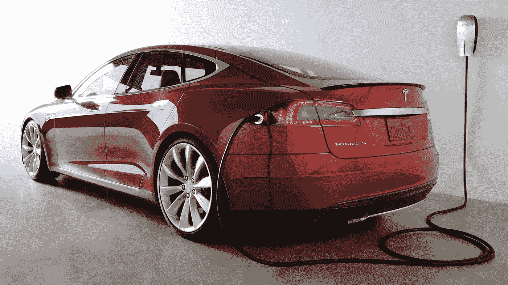

# 人工智能将如何令人难以置信地降低你的能源账单

> 原文：<https://medium.datadriveninvestor.com/how-artificial-intelligence-will-incredibly-lower-your-energy-bill-33914791ea1a?source=collection_archive---------0----------------------->

世界向清洁可再生能源(如太阳能、风能和生物燃料)的过渡依赖于我们的行动。我们必须通过优化住宅、建筑和机器的能耗来参与这一变革。

事实上，研究表明，不断调整后者的运营并实施节能战略可能非常有益。[能源使用可减少 30%](http://news.mit.edu/2013/reducing-wasted-energy-in-commercial-buildings) 。但是如何实现呢？利用人工智能是答案。

 [## 人工智能预测:“颠覆，然后是生产力”——数据驱动的投资者

### 人们越来越担心，随着机器学习和互联网的普及，所有白领工作都将消失

www.datadriveninvestor.com](https://www.datadriveninvestor.com/2018/08/06/ai-forecast-disruption-then-productivity/) 

当人们听到人工智能(AI)时，他们一般会想到好莱坞电影(天网，黑客帝国，机械战警等。).然而，在现实生活中，它仅指行为智能的计算系统，在大数据集上应用高级算法。

这些智能设备体现了人工智能对不断变化的环境和不断变化的目标的预测能力和灵活性。事实上，人工智能可以在几个方面帮助降低能耗:

*   **捕捉作战流浪狗:**

快速捕捉运行异常或能量泄漏是高效实时能量管理的目标。**人工智能系统可以预测这些泄漏何时发生**，特别是对于大型办公大楼，那里的设备可能会偏离最佳设置。因此，这将减少能源浪费，为业主和租户省钱，保护设备免受磨损，并维护更好的建筑。

*   **分解能量消耗:**

机器学习技术可以检测**消费行为和能源使用模式**。因此，这种有意义的见解可以帮助公用事业公司建立更好的客户群，并利用相关信息为客户提供个性化服务。此外，家庭可以直接受益于这些见解——如果很好地呈现给他们，在了解他们自己的消费(和电费)后重新获得控制权！).

*   **寻找太阳能放置的最佳位置:**

部署太阳能解决方案的关键部分是与其安装相关的成本。然而，如果企业**瞄准最感兴趣的前景和领域**，这些成本将大幅降低。使用机器学习以及与树荫、收入、房屋大小、能源成本、折扣、激励和屋顶朝向相关的数据是成本和风险控制的关键。事实上，利用这些信息有助于找到能源性能方面的最佳区域。

人工智能和机器学习实现了各种商业机会。他们授权第一波创业公司开发旨在节约更多能源的新产品。尽管如此，仍有一些长期存在的问题需要解决:

*   **数据采集:**

在撰写本文时，政府和公用事业机构正在全球部署智能电表*。这将允许将来访问更多有趣的数据。然而，要覆盖更广泛的领域并开发特定的机器学习算法，还需要付出相当大的努力。后者的一个例子是*非监督&半监督学习*，它甚至可以预测没有智能电表的家庭的能源消耗水平。

*   **业界的不情愿:**

能源行业非常保守。自从托马斯·爱迪生以来，它的商业模式没有改变过——正如 Opower 的联合创始人亚历克斯·拉斯基在一次 ted 演讲中断言的那样！他说:“当用户浪费能源时，公用事业公司仍然会得到回报。为了使用人工智能应用程序和提高能源效率，公用事业公司必须不仅仅是能源供应商。他们必须相信，以用户为中心和“智能”是“智能电网”时代的利润所在。

*   **电动车的到来:**

随着越来越多的电动汽车进入市场([它们的数量每年都在翻倍！](http://transportevolved.com/2014/04/16/number-electric-cars-world-doubled-past-year-say-academics/))，出现了关于管理其电池充电周期的问题。作为**有史以来最大的家用电器，**它们在接入电网时的识别对于优化管理能源需求和供应至关重要。

去年在巴黎举行的第 21 次联合国气候变化大会上，各国政府表明了他们对减少碳排放的承诺。这不能仅仅通过生产绿色能源来实现。我们需要优化管理能源分配，并在消费者心中推动真正的行为变化。如果人工智能系统被用来重新控制建筑中的能源泄漏，向家庭展示他们可以做得更好的地方，并鼓励绿色能源发电，这两个目标都可以实现。然而，与数据采集相关的问题、行业的不情愿以及混合动力电动汽车的到来可能会挑战这些新技术的采用。

> 人工智能正在改变我们彼此互动的方式，我们与物体互动的方式(物联网)，并将——希望—**改变我们与地球互动的方式**。

**:根据爱迪生基金会电气创新研究所的数据，公用事业公司在美国各地的家庭中部署了 5000 万个电表，覆盖了 43%的家庭。根据欧盟委员会 2014 年的一份报告，欧洲承诺到 2020 年投资约 450 亿€，安装近 2 亿个智能电表。*