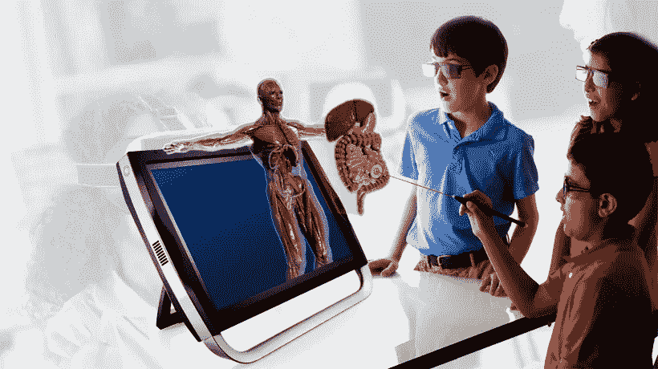

# 增强现实如何在教育领域创造新的高度

> 原文：<https://medium.datadriveninvestor.com/how-augmented-reality-is-creating-new-heights-in-the-education-sector-8c17114ff98c?source=collection_archive---------15----------------------->

在今天的世界里，包含相关信息的内容有其自身的重要性。当它可以随时被访问时，它的价值就会增加。类似地，不断发展的技术增强现实(AR)正在帮助行业通过身临其境的内容吸引用户。

在很短的时间内，AR 已经被不同的部门广泛接受。教育领域的增强现实正在增加改变这一领域现状的可能性。教育部门目前正在利用这一技术产生效益。

AR 被认为是一种可靠的技术，这就是如此广泛的原因。它的解决方案有助于教育部门在不同的方面发展。AR 的潜力可以通过不同的方式来吸引用户。因此，企业期待着增强现实如何改变世界。

 [## 人工智能和虚拟现实的融合-你能期待什么-数据驱动的投资者

### 在技术领域，融合是合乎逻辑的一步。就在几十年前，你可能需要一个专门的…

www.datadriveninvestor.com](https://www.datadriveninvestor.com/2018/08/30/the-convergence-of-ai-rv-what-you-can-expect/) 

**增强现实创造教育领域的新高度**

增强现实解决方案是一种以身临其境的方式提供信息的绝佳方式。因此，教育工作者和学生正在接受这项技术。通过深度学习，教授学生更多关于他们所看到和经历的东西。

增强现实在教育中的优势正在改变学生与他们的世界互动的方式。因此，它成为了学习他们学科内容的最明显的途径。统计数据显示，教育领域的 AR 产品销量高于非增强现实产品。

目前，有许多增强现实解决方案整合到教室中，以充分利用这一先进技术的潜力。许多 AR 解决方案将书籍内容与 AR 技术集成在一起。因此，在智能手机的帮助下，学生可以将课本内容带入生活。同样，各种组织正在出版用每个空间中的 AR 可能性编码的 AR 书籍。

**学生体验 AR**

它作为学生发挥着重要的作用，因为它帮助学生克服理论学习的压力。AR 提供了一种与生动内容互动的简单方法。学生可以通过增强现实解决方案获得更多信息。当信息传递给学生时，它有助于分析信息的准确性和来源。

[教育领域的 AR 解决方案](http://www.quytech.com/augmented-reality-in-publication.php)推动学生探索新的视野和维度。最棒的是，它通过将教育融入生活，有效地融合了学生的知识。增强现实也使教室与教育和技术的积极关系更加紧密。

同样，博物馆和历史遗址也为其展品添加了 AR 功能，以创建更多信息。

**增强现实集成类**

老师们总是觉得很难集中孩子们的注意力。学生的世界充满了各种极具吸引力和视觉刺激的媒体。因此，机构已经开始在其课程中引入 AR 特色项目。学生们正在接受这些 AR 计划，以简化学习并保持学生的参与。

因此，它正在将教育转变为一个教育游戏平台。课程中运行的 AR 程序包括物理材料的 3D 图像。这有助于学生离他们的目标更近一步。AR 学习平台需要大量的规划和手动配置。

因此，学生和教师可以以更加互动的方式在课堂上参与 AR 内容。

**收尾**

[AR 解决方案](http://www.quytech.com/augmented-reality-solutions.php)正在改善教学和学习体验。它有助于将教育领域的互动层面带入全新的方式。因此，这项新技术将包含多种感官，可以加快记忆过程。这样的学习过程以一种强化的方式来引导学生。

AR 正在通过用数字层升级传统书籍来提高对高级学习材料的共同理解。说教育中的 AR 可以成为指导学生的导师不会错。

作者: Colleen Jansen 是 Quytech 的商业营销专家，Quytech 是最著名的增强现实应用开发公司之一

*原载于 2019 年 4 月 1 日*[*netblogtips.com*](http://netblogtips.com/augmented-reality-creating-new-heights-education-sector/)*。*