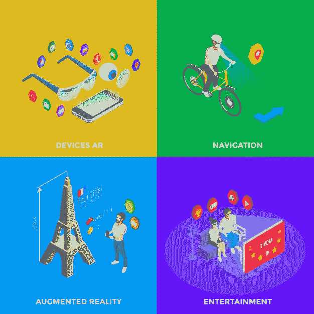
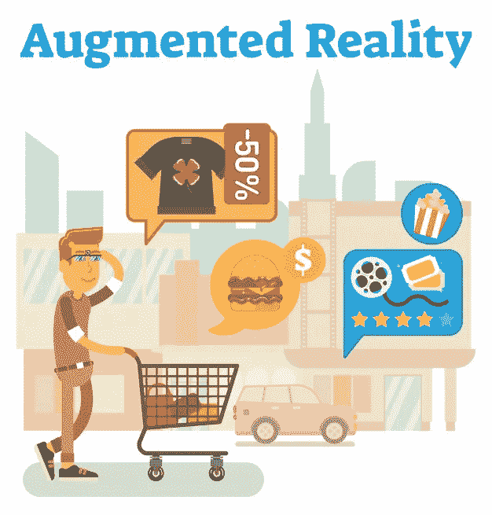
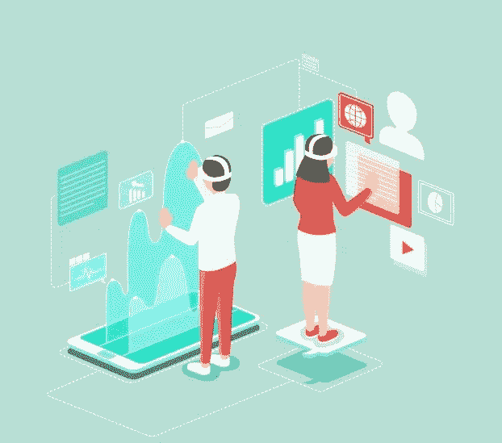

# 增强现实和虚拟现实如何给企业带来成功

> 原文：<https://medium.datadriveninvestor.com/how-augmented-reality-virtual-reality-bring-success-to-a-business-402a6ba995c3?source=collection_archive---------17----------------------->

每个企业家的主要焦点是获得成功和实现他们的商业目标。有很多方法可以让你的企业获得成功。采用增强现实和虚拟现实是接触你的目标受众并在市场上引起轰动的一种方式。这也将有助于你为你的品牌赢得信任和忠诚的客户，并产生转化，这对你的业务取得成功非常有益。从展示城市中最好的旅游目的地到搜索最好的餐馆，虚拟现实永远不会让你失望。许多旅行和旅游企业正在使用虚拟现实来提升旅行者的兴趣所在。这也是在你的目标受众面前提高你的品牌知名度的好方法之一。

虚拟应用最大的好处是，买家会觉得它很酷，让你的品牌看起来更有趣。如果你仍然不知道增强现实和虚拟现实是什么样子，那么你应该考虑尝试一下。是你的身体和大脑被欺骗，相信你实际上是通过虚拟现实生活在真实的体验中。如果你熟练地使用这种方法，那么你可以用一种吸引人的方式展示你的品牌，你也可以让它成为用户意识的一部分。

 [## 人工智能和虚拟现实的融合-你能期待什么|数据驱动的投资者

### 在技术领域，融合是合乎逻辑的一步。就在几十年前，你可能需要一个专门的…

www.datadriveninvestor.com](https://www.datadriveninvestor.com/2018/08/30/the-convergence-of-ai-rv-what-you-can-expect/) 

你想知道为什么每个创业者都必须考虑增强现实和虚拟现实体验才能获得商业成功吗？我们来看看以下几点。

## 创造完全的感官沉浸感

技术的目标是让我们的生活更加舒适和方便。有了增强现实和虚拟现实，你可以在几分之一秒内增加你的业务销售。如果你拥有一家制造公司，你的客户甚至不用开车就可以试驾。这将改变你的客户的体验。如果你有自己的旅游公司，那么你甚至可以在你的顾客到访之前就向他们展示他们喜欢的目的地是什么样子。如果你正在使用增强现实和虚拟现实，那么它将促进你的业务增长，你可以实现你的业务成功。

## 让你的品牌引人入胜

现在，增强现实和虚拟现实使你的品牌看起来有趣和令人兴奋。这也是在你的目标受众面前推广你的品牌的好方法。如果你正在使用这项技术，那么它会让你的品牌看起来引人注目，独一无二。这也会让你在竞争中领先。短短几天，你的服务和产品就在市场上引起了必要的轰动。你会给你的用户一些你的竞争对手没有提供的东西。

## 创造一个独特的场景

增强现实和虚拟现实能够毫无风险地将你的用户带到另一个虚拟世界。作为一个品牌所有者，你向你的用户展示你真正关心你是非常重要的。这可能是你不断努力使你的品牌区别于你的竞争对手。没有什么比给你的客户创造一个虚拟的体验，并给他们一些他们一直在寻找的东西更完美的了。许多企业家不知道这一点，但增强和虚拟现实实际上是节省成本的。这是一项长期投资，会给你带来很多好处。很快，这项技术将增加你的潜在销售业务。

## 让你的品牌更上一层楼

使用增强现实和虚拟现实作为营销策略的一部分，将使你的品牌更上一层楼。你可以在竞争中保持领先，你的忠实客户会从中获得很多好处。这实际上可以给你的企业带来商机，帮助你实现业务目标。现在，许多企业家正在使用这项技术来保持他们在竞争中的领先地位。这是在有限的时间内实现你的商业目标的最美妙的方法之一。

增强和虚拟现实的最大好处之一是，它有能力在几分之一秒内改变我们对世界的感知。它为你创造了自己的世界。如果你想为你的企业获得一个增强的虚拟现实，请联系[这里。](https://www.designers-x.com/)