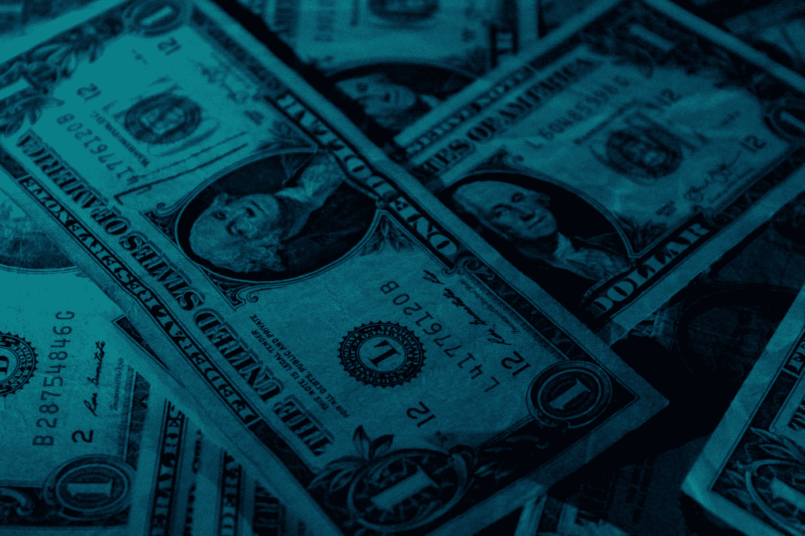

# 自动化交易如何增加你的交易利润

> 原文：<https://medium.datadriveninvestor.com/how-automated-trading-can-increase-your-trading-profits-371ae1f828fe?source=collection_archive---------0----------------------->

## 你有没有想过如何自动化你的交易策略，增加你的交易利润？在这篇文章中，我们将涵盖算法交易(又名交易机器人)的基础知识，好处和风险。准备好自动化交易 101！

Photo by [rawpixel](https://unsplash.com/@rawpixel?utm_source=medium&utm_medium=referral) on [Unsplash](https://unsplash.com?utm_source=medium&utm_medium=referral)

很多技术分析包括观察指标的信号，然后根据信号进行交易。正如我在以前的一篇文章中所讨论的，你应该在你的交易日志中记下你所有的交易，随着你获得更多的经验，你应该能够识别出让你赚钱最多的交易系统。

如果你能给电脑编程，让它自动识别这些设置并自动交易，会怎么样？如果你能把自己从图表的暴政中解放出来会怎么样？

> “不可能！技术无法取代我 20 多年来积累的技能和经验，我整天坐在我的屁股上看图表！”
> 
> ——一些婴儿潮时期出生的人的推特图表

好吧，我承认。这句话是我编的。

你抓到我了。

憎恨者会说这不可能，但他们错了。可以做到。

可用的金融数据数量惊人。你可以通过他们的应用程序接口(API)直接从大多数加密货币交易所获得价格反馈，正如你所料，这只是一堆数字。

不出所料，计算机在数学方面比人类好得多。如果你能找出能让你赚最多钱的设置，那么电脑也能。我们这里说的是技术分析，不是基本面分析，那完全是另外一回事。

我一直在谈论的一个人，埃德·塞科塔，在 70 年代和 80 年代过得相当不错。他开创了系统交易，在 16 年的时间里，他的模型账户获得了 250，000%的收益。是的，这是零的正确数目。

这种收益在今天是闻所未闻的。在计算机化交易出现时，他几乎没有竞争对手。收益被侵蚀了，但是你仍然可以从自动交易系统中获得丰厚的回报。

技术分析是对图表的研究。助教观察价格寻找规律，用指标来判断市场状况。指标只是资产价格和/或交易量的数学函数。模式只是一段时间内价格的排列。

这意味着技术交易策略归结为数字分析和数学问题。在解决数学问题时，计算机比人类更快、更准确，所以为什么不告诉你的计算机游戏规则是什么，让它为你交易呢？

# **什么是算法？**

“算法”的字典定义是:

> "在计算或其它解决问题的操作中，尤指计算机所遵循的过程或一套规则."

这似乎非常类似于技术交易策略。你找到了一个对你很好的设置(例如 MACD 快线从下往上穿过慢线)，然后你决定怎么做(例如下一个买进市价单，止损在最后一个支撑位以下 1%，当 MACD 线再次穿过时平仓)。这是一个简单的例子，而且都是数值。

如果你能确定哪些情况下你应该开仓，哪些情况下你应该平仓，那么你可以告诉电脑做同样的事情。它会更快更准确(假设你告诉它做正确的事情！).

如果我们看一个更高级的例子，好处会变得更明显。假设你想结合 5 个指标，扫描一篮子 7 种不同资产的交易条目。这是人类大脑需要处理的大量信息。你将在屏幕之间来回切换，寻找你的指标亮起绿色，并告诉你进入市场。

当你的注意力分散在多个市场时，犯错的可能性就会加大。

这是电脑发光的时候。计算机处理多种资产和指标的能力比我们任何人都要大得多。计算机仍然有其局限性，但在快速准确的数据分析方面，即使是基本的个人笔记本电脑也能超过任何人。

我听到你们中的一些人说，“是的，但是我可以设置警报和信号来告诉我什么时候市场条件是正确的！”你可以。你认为警报和信号是如何工作的？它们是算法。

这是算法交易的一个步骤，因为警报只是告诉你市场何时处于某种状态，它们不处理订单或类似的事情。这部分由你决定。这实际上是操作的简单部分。为什么不找一个算法来做所有的事情呢？比雇助理便宜。

# 它们在交易中是如何使用的？

Photo by [Thomas Kvistholt](https://unsplash.com/@freeche?utm_source=medium&utm_medium=referral) on [Unsplash](https://unsplash.com?utm_source=medium&utm_medium=referral)

除了一般的自动交易，自动交易还有一些特殊的用途，包括:

*   高频交易(HFT)
*   套利
*   头皮
*   交易成本降低

HFT 集团以高速执行大量交易，因此得名“高频”。2008 年，雷曼兄弟(Lehman Brothers)破产后，人们对股市的流动性产生了极大的担忧。纽交所决定在 2016 年采取一些措施。他们为做市商引入了新的激励措施，通过为在纽约证券交易所和纽约证券交易所上市的证券交易提供平均 0.0019 美元的回扣，诱使集团在市场上提供流动性。

这听起来不像是一个很大的激励，但是如果你每天做几百万笔交易，回扣就会开始增加。一个人怎么可能一天做几百万笔交易？数百万的盈利交易！

他们不能。

输入，自动交易系统。通过引入回扣，纽交所鼓励使用高频交易，这种实体可以在几微秒内做出交易决定，并因此获得奖励。

一些人认为这是不道德的，因为高频交易比非高频交易有更大的优势。是的，但这只是意味着市场的其他部分需要适应新的参与者。适应或者死亡。市场在不断变化，这只是其中的一个变化。世界正变得计算机化，总会有人阻碍进步，因为对其他人来说“进步”实际上在短期内伤害了这些人。因此，人们对高频交易感到不快是可以理解的。

但进步就是进步。能自动化的工作都会自动化。我们需要面对这个事实。别担心，我们不会深入讨论自动化和当今人类的未来。

让我们回到自动交易。

自动交易系统的另一个特殊用途是套利。

套利是指在两个不同的市场上同时买入和卖出相同的资产，而这两个市场的价格是不同步的。例如，目前 BTCUSD 在北海巨妖的交易价格是 7281.50，在 Bitfinex 是 7294.10。差额是 12.60。如果你能在北海巨妖上购买 BTC，然后在 Bitfinex 上卖出，你可以从每个 BTC 中赚到 12.60 英镑，这是毫无疑问的。

它被认为是“无风险”的，因为你买卖的是同样的资产，因此价格最终会趋同。我说“应该”，因为情况可能并不总是如此。

这些价格差异可能不会持续很久，因为还有其他交易者在关注价格，也希望利用价差。所以你要快。

还有什么比给电脑编程更好的快速交易方式呢！套利机器人看似简单，但变得越来越复杂。有很多不同的问题是你在其他种类的交易中通常不会遇到的，比如执行速度。这就成了一个问题，因为在另一个套利者利用差价之前，差价不会持续太久。所以首先是最快的手指。

一些贸易集团诉诸“共同定位”。在这里，交易公司的交易算法托管在与交易所服务器位于同一栋大楼的服务器上，因此它们可以通过光纤电缆直接连接。

当许多贸易公司这样做时，数据中心通过使用完全相同长度的光纤电缆将每个贸易集团的服务器连接到 exchange 服务器，为所有集团提供公平的条件。它涉及到细节的层面，这就是这个领域的竞争有多激烈！

倒票是另一个应用。它包括进场交易，然后在短时间内平仓，以便从微小的价格变化中获利。如果你观察任何流动资产的图表，甚至是排名前 10 位的加密货币，你会发现价格不断变化。黄牛从这场运动中获利。

与高频交易类似，黄牛从规模中赚钱。如果你每笔交易赚 0.10 美元，你需要大量的交易来获得可观的利润。但是有了算法黄牛，你可以做到这一点。

剥头皮需要快速决策，这是计算机比我们人类更适合做的事情。在短时间内工作和进行短期交易需要计算机的速度和准确性。

短时间也有助于限制黄牛的风险敞口，因为他们只在很短的时间内受到市场波动的影响。他们不必担心价格的大幅波动，因为他们每次只在市场上呆几分钟。

更小的每次交易利润也更容易获得。在给定的时间框架内，市场更有可能向同一方向移动 0.10，而不是 1.00。这使得黄牛党更容易在每笔交易中获利。这些交易也更加频繁，因此即使在市场相对平静的时候，黄牛党也能赚钱。

有些人可能看不起刷单这种低级的交易方式，但归根结底，这是一种在市场上赚钱的方式。也许你比技术或基本面分析更适合刷单？如果是这样，那太好了。游戏的目的是赚钱，而不是成为市场上最聪明的人，甚至是最熟练的人。

我们在这里讨论的最后一种自动化交易是降低交易成本。算法被用来将大订单分解成小订单，然后随着时间的推移将它们输入市场，以获得尽可能好的价格。

大订单可以推动市场，因此大型机构投资者将使用自动化系统将订单分割成小块，让市场能够消化，而不会对价格产生太大影响。

这是算法在交易中不太令人兴奋的用途，但它非常必要，这是计算机比人类做得更好的工作的另一个例子。

# 为什么会有人使用交易算法？

Photo by [Kevin](https://unsplash.com/@ikukevk?utm_source=medium&utm_medium=referral) on [Unsplash](https://unsplash.com?utm_source=medium&utm_medium=referral)

我们已经讨论了自动交易系统的一些优势。我想在这里重申一下，并更详细地谈一谈。

计算机在处理数据方面比人快。它们是用来做数学的。我们的大脑进化成能察觉危险，并逃跑或与之战斗。电脑会在每次数学竞赛中打败我们。它们更快更准确。

这使得计算机能够比我们更快地做出决定并采取行动。非常适合在交易中监控 1 分钟图表，一旦市场有波动的迹象就采取行动。

想象一下，试图监控前 5 大加密货币的 1 分钟图表，观察每种货币的价格走势，并监控来自多个指标的信号。你能抓住每一个机会的可能性有多大？不是很喜欢。

这对你的硅脑朋友来说轻而易举。

自动交易系统也可以用来降低你的操作成本。想象一下，如果每次你想进入一个新的市场，你都必须雇用另一个交易员或交易助理。你的注意力是有限的，人脑一次能集中的精力也就这么多。

如果你正在交易加密货币，并希望扩展到外汇市场，那么你将需要帮助。自动交易系统可以提供这一点。如果你了解你的交易规则，并且能够将你的加密策略编成法典，那么你就可以建立一个自动交易系统来处理你的交易。让你可以专注于你的外汇投资。

你可以随心所欲地重复这个循环，在每个市场建立自动系统来处理你的交易活动。

如果你厌倦了整天盯着图表，你不想再交易了，那么你可以设计一个系统来帮你做，同时你可以专注于更有成就感的事情。

我们知道你会回来的。你开始交易是有原因的，它最终会把你拉回市场。

# 有什么不好的地方吗？

Photo by [Jens Johnsson](https://unsplash.com/@jens_johnsson?utm_source=medium&utm_medium=referral) on [Unsplash](https://unsplash.com?utm_source=medium&utm_medium=referral)

在自动化交易系统的世界里，我让一切看起来都很美好，但事实并非如此。

自动化交易的一个主要优势也是它的致命弱点。如果计算机能很快地进行赢利交易，它们也能同样快地进行亏损交易。如果系统开始亏损，它会很快亏损，在你知道发生了什么之前，你可能已经赚了很多。

减轻这种情况的一种方法是通过使用适当的[风险管理实践](https://medium.com/@harrynicholls/the-5-most-effective-risk-management-techniques-that-the-pros-use-a3bf7191f682)。交易系统只能做你告诉它做的事情，所以如果有你没有想到的情况(很可能你不会想到所有的事情)，交易系统会继续使用你设定的规则，即使这会让你赔钱。

风险管理规则可以在这方面有所帮助。你可以为每笔交易设置止损限制，例如，在损失 5%时平仓，甚至在亏损超过给定值时关闭交易系统。这些做法有助于确保你不会因为一些糟糕的交易而失去所有的交易股份。因为当它发生时，会比你说“长期资本管理”来得更快。

自动交易系统往往不灵活。计算机只能做你告诉它做的事情，有时人们认为他们已经告诉它做一件事，当他们实际上告诉它做另一件事，“该死的机器没有做我告诉它的事情！”。但是，除了你告诉它做的事情，机器不可能做任何其他事情(我在这里不是说人工智能，因为那是另一回事)。

因此，当市场发生变化时，你的算法可能需要更新。

2010 年的闪电崩盘是自动化交易危险的最好例子。

2010 年 5 月 6 日，美国东部时间下午 2 点 32 分，一场万亿美元的股市崩盘开始，持续了约 36 分钟。美国的一些主要股票指数，如标准普尔 500、道琼斯工业平均指数(DJIA)和纳斯达克综合指数，迅速崩溃，并在短时间内连续收复失地。

这被称为“闪电崩盘”。DJIA 遭受了历史上第二大单日跌幅！它在几分钟内损失了 998.5 点。下降了 9%!幸运的是，它没有持续，指数在几分钟内收复了大部分失地。

崩盘部分是由自动交易系统(即高频交易系统)造成的。

人们发现，一家大型基本面交易公司，沃德尔&里德金融公司，已经下单卖出 75，000 份 E-Mini S&P 合约(价值约 41 亿美元)。这是一个异常高的交易量，很快就被购买合约的高频交易商吞噬了。

就在他们买入合约的同时，自动交易系统再次卖出合约。[华尔街日报](https://www.wsj.com/articles/SB10001424052748704029304575526390131916792)引用了[官方对此事件的报道](https://www.sec.gov/news/studies/2010/marketevents-report.pdf)，称:

> “[然后]高频交易开始快速买入，然后相互转售合约——随着相同的头寸快速来回传递，产生了‘烫手山芋’量效应。”"

在期货市场发生这种情况的同时，其影响也蔓延到了股票市场，这可能是由于套利者利用了标准普尔 500 股票和 E-mini S&P 合约之间的差价。股价一路下滑，埃森哲和 P&G 等公司的股价跌至几便士或 10 万美元！这个世界已经疯了！

正如[的官方报告](https://www.sec.gov/news/studies/2010/marketevents-report.pdf)所言，崩溃在以下时刻结束:

> “下午 2 点 45 分 28 秒，当芝加哥商品交易所(CME)的停止逻辑功能被触发时，E-Mini 的交易暂停了 5 秒钟，以防止价格进一步下跌。在这么短的时间内，E-Mini 的卖方压力得到部分缓解，买方兴趣增加。当下午 2 点 45 分 33 秒恢复交易时，价格稳定下来，此后不久，E-Mini 开始回升，随后是“间谍”。

正如我已经说过的，计算机能够比我们更快地做出决定并采取行动。它们会在加剧此类市场事件中扮演重要角色。谁能在事实发生之前预测到自动交易系统会以这种方式对这样的事件做出反应？我怀疑很多人，如果有的话。

你不能也不应该试图预测将要发生的事情。只需为一般情况做好准备:市场快速上涨，市场快速下跌。

# 如何从交易算法中赚钱？

Photo by [Aidan Bartos](https://unsplash.com/@bartos?utm_source=medium&utm_medium=referral) on [Unsplash](https://unsplash.com?utm_source=medium&utm_medium=referral)

在艾德·塞科塔早期，他将交易算法编程到穿孔卡上，由计算机读取。幸运的是，自那以后，交易技术已经有了长足的进步。现在，任何有基本编程技能的人都可以快速写出交易算法。

如果你有一个交易系统，不管是基于[指标信号](https://medium.com/@harrynicholls/7-popular-technical-indicators-and-how-to-use-them-to-increase-your-trading-profits-7f13ffeb8d05)，纯价格行为，还是其他技术分析，你都可以写一个简短的脚本来监控你选择的指标并根据它们行动。如果你没有编程技能，那么就在像 [UpWork](https://www.upwork.com/) 这样的平台上外包这项工作。

有一些交易平台允许你编写自己的交易算法，并将其与他们的基础设施相结合。你不需要担心连接到交易所 API，如何计算盈亏，甚至如何执行订单。这些系统已经解决了所有这些问题，所以你可以在交易操作的高价值方面工作，算法本身。

一些可用的平台包括:

*   [催化剂](https://www.catalystcrypto.io/)(我选择的平台)
*   [哈森在线](https://www.haasonline.com/?ref=2338)
*   [壁虎](https://gekko.wizb.it/)
*   [交易视图](https://tradingview.go2cloud.org/aff_c?offer_id=2&aff_id=9802)
*   [量子](https://www.quantopian.com/)(非加密)

Quantopian 不支持加密货币，但我想我应该加入它，因为它是所有这些系统中最先进的。Catalyst 是从 Quantopian 的基础技术中派生出来的，但不同之处在于它们只专注于加密货币。就是我现在用的系统。两者都是用 Python 写的。

我没有尝试过 HAASONLINE，因为它是一项付费服务，但我想我应该添加它，以显示现在有哪些其他类型的解决方案可用。而 Gekko 是用 Javascript 写的备选。我不认为它像 Catalyst 那样完美，但它确实提供了一些好的功能。

Catalyst、Gekko 和 TradingView 的一个共同点是回溯测试。这两个系统都允许你从交易所下载历史价格数据，并在过去的一段时间内测试你的算法。

这对开发和完善你的算法很有帮助。在 Catalyst 上，根据你要测试的货币对，你可以从 2015 年 3 月的某个时候开始交易，直到昨天，以及这之间的任何时间。您可以尽可能多地进行回溯测试，而不用冒任何资金风险，直到您对结果满意为止。

TradingView 有一个非常简单的脚本语言叫做 Pine，即使你没有编程经验也可以使用。这非常简单，可以成为你进入自动交易的大门。

请注意，过度的回溯测试会导致您的策略过度适应历史数据。也就是说，你的算法在 2017 年 6 月至 2017 年 12 月的价格行动中可能完美运行，为你赢得 3，000%(哇！)但可能只在那段时间有效。市场情况是不断变化的，不能靠回测给你完美的算法。

我现在正在尝试一种策略来完善我的算法，那就是使用蒙特卡洛模拟器来生成下一年的随机价格，然后将这些价格传输到 Catalyst，并针对该数据集运行我的算法。通过这种方式，我可以在未来无限可能的情况下测试我的算法。

我现在不打算深入细节，但基本上我是用历史波动率来生成价格的。

不过，不需要马上了解技术。回溯测试将足以开始。

一旦你有了一个经过测试的策略，你应该用纸上交易者和实时数据来测试它，以确保从回溯测试系统转换到实时交易系统没有问题。你不希望一个编程错误导致你在第一天失去你的全部股份！

如果你很高兴你的策略在实时数据中运行良好，那么继续吧，[开设交易账户](https://medium.com/@harrynicholls/want-to-start-trading-bitcoin-read-this-a165a927cfbc)，存入一些交易资金，启动你的交易机器人。

这就是自动交易的基础。似乎很简单，是吧？

自动交易是你交易工具包中的一个很好的工具，我想说最难的是整理你的策略。将你的策略转换成计算机可以理解的代码可能非常困难，但是如果你用心去做，这是完全可行的。

不要忘记，自主交易中的风险被自动化交易放大了。你的机器人只能做你让它做的事情，所以如果市场条件导致它进入亏损的位置，它会进入亏损的位置，而且很快！这些损失可能会增加，因此要有适当的风险管理系统:

1.  设置一个最大吸取限制，如果它被触发，将杀死机器人
2.  在每笔交易中使用止损

开发系统时，前期需要做大量的工作，但是从长远来看，您节省的时间是非常宝贵的。这些时间可以用来检查你的交易机器人的性能，设计改进你的系统，建立更多的机器人来增加你的利润，或者只是在巴巴多斯的海滩上放松一下。做你想做的，这是你应得的。

你应该读读这些，因为在交易中，信息就是一切:

*   [9 种最糟糕的加密货币骗局以及如何避免它们](https://medium.com/@harrynicholls/the-9-worst-cryptocurrency-scams-and-how-to-avoid-them-4d6163594a61)
*   [用这 8 条关键经验开始你的比特币交易生涯](https://medium.com/@harrynicholls/kickstart-your-bitcoin-trading-career-with-these-8-key-lessons-10a0484a2a8f)
*   [7 个流行的技术指标以及如何使用它们来增加你的交易利润](https://medium.com/@harrynicholls/7-popular-technical-indicators-and-how-to-use-them-to-increase-your-trading-profits-7f13ffeb8d05)
*   [单一最赚钱的比特币指标](https://medium.com/datadriveninvestor/the-single-most-profitable-bitcoin-indicator-4cc8b9f7709)

如果这篇文章有帮助或者有趣，请点击拍手按钮👏所以更多的人可以看到它！

***随意分享这篇文章，因为你认识的人可能会觉得有用！***

**免责声明:**本文中的信息仅用于教育目的。我不是理财顾问，这篇文章也不包含理财建议。自己决定风险，或者咨询专业的财务顾问。

