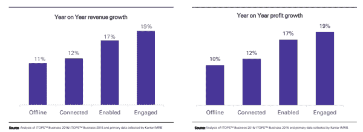
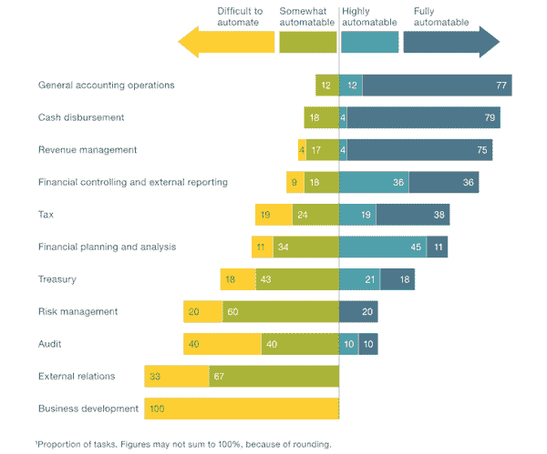

# 自动化和技术如何确保业务增长？

> 原文：<https://medium.datadriveninvestor.com/how-automation-and-technology-ensure-business-growth-58f9d04187ff?source=collection_archive---------1----------------------->

凯捷研究所最近的一项调查显示，通过在汽车、零售、公用事业、制造等行业广泛采用自动化，到 2022 年，企业可以节省高达 1650 亿美元的成本。

公司通常会不断寻找新的方法来提升他们的业务并最大化利润。这些天来，我们目睹的知名公司和初创公司的显著增长，对任何人来说都不是什么奇迹。他们巨大成功的背后是技术和自动化。如果我们以任何成功的公司为榜样，我们会发现他们的流程依赖于技术而不是人力资源，无论是初创公司还是大公司。是的，中小企业对快速采用最新技术感到害羞，但他们也在排队，这是不容忽视的积极方面。

 [## 不管准备好了没有，革命就在我们面前——数据驱动的投资者

### “对于技术如何影响我们的生活和重塑经济，我们必须形成全面的全球共识……

www.datadriveninvestor.com](https://www.datadriveninvestor.com/2019/02/12/ready-or-not-the-revolution-is-upon-us/) 

技术和自动化已经成为人类生活不可或缺的一部分，而我们作为消费者通常不会考虑它的影响。但是，企业不会忽视革命性的技术，这些技术为他们带来了提高性能和效率的机会。

由于许多企业正在建立自动化能力，麦肯锡全球调查建议，公司必须首先确定需要技术干预的功能。该调查揭示出“尽管不同行业和地区的公司至少在部分业务流程上实现了自动化，但只有极少数公司成功实现了目标。”

因此，我们可以理解成功的关键是战略性地采用技术和自动化。对于公司来说，确定自动化技术可以产生的效率和结果，以及转型将处理的中断级别非常重要。

在商业领域，像软件机器人、机器学习、人工智能这样的词已经变得很常见。正是这些创新技术和其他软件开发平台的进步，让公司重新定义了流程和工作场所自动化。今天的大多数企业(a)对它需要什么有一些想法,( b)理解拥抱技术和自动化的重要性。

接下来的问题是，技术如何影响业务增长，采用技术是否有意义。以 facebook 中的图片上传为例。脸书建议你在上传的时候给你的朋友加标签，或者根据照片中的人加标签。脸书在机器学习的帮助下为用户提供了这一功能。最后，它使上传图像更快更容易。技术和自动化在 [**业务运营管理服务**](https://www.ongraph.com/services/) 中扮演类似的角色。

**减少时间**——在业务中整合技术的诸多优势之一是，帮助减少了做同样工作所需的时间。在技术的帮助下，一个公司可以在有限的时间内做更多的事情，而不用做任何枯燥的工作。计算系统的进步极大地减少了平凡的任务，简化了复杂的事情，并且可以在几分钟内处理大量的工作。

**Revenue and Profit Impact (Source: Google, KPMG)**

**收入和利润** —现在，与数字技术的合作已经高度简化，这大大促进了收入的增长。甚至谷歌和毕马威的报告也证实了这一点，更重要的是，包括网站、电子商务和社交媒体在内的数字技术为企业提供了更高的市场影响力。与依赖线下业务运营的公司相比，以数字化方式与客户互动的公司的收入增长了近两倍。

生产率**—因为可以在更短的时间内完成更多的工作，掌握创新可以极大地提高生产率。此外，如果日常实践中基于价值的部分可以计算机化，技术还能让个人从事更多实质性的工作。这促使人们更好地利用自己的技能，从而激发更多的生产力。对于企业来说，这同样意味着完成同样数量的工作需要更少的人力。**

****效率** —技术意味着机器现在可以完成需要高水平效率和精确度的任务。创新的计算系统可以帮助企业提高从制造到营销等各种职能的能力，并确保避免出现代价高昂的错误。因此，这可以增加业务发展。**

****见解** —技术还展示了关于业务的重要体验。通过将数据和数字转化为实质性的重要信息，组织可以利用这些信息做出战略性的计算决策。大数据分析等技术的进步可以用于决策过程，并确保业务发展。**

**虽然对公司来说还有很多优势，但下一个合乎逻辑的问题是，创新和自动化应该触及企业的哪个方面？虽然简单的答案是业务的“每一个方面”。以金融科技或金融公司的流程为例。**

**正如麦肯锡公司在一篇题为“机器人、算法和财务功能的未来”的文章中所指出的，“财务组织从事广泛的活动，从收集基本数据到做出复杂的决策和为商业领袖提供咨询。因此，通过自动化提高绩效的潜力因子职能而异，需要一系列技术来释放全部机会。”**

*****你可能也会觉得很有帮助——***[***AI 在金融服务业的发展***](https://medium.com/datadriveninvestor/development-of-ai-in-financial-services-58e9249e547) ***。*****

**文章接着指出，应用麦肯锡全球研究所自动化研究中概述的类似方法，作者弗兰克·普拉施克、伊桑·塞思和罗布·怀特曼发现，截至目前，可用的技术可以完全自动化金融机构 42%的职能，并基本自动化另外 19%的职能。**

****

****Source- McKinsey and Company****

**对于考虑技术和自动化的组织来说，关键是要认识到需要技术干预的领域，以及它可以产生的效率和结果。当考虑到这三个因素时，企业应该毫不犹豫地接受对成功至关重要的创新和自动化。**

****展望未来****

**如果您的公司还没有为整个企业的自动化创建一个计划，您可以采取一些步骤来收获自动化的回报。**

****优先考虑自动化:**简单地推进自动化项目的组织可以从一开始就将自动化作为关键来获利。将此付诸实施的方法包括为技术采用定义明确的战略目标，为该计划设立执行发起人，并专注于自动化工作，开发关于成本和收益的完整知识，以使自动化成为企业范围的战略，而不仅仅是以功能性、强制性的方式实施。**

****关注角色和人:**自动化提升了 IT 的角色；因此，如果一个组织采用自动化，他们可以充分利用现有 IT。—例如，在所有未来的工作中，尽可能早地让该职能部门参与进来。公司应该采用一种明智的方式来看待劳动力管理，这可能是一种从革命中获取价值的方法的发展。它也可以是对伴随未来状态自动化过程的劳动力的技能和新角色的评估。**

****扩大所有权和采用**:已经成功部署自动化技术的公司应该努力扩大对自动化的管理和购买。该计划将在许多方面使他们受益，同时也帮助他们跟上快速发展的步伐，而不是在每次采用新技术时都重新思考他们的流程。**

**是的，我们还有时间让创新和自动化进入正轨。但事实是，2019 年将是没有自动化的公司会落后的一年。企业中的自动化可以通过多种方式实现。因此，采用最有前途的一个将是一个公司的战略举措。**

**敬请关注[商业自动化趋势](https://medium.com/p/e484ed86d479/edit)**

**要了解更多信息，请关注我们的 [Medium](https://medium.com/me/stories/public) 、 [Quora](https://www.quora.com/profile/Alka-Singh-176) 、 [Resources](https://www.ongraph.com/blog/) 和 [AppFutura](https://www.appfutura.com/cs/ongraph) 。**