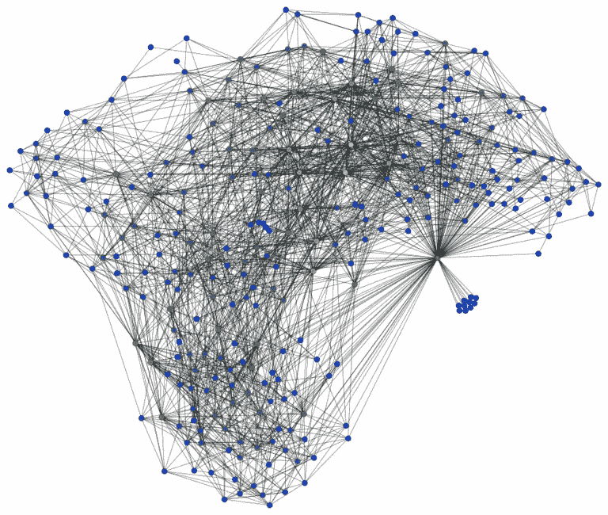
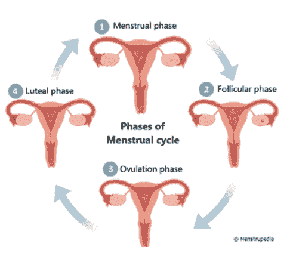
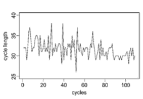
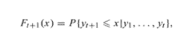
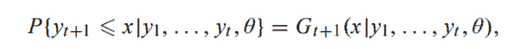
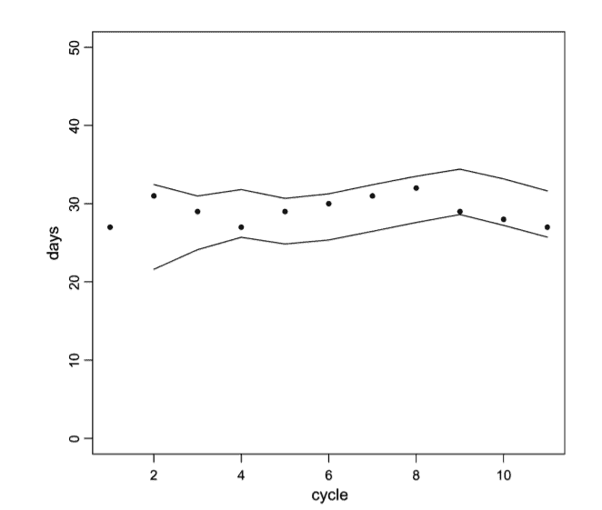
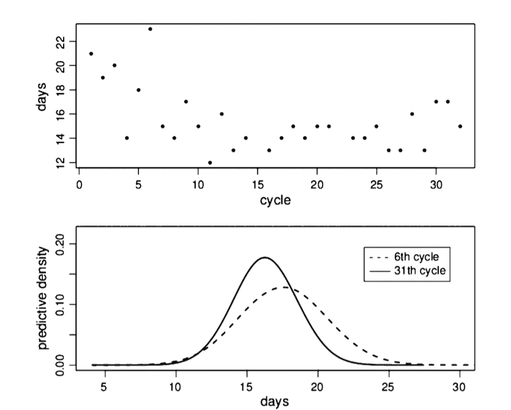
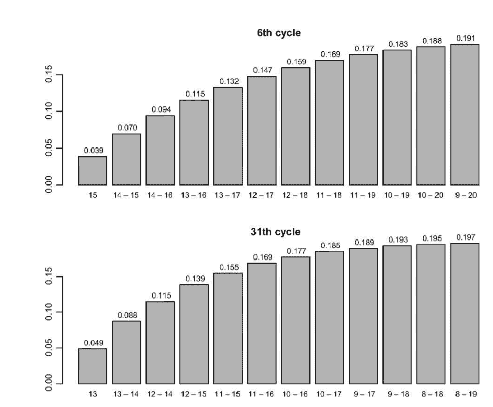
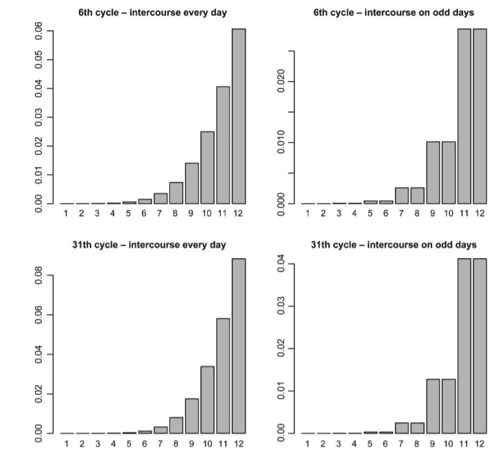

# 贝叶斯统计如何比人类更好地理解女性月经周期

> 原文：<https://medium.datadriveninvestor.com/how-bayesian-statistics-understands-women-menstrual-cycle-better-than-humans-23775f470de3?source=collection_archive---------4----------------------->

A Bayesian Network

我一直在写关于生成建模的文章，目前正在研究用于建模现实世界问题的贝叶斯技术。本文讨论使用贝叶斯层次模型预测妇女的连续月经周期长度，因为它在不孕症管理和自然计划生育中具有非常重要的作用。

基本上，月经周期有 4 个阶段，预测这些阶段的长度对上述方面非常重要。月经周期的 4 个阶段是月经期(1-5 天)、卵泡期(1-13 天)、排卵期(14 天)和 4)黄体期

要详细了解这些阶段，请阅读文章:[https://www . menstrupedia . com/articles/physiology/cycle-phases](https://www.menstrupedia.com/articles/physiology/cycle-phases)

女性的生育窗口是基于传统的日历计算，有时会使用其他自我监测症状，如[基础体温](https://en.wikipedia.org/wiki/Basal_body_temperature)或观察[宫颈粘液](https://www.babymed.com/cervical-mucus-changes-egg-white-ewcm-and-fertility)。月经失调被认为与生育能力下降和各种慢性疾病(如乳腺癌、心血管疾病和糖尿病)的未来风险增加有关。

该贝叶斯分层模型的目的是能够预测女性的这两个月经周期特征。在非常高的水平上，贝叶斯模型试图从每个对象中学习特征值，作为下一个对象的先验分布。这样，一个学科的观察结果可以用于另一个学科。排卵前阶段长度的预测性分布可用于预测下一个周期中作为性交(性交前)行为的函数的受孕概率，并且这种可能性导致识别女性最易受孕窗口的有趣应用。

数据集:1798 名年龄在 18-50 岁之间的受试者。每个妇女提供至少 6 个连续周期的序列，导致总共 36641 个周期。连续循环的最长记录序列包括 109 次测量。对于每个妇女，记录每个月经周期的长度，以及每日基础体温和月经出血发生的天数。

在周期长度和排卵前阶段长度的数据集 w.r.t 单个序列中观察到一些特征:

(I)由于数据以天为单位记录，观察到的长度是离散的。(ii)对于覆盖多年的序列，通常观察到缓慢下降的时间趋势。众所周知，随着时间的推移，平均长度会下降，这取决于女性的年龄。对于数据库中具有最长连续周期记录序列的妇女，周期长度相对于时间作图。

模型

考虑一个单独的女性，让 yt 表示她第 *t* 个月经周期(⁠t=1,2,…⁠)的天数，或者，基础体温中的低温期的天数。我们的主要目标是推导一步预测分布。

对于 t=1，2，…我们有兴趣评估 Ft+1(x)的整体，因为单个系列内不可忽略的可变性意味着区间预测比点预测更合适

在寻找适合描述观察到的过程的统计模型时，我们必须考虑到妇女内部和妇女之间的可变性。用于模拟这两种变异来源的方法可描述如下。为了解释特定女性周期之间的变化，这里提出了一个参数模型，Gt+1 是完全指定的，θ是未知参数的向量。然后，我们假设 Gt+1 的函数形式对于所有女性都是相同的，而女性之间的剩余可变性可以通过允许θ根据概率分布 p(θ|ζ)在受试者之间变化来描述。最后，我们通过指定ζ的先验分布，在贝叶斯框架中处理这个问题。

等级模型的公式直接遵循个体模型，允许θ根据概率分布 p(θ|ζ)在女性中变化。

结果和诊断:

数据库的大规模允许我们将女性随机分为两组。第一组包括 1100 名妇女，用于评估，而第二组包括 698 名妇女，用于诊断。这样，从第二组获得的结果给出了模型的真实性能的概念。根据测试组评估的一步预测的均方误差(MSE ),拟合模型的性能。由于无法获得试验组女性个体特定参数的后验分布，为了得出 MSE 计算中所需的预测分布，这些已被相对人口数量所取代

现在这一节讲讲如何使用这个模型。该图显示了观察到的特定女性的周期长度以及从 Ft+1(x)得出的 95%预测区间。应当记住，在实践中，输出是逐渐显示的，随着连续的观测数据变得可用，从左到右逐渐变化，并且在第个周期结束时计算第(t + 1)个周期长度的预测间隔。

图 5 的第一幅图显示了不同女性的观察到的排卵前期长度，而下图显示了其第 6 和第 31 周期的排卵前期长度的预测密度。这两种密度差别很大。特别是，第 31 个循环密度向左移动，分散程度较低。位置转移显示了模型如何从系列的局部水平的数据中学习，在图 5(上图)中，局部水平的数据似乎在减少。离差的减小是由于到第 31 个周期时可获得额外的数据。

排卵前阶段长度的预测分布可直接用于自然计划生育和不孕症管理。然而，对于这种类型的应用，我们还需要在给定特定性交行为的周期中受孕的概率。设 R 是描述周期中特定交媾模式的向量，即 R = [r1，r2，.。。]，其中如果性交行为发生在第 I 天，ri = 1，否则 ri = 0，U(y，R)是在给定排卵日 y 和性交行为 R 的周期中受孕的概率

函数 U(y，R)不能用于预测，因为我们不知道下一个周期的排卵日。然而，如果我们将 U(y，R)与 y 的预测分布相结合，我们可以计算下一个周期的受孕概率 Vt+1(R ),给定性交行为 R 和先前观察到的排卵前阶段的长度

因此，最酷的事情是，如果我们想确定下一个周期中 x 个最肥沃的日子，我们可以简单地找到在 R1+R2+∙∙= x 的限制下使 Vt+1(R)最大化的 R。最肥沃的日子的识别经常被试图通过生育意识方法实现或避免受孕的夫妇使用。

■使用 Vt+1(R)的另一个例子，对同一位女性来说，性交时受孕的风险只发生在第一个 i (i = 1，.。。周期的 12 天，具有以下两种状态中的一种:每天性交和仅在奇数天性交。每日性交假设为一个周期中的受孕概率提供了一个上限，并可用于估计不孕的排卵前时期的长度。

上图:女性第 6 周期和第 31 周期的最佳生育间隔。柱的高度给出了预测的受孕概率，如果在柱底部指示的间隔内每天都有性交行为。

上图:在假设妇女在第一个 i (i = 1，.。。，12)天的周期。

因此，我们看到了基于贝叶斯的统计模型如何被用来预测连续周期的长度，并帮助我们预测受孕或不受孕的最佳生育期。这些月经周期预测也可以用来诊断女性的问题。

毫无疑问，贝叶斯比男人或女人更了解女人！！

参考论文:[论文](https://watermark.silverchair.com/kxq020.pdf?token=AQECAHi208BE49Ooan9kkhW_Ercy7Dm3ZL_9Cf3qfKAc485ysgAAAkMwggI_BgkqhkiG9w0BBwagggIwMIICLAIBADCCAiUGCSqGSIb3DQEHATAeBglghkgBZQMEAS4wEQQMc3iQq2s2sEfs5SqXAgEQgIIB9kwfPAmASQ-9Lmj-O9te1ccw4oJ0USCvd-l0NYTFlrg5xrtXU58difR5VRe27a6to10AbSKyISTaamlZ815MwqHy9rMU2LaXT-kbtTWYfXaTQ3c3n1ccyHSJXZG3SK96GExVyzo73IRXXBLMYqnFP0_H8SFmyca0k4UG8-jCmEZ6ReXvpPw2urbYUq54VnEmwUJcTmwq1s2sZevsxV9dQZSqUtrzY9WisgRlSqjVPzJSlxXVPfr0TFiGTIz1C3Y8AWrvSVlq9I6bFsazBtnun8akAKELy1zpRZn5rwcA2Fuerg-Ucp9_AgePvrRzcOUYQcF6qGtJnGFbGESL6TUClTDqV0Mi6bEzhy4XfXX0_y4BqyzOI6qAsF0py4S6J2NOSDM4xt5KIzgQxjMw5Qb_I835a-TxNU0DWG-FlxumXZTneCCTs4gD7qwjs5Cf9XK4VSJUWJC1vg0nSgdz4hw36thPpiaL7R_DS3LyezCfEj7u7j0jXslCyy8RleIdgp89cnfFtWvdKMwv86FajyvEN38Ev8R6Q4bkQgnKBzEAS0uX8jRHZuiWCefbBkSC4xxTmLFQbOf7h3Lw7A3-W02qtvusQ63ToE0k8AR5QZ5bpCayHGXmo-6mZKwrJWdlUKgUA7MJnUlEma4rkK2jkZ2sgHl0Pw86rCg)