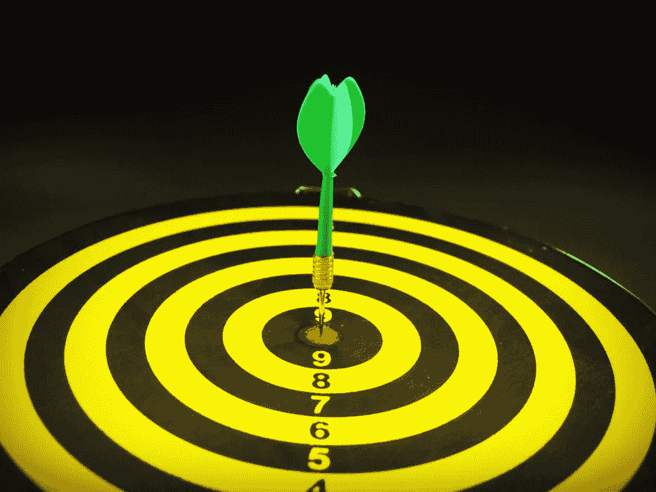

# 完美是优秀的敌人

> 原文：<https://medium.datadriveninvestor.com/how-being-perfect-is-the-enemy-of-being-good-2f0f3f5199df?source=collection_archive---------10----------------------->

无论是创业者还是开发者，我们都希望从各个角度做到完美。

无论是一个产品还是一项服务，我们都试图从各个角度做到尽善尽美，延迟对外发布只是为了保证它的完美。

在个人理财领域，我们等着在银行里获得一些额外的现金来开设一个退休账户，这是我们过去几个月一直想要的。我们努力做到万无一失，等待薪水。我们没有意识到的是，我们正在耽误一件好事，那就是开户。

# 你只需要开始

> “为了完成伟大的事情，我们需要开始并完成它。根据反馈和时间进行微调。”

> 没有人能在脸书第一次发布时就拥有它所有的完美特性。完美是需要时间的。它需要收集好的评论，并根据这些评论做相应的工作，以使它成为更好的产品。
> 
> Twitter 最初并没有想到使用标签。是那些开始用不同标签使用 Twitter 的用户让他们思考使用标签的潜力。他们做了渐进的改变来构建我们今天使用的具有优秀特性的产品。它并不完美，但很好。随着时间和评论，它变得完美。
> 
> 杰夫·贝索斯创立亚马逊的目标是卖书。随着时间的推移，他也看到了出售其他东西的潜力，现在截至我写这篇文章时(2018 年 10 月)，他是世界上最富有的人。

所以，不要试图建造什么东西，或者为了让它变得完美而努力实现你的目标。做好自己的工作，发布一个好的产品就行了。随着时间的推移会变得完美。不要因为从你的角度来看它并不完美，就推迟它对外界的可用性。你永远不知道它对别人有多有用。

# 人们有不同的心智模式

人们有不同的观点，这些观点被称为心智模式。每个人从不同的角度看一个产品。对你好的不一定对别人好，对你不完整的可能对别人很有用。

> “不要想着做出完美的东西。最初做得很好，随着时间和反馈不断改进，这是可以的。重要的是开始和完成。”

有一个目标，为之努力，并向外界提供最终产品或服务。收集反馈并加以改进。重复循环。

# 如果你追求完美主义，你将永远不会出版

很久以前，当我在一家初创公司工作时，我们正在做一个项目，这是一个功能蠕变。就在我们过去完成所有必需的功能时，有更多的功能被管理层决定添加到产品中。

这个项目一直没有结束。总是有一些或其他的功能被包括在内，发布时间被推迟。这都是因为我们追求完美主义。

管理层希望产品非常完美，没有用户和客户的抱怨。在这一点上，我们应该明白在所有方面都尽善尽美并没有那么好。

发布一个不像我们想要的那样完美的产品是可以的。随着时间的推移，我们可以逐渐完善它。客户和用户会称赞我们随着时间的推移做出了良好的增量变化。

你还在等什么？完成你正在做项目，并向外界公开。如果你追求完美主义，你将永远不会发表它或让别人得到它。**只要优秀就可以，不要追求完美。根据反馈逐步做出改变。**

# [这是我所有个人理财文章的清单](https://medium.com/@abhilashgupta8149/personal-finance-articles-index-30e48fcc6075)

如果您对个人财务和资金管理有任何疑问，我希望收到您的来信。

**感谢阅读。如果你喜欢这篇文章，请随意点击那个按钮👏帮助其他人找到它。**

# 然后..

 [## 如何在我们的工作中做到最好

### 在上一篇文章中，完美是优秀的敌人，我们学习了如何在…

medium.com](https://medium.com/@abhilashgupta8149/how-to-be-best-at-what-we-do-acd5770709fb) 

*最初发表于* [*FinCalC 博客*](https://fincalc-blog.blogspot.com/2018/10/how-being-perfect-is-enemy-of-being-good-fincalc.html)