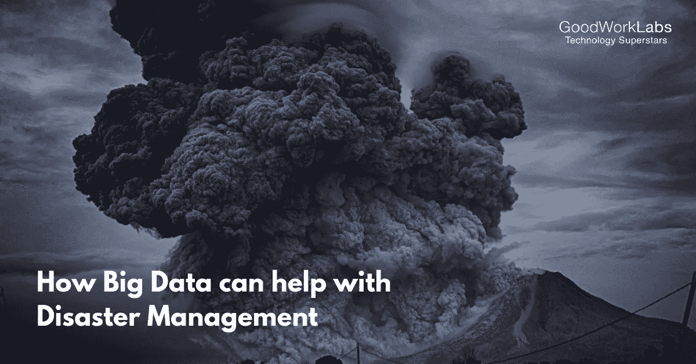

# 大数据如何帮助灾难管理

> 原文：<https://medium.datadriveninvestor.com/how-big-data-can-help-with-disaster-management-7c9901fa7dd6?source=collection_archive---------18----------------------->

从历史中抽出一页，你会发现，在拯救处于可怕灾难中的人们时，所有这些众多的政策都没有效果。随着创新的不断发展，政府应该更加关注各种大数据技术，以帮助预测灾害和救灾工作。

像[物联网(IoT)](https://www.goodworklabs.com/iot-application-development-company/) 这样的伟大创新如今变得越来越常见，而二十年前却不是这样。随着自然灾害频率的增加，通过这一技术在通信方式上取得的进步导致伤亡人数大幅减少。

 [## 挑战你对人工智能和社会的看法的 4 本书——数据驱动的投资者

### 深度学习、像人类一样思考的机器人、人工智能、神经网络——这些技术引发了…

go.datadriveninvestor.com](http://go.datadriveninvestor.com/4AI1) 

像 NASA 和 T4 国家海洋和大气管理局(NOAA)这样的机构已经使用大数据技术来预测这些自然灾害，然后在紧急情况下与响应人员协调。这种技术对于各机构来说也是必不可少的，它们通过记录救援地点和疏散路线的位置来列出典型的灾难响应。

此外，风暴影响区周围的机构使用[机器学习算法](https://www.goodworklabs.com/best-machine-learning-solutions/)来了解风暴和洪水等灾害，以及它们可能造成的潜在损失。

# 大数据和灾难管理

大数据技术是一种巨大的资源，已经在灾难救援、准备和预防方面不断证明了它的实力。大数据有助于响应机构识别和跟踪人口，如老年人群、儿童和婴儿高度集中的地区等。

大数据系统有助于与救援人员协调，以确定可以提供支持的资源，并在此类紧急情况下进行一些后勤规划。实时通信的便利也是灾害中的一个额外优势，因为使用这一技术可以预测将受到影响的公民的反应。

大数据系统现在正处于加速增长阶段，有研究称，世界上 90%的数据是在过去两年内生成的，这是一个巨大的数字。所有这些数据都有助于应急部门的经理在自然灾害发生时做出更明智的决策。

通过将用于绘制地理记录的数据与实时图像相结合，始终如一地生成的报告被证明对灾害应对管理有着巨大的好处。它们还向响应者提供关于受影响区域的状态的信息，为他们提供持续的实时数据流，以防出现紧急情况。

# 大数据的优势

大数据技术无疑是应对自然灾害和提高应急响应效率的一个重要方面。

但是，下面通过适当的实例解释了一些广泛的好处。

1.  **危机映射**

内罗毕的非营利数据分析社区被称为 [Ushahidi](https://www.ushahidi.com/about) ，创建了一个收集信息的开源软件平台。这项技术在 2008 年首次开发的地图平台上工作，分析肯尼亚总统选举后发生暴力的地区。

当时的信息来自社交媒体和许多目击者。他们的团队成员随后将同样的信息放在交互式的谷歌地图上，帮助居民脱离危险。

同样的技术在 2010 年再次使用，当时海地经历了一场地震，证明它在拯救该地区众多公民的生命方面是不可或缺的。

**2。拉近爱人和家人的距离**

脸书和谷歌是目前真正的技术领导者，他们也投资开发了一些先进的资源，这些资源在发生自然灾害时也能受益。他们部署了庞大的在线系统，使家庭成员在分离后能在紧急情况下再次联系。

谷歌的“寻人”应用程序是在海地地震后发布的，用于帮助人们与家人联系。该平台的功能是让人们输入失踪人员的信息，并在灾难发生时与他们重新联系。

**3。为紧急情况做准备**

处理大数据的系统不断地让机构更好地预测或预报特定灾难何时会发生。这些机构致力于确保将数据收集、通知平台和情景建模结合起来，形成强大的灾害管理系统。

自然灾害发生时，居民提供家庭信息，机构利用这些信息评估和分配资源。例如，这些公民分享可以挽救生命的信息，如家中有身体问题的家庭成员的存在。

美国一直需要那些能够在自然灾害中运用有助于预测和拯救生命的技术的科学家。

相当一部分公司领导认为，数据科学家数量的短缺使得他们的企业很难在竞争激烈的市场中生存下来。显而易见的结果是，与竞争对手相比，那些成功获得优秀 IT 人员的公司表现得更好，完全是因为他们的天赋。

如果预测者的分析可信，到 2020 年，美国的公司将为非常有才华的数据科学家创造近 50 万个工作岗位。然而，这些科学家的现有储备表明，目前只有 20 万这样的科学家。这可能只是一个好消息，因为它为未来所有有抱负的数据科学家提供了新的机会。

*原载于 2019 年 3 月 1 日*[*【www.goodworklabs.com】*](https://www.goodworklabs.com/big-data-for-disaster-management/)*。*