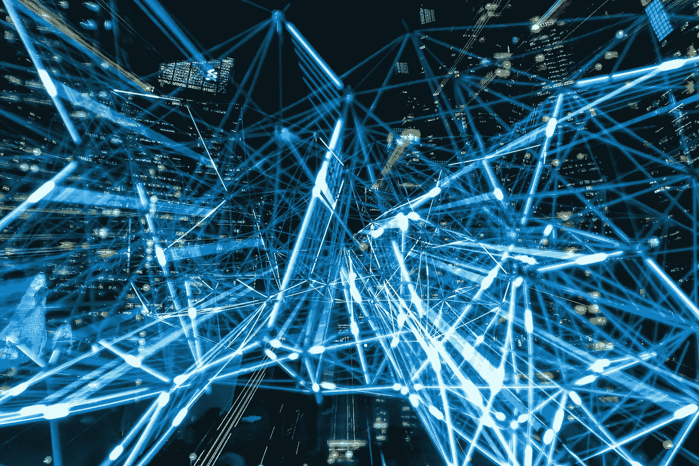
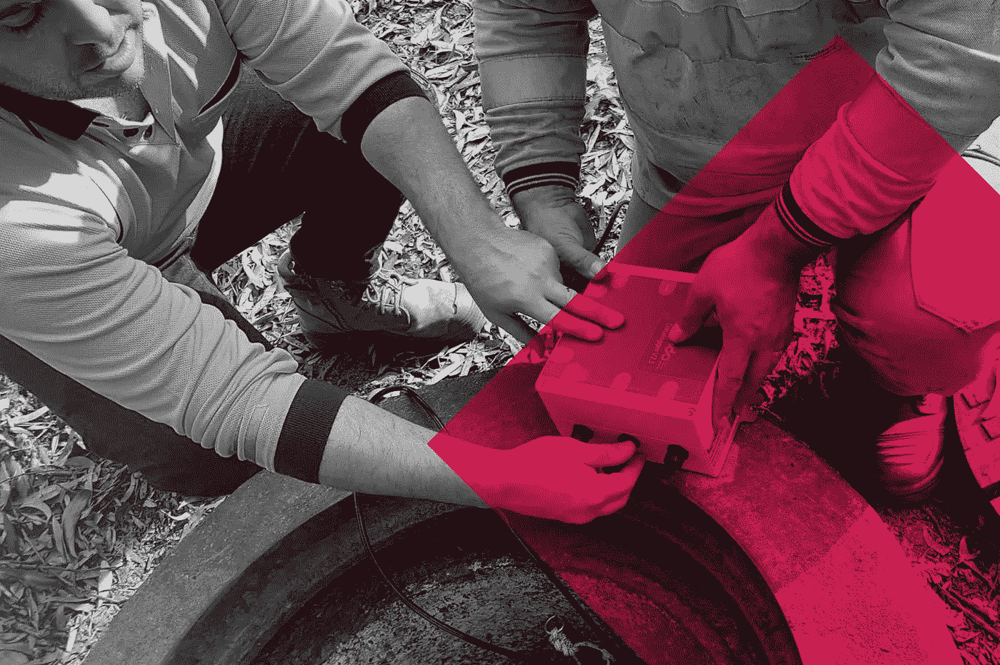

# 大数据如何支持智能收集系统并保护废水处理厂

> 原文：<https://medium.datadriveninvestor.com/how-big-data-enables-smart-collection-systems-and-protect-wastewater-treatment-plants-32595fbe6852?source=collection_archive---------7----------------------->

## 废水网络可能是城市基础设施中最被低估的部分。虽然城市的大部分居民和工业都依赖于它们，但许多人并没有意识到维护一个下水道需要做的工作，也没有意识到城市发展给重要的废水系统带来的压力。这些越来越集中的废水处理服务，即公用事业在一个集中的地方处理废水，可以帮助满足日益增长的人口需求。

数字化对于提供这些集中式水收集服务和支持高效城市化至关重要。它使网络能够受益于在线连接和管理平台，这些平台以信息(大数据)为食，处理数据的效率远高于人工操作员。这些革命性的过程通常被称为人工智能(AI)系统，它们改进了废水网络的管理方式，有助于保护废水处理厂免受破坏，最大限度地提高过程效率，并支持扩大水再利用项目。

通过人工智能数字化城市的污水网络始于良好的数据。为了了解这样一个系统如何能够提供运营废水智能，了解大数据、人工智能、机器学习及其应用非常重要。

人工智能系统使用机器(特别是先进的计算机系统)复制人类智能。这些过程包括“学习”(获取信息和使用信息的规则)、“推理”(使用规则得出近似或明确的结论)和“自我纠正”。人工智能工具能够分析数据，并识别网络系统何时面临高污染负荷。这种分析然后转化为可操作的见解，使运营团队能够减轻事件的影响，追踪事件的源头，并通过扣留污染物和教育污染网络的用户来减少事件的影响。

 [## 为什么数据将改变投资管理|数据驱动的投资者

### 有人称之为“新石油”虽然它与黑金没有什么相似之处，但它的不断商品化…

www.datadriveninvestor.com](https://www.datadriveninvestor.com/2019/01/25/why-data-will-transform-investment-management/) 

人工智能平台需要大量高质量的数据(大数据)来优化功能，特别是在执行复杂操作(如管道内废水网络活动分析)的情况下。两种类型的大数据对于提供有效的情报至关重要:历史数据和实时数据。

历史数据是指由公用事业和水务组织存储和保存的数据。这些数据是在几年的时间内从网络中收集的，可以详细描述任何数量的水条件读数，如温度、流速或 pH 值。这可以用作参考目录，提高网络条件报告的准确性，因为算法会根据这些数据来学习模式并检测与标准不同的事件。

实时数据由网络中的当前活动驱动，由连接的传感器测量，这些传感器记录废水质量参数并将实时情况报告传输到云。

这两种数据类型被馈送到由人工智能系统运行的在线分析平台，该平台存储、分析并呈现这些信息作为运营洞察。数据清理和鉴定是该过程中的重要步骤，因为删除不可靠的数据可以提高洞察力和输出质量。

在人工智能系统中，先进的机器学习(ML)工具允许对数据进行分析和关联，并构建算法。然后，软件本身可以检测异常和模式。在智能水管理模型中，这些工具用于检测和预测废水行为。ML 过程通常从受控的数据输入和操作员指令开始，允许 AI 识别数据集中的模式和与目标过程相关联的典型特征。随着时间的推移，系统开始自我学习，自动计算改进流程的方法。

使用大数据和人工智能的智能水管理系统可以为废水网络运营商提供实时网络状况的洞察力。Kando 的 Clear 上游智能废水管理平台就是这样一个系统。Kando 的大数据分析推动了更有针对性的废水源头控制，利用实时网络信息不断优化流程。然后可以接触和管理被确定为系统违反许可证的来源。

[Clear Upstream](https://www.kando.eco/the-solution) 是一种数字解决方案，可在早期阶段实时检测、追踪和采样下水道中的非法和过量废物。该解决方案以服务即解决方案(SaaS)包的形式交付，为公用事业和城市提供自动采样废水流量的物联网(IoT)测量单元、基于网络的引擎和 Kando 方法。

一旦有了数据，Kando 的引擎(智能算法)就会分析输入，检测关键指标何时偏离预定标准，并通过可操作的实时网络洞察通知水管理团队。该系统追踪确切的排放源，并自动启动采样，以收集可疑事件的证据。然后，这些样本被收集起来，送到实验室进行进一步分析。返回后，实验室测试的结果将被添加到 Kando 的数据库中，为以后类似情况的分析提供信息，并增强对未来废水污染事件的响应。

**案例分析**

希腊公用事业公司 EYDAP 为这些大数据驱动的系统如何保护废水处理厂提供了一个绝佳的例子。

雅典公用事业公司致力于实现废水监控和实时污染检测结构的现代化，并向 Kando 的 Clear Upstream 寻求解决方案。智能废水管理解决方案最初在 EYDAP 的网络中部署了四个物联网连接的传感和采样单元；三个在网络收集器的下游，一个靠近工厂的废水出口。这种部署方法使用户能够全面了解大区域的情况，并检测可能表明污染的废水质量变化。

在污染事件中，物联网采样器会自动激活，采集样本进行实验室评估。实验室结果证实了污染，但 Kando 的算法表明，污染源是最初怀疑的另一家工厂。一个物联网设备被重新定位，旨在确定来源。

在部队重新部署后，坎多的引擎立即检测到一个被污染的负载，并将其关联到一个特定的位置。一个特定的工厂被精确定位并被监控，在随后的事件中进一步的样本被自动提取。把样本送到实验室-证实了 Clear Upstream 的发现。验证后，电力公司能够做出明智的决策，采取果断措施处理问题根源，并大幅减少污染事件。

本案例研究展示了采用人工智能驱动的智能废水管理工具来实现增强网络运营的价值。EYDAP 能够检测其网络中的异常情况，并获得洞察力，从而做出明智的决策并采取预防性措施来保护废水处理过程。能够检测、追踪、跟踪和查明污染源使他们能够与污染者进行对话，产生意识，并导致网络中的污染负荷降低 50%。