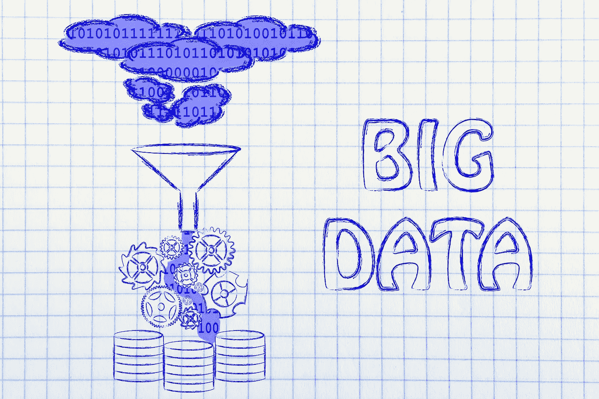

# 大数据如何颠覆金融行业

> 原文：<https://medium.datadriveninvestor.com/how-big-data-is-disrupting-the-financial-industry-1f43754f4388?source=collection_archive---------1----------------------->

金融业正在经历自互联网出现以来从未有过的技术变革。移动银行和支付、通过短信的即时点对点转账、在线点对点贷款、机器人建议、人工智能驱动的聊天机器人以及区块链的银行间支付——仅举几例——都是过去十年出现的金融创新。

促成这一技术变革的关键因素之一是金融服务公司对大数据分析的整合。

# 什么是大数据？

[大数据](https://www.forbes.com/sites/lisaarthur/2013/08/15/what-is-big-data/#50fdeee5c85b)指的是结构化和非结构化数据集，这些数据集过于庞大和复杂，无法使用传统的数据库管理应用程序进行处理。然而，最近该术语的含义发生了变化，也包含了新的预测数据分析工具，这些工具能够利用这些大型数据集来产生对用户行为的宝贵见解。

换句话说，大数据可以让公司更好地了解客户的行为，同时更准确地预测他们未来的行为。因此，鉴于金融行业的数据密集程度，大数据可用于金融行业的一系列应用。

在本文中，您将发现金融行业正在使用大数据的三个领域；即情感分析、欺诈预防，以及开发可用于直接为每个客户定制产品和服务的深入客户知识。

# 情感分析

个人在多个社交媒体网络和在线平台上表达自己的观点和意见。无论他们是在抱怨猫途鹰一家餐厅的食物，还是在 Twitter 上表达他们的政治观点，或者在论坛上分享他们对一部新电影的想法，他们都在提供情感数据。

例如，通过部署 Apache Hadoop 等大数据分析程序，这些观点可以被整理并用于改善为银行客户[提供的服务和产品。Hadoop 使用自然语言处理和机器学习从大型基于情感的数据集中提取关键数据点，这些数据对企业可能有用。](http://www.computerweekly.com/blog/Data-Matters/Sentiment-analysis-with-Hadoop-5-steps-towards-becoming-a-mind-reader)

使用 Hadoop，银行可以发现有多少客户对银行的客户服务不满意，并在网上表达这些意见。例如，分析可能会发现，十分之三的客户对他们正在接受的服务不满意，但在银行主要竞争对手的客户中，只有十分之一的客户对他们银行的服务不满意。这将为银行提供重要的见解，然后可以采取行动改善其服务。

对冲基金[也在利用情绪分析来预测股价走势](https://www.wsj.com/articles/tweets-give-birds-eye-view-of-stocks-1436128047)。例如，大数据分析可以用来通过关于公司的正面或负面推文数量来衡量对股票的情绪。

通过分析成千上万条关于特定股票的推文，分析工具可以实时显示对股票的情绪是非常积极还是非常消极。这些信息可以被高频交易算法用来做短期交易决策。许多领先的机构已经在这一领域进行了大量的研究，例如 T4 大学、斯坦福大学和德克萨斯大学。

# 欺诈检测和防范

欺诈每年给金融业造成数十亿美元的损失。此外，在当今安全漏洞被全面披露的世界，严重的欺诈案件也会损害金融机构的品牌和声誉。由于这些原因，欺诈检测和预防在全球金融机构的议事日程上占据重要位置。

[在打击欺诈的战斗中，大数据是非常有用的](https://www.forbes.com/sites/ibm/2014/09/22/how-to-use-big-data-to-fight-financial-fraud/#be1c6046f478)武器库。通过将大数据与人工智能和机器学习技术相结合，可以比以往任何时候都更容易地识别和预防欺诈模式。

通过分析和跟踪新客户的行为，从最初的客户入职流程一直到交易监控和日常客户互动，金融服务部门可以使用大数据分析来检测异常的客户活动。

通过结合预测分析、行为特征分析和实时检测，大数据分析可以让金融机构以大数据革命前不可能的速度进行欺诈检测。

此外，随着机器学习应用于客户行为数据，未来欺诈预防所需的预测能力得到了大幅提升，这要归功于在欺诈检测和预防流程中纳入了大数据。

# 深入的客户知识

在这个行业中，提供定制的用户体验变得比以往任何时候都更加重要，因为新的初创公司涌入，试图从现有机构手中夺取市场份额，因此竞争越来越激烈。

通过使用大数据，金融服务公司可以向其客户提供定制的金融服务。通过整合广泛的数据点，包括客户的电子邮件、投诉、客户支持查询、社交媒体上的声明等。金融服务公司能够构建一个 360 度的客户视图，然后使用它来定制服务和交叉销售适合客户需求的产品。

此外，通过将大数据与机器学习相结合，可以向客户提供定制的金融建议。机器学习软件可以通过分析客户的大数据来学习客户的行为和需求。然后，这些发现可用于提供专门针对该客户的金融建议，包括适合他们的服务和产品。得益于大数据，这种获取深入客户知识的新能力可能会成为金融机构非常有利可图的业务。

大数据正在以对消费者和金融机构都有利的方式颠覆金融业。消费者可以从与金融机构更加个性化的互动中受益，而金融服务公司将能够增加收入并减少欺诈和其他恶意活动造成的损失。

*原载于 2018 年 3 月 28 日*[*【www.datadriveninvestor.com】*](http://www.datadriveninvestor.com/2018/03/28/how-big-data-is-disrupting-the-financial-industry/)*。*