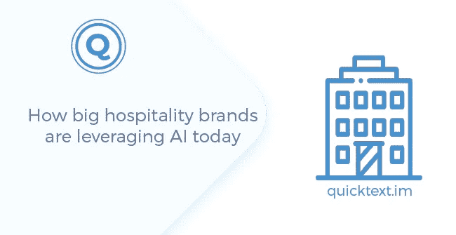
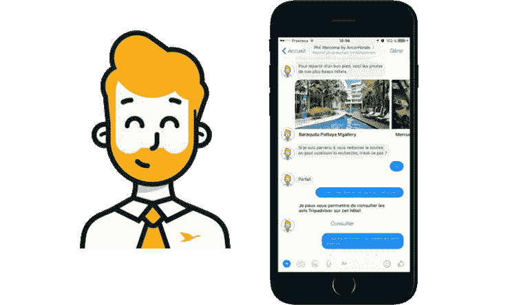

# 如今，大型酒店品牌如何利用人工智能

> 原文：<https://medium.datadriveninvestor.com/how-big-hospitality-brands-are-leveraging-ai-today-a5e194ab3dcc?source=collection_archive---------43----------------------->

当所有酒店房间都舒适且设计精美时，您如何获得竞争优势？

设计是 2000 年代成功的关键；现在已经成为新常态。当所有的酒店都在出售或多或少相同的房间时，你如何与你的竞争对手区分开来？

一个好的策略是向更高水平的客户服务和个性化发展。以客户为中心的方法过去很难维持，因为它需要大量的员工，你必须招聘、培训和支付不同质量水平的服务。酒店品牌已经大量采用人工智能作为应对这一挑战的关键。

让我们看看大品牌目前如何利用技术为客户提供出色的体验，以及独立酒店应该如何避免商品化。

> ***品牌如何规模化客服？***

聊天机器人已经成为任何可扩展客户服务的基本元素。聊天机器人是能够立即理解和回答顾客的机器人。他们可以执行基本任务，如预订房间、回答常见问题、推荐酒店周围的地方等。这样，他们过滤掉大约 80%的客户请求，将剩下的 20%传递给员工。

大多数酒店品牌都有聊天机器人。我最喜欢的聊天机器人名字是 Phil Welcome by AccorHotels，因为它同时是一个名字和一个邀请。Phil 的目标是成为一个旅行伴侣，能够在顾客入住前、入住中和入住后与顾客互动。菲尔是作为雅高数字计划的一部分而诞生的。聊天机器人有助于帮助该品牌成为移动领域的冠军。虽然 Phil 仍处于早期阶段，但万豪酒店(Marriott Hotels)等品牌早在 2014 年就已经在开发他们的机器人。

万豪很早就认识到顾客是懒惰的，你让他们的旅行越容易，他们就越有可能被吸引并成为忠诚的顾客。

*   ChatBotlr 首先部署在他们的空中酒店。它最初是一个简单的短信机器人，允许客户要求额外的毛巾和其他基本服务，并逐渐扩大。据万豪称，大约⅔的顾客在入住期间会与机器人互动。
*   事实证明，聊天机器人非常高效，万豪奖励机器人就是为了帮助奖励客户预订房间、管理预订以及获取与他们下次旅行相关的旅行提示而开发的。

万豪奖励视频:【https://youtu.be/bkFHECiL83Q 

许多其他酒店品牌也加入了万豪，如雷迪森的爱德华时代酒店(Edwardian Hotels)推出了爱德华。

爱德华视频:[https://youtu.be/G8wPldZR78w](https://youtu.be/G8wPldZR78w)

IHG 正在通过 Indigo Hotel 的聊天机器人将酒店体验推向一个全新的水平，这些聊天机器人的行为就像虚拟的本地主机，引导客户发现异国情调的地方。

靛蓝视频:[https://vimeo.com/243604025](https://vimeo.com/243604025)

> ***独立酒店如何提供有竞争力的客户服务？***

独立酒店经营者听说聊天机器人和人工智能已经有几年了，但大多数人仍然对聊天机器人持怀疑态度，直到他们接到一个警钟:Expedia、Kayak、Tripadvisor 以及 Booking.com 都推出了自己的聊天机器人。预订助手是为了自动回答客户的问题和请求而创建的，因为客户希望获得即时定制服务。多亏了聊天机器人，与大多数酒店向其直接预订者提供的服务相比，预订目前向其客户提供了更好的数字服务。看一看。

订票助理视频:[https://youtu.be/MEG2VOS6t7o](https://youtu.be/MEG2VOS6t7o)

聊天机器人和信息是奇妙的互动工具，已经成为酒店营销的必备工具。大品牌选择关注忠诚度，因为他们的奖励计划是他们营销策略的重要组成部分。然而，较小的酒店集团通常没有完全相同的担忧，应该专注于利用人工智能的力量来帮助解决他们自己的挑战，例如销售，聊天机器人的对话能力可以用来吸引在线游客，解除他们的疑虑，并帮助他们完成预订过程。

毫无疑问，聊天机器人很棒，但你不能指望它们为你解决所有问题。它们就像电动自行车——用很小的力气就能帮你走得很远，但在某些时候，你不得不踩踏板。有时候他们没有答案，这也没关系；这时工作人员开始工作。

总的来说，消息、聊天机器人和人工智能的引入让我想起了 20 年前网站发生的事情。

> *如果你想讨论更多或者有关于聊天机器人和 AI 的问题，欢迎联系我*[*bde @ quicktext . im*](mailto:bde@quicktext.im)*查看我们的 Quicktext 视频*[*https://youtu.be/MRwImPq1BUg*](https://youtu.be/MRwImPq1BUg)

*原载于*[*www . quicktext . im*](https://www.quicktext.im/resources/how-big-hospitality-brands-are-leveraging-AI-today)*。*