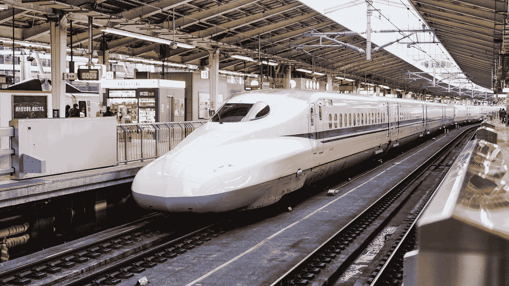
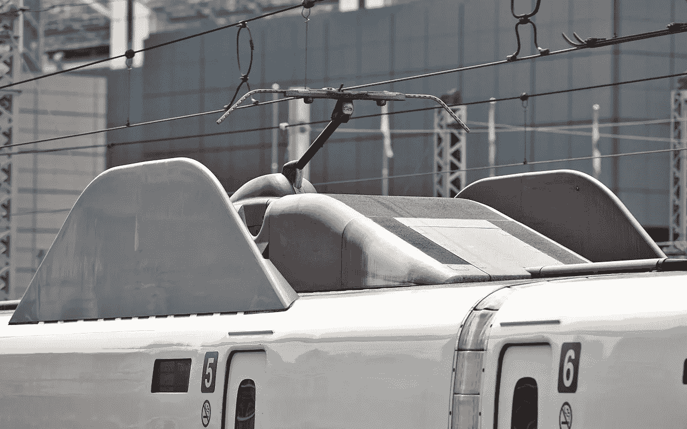

# 仿生如何战胜音爆

> 原文：<https://medium.datadriveninvestor.com/how-biomimicry-beat-the-sonic-boom-e17ac21b28de?source=collection_archive---------1----------------------->

## 这是一个难以置信的真实故事，讲述了一位鸟类观察者对自然世界的热爱如何帮助解决了困扰东京市中心的一个工程问题:子弹头列车的音爆头痛。

The story of the unforseen technological applications of a Kingfisher’s beak | Photo by [Boris Smokrovic](https://unsplash.com/photos/DPXytK8Z59Y?utm_source=unsplash&utm_medium=referral&utm_content=creditCopyText) on [Unsplash](https://unsplash.com/search/photos/kingfisher?utm_source=unsplash&utm_medium=referral&utm_content=creditCopyText)

阿潘所谓的“子弹头列车”的名字比你想象的更贴切。当机车在 1964 年首次亮相时，它被誉为设计杰作。

然而，到了 1990 年，掌声变成了愤怒，因为项目工程师和东京人民发现了列车设计中一个非常明显的问题。

新干线列车时速超过 320 公里，每次进入隧道，它们基本上就成了猎枪子弹。就像步枪一样，每次火车冲出隧道时，都会伴随着一声爆炸。

Japan’s famous Bullet Train, featuring Nakatsu’s “kingfisher” nose-cone | Photo by [Fikri Rasyid](https://unsplash.com/photos/3ba59K57wE4?utm_source=unsplash&utm_medium=referral&utm_content=creditCopyText) on [Unsplash](https://unsplash.com/search/photos/bullet%20train?utm_source=unsplash&utm_medium=referral&utm_content=creditCopyText)

这种现象被称为“隧道爆炸”，是由火车迫使空气沿着封闭的隧道流动，并以波的形式建立空气压力，直到它以音爆的形式释放到隧道的尽头(类似于协和喷气式飞机发出的噪音)。心怀不满的当地居民报告称，在距离铁路 400 米远的地方听到了爆炸声。

 [## 准备在 2019 年改变世界的技术-数据驱动的投资者

### 很难想象一项技术会像去年的区块链一样受到如此多的关注，但是……

www.datadriveninvestor.com](https://www.datadriveninvestor.com/2019/01/17/the-technologies-poised-to-change-the-world-in-2019/) 

因此，日本强制规定了可接受的 70 分贝的限制，以防止进一步的噪音污染水平。子弹头列车的工程师们面临的问题是如何在不影响速度的情况下降低噪音？

直到 1994 年，一位名叫中津英二的工程师偶然发现了这个解决方案，这要归功于他不同寻常的爱好:观鸟。

在偶然遇到一位鸟类爱好者后，中津意识到在自然界中可能已经有了解决火车问题的方法。受翠鸟的启发，中津给了他的火车一个 50 英尺长的钢铁“喙”,解决了噪音污染问题，还出人意料地使新干线列车的效率提高了 10 %- 15%。

在设计中，这被称为仿生。简单来说，这种实践包括从自然界中寻找解决问题的方法。仿生研究所的执行主任贝丝·拉特纳将这一过程解释为“受自然启发的创新”

她补充说，“这个想法是，我们可以模拟生物如何运作，以创造支持健康地球的材料、产品和系统。”

The Shinkansen’s Z shaped pantograph | Photograph by Tennen-Gas

“有一些很好的例子可以说明创新者是如何依靠自然来解决声音或噪音相关问题的。Ziehl-Abegg 的工程师通过开发模仿猫头鹰羽毛形状和锯齿的风扇叶片，创造了一种节能、静音的风扇 Owlet。另一个例子是梧桐吊扇，它模仿了梧桐种子树的豆荚，创造了一种能提供大量气流而噪音最小的设计。”

除了新的“鸟嘴”，Nakatsu 还将他的观鸟知识应用到火车上，增加了更多的动物特征。

像 Ziehl-Abegg 的工程师一样，他对猫头鹰无声地扑向猎物的方式着迷。中津重新设计了列车的受电弓(连接车厢上方的电源线)，这是噪音最大的部分，以反映猫头鹰翅膀的形状。此外，他还重新创造了猫头鹰羽毛的降噪特性，在受电弓的“翅膀”上设置了一系列锯齿，以驱散湍急的气流。

也许下一次你在早晨的通勤列车上啜饮咖啡时，你会考虑它的设计可能受到猛禽的启发。

[*亨利·托拜厄斯·琼斯*](https://www.henrytobiasjones.com/) *是英国伦敦的自由记者和编辑。在*[*Twitter*](https://twitter.com/henrytojones)*和*[*insta gram*](https://twitter.com/henrytojones)*这里关注他。*