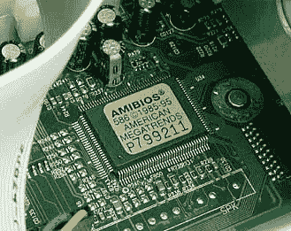
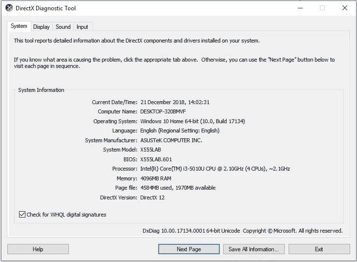
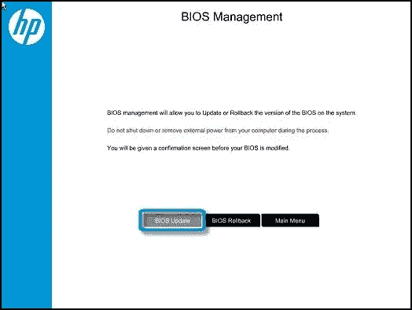

# BIOS 是如何工作的？更新 BIOS？

> 原文：<https://medium.datadriveninvestor.com/how-bios-works-updating-bios-1cff6697b092?source=collection_archive---------12----------------------->

BIOS 是基本输入输出系统的首字母缩写，被称为系统 **BIOS** ，ROM **BIOS** ，或 PC **BIOS。**

这就把系统从一片金属变成了可以解释和执行命令的东西。如果没有 BIOS，我们的计算机将无法识别电信号，只让电流流过主板。

它是一种在计算机启动过程中使用的*固件*。(固件—它是直接控制单个硬件的单个软件。)

 [## 模式和机器人:复杂的现实|数据驱动的投资者

### 哈耶克的名著《复杂现象理论》(哈耶克，1964)深入探讨了复杂性的话题，并断言…

www.datadriveninvestor.com](https://www.datadriveninvestor.com/2019/03/04/patterns-and-robotics-a-complex-reality/) 

# ***更新或刷新 BIOS***

BIOS 更新不知何故使你的计算机更快或运行得更好，这是一个神话。在一些罕见的情况下，BIOS 更新可以修复主板问题，这可能会使您的计算机性能更好，但这通常与速度无关。

**每种型号的主板都需要自己的 BIOS 版本，这也是可能出现问题的地方。**

1.首先，如果您将 BIOS 用于不同的主板，甚至是同一主板的稍有不同的版本，就会出现重大问题。您的计算机可能根本无法启动，或者在启动时会出现奇怪的错误信息。

2.其次，如果电脑在更新过程中断电或出现其他问题，它可能会损坏您的电脑，并花费数百美元进行修复。

3.第三，并不是所有的 BIOS 更新都像电脑自带的那样经过了彻底的测试，所以一个新的 BIOS 版本可能会导致启动问题等等。

## ***既然我已经解释了更新你的 BIOS 的理由和反对理由，我们来谈谈如何判断你的 BIOS 是否有更新。***

***遵循以下步骤:***

1.确定 BIOS 的当前版本。

(打开 run 并键入“msinfo32”或“Dxdiag”)。

2.找到并下载正确的 BIOS 更新。

(直接上厂家网站。下载当前 BIOS 版本和更新版本。如果更新后的版本有更多的问题(例如 bug)或者速度慢了很多，就回到之前的版本。)

3.安全电源

(这基本上就是不间断供电的意思。如果在更新过程中出现电源波动，那么这将会破坏我们 BIOS 上的固件)。

4.安装 BIOS 或闪存 BIOS。

(按照制造商的步骤安装固件，例如将实用软件下载到 USB 驱动器或直接通过操作系统更新)。

继续，重新启动，现在我们有了新的 BIOS。