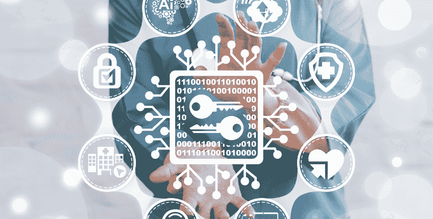

# 区块链如何绕过医疗行业，帮助你控制自己的身体和数据

> 原文：<https://medium.datadriveninvestor.com/how-blockchain-could-bypass-the-healthcare-industry-and-help-you-gain-control-of-your-body-and-764113df495e?source=collection_archive---------12----------------------->

医疗保健行业长期以来一直被其对垂直创新的推动所定义。每年数十亿美元不会白白花在医学和药学研究上。在给人们带来明显好处的背后，还有一个寻求更高利润的全球性行业不断增长的商业利益。利润在很大程度上来自公民个人和国家承担的负担，在获得这一基本人类服务时，它们被迫按照市场规则行事。

另一方面，医疗保健行业利用其权力地位历史性地推迟了横向创新。在实施其他行业已经采用的核心技术方面进展缓慢，阻碍了医疗保健领域的系统和流程开发。因此，为了用户的利益而降低成本和提高效率的机会仍然没有实现。

以电子病历为例——用于收集和保护数据的格式和技术的差异简直令人震惊。整个行业的数据仍然高度分散，驻留在多个平台上:从医疗机构创建的自主 CRM，到通用医疗 CRM，甚至是 Salesforce 等商业系统，这些系统适应了医疗保健领域，取得了不同程度的成功。如果该机构决定投资 EMR 软件的话。一些医疗服务提供商(是的，在发展中国家也是如此)仍然认为将医疗数据保存在最原始的电子表格中就足够了。

这种技术不发达导致的最不幸的结果之一是缺乏数据互操作性。无法有效共享数据，因此无法在单个医疗机构之外建立连续的个人健康史，这极大地增加了州/患者方面的医疗成本负担，同时增加了医疗行业的收益，最终导致过度提供服务。

医疗保健行业不仅受益于医疗“交易”数量的增加(以弥补丢失的数据和/或了解患者历史)，还进一步受益于患者数据的出售。在像美国这样的国家，这些数据实际上是由患者和服务提供商共同拥有的，但是，与医疗机构不同，用户没有任何方法或工具来管理和货币化他们的数据所有权。

在这种背景下，区块链技术作为一种工具出现，能够挑战和改变医疗保健行业权力结构的核心。随着区块链不仅解决互操作性问题，而且随着技术将数据所有权和市场化范式从行业转向患者，这种变化将会发生。此外，可穿戴设备和自我追踪器应用程序的数据可以与电子病历结合的空间的创建，为重大的行业颠覆奠定了基础。区块链不仅可以更好地了解个人的健康之旅，还可以绕过行业普遍存在的低效率，最终帮助用户在选择医疗服务时拥有发言权。

让我们更深入地了解一下医疗保健领域中由区块链推动的颠覆实际上会是什么样子。

人们普遍认为，区块链将接管所有行业。在医疗保健领域，它已经被用于控制制药行业的供应链，并被进一步用于保证实验室和临床论文中样本的完整性和可靠性。然而，随着患者开始要求对其数据的权利，远离行业对该技术的零星自我采用，医疗保健机构将被迫在其前端集成该技术。

区块链将为用户/患者提供一个安全且易于认证的背景，用于存储、操作和交换他们的数据，同时绕过本地电子病历系统。医疗数据互操作性将通过从机构到患者的数据管理模式的转变来实现。因此，患者将获得健康数据连续性和成本大幅降低的双重好处。

因为数据的保管人(患者)在区块链上有明确的表示，所以通过智能合同管理和授予对数据的访问变得直接和即时。患者不仅可以使用区块链来保证他们在医疗服务提供者之间的病史连续性，还可以首次将他们的数据商业化。在这种情况下，商业化并不仅仅意味着货币化。数据本身将成为一种新的货币，用户可以通过区块链来换取医疗服务。不仅来自不发达国家和新兴经济体的患者将受益于这种新货币，生活在医疗服务有限的西方国家的数百万人的生活也将发生革命性变化。

在这个新的区块链时代，可穿戴设备和自我追踪器应用也将扮演新的角色。来自可穿戴设备、健身追踪器和其他可量化的动态信息生成器的数据可以链接到该链，不仅可以收集、存储和商业化信息，还可以作为一种额外的工具来帮助理解、了解和直接改善患者的健康之旅。

> Goldwater 说:“通过这些设备生成的大量数据，如电子病历(EMR)、量化自我跟踪设备、智能手机应用程序和个人健康记录(phr)，提供了一个了解患者健康状况的机会，而以前只有通过管理经过心理测量学验证的仪器才能获得这种机会。”。

这些设备和自我跟踪应用程序，就像医疗保健机构一样，迄今为止一直是它们收集的数据的唯一市场受益者。以月经追踪器为例，这是大多数初潮至更年期的女性用智能手机拥有的简单免费的应用程序。在很大程度上，这些应用依赖于财务可持续性数据的生成和分析。

尽管如此，现在是时候让这些工具发挥更大的作用，从数据清道夫转变为更大的角色了。区块链将允许这些公司继续盈利。然而，他们的交易将首次在清晰透明的服务/数据交换之后进行。与此同时，个人将能够使用通过这些应用程序收集的信息，并将其与传统生成的电子病历相结合，不仅可以更好地了解他们的健康史，还可以在其中发表意见。

迄今为止，我们的健康之旅一直由疾病治疗和/或预防方案来定义。然而，这些协议已被证明对预防公共健康问题，例如疫情不孕症，毫无用处。在大多数情况下，可以通过解释容易获得的数据来预防不孕症，而这些数据又可以与不同的风险因素联系起来。问题在于，许多妇产科医生的判断不是基于动态数据，而是基于陈旧的流程，这些流程旨在仅在出现不孕症时对女性进行治疗，而如今，在许多情况下，这已经为时过晚。

区块链的使用可以创建一个全新的范式，在这个范式中，医疗预防和决策不是留给一个单独的从业者，而是留给由输入链中的公共和个人数据的组合触发的智能合同。如果我们以之前的女性健康为例，患者可以上传并合并区块链、月经、激素、妇科和基因数据——所有这些数据都是通过电子病历、可穿戴设备、追踪器和自检应用程序收集的。在那里，它将与公共卫生和研究数据交叉引用，通过智能合同触发警报和行动，这些智能合同旨在立即通知和指导符合某些风险标准的患者，如过早绝经。医疗决策将不再仅仅基于人类的知识或判断力，而是依赖于链中难以置信的大量数据。

虽然要求和管理我们自己的医疗数据所有权的能力将成为一项新要求的权利，但区块链潜力不会就此止步。数据管理只是引领真正的医疗革命的先驱，在这个新时代，个人将能够绕过医疗行业的特权，有效地控制自己的身体和健康。