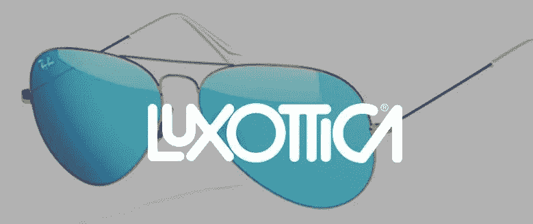
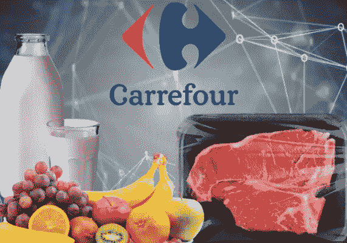
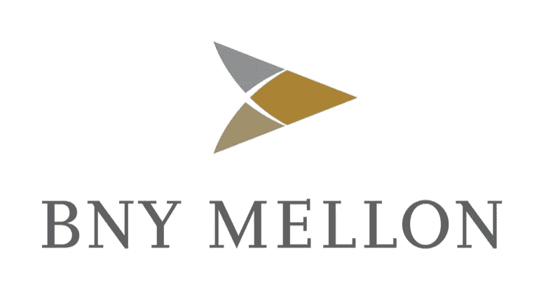

# 区块链如何在零售领域得到应用

> 原文：<https://medium.datadriveninvestor.com/how-blockchain-is-being-used-in-the-retail-sector-a1706cdbb497?source=collection_archive---------3----------------------->

[荷兰的 flash boys](https://flashboys.io/)一直致力于使用区块链技术的多项举措，以帮助零售部门减少欺诈并提高供应链的透明度。它开发的一个项目是使用近场通信(NFC)芯片，并将这些芯片放在酒瓶上或衣服内。NFC 芯片的一个优势是不需要特殊设备来读取它们，只需要一部智能手机，产品的来源和其他细节可以保存在芯片上，因此有助于解决假冒商品的销售。

事实上，Flashboys 目前正在与世界上最大的眼镜制造商 T2 的 Luxottica 商谈，有可能将 NFC 芯片植入太阳镜。一旦芯片在太阳镜中，它就可以创建一个独特的令牌，它可以将所有者的信息存储在区块链上。这将有望减少二手太阳镜的销售，因为新主人可以很容易地扫描它们，看看它们是否被报告为丢失/被盗。时装零售商也在探索这样的想法，因为他们努力推动他们的“实体店”的销售，并找到让自己与网上销售区分开来的方法。嗯，一种方法是将 NFC 芯片插入仅在店内销售的衣服中，并对顾客说“如果你从我们的一家商店购买，你将获得另一次购买的折扣，或者你将能够看到你的衣服是由谁制作的以及如何制作的”。通过使用 NFC 芯片，客户可以使用他们的移动电话并获得折扣，和/或访问各种不同类型的信息。这可以帮助零售商鼓励顾客更多地使用他们的实体店。

 [## 5 行业转型区块链应用|数据驱动投资者

### 除非你一直生活在岩石下，否则我相信你现在已经听说过区块链了。而区块链…

www.datadriveninvestor.com](https://www.datadriveninvestor.com/2019/02/13/5-real-world-blockchain-applications/) 

与此同时，[美国运通](https://coinnewstelegraph.com/blockchain-for-retail-use-cases-and-potential-applications-cointelegraph/)正在考虑如何利用区块链技术来升级其提供的许多不同的忠诚度计划。成立于 2015 年、总部位于瑞士的 Qiibee 也认为，区块链是忠诚度行业的理想技术，因为它为品牌所有者提供了更多选择和与客户互动的方式，从而为他们提供更好的价值和信息。[qi bee](https://coinjournal.net/qiibee-ceo-blockchain-is-the-perfect-technology-for-loyalty-programs/)正试图解决这一挑战，例如当顾客用他们喜欢的品牌购物时，他们会得到品牌代币的奖励，因此最终收集了许多不同的代币。反过来，这些使用起来也很麻烦。但是，通过使用 Qiibee 平台，他们可以从需要他们自己拥有的令牌的人那里交换他们需要的令牌，即交换令牌！

因此，看起来零售行业正在以各种方式拥抱区块链技术，但我怀疑，随着这个行业被更多地采用，将会发现更多的方式来进一步为在线和离线零售商利用它。

**“伏地魔”最终被关进新加坡监狱**

只要有钱赚，似乎总有人想进行“狡猾的交易”，不幸的是，这无助于公众对加密货币的看法。全球法院继续对以某种形式参与 Cryptos 的人做出监禁判决，尽管一些邪恶活动显然是犯罪行为，但其中一些犯罪者确实非同寻常。

以在新加坡被监禁两年的叶林·敏特先生为例，他承认对许多人进行了刑事恐吓和骚扰。这名 36 岁的男子威胁要伤害 30 个人，除非他们每人给他转一个比特币。然而，他没有在威胁信的结尾写上哈利·波特的死敌“伏地魔”，而是多加了一个“R”，并署名为“伏地魔”！！！

与此同时，一名澳大利亚政府雇员被指控“工作时采矿”，而不是“工作时吹口哨”(又名《白雪公主和七个小矮人》)。这名 33 岁的男子被指控使用他改装的政府设备开采加密货币。这种使用政府财产的非法加密货币开采类似于英国广播公司去年报道的故事，关于俄罗斯人据称在俄罗斯西部萨罗夫的联邦核中心[安装了一台超级计算机来开采比特币。](https://www.bbc.co.uk/news/world-europe-43003740)

在美国，22 岁的雅各布·伯勒尔·坎波斯(Jacob Burrell Campos)承认违反了反洗钱检查，并在没有注册公司的情况下经营比特币兑换业务。坎波斯不得不[没收他赚的 82.3 万美元以上的钱，他自 2018 年 8 月以来一直被拘留](https://thenextweb.com/hardfork/2019/04/09/22-year-old-gets-2-years-in-jail-for-illegally-selling-hundreds-of-thousands-in-bitcoin/)。同样在美国，来自内华达州的摩根·洛克库恩斯被指控经营非法比特币交易所和欺诈，结果被判处 21 个月监禁。据称，罗克孔斯出售了 18 英亩的土地" [*"，这些土地本该用于建设位于内华达州埃尔科县的“比特币巨型城市”*](https://coindoo.com/unauthorized-bitcoin-broker-from-nevada-to-spend-2-years-in-prison/?utn_medium=notification&utm_source=onesignal) "但他只拥有 5 英亩土地！

然后是马克·卡普勒斯的案件，他因卷入 Mt. Gox 事件而在日本监狱度过了 11 个月，超过 60 万枚比特币(今天价值不到 50 亿美元)不翼而飞。Karples 被指控篡改 Mt. Gox 的记录，被判 2.5 年缓刑。

因此，无论在哪个司法管辖区，我们已经看到有人“服刑”，毫无疑问，还会有许多人面临“法律的强力制裁”。希望随着这些骗子被逮捕和处理，这将阻止其他人进行涉及加密和数字资产的犯罪活动。“坏演员”被判刑的事实应该会让人们放心，使用数字资产的人受到正常法律的约束，并将面临相应的后果。

**可能以数字资产形式支付的脸书员工工资**

脸书可能会[向员工提供按月支付的 Globalcoin](https://usethebitcoin.com/facebook-could-announce-its-cryptocurrency-this-month-for-employees-to-take-it-as-salary/) (这可能是脸书即将推出的数字货币的名称)，即作为他们的工资，进一步说明数字资产如何进入我们的日常生活。颇具讽刺意味的是，脸书一直在出售它在客户身上收集的广告商数据——2018 年为[创造了 168 亿美元](https://martechtoday.com/despite-ongoing-criticism-facebook-generates-16-6-billion-in-ad-revenue-during-q4-up-30-yoy-230261)——而对脸书的信任度一直在下降。最近的一篇文章声称“*超过* [*60%的美国人不信任脸书*](https://www.fastcompany.com/90331377/more-than-60-of-americans-dont-trust-facebook-with-their-personal-information) *的个人信息”*，那么为什么脸书的消费者会购买和使用 Globalcoin 呢？当然，对于任何交易媒介——交易的货币——人们都需要对货币有信心和信任？据说，可能是因为这个原因，脸书已经同意将其新数字货币的控制权交给一个独立的董事会。与此同时，Globalcoin 的推出势头越来越大，据报道，脸书一直在与美国商品期货交易委员会(CFTC)讨论，以帮助为 Globalcoin 铺平道路，为其推出做好准备。据悉，脸书也在与 Visa 和万事达卡进行谈判。

[首席执行官马克·扎克伯格最近评论](https://cryptocoin.news/news/altcoin/cftc-begins-discussions-with-facebook-about-its-stablecoin-27298/)脸书的未来时说:*“支付是我们有机会让它变得更容易的领域之一……我相信给某人寄钱应该像发照片一样容易。”*

Globalcoin 对于数字资产领域来说是一个非常重要的发展，因为它将允许脸书的 23 亿月度用户以及 700 万广告商使用这种货币，从而绕过传统的银行系统。但只有时间才能证明，脸书消费者的信任是否足以让他们使用这种新的数字货币。

又及，好像脸书需要它！据报道，脸书将在一个封闭的区块链上运营 Globalcoin，并向运营每个 [100 个节点的组织收取 1000 万美元](https://www.theinformation.com/articles/facebook-plans-outside-foundation-to-govern-cryptocurrency?)，因此产生额外的 10 亿美元。这笔额外的收入对于脸书来说只是沧海一粟，因为在 2019 年 3 月底，它坐拥[超过 410 亿美元的现金](https://ycharts.com/companies/FB/cash_on_hand)！

**供应链和物流**

来源:马士基

**主要航运公司加入区块链驱动的供应链和物流平台**

联合国于 1996 年设立了联合国贸易便利化和电子商务中心(UN/CEFACT)。联合国电子商务中心的任务是寻找途径，改进贸易便利化和电子商务标准方面的全球协调与合作。

它的主要优先事项仍然是鼓励互操作性:简化供应链上下游的信息交换，包括商业和政府流程。 [TradeLens](https://www.tradelens.com/) 试图将 UN/CEFACT 创建的书面标准数字化，因为它努力利用区块链技术为国际货物运输带来更大的可追溯性和透明度。它每周处理超过 1000 万次运输事件。

当供应链中的不同参与者不能就不同的定义达成一致时，对于那些参与全球物流的人来说，互操作性的挑战是相当大的。这方面的一个例子是，当托运人、承运人和海关当局仅仅因为他们的计算机不能相互通信而继续依赖纸质文件时！有了一致同意的标准和定义，人类和计算机就能在“同一页面”上操作，有助于提高集装箱运输、全球贸易和世界经济的效率。

法国航运公司 CMA CGM Group 和瑞士航运公司 MSC 地中海航运公司(MSC)最近宣布，他们将[加入 TradeLens 的区块链驱动的航运平台](https://worldmaritimenews.com/archives/277649/cma-cgm-msc-to-become-members-of-tradelens-blockchain-platform/)，以帮助改善他们的供应链物流。

*“数字协作是集装箱航运业发展的关键。MSC 首席数字信息官 andréSimha*报告说:“TradeLens 平台具有巨大的潜力，可以刺激行业实现供应链数字化，并围绕共同标准建立合作关系。

TradeLens 由 AP Moller Maersk 和 IBM 开发，使用了 IBM 的区块链专业知识。马士基成立于 1906 年，是世界上最大的航运公司之一。这是另一个有趣的“合作资本主义”的例子——一家公司开发了一个区块链平台，然后允许历史上的竞争对手使用相同的平台。

Tradelens 现已有 100 多家公司使用其平台，为发货商、承运商、货运代理、海关官员、港务局、内陆运输提供商等提供了各自数据的完整视图。它还允许参与者在货物在世界各地移动时进行数字协作。该平台旨在提高全球供应链的效率和信任，使其更加透明和安全，以促进更大的合作。

正如区块链技术越来越多地被使用的许多例子一样，最终客户不会意识到，也不需要了解跨国组织正在利用这项技术来提高业务效率的任何信息。TradeLens 也是一个很好的例子，说明许多不同的独立方如何利用区块链在全球范围内处理大量数据，这些独立方之间过去很少合作，因为它们经常相互竞争。

**零售**

**追踪出处的二维码导致销量增加！**

家乐福已经发现，通过让其客户能够追踪其一些肉类、奶制品和水果产品的[原产地，销售额有所增加。在竞争异常激烈的食品市场上，任何一家超市能给他们带来优势的东西，都必然会被它的竞争对手复制。家乐福表示，将增加使用区块链平台销售的产品数量，该平台提供了更大的透明度，可以显示这些产品来自哪里，在哪里包装或挑选，以及是否受任何转基因生物、抗生素或农药的影响。它现在正寻求在未来扩大业务，增加非食品类产品，即服装，以及更多信息，如农民从货架价格中赚了多少钱。它还在试验不依赖“快速反应”(QR)码的产品识别方法。](https://uk.reuters.com/article/us-carrefour-blockchain/carrefour-says-blockchain-tracking-boosting-sales-of-some-products-idUKKCN1T42A5)

家乐福区块链项目经理 Emmanuel Delerm 告诉路透社“*”，区块链倡议已被证明是迄今为止在中国最受欢迎的——在中国，购物者扫描二维码已经很普遍，其次是意大利和法国，一些人花了长达 90 秒的时间来阅读出处信息。他们对产品的来源和动物如何被照顾的信息感兴趣，一个农民和他的鸡的视频证明很受欢迎，千禧一代购买更少，但为了他们的健康，为了地球*。

迄今为止，家乐福一直专注于使用区块链技术来提供其自有品牌的详细信息。然而，它还与雀巢合作，让消费者获得雀巢 [Mousline 马铃薯](https://coinnewstelegraph.com/carrefour-says-blockchain-tracking-boosting-sales-of-some-products-investing-com/)泥产品的信息，从而让消费者能够看到它只由法国马铃薯制成。

不仅仅是家乐福在使用二维码和区块链技术，让顾客获得他们所购买食品的详细信息——SAP 也有一个平台。智利的蓝莓种植者正在他们的产品上添加二维码，这样最终买家就可以跟踪从农场到货架的整个过程。正如《福布斯》的一篇文章[所报道的那样](https://www.forbes.com/sites/sap/2019/02/18/from-vine-to-table-blockchain-enters-the-food-chain/#459042ca6223)*——“只需用我们的智能手机扫描二维码，我们就能看到浆果种植地的证明，了解农场的可持续发展实践，并确保收割机受到公平劳动法的良好对待。区块链将成为这一切的幕后推手*”。

在亚洲,[南华早报报道，阿里巴巴](https://www.abacusnews.com/alibaba-experiments-blockchain-track-food-provenance/article/2144497)正在与新西兰的四个农民测试一个项目，让消费者能够识别使用了什么原料，只需用手机扫描二维码。其目的是建立一个“食品信任框架”，提供更多关于消费者正在购买的食品的信息。如果出现问题，例如某种形式的污染进入了食品分销链，如果人们能够使用区块链技术追踪源头，那么识别问题的来源将会更快。

**教育**

**阿联酋将获得区块链资格**

几周前，我们报道了新加坡政府如何开发区块链驱动的平台，允许各种新加坡学术机构将学生资格输入区块链。这很重要，因为许多简历包含不正确的信息——在一项对 5000 份简历的调查中，发现 [80%的简历至少有一条不正确的信息](https://www.ciphr.com/features/cv-fraud-candidates-lying/)！通过在区块链上记录资格和经验，创建了一个透明的不可变记录，供相关人员查看。

据了解，[阿联酋](https://hackernoon.com/uae-university-launches-the-blockchain-records-app-to-manage-academic-records-2ff8ab7804a0)现在也将使用区块链技术来保存和管理学术记录，这意味着超过 75，000 名学生的资格现在可以在线获得。

这些都是区块链如何帮助建立信任和减少欺诈的很好的例子，尽管用户不会知道使用了什么技术来实现这一点，他们也不会关心…..

**金融服务**

**全球最大托管机构拥抱区块链技术**

[纽银梅隆(BNY)是全球最大的托管人](https://coinnewstelegraph.com/how-a-startup-fits-into-bny-mellons-blockchain-strategy-american-banker/)，托管资产 34.5 万亿美元，自 2016 年开始尝试区块链技术。然而，它同意在公共区块链上照看其数字资产的第一家公司是 [Bakkt。Bakkt 是一家由国际清算交易所(ICE)支持的公司，该交易所反过来拥有并经营着全球十几家受监管的证券交易所。](https://www.bakkt.com/)

BNY 热衷于强调，它目前正在“为 Bakkt 提供数字资产的安全保护”，而不是为它们提供托管服务，部分原因是 BNY 方面认为，在提供全面托管服务之前，监管需要更加清晰。

BNY 最大的托管竞争对手之一， [Northern Trust 也在考虑为数字资产提供托管服务](https://www.forbes.com/sites/michaeldelcastillo/2018/07/31/northern-trust-opens-doors-to-cryptocurrency-hedge-funds-as-part-of-pervasive-blockchain-expansion/#75e3ab0248bc)(据《福布斯》报道),因为它意识到，它也需要“跟上速度”,以便为那些希望处理这一快速发展的新资产类别——数字资产的人提供服务。

然而，不仅仅是大型和传统的现有托管机构在考虑为数字资产提供托管服务。[安克雷奇](https://anchorage.com/)是一家新成立的加密托管公司，由硅谷非常成功的风险投资人安德森·霍洛维茨(Andreessen Horowitz)支持。 [Bank Frick](https://www.bankfrick.li/en/blockchain-banking/crypto-storage-solutions) 是一家总部位于列支敦士登的私人银行，现在提供一系列区块链银行服务，包括数字资产托管。来自加州的 BitGo 自 2018 年以来一直为比特币提供合格的托管服务。这家总部位于加州的公司利用其作为“安全即服务提供商”的六年经验，为金融机构和基金经理提供数字资产托管服务。同样来自加利福尼亚州，总部位于旧金山的数字资产交易和钱包提供商比特币基地[在 2018 年为其产品增加了一项加密托管服务](https://bravenewcoin.com/insights/coinbase-service-launch-marks-new-era-in-crypto-custody-solutions)。[比特币基地托管公司](https://custody.coinbase.com/)是一家合格的托管公司，使机构投资者能够将 30 多种不同的数字资产安全地存储在一家受监管和保险的第三方存储解决方案提供商处。受监管的数字资产交易所 [Gemini](https://gemini.com/custody-services/) 也于 2018 年推出了面向机构投资者的合格托管服务。

Fidelity Digital Assets 是 Fidelity Investments Inc .最近推出的一家加密企业，该公司拥有[7.2 万亿美元的客户资产](https://institutional.fidelity.com/app/literature/press-release/9883768/fidelity-launches-new-company-fidelity-digital-assets.html)。这家总部位于纽约的资产管理公司于 2018 年 3 月推出了加密托管服务。同样在纽约，数字资产交易所 [itBit](https://www.itbit.com/custody) 去年推出了加密保管服务，以补充其交易所和场外交易(OTC)业务。作为一家受监管的纽约州信托公司，itBit 确保所有客户资产和资金都由强制性资本准备金提供充分支持。

另类资产托管公司 [Kingdom Trust](https://www.kingdomtrust.com/institutional-custody/digital-institutional-custody) 于 2017 年推出，是首批提供数字资产存储解决方案的托管公司之一。目前，这家总部位于肯塔基州的公司已经成为市场领先的合格数字资产托管服务公司，由伦敦劳埃德保险公司提供保险[。计划于 2019 年 6 月推出的 Koine](https://www.koine.com/) ，将为机构客户提供数字资产托管和结算服务。这家总部位于伦敦的初创公司的目标是交易场所、机构投资者、数字资产发行商和市场基础设施提供商。

[Prime Trust](https://primetrust.com/custody) 是一家总部位于拉斯维加斯的合格数字资产托管公司，支持比特币、ETH 和 ERC20 代币。最后， [Xapo](https://www.xapo.com/) 是历史最悠久的比特币存储解决方案提供商之一。在过去的五年里，这家总部位于香港的公司将其存储资产增加到超过 70 万 BTC(约 56 亿美元)，成为世界上最大的数字资产托管公司。难怪比特币基地和富达据报道正在谈判收购 Xapo！

因此，很明显，各种不同的公司对提供数字资产托管有着相当大的兴趣。尽管有一种观点认为，鉴于区块链技术提供的去中心化和不变性，我们是否需要托管人，以及他们的服务是否可以通过使用受托人来取代？这一点很重要，因为在英国，您目前不需要接受金融行为监管局(FCA)的监管，成为受托人，这可能会减少公司所需的监管资本，降低组织的保险费，还有助于降低合规监控成本…..

如果你想每周收到一份数字字节电子邮件:[jonny.fry@teamblockchain.net](mailto:jonny.fry@teamblockchain.net)

Digital Bytes 经过精心撰写，旨在引起人们对区块链和数字资产领域发展的关注，但建议读者在根据上述任何链接和信息采取任何行动之前，先听取专业建议。TeamBlockchain Ltd 对任何可能采取或可能不采取的行动、收到此版本数字字节的损失或收益不承担任何责任。如果由于某种原因，上述任何链接不起作用，请与我们联系。