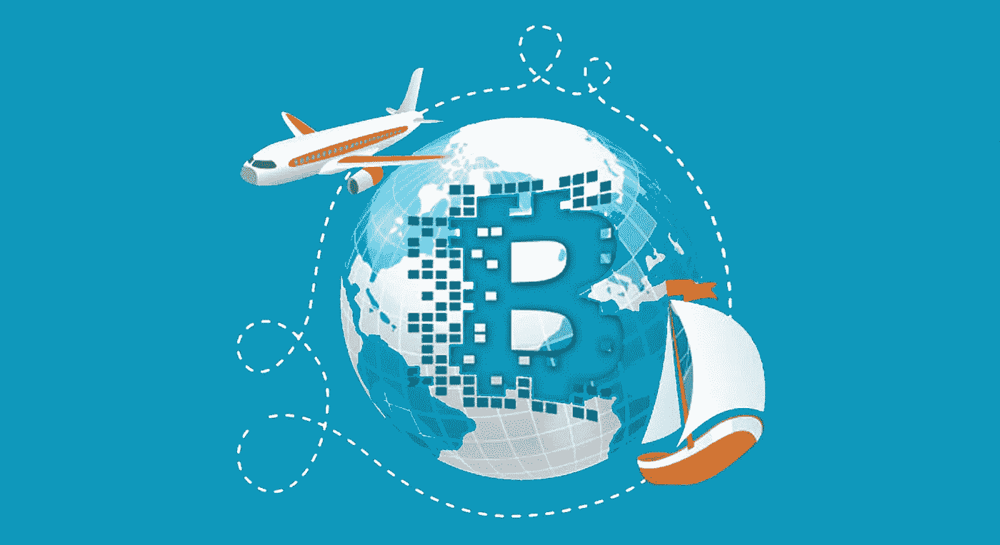

# 区块链是如何召唤出你心中的旅行者的(提示:漫游)

> 原文：<https://medium.datadriveninvestor.com/how-blockchain-is-calling-out-the-traveller-in-you-hint-roaming-3022705565a?source=collection_archive---------8----------------------->

K

目前，区块链是专家们谈论最多的技术之一，他们押注于未来。每家公司都在试图从这项新兴技术中获益。电信行业也不例外。区块链正在快速增长，并已经在全球范围内塑造了许多行业。事实上，迪拜的目标是到 2020 年实现无纸化政府。你可以阅读我们之前的专题，‘[区块链会改变印度吗？](https://medium.com/decodein/will-blockchain-transform-india-f121438d0c1c)

今年 1 月，迪拜电信公司 Du 与 Dhonor HealthTech 合作开发了全球首个患者安全区块链。根据 [Infoholic Research](https://www.globenewswire.com/news-release/2019/04/10/1802056/0/en/Asia-Pacific-is-Witnessing-High-Growth-in-the-Blockchain-in-Telecom-Market-Globally.html) 的一份报告，由于该技术与运营支持系统(OSS)和业务支持系统(BSS)的兼容性不断提高，2018 年至 2023 年间，全球电信市场的区块链将以 77.79%的 CAGR 增长。区块链以增加即时价值的方式映射到运营商业务功能的能力，无疑将推动整个海湾合作委员会(GCC)及其以外地区的广泛采用。

 [## 2019 年成为主流的 7 大区块链挑战及更多...-数据驱动型投资者

### Faisal 在加拿大工作，拥有金融/经济和计算机方面的背景。他一直积极从事外汇交易…

www.datadriveninvestor.com](https://www.datadriveninvestor.com/2019/03/25/top-7-blockchain-challenges-to-go-mainstream-in-2019-more/) 

区块链正在重新设计电信公司的商业模式，这将使它们以难以想象的规模增长。通信服务提供商(CSP)现在将能够发布他们的产品信息，以便潜在的漫游客户可以访问这些信息，或者他们可以捆绑这些信息或将其出售给当前的用户。这基本上可以导致一个批发股票交易所。电信公司还可以与其他数字服务合作，以他们的首选语言为他们的客户提供前所未有的服务质量。

这种分布式账本系统(DLS)将增加安全性，因为它是端到端加密的，将证明是一种稳健的系统，能够在移动运营商之间安全地共享身份信息。漫游将变得无缝，因为它将允许用户获得漫游计划，而无需获得他们正在访问的国家的另一个旅行 SIM。它将成为一个全球买家和卖家社区，嵌入到每个企业的 BSS 中，使其更加优化。

运营商将能够直接向合作伙伴销售，无需任何中介。eSIM 和 iSIM 将使这项技术蓬勃发展，因为它们已经集成在手机中，不需要更多的硬件。你可以毫不费力地在线更换运营商。区块链允许选择加入全球市场的多家运营商向漫游用户购买和出售服务，而没有任何第三方造成技术障碍，并给最终用户和运营商带来困难。

这也将有利于物联网设备、可穿戴技术和所有其他可以受益于 eSIMs 和 iSIMs 的技术。无论用户的需求是什么，区块链都会提供解决方案。此外，DLT 将存储客户的偏好，这将有助于运营商将其服务推给用户。它可以优化电信公司高管层所担心的一切——计费、供应、号码可移植性等——并充当数字化转型和提高运营效率的有力代理。

总而言之，区块链将在许多方面使电信业及其用户受益，其中漫游等服务对大多数人来说将更简单。我们准备在不久的将来看到这项技术的更多进步和部署。继续阅读，保持更新:)