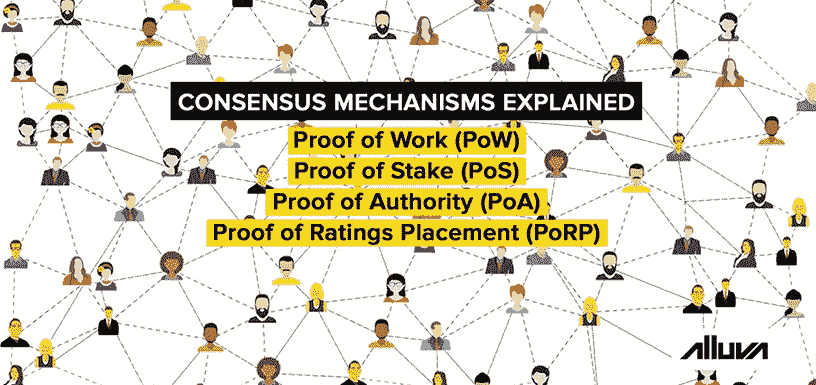
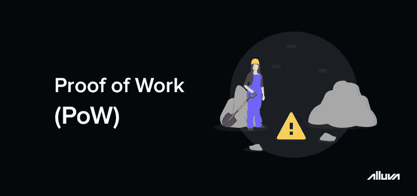
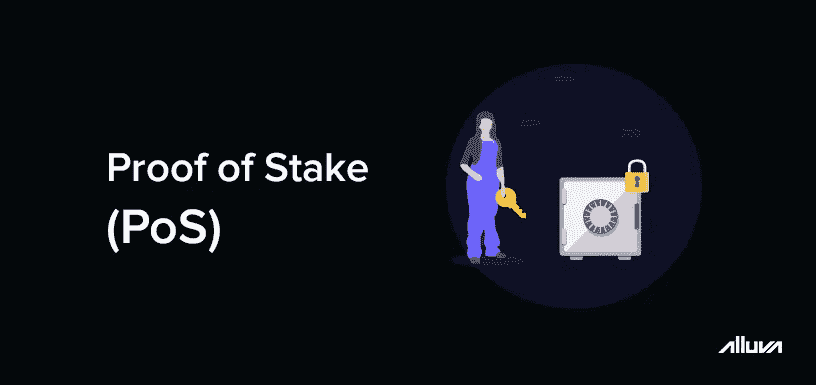
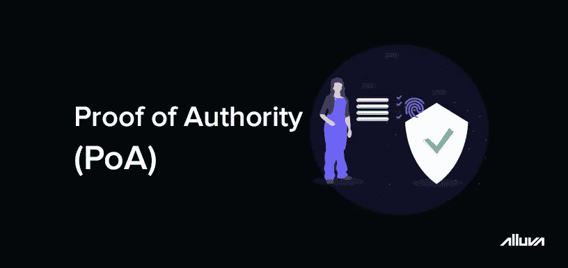
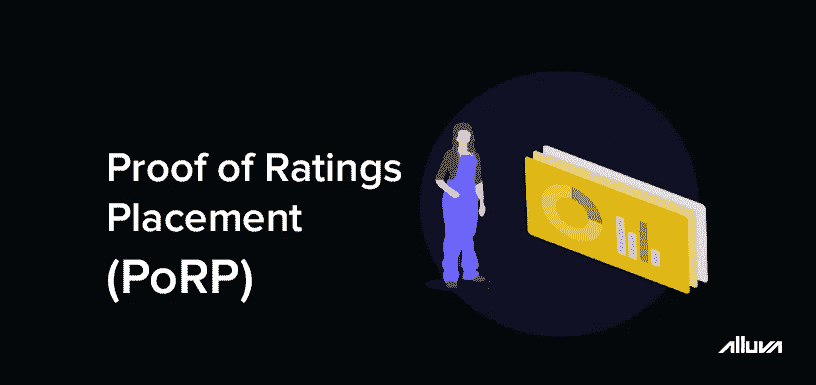

# 区块链网络如何决策:共识机制解释

> 原文：<https://medium.datadriveninvestor.com/how-blockchain-networks-make-decisions-consensus-mechanisms-explained-da463fc4e56a?source=collection_archive---------3----------------------->

区块链网络的主要卖点之一是权力下放，这意味着即使在没有中央权力机构的情况下，它们也能发挥作用。然而，由于有关项目未来开发和维护的决策仍需做出，因此共识算法允许网络参与者达成共同的决策。在加密货币区块链的背景下，节点使用共识机制来确保新添加的交易是合法的，并遵循网络的规则。

虽然比特币使用工作共识机制的证明，但近年来出现了数十种其他算法。共识算法的激增可以归因于区块链可扩展性三难困境，这个术语指的是该技术的各种瓶颈。虽然理想的分布式网络在安全性、分散性和吞吐量方面表现出色，但今天的大多数数字货币只能获得其中的一两个特征。因此，开发人员不断致力于新的共识算法，以建立一个接近完美的区块链网络。

 [## 正在改变行业的 5 个真实世界区块链应用|数据驱动的投资者

### 除非你一直生活在岩石下，否则我相信你现在已经听说过区块链了。而区块链…

www.datadriveninvestor.com](https://www.datadriveninvestor.com/2019/02/13/5-real-world-blockchain-applications/) 

量化这一进展的最好方法是看一看一些最流行的共识算法，以及它们之间的区别。

## **工作证明(PoW)**

2009 年，工作证明由比特币的创始人中本聪与比特币一起推出，成为该榜单上最古老的共识机制。顾名思义，该算法需要参与者在计算资源的帮助下完成一个耗时的过程。这个过程本质上涉及到找到一个复杂的密码问题的解决方案，这涉及到大量的尝试和错误来解决。拥有更多可支配资源的参与者具有优势，因为他们每秒可以执行更多的事务。由于整个过程是一场为了奖励而完成的比赛，所以它通常被称为加密货币的“挖掘”。

在比特币等加密货币中，矿工解决这些问题，为下一个区块提供有效的哈希。一旦特定挖掘器计算出散列，工作一致性验证算法就用网络上的节点来验证散列。如果被接受，该交易将被添加到区块链中，矿工将获得“区块奖励”作为补偿，此外还有区块内的任何交易费用。

PoW 算法确保奖励在相当长的时间内公平分配。随着更多的矿工进入网络，网络会自动调整开采难度，以确保新区块的开采间隔大约为 10 分钟。由于事务只能在计算完哈希后添加到区块链中，因此攻击网络需要大量不切实际的计算能力。

## **股权证明(PoS)**

第一个股份证明(PoS)的实现是在比特币发行两年后的 2011 年发布的。这种机制不使用计算资源来验证新块，而是允许用户将他们的资产用于参与验证过程。标记的令牌被锁定为抵押品，允许用户在合法的区块上投票。与赌注较少的参与者相比，赌注较多的参与者被赋予更大的权重。

PoS 网络本质上是基于这样的逻辑运行的，即具有更高风险的用户将总是被激励来保护网络免受攻击和欺诈性交易。要想攻击成功，必须有一半以上的用户参与共谋。另一个优点是，交易可以更快地得到验证，因为挖掘者不必为了找到块散列而相互竞争。以太坊有望在不久的将来迁移到基于 PoS 的实现。

## **授权证明(PoA)**

与前两个共识算法不同，权威证明依赖于知道块验证者的身份。因此，交易只能由一组预先批准的可信参与者添加。由于这些少数用户能够决定交易的真实性，他们被视为事实上的权威。

权威的证明完全建立在声誉的概念上。然而，PoA 不能用于分散的区块链或加密货币，因为不存在平等或集中的方面。然而，共识机制已被证明对私有区块链特别有效，如微软的 Azure 平台，在那里分散是不必要的。

## **收视率证明(PoRP)**

像 PoW 一样，评级放置共识机制的证明已经被专门开发来逐渐将代币释放到流通中。由 Alluva 区块链平台使用，PoRP 允许贡献者接收令牌，以换取评级和加密货币价格预测。网络参与者的回报基于两个因素:他们的参与和他们预测的准确性。

在 PoRP 中，贡献者因正确预测特定加密货币在一周、一个月、六个月和一年内的价格而获得 Alluva 令牌奖励。如果一个用户的预测是在一个更长的时间范围内做出的，比如一年，他将会收到更多的令牌。通过这种方式，用户可以直接激励他们的市场研究工作，并鼓励他们在 Alluva 平台上做出准确的预测。

# **没有一致的机制来统治他们所有人**

虽然上面的列表无论如何都不全面，但它证明了一个事实，即不可能有一个单一的共识算法可以用于所有事情。每一个独特的项目都需要不同的机制，这取决于其分散化、分布和令牌分配的最终目标。虽然开发人员将继续寻找新的方式让社区达成一致的决定，但行业将继续发展和适应，就像过去十年一样。

要了解更多关于 [Alluva](http://bit.ly/alv_md_01) 的分散价格预测平台，请访问我们的网站[这里](http://bit.ly/alluvahome)。如果您有任何进一步的问题，请随时联系我们的电报组[这里](http://bit.ly/alv_telgrp)。我们定期回应社区反馈和询问。更多类似的文章，不要忘记点击[这里](http://bit.ly/alluva_mdm)关注我们的媒体简介。