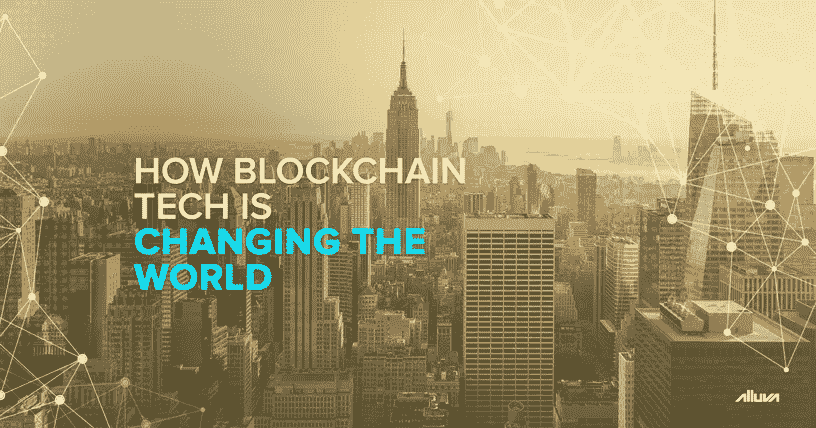

# 区块链技术如何改变世界

> 原文：<https://medium.datadriveninvestor.com/how-blockchain-technology-is-changing-the-world-3766aedd93c9?source=collection_archive---------11----------------------->

区块链是支撑比特币和以太坊等流行加密货币的技术，被许多行业和市场领导者吹捧为革命性的，包括科技巨头微软、亚马逊和 IBM。虽然区块链最初仅用于记录数字货币交易，但在过去几年中已经出现了一些非货币和非金融应用。

因此，越来越多的公司，包括沃尔玛和三星等，正在对区块链技术进行大量投资。在专业服务公司普华永道进行的一项研究中，84%的被调查高管表示他们的组织至少在一定程度上试验了这项技术。与此同时，[统计公司估计](https://www.statista.com/topics/5122/blockchain/)全球在区块链相关应用上的支出将从 2018 年的 15 亿美元增长到 2022 年的 117 亿美元。

 [## 2019 年成为主流的 7 大区块链挑战及更多...数据驱动的投资者

### 教训是永远不要停止学习和成长。关于技术、金融、工作场所、生产力和…

www.datadriveninvestor.com](https://www.datadriveninvestor.com/2019/03/25/top-7-blockchain-challenges-to-go-mainstream-in-2019-more/) 

在本文接下来的部分，我们将看看区块链技术的优势，以及整个行业如何实现其真正的潜力。

# 消除欺诈

区块链系统或网络提供了一种完全分散的信息发布方式。区块链提供了高度的透明性，因为所有参与者都可以读取和解释存储的数据，即使完全没有可信的第三方。此外，区块链总账上的记录是不可变的，将来不能被另一方修改或更改。

因此，欺诈防范是区块链的第一个非金融用例之一，并且仍在许多行业中占据一席之地。在拉丁美洲，智利的圣地亚哥证券交易所[表示](http://inter.bolsadesantiago.com/sitios/en/noticias/Paginas/Santiago-Exchange-launches-the-first-Blockchain-application-.aspx)有兴趣利用该技术的独特优势来减少欺诈事件，同时提高效率和降低成本。

# 提高可追溯性

供应链是另一个可以从提高透明度和效率中大大受益的部门。行业中的现有系统严重依赖于人工输入、手动验证和过时的 IT 系统。由于每年记录数百万个跟踪事件，很难跟踪恶意、欺诈和错误。为了解决这个问题并提高供应链行业的可追溯性，IBM 在 2018 年 8 月与航运巨头马士基合作，[推出了](https://www.prnewswire.com/news-releases/maersk-and-ibm-introduce-tradelens-blockchain-shipping-solution-300694642.html) TradeLens，这是一个*“区块链支持的航运解决方案，旨在促进更高效、更安全的全球贸易。”*

在 2019 年 2 月发表的一封致证券交易委员会的信中，美国科技公司苹果也[建议](https://www.sec.gov/Archives/edgar/data/320193/000119312519041571/d694085dex101.htm)使用区块链技术，以确保其矿产供应链保持无冲突和环境可持续。通过利用区块链的智能合同，苹果等公司可以确保在向供应商付款之前，自动检查商品的真实性、质量和可持续性。

当与物联网(IoT)和人工智能(AI)等其他新兴技术相结合时，区块链有潜力实现供应链行业很大一部分的自动化。例如，一系列物联网传感器可以帮助零售商跟踪与产品相关的指标，如温度和湿度。一旦登录到区块链，这些信息也可以与收获和运输相关的数据一起呈现给最终客户。事实上，大约一年前，也就是 2018 年 9 月，沃尔玛[宣布了一项类似的区块链供应链系统的试验计划。](https://techcrunch.com/2018/09/24/walmart-is-betting-on-the-blockchain-to-improve-food-safety/)

# 智能合同和 DApps

智能合约是一种可编程的合约，当满足某个预定义的条件时，它会自动执行任务。尽管智能合约被认为是许多行业的一大颠覆者，但它可能是保险等用例中最通用的，在这些用例中，由于强制的人工干预，处理时间从数周到数月不等。借助智能合同，保险提供商可以自动批准与记录完善的事件(如洪水、旅行延迟或取消)相关的索赔。总而言之，该技术有能力通过最大限度地减少欺诈、降低支出、消除处理延迟和提高整体客户满意度来扰乱保险行业。

除了保险，智能合约在许多领域都显示出了巨大的潜力，包括治理、房地产和金融科技。分散式应用程序(DApps)使用智能合约与区块链接口，由于其直观性和与传统 web 应用程序的相似性，最近也变得越来越突出。例如，Alluva DApp 帮助金融分析师和投资者筛选加密货币和区块链领域的市场噪音和主观意见。Alluva 使用众包情绪数据来预测和识别可行的投资机会。

即使现在，许多区块链开发者和传播者认为我们仅仅触及了这项技术全部潜力的表面。既然公共和私营部门都对区块链的能力感兴趣，这种技术几乎无处不在可能只是时间问题。

更多关于加密货币和区块链产业的有趣内容，请关注我们的媒体频道[这里](http://bit.ly/alluva_mdm)。要了解更多关于 Alluva 的信息，请点击我们的网站[这里](http://bit.ly/ext_grp1)。在这里，你可以随意加入我们[电报组的讨论。最后，](http://bit.ly/alv_telgrp)[关注](http://bit.ly/alluva_tw)我们的 Twitter 账户，了解最新动态。