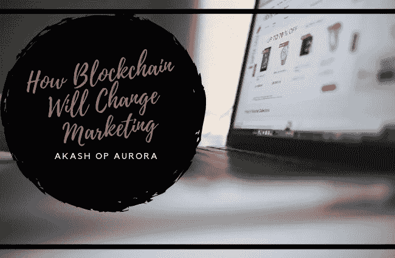

# 区块链将如何改变营销

> 原文：<https://medium.datadriveninvestor.com/how-blockchain-will-change-marketing-4ac5607e913f?source=collection_archive---------13----------------------->

随着区块链技术已经在改变金融行业，它也将影响营销行业也就不足为奇了。2016 年，机器人给公司造成了超过 70 亿美元的损失。机器人可以用来增加广告收到的点击量，这样出版商就可以增加他们向公司收取的广告费用。区块链是透明和加密的，更容易区分实际的人是否看到他们的广告，或者它只是一个机器人。区块链技术可以帮助许多希望更好地利用广告资金的公司。

[**更好的锁定你的受众**](https://www.forbes.com/sites/danielnewman/2017/11/14/4-ways-blockchain-will-transform-digital-marketing-and-advertising/#391229f43fb7)

有了直接从客户那里收集信息的能力，区块链将能够建立他们客户的档案，而不是从多个不同的来源获得信息并需要将它们拼凑在一起。通过使用区块链，公司将能够向顾客推销他们的产品。公司将能够利用个人搜索历史来锁定那些更有可能购买产品的人。区块链还将有助于监管客户看到的广告。应该给顾客的最佳广告数量是四至六个。这项技术可以用来确保每个广告的点击率。你不会得到你已经购买的产品的广告，因为他们会停止。

[**减少诈骗金额**](https://www.forbes.com/sites/forbesagencycouncil/2018/02/27/10-ways-blockchain-could-change-the-marketing-industry-this-year/#4191fded48ba)

如前所述，公司因为欺诈而亏损。通过使用区块链，出版商将对他们所说的数字负责。广告商将会看到他们的流量来自哪里，以及有多少人在观看。机器人将不再是虚假的垃圾广告，更重要的是，这些公司将获得真实的数字，以查看哪些广告对他们的公司有效。他们将能够证明他们没有浪费钱，而且从长远来看这对公司是有帮助的。公司将能够知道哪些出版商做得好，这将允许他们购买更多与他们相关的广告。

[**整个市场的透明度**](https://www.forbes.com/sites/forbesagencycouncil/2018/02/27/10-ways-blockchain-could-change-the-marketing-industry-this-year/#4191fded48ba)

广告商将能够看到影响者是否有真正的追随者。如果影响者只有喜欢他们的机器人，他们将不再被用于营销活动，而那些被真人跟踪的机器人将继续存在。对于那些将社交媒体平台作为职业的人来说，这将极大地改变他们做生意的方式。对于营销团队来说，这将允许他们选择与谁更好地合作。能够看到有多少人正在查看他们的广告，并点击它们。广告商也将能够更好地与出版商协商条款。他们可以得到更好的交易，不会为他们正在接受的服务支付过多的费用。他们将能够看到他们的活动结果，以及为他们公司的活动产生的实际数字。

虽然目前还没有很多公司能够在他们的业务中实现这项技术，但将来会实现的。公司应该为这些变化做好准备。这将有助于节省资金，更好地瞄准客户，并帮助企业选择如何营销。

【akashopaurora.co】原载于**。**