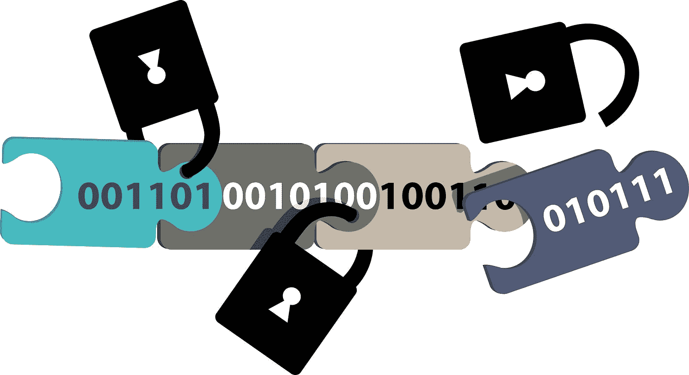

# 区块链将如何改变世界

> 原文：<https://medium.datadriveninvestor.com/how-blockchain-will-change-the-world-23f5e8f88821?source=collection_archive---------0----------------------->

*“我通常忙于尝试分散防御，在深入研究区块链和分散系统后，我很高兴加入 SIRIN LABS 作为大使，让区块链与他们即将推出的智能手机操作系统更加友好！”*

最近的话不是别人，正是[莱昂内尔·梅西](https://www.facebook.com/leomessi/posts/2059994690686781)。这位阿根廷和巴塞罗纳足球传奇人物是否理解区块链最深层的错综复杂还有待观察。但他代表一家有前途的区块链公司发布的宣传帖子显示了分布式账本技术在过去几年里在全球范围内的认知度。这表明，在未来几年，区块链将在世界上发挥巨大的影响力。

表面上，人们可能会忍不住问，当谈到区块链时，有什么大惊小怪的。毕竟，当我们把所有的炒作归结到该技术毫无特色的核心功能——成为一个改进的分布式账本——这场革命听起来并不*特别令人兴奋。但是，正是这种分类账提供一个不可伪造的、单一版本的真相的能力，现在使得许多过程变得更快、更安全、更准确和更有效。随着区块链彻底消除对中央中介机构的需求，它将从根本上改变传统模式和基础设施，行业、政府甚至个人已经在这些基础上运行了几十年，如果不是几百年的话。*

迄今为止，就区块链用例而言，加密货币占据了大部分头条。许多人会说“理所当然！”—毕竟，新的可交易资产并不是每天都能产生四位数的年百分比收益，就像比特币在 2017 年实现的那样。但在接下来的几年里，分布式账本技术本身将最终改变世界经济、政治和文化的大部分面貌。几乎每天都有另一个行业滔滔不绝地谈论区块链能为其未来带来什么。在这里，我们看一些具体的例子，在这些例子中，该技术有望发挥特别重要的作用…

# 保险

我们已经讨论了区块链转变金融服务业的潜力，主要是在贸易融资、支付、清算和结算以及合规和监管等子行业。这看起来也将在保险业引起巨大的动荡。许多行业巨头都在测试潜在的区块链应用，包括安联保险、友邦保险和瑞士再保险。并有可能提出基于区块链的解决方案，以改善内部流程，从而提高效率、降低成本和增加收入；以及更普遍的行业使用案例，这些案例可以使整个行业价值链中的各个部门受益。

在这方面，人们非常期待引入智能合同，这是一种在区块链自动执行的协议，保险合同的所有参与方都可以信任。尤其是索赔数据，将会得到显著改善，尤其是考虑到目前该领域中保险组织、代理和第三方(例如，维修店)普遍存在的低效率，以及手动数据输入处理方法仍然普遍存在并因此容易出现人为错误的事实。相比之下，使用区块链可以根据使用智能合同记录的安全信息提交和裁定索赔，从而实现索赔支付流程的自动化。正如德勤最近在[观察到的，智能合同“可以为客户和保险公司提供以透明、响应迅速和无可辩驳的方式管理索赔的手段”。因此，智能合同将降低成本，提高支付速度，并为保险业提供一种新的创新商业模式。](https://www2.deloitte.com/content/dam/Deloitte/ch/Documents/innovation/ch-en-innovation-deloitte-blockchain-app-in-insurance.pdf)

# 供应链管理

鉴于区块链实现了过去和现在的分散和不可变的交易记录，企业可以使用这一技术在整个供应链中跟踪其商品、资产和/或服务——从生产到最终用户收到。许多人会说这是非常需要的——众所周知，今天的供应链在本质上是错综复杂的，比如说，在制造商和供应商之间，或者在商家和客户之间，往往需要几天才能完成付款。

[正如德勤](https://www2.deloitte.com/us/en/pages/operations/articles/blockchain-supply-chain-innovation.html)所言，实施区块链解决方案“可以帮助参与者记录价格、日期、地点、质量、认证和其他相关信息，以有效管理供应链。在区块链获得这些信息可以提高材料供应链的可追溯性，降低假冒和灰色市场的损失，提高外包合同制造的可见性和合规性，并有可能提高组织作为负责任制造领导者的地位”。

时间延迟和人为错误可以大大减少，废物和排放也可以大大减少，这些废物和排放可以显著影响与工业生产相关的环境影响。例如，IBM 正在与包括雀巢和沃尔玛在内的主要食品生产商和分销商合作，以减少全球食品供应链中的污染。这是一个重要的发展，特别是考虑到[世界卫生组织的一份报告](http://www.who.int/mediacentre/news/releases/2015/foodborne-disease-estimates/en/)发现，每年全世界有十分之一的人因受污染的食物而生病，大约 42 万人因此死亡。由于没有人监督整个供应，食品安全目前可能在该过程的许多阶段受到威胁。

但是，随着区块链提供整个生态系统的不可改变的时间戳记录，识别供应链上臭名昭著的污染点就变得容易多了。[《福布斯》最近承认](https://www.forbes.com/sites/rogeraitken/2017/08/22/ibm-forges-blockchain-collaboration-with-nestle-walmart-for-global-food-safety/#7e3a27d03d36)IBM 区块链在解决此类问题方面具有巨大潜力，*“全球食品供应链中的所有参与者——从种植者到供应商和加工者，从分销商到零售商、监管机构和消费者——都可以通过 IBM 的这一最新举措获得关于其交易的食品原产地和状态的已知和可信信息的“许可访问权”*。*这样一来，食品供应商和生态系统的其他成员就可以利用区块链网络在短时间内追踪受污染产品的源头，阻止疾病的传播。”*

# 减少腐败

鉴于区块链账本的不变性和永久性，人们对这项技术在解决腐败问题上的应用充满期待。以土地注册处为例。政府注册系统缺乏安全性导致了大量数据损坏的案例。犯罪分子能够伪造所有权，通常只需使用编辑软件，以对他们有利的方式规定财产所有权的转让，而且费用可以忽略不计。事实上，产权保险本身是一个 200 亿美元的产业，一些估计表明，打击产权欺诈的成本约为 10 亿美元。

更何况这是一个严重的全球性问题。据信，70%拥有土地的人对他们的土地拥有不确定的所有权。洪都拉斯是受影响最严重的国家之一，据[美国国际开发署土地使用权评估](https://usaidlandtenure.net/country-profile/honduras/)估计，洪都拉斯 80%的私有土地没有所有权或所有权不当，而只有 14%的公民合法拥有房产，其中不到三分之一的公民进行了正式登记。这种不足甚至导致了暴力冲突和广泛的欺诈，注册系统数据库被黑客入侵，官僚们能够保护最豪华的财产。

事实上，区块链最有前景的早期应用之一是洪都拉斯政府和初创公司 Factom 之间的合作，旨在将洪都拉斯的土地所有权置于区块链。虽然这个项目[似乎已经停滞不前](https://www.coindesk.com/debate-factom-land-title-honduras/)，但其他国家，如格鲁吉亚共和国——成为第一个在区块链记录土地所有权的政府[——以及瑞典和印度，现在正处于测试阶段，以在其国家财产记录中扩大区块链的使用。](https://www.forbes.com/sites/laurashin/2017/02/07/the-first-government-to-secure-land-titles-on-the-bitcoin-blockchain-expands-project/#3473ef8c4dcd)

# 解决人道主义问题

许多政策制定者也希望区块链能够解决一些当今世界上最复杂的人道主义问题。9 月初，欧洲议会内部的一个区块链工作组表示有兴趣使用区块链为难民提供数字身份。根据最近与欧盟试点项目“分布式账本技术横向工作组”相关的欧盟预算出版物，立法者正在考虑这样一个提案，“一个应该探索的具体用例是基于[分布式账本技术]的解决方案在管理难民状况方面的潜力。许多难民和处于类似难民状况的人无法证明自己的身份或获得基本服务。”表面上看，这一举措将有助于难民获得一个正式的身份证，这反过来将有利于开设银行账户、获得医疗保健和寻求法律代表。

今年早些时候有报道称，联合国正在利用以太坊向叙利亚战争难民提供资金。从那时起，据信 7 个联合国小组正在探索区块链如何解决与身份和小额支付有关的问题。

事实上，芬兰政府已经做得更好了。赫尔辛基与一家名为 MONI 的公司合作，向没有银行账户的难民提供预付万事达借记卡。每张卡都包含一个存储在区块链上的唯一标识符，这意味着不需要第三方来进行身份验证。该卡还具有银行账户的功能，能够从用户的雇主处直接接收存款；并且账户的私人密钥只能由持卡人访问，因此允许容易且安全地进行识别。由于区块链存储了每位持卡人的所有交易，因此，当地移民服务部门也可以轻松监控持卡人和支出。

# 政治

区块链可能引发投票方式的革命，不仅在政党层面，而且在公司股东大会上。大多数国家目前的政治选举投票程序仍然明显过时。前往投票站在投票站的一张纸上投票会产生许多问题，包括等待时间长、黑客漏洞、计票错误和腐败。然而，舒适的个人设备上基于区块链的投票系统可以完全改变这一过程，成为完全安全、防篡改的体验。使用区块链进行投票是该技术支持者最长期的目标之一，加拿大计算机科学家的目标是[早在 2012 年](https://www.newscientist.com/article/mg21328476.500-bitcoin-online-currency-gets-new-job-in-web-security/)使用它“作为一种数字信息的‘碳定年’形式——这将使电子投票更加安全”。

如今，等公司正在创建基于 DLT 的投票系统，用一个令牌代表选民的选择，然后将令牌存入候选人的“钱包”，作为在区块链上永久记录投票的一种方式。 [BitCongress](http://www.bitcongress.org/) 是另一家旨在确保区块链每个人都有不可改变的投票权的公司。正如其网站所说，“BitCongress 允许任何人使用一个简单的应用程序编写世界法律。这意味着任何人现在都可以写一部法律，将这部法律发布到平台上，让任何人看到&投票。投票将永远登录到比特币区块链，因此永远不会发生投票黑客行为”。

我们已经讨论了区块链最激动人心的五个用例。我们可以轻松地讨论更多，包括[艺术](https://www.forbes.com/sites/rogeraitken/2017/08/17/how-the-blockchain-is-disrupting-the-art-economy-as-we-know-it/#639e505c74fe)、[预测市场](https://augur.net/)、[钻石行业](https://www.forbes.com/sites/pamelaambler/2017/09/10/how-blockchain-is-fixing-the-diamond-industrys-rampant-ethical-issues/#777f3c8325bc)、 [RegTech](https://static1.squarespace.com/static/567bb0614bf118911ff0bedb/t/5915784ef7e0abd89c297f3d/1494579283238/From_Fintech_to_regtech.pdf) 和[医疗保健](https://www.forbes.com/sites/jessedamiani/2017/11/06/simplyvital-health-blockchain-revolutionize-healthcare/)。虽然这些仍然处于技术发展的早期阶段，但我们正开始到达这样一个点，即“潜力”开始转化为可展示的、可见的成功。

但是，推进区块链也有局限性和挑战。其中最相关的是它的复杂性。不仅街上的普通人仍然可能甚至没有听说过“区块链”这个词，而且即使那些熟悉它的人，也很少有人真正理解它是如何运作的。此外，随着技术的引入，出现了一系列新的术语，用户可能需要一段时间才能真正掌握区块链。此外，运行比特币等协议的计算成本[，我们之前已经讨论过](http://www.datadriveninvestor.com/2017/11/12/blockchain-consensus-algorithm-pow-pos-and-beyond/)。最近的估计表明[比特币采矿每年消耗的电力比爱尔兰还多](https://www.theguardian.com/technology/2017/nov/27/bitcoin-mining-consumes-electricity-ireland)！

然而，随着区块链现在明显影响的应用和用例的数量，似乎一个新的范式正在等待着世界。

*原载于 2018 年 4 月 10 日*[*www.datadriveninvestor.com*](http://www.datadriveninvestor.com/2018/04/10/how-blockchain-will-change-the-world/)*。*