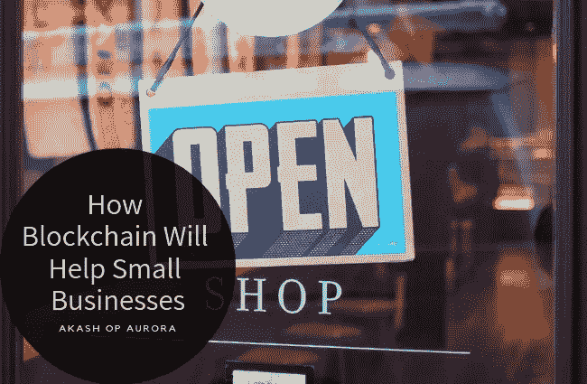

# 区块链将如何帮助小企业

> 原文：<https://medium.datadriveninvestor.com/how-blockchain-will-help-small-businesses-2dd8789bf223?source=collection_archive---------38----------------------->

区块链技术正在重塑组织营销和处理金融交易的方式。这项技术提供了透明的数据，不能被操纵。另一个重要的好处是，它让小企业有能力与大公司正面交锋。他们有能力在许多情况下消除中间人，同时提高工作流程的效率。

**礼品卡和忠诚度计划**

**提供礼品卡或忠诚度计划的商店可以摆脱第三方团体，自行提供任一选项。顾客可以通过区块链的公共账本收到一张数字卡片。该技术将为客户和企业提供更高的安全性。**

**[**智能合约的使用**](https://www.upwork.com/hiring/for-clients/8-blockchain-applications-help-small-business/)**

**智能合约将自动按照程序运行，用户无需担心欺诈、审查甚至第三方干涉。通过使用该技术，合同条款的填写将不会因法规而变慢，交易成本也将降低。就像普通的纸质合同一样，由区块链创建的合同将牢不可破。**

**[**除去中间人**](https://www.entrepreneur.com/article/312923)**

**通过使用区块链技术，企业在需要客户数据时不再需要中间人。如果小商店希望获得特定的消费者数据，他们将能够与其他小商店进行交易来获得这些数据。他们不需要从大公司那里获取消费者数据，这些大公司可能会对不真实的信息收取更高的费用。**

**[**全球安全支付**](https://www.upwork.com/hiring/for-clients/8-blockchain-applications-help-small-business/)**

**通过使用区块链技术，企业将能够安全地汇款，而不必担心欺诈。交易将立即以低成本完成，而不是与多家银行打交道和支付昂贵的交易费用。如果您是一家在全球范围内与客户互动的小型企业，或者如果您有远程员工，这将是一项至关重要的优势。**

**[**遵循产品的生命周期**](https://www.upwork.com/hiring/for-clients/8-blockchain-applications-help-small-business/)**

**对于要制造的普通产品来说，资源需要在制造公司集中起来，在那里组装最终产品。有了区块链技术，我们将能够实时看到产品建造的整个生命周期。有了这些信息，公司的成员将能够确定哪些步骤浪费了金钱或时间。然后，他们将能够修复过程中成本高昂的步骤，并节省资金。**

***最初发表于*[*【AkashOPAurora.co】*](http://akashopaurora.co/how-blockchain-will-help-small-businesses/)*。***