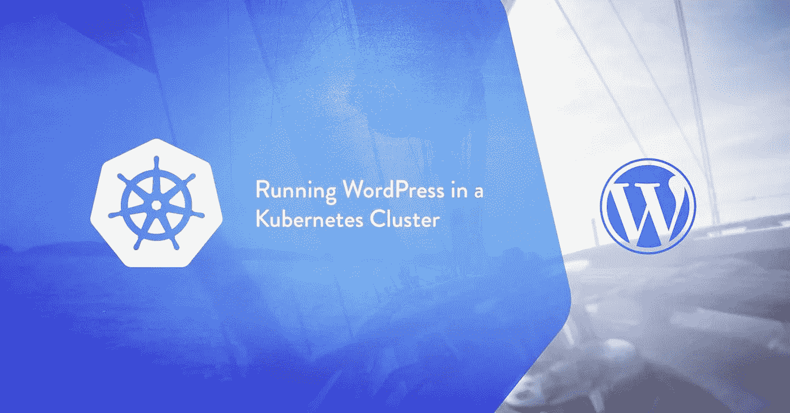
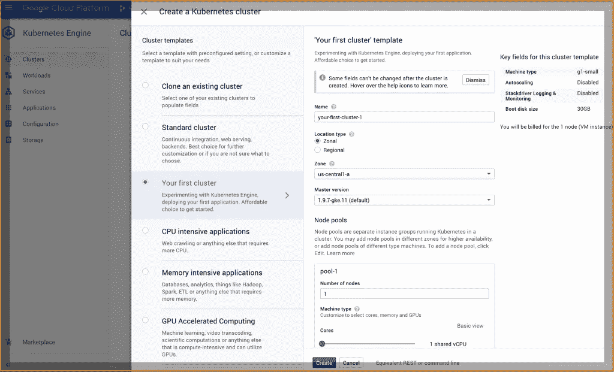

# 我只用了 11 分钟就在 Kubernetes 上推出了 WordPress 和 MySQL

> 原文：<https://medium.datadriveninvestor.com/how-build-deploy-wordpress-mysql-kubernetes-7660df33aef2?source=collection_archive---------10----------------------->

[](http://www.track.datadriveninvestor.com/1B9E)

*Originally published at* [*sinxloud.com*](https://sinxloud.com) *on November 19, 2018.*

WordPress 可以说是网站和博客最受欢迎的内容管理系统。通过在 Kubernetes 上运行 WordPress，我们可以构建一个可靠的、可扩展的内容管理平台。它是一个 docker 图片，在 DockerHub 上有超过 1000 万的点击量。

据信，今天有近 20 亿个在线网站，这意味着世界上大约每四个人就有一个网站。

事实上，我们今天有近 20 亿个在线网站，这要感谢 CMS，根据 [BuiltWith Trends](https://trends.builtwith.com/?__hstc=240889985.75127629ab904ef59c72aed6880f399a.1543134841738.1543134841738.1543151696879.2&__hssc=240889985.1.1543151696879&__hsfp=3796877508) ，WordPress 拥有 59.9%的市场份额，使其成为顶级网站平台和受欢迎的 CMS。

所以，如果你是一个关心 SEO、速度和效率的人，Kubernetes 是一个答案，因为它允许大量的容器和谐地一起工作，减少操作负担。

有了 Kubernetes，我们可以在许多不同的机器上运行容器。当需求变化时，通过添加或删除容器来扩大或缩小规模。



**好了**，我们听说“Kubernetes 很棒”,但现在是时候去实践了。在接下来的 30 分钟里，我将带你经历在 Kubernetes 上创建你的第一个 WordPress 的整个过程，你最好相信这将会很棒。

此外，如果你想了解更多关于 Kubernetes，参加这些课程；

*   [Kubernetes](https://sinxloud.com/fly/getting-started-with-kubernetes-nigel-poulton-pluralsight/)入门——Nigel Poulton
*   [谷歌 Kubernetes 引擎入门](https://sinxloud.com/fly/getting-started-with-google-kubernetes-engine/) —谷歌云
*   [准备谷歌云认证](https://sinxloud.com/google-cloud-certification-courses-specialization-training-classes/) —谷歌云

# 通过 8 个简单的步骤在 Kubernetes 上部署 WordPress 和 MySQL

事不宜迟，让我们从你需要什么开始吧。首先，你需要注册谷歌云，你还需要从谷歌云申请 300 美元的信用，有效期最长为 12 个月。有几个步骤你必须采取，以广场了，但整个过程应该不到 5 分钟。

## NFS 服务器设置

我们可以使用 NFS 服务器来存储 WordPress 和 MySQL 数据。所以，还是先准备一下吧。

开放端口 **TCP:111，UDP: 111，TCP:2049，UDP:2049**

```
sudo yum install nfs-utils -y
```

现在我们将通过 Kubernetes 的私有子网共享 NFS 目录:

```
sudo vi /etc/exports
/ 172.31.32.0/24(rw,sync,no_root_squash)
```

**记住**，您需要将 **172.31.32.0/24** 更改为您的专用集群子网。

## 创建备份目录

我们需要为 MySQL 和 WordPress 文件创建一个备份目录:

```
sudo mkdir /{mysql,html}sudo chmod -R 755 /{mysql,html}sudo chown nfsnobody:nfsnobody /{mysql,html}sudo systemctl enable rpcbind ; sudo systemctl enable nfs-serversudo systemctl enable nfs-lock ; sudo systemctl enable nfs-idmapsudo systemctl start rpcbind ; sudo systemctl start nfs-serversudo systemctl start nfs-lock ; sudo systemctl start nfs-idmap
```

为 MySQL 密码创建一个秘密

完成 MySQL 设置后，我们需要使用 MySQL secrets 引擎。MySQL Secrets engine Vault 根据配置的角色动态生成数据库凭证。

MySQL 的秘密是一个存储敏感数据的对象，比如密码或密钥。

机密中的每一项都必须是 base64 编码的。因此，让我们创建一个供管理员使用的密码，并对管理员的密码进行编码:

```
echo -n 'admin' | base64
```

您将获得编码后的密码: **YRWtaW4=**

**或者我们也可以根据文档进行如下操作，**

通过以下命令创建秘密对象。您需要将**您的 _ 密码**替换为您想要使用的密码。

```
kubectl create secret generic mysql-pass --from-literal=password=YOUR_PASSWORD
```

通过运行以下命令验证该机密是否存在:

```
kubectl get secrets
```

回应应该是这样的:

```
**NAME**                  **TYPE**                    **DATA**      **AGE**
mysql-pass            Opaque                  1         42s
```

> **注意:**为了保护秘密不被暴露，无论 **get** 还是 **describe** 都不能显示其内容。

为 MySQL 创建一个 **secret.yml** 文件，这样它将被 WordPress 映射为一个环境变量:

```
apiVersion: v1
kind: Secret
metadata:
  name: mysql-pass
type: Opaque
data:
  password: YRWtaW4=
```

这意味着需要访问数据库的服务不再需要硬编码凭证:它们可以从 Vault 请求凭证，并使用 Vault 的租赁机制来更容易地滚动密钥。所以，别忘了把你的编码密码加到上面的 secret.yml 里。

完成后，运行以下命令:

```
kubectl create -f secret.yml
```

## **为 WordPress & MySQL** 部署持久卷

现在，让我们继续创建 PV 文件，并更改您正在使用的 NFS 服务器的 IP 地址。

在 Kubernetes 上，WordPress 和 MySQL 都使用 PersistentVolumes (PV)和 PersistentVolumeClaims (PVC)来存储数据。如果你想了解更多关于 PV 和 PV 的知识，这里有一个到 Kubernetes 文档的链接。

PVC 是对存储的请求，在某个时候可以变得可用，绑定到某个实际的 PV。

让我们先用以下内容为 WordPress 创建一个 PVC:

```
*# Create PersistentVolume*
*# change the ip of NFS server*
apiVersion: v1
kind: PersistentVolume
metadata:
  name: wordpress-persistent-storage
  labels:
    app: wordpress
    tier: frontend
spec:
  capacity:
    storage: 10Gi
  accessModes:
    - ReadWriteMany
  nfs:
    server: 172.31.39.63
    *# Exported path of your NFS server*
    path: "/html"---
apiVersion: v1
kind: PersistentVolume
metadata:
  name: mysql-persistent-storage
  labels:
    app: wordpress
    tier: mysql
spec:
  capacity:
    storage: 10Gi
  accessModes:
    - ReadWriteMany
  nfs:
    server: 172.31.39.63
    *# Exported path of your NFS server*
    path: "/mysql"
```

然后执行以下命令从 **mysql-deployment.yaml** 文件部署 MySQL:

```
kubectl create -f pvc-wordpress.yml
```

然后，让我们验证持久卷是否得到了动态调配。请注意，调配和绑定 PVs 可能需要几分钟时间。

```
kubectl get pvc
```

通过运行以下命令验证 Pod 正在运行:

```
kubectl get pods
```

**部署持续体积索赔(PVC)**

PVC 是对存储的请求，在某个时候可以变得可用，绑定到某个实际的 PV。

用以下内容为 WordPress 创建一个 PVC:

```
apiVersion: v1
kind: PersistentVolumeClaim
metadata:
  name: wordpress-persistent-storage
  labels:
    app: wordpress
spec:
  accessModes:
    - ReadWriteMany
  resources:
    requests:
      storage: 6Gi
```

然后运行:

```
kubectl create -f pvc-wordpress.yml
```

对 MySQL 做同样的事情:

```
apiVersion: v1
kind: PersistentVolumeClaim
metadata:
  name: mysql-persistent-storage
  labels:
    app: wordpress
spec:
  accessModes:
    - ReadWriteMany
  resources:
    requests:
      storage: 6Gi
```

运行:

```
kubectl create -f pvc-mysql.yml
```

验证持久卷是否得到了动态调配:

```
kubectl get pvc
```

> **注意:**配置和绑定 PV 可能需要几分钟时间。

通过运行以下命令验证服务是否正在运行:

```
kubectl get services wordpress
```

回应应该是这样的:

```
**NAME        TYPE        CLUSTER-IP   EXTERNAL-IP   PORT(S)       AGE** wordpress   ClusterIP   10.0.0.89    <pending>     80:32406/TCP   4m
```

> **注意:** Minikube 只能通过 NodePort 公开服务。外部 IP 始终处于待定状态。

太好了，我们已经到了部署阶段。

## 部署 MySQL

以下是 mysql 服务和部署的 **mysql-deploy.yml** :

```
apiVersion: v1
kind: Service
metadata:
  name: wordpress-mysql   *# will be used as a value in*
  labels:                 *# WORDPRESS_DB_HOST in wordpress-deploy.yml*
    app: wordpress
spec:
  ports:
    - port: 3306
  selector:
    app: wordpress
    tier: mysql
  clusterIP: None
---
apiVersion:  apps/v1beta2 *# for versions before 1.9.0 use apps/v1beta2*
kind: Deployment
metadata:
  name: wordpress-mysql
  labels:
    app: wordpress
spec:
  selector:
    matchLabels:
      app: wordpress
      tier: mysql
  strategy:
    type: Recreate
  template:
    metadata:
      labels:
        app: wordpress
        tier: mysql
    spec:
      containers:
      - image: mysql:5.6
        name: mysql
        env:
        - name: MYSQL_ROOT_PASSWORD
          valueFrom:
            secretKeyRef:
              name: mysql-pass        *# the one generated before in secret.yml*
              key: password
        ports:
        - containerPort: 3306
          name: mysql
        volumeMounts:
        - name: mysql-persistent-storage  *# which data will be stored*
          mountPath: "/var/lib/mysql"
      volumes:
      - name: mysql-persistent-storage    *# PVC*
        persistentVolumeClaim:
          claimName: mysql-persistent-storage
```

该文件由两个独立的配置组成:

**服务**部分映射 MySQL 的端口 **3306** ，并使其可用于所有标签为 **app:wordpress** 和 **tier:mysql** 的容器。

部署部分声明了创建 MySQL 容器的策略和规范:

*   这是一张来自 Docker Hub 的图片: **mysql:5.6**
*   它有 **app:wordpress** 和 **tier:frontend** 标签(用于服务)
*   它还包含一个名为 MYSQL_ROOT_PASSWORD 的环境变量，该变量保存来自我们的密码的值
*   港口 3306 现已开放
*   卷被声明并安装在 **/var/lib/mysql** 中。

现在，我们可以通过执行以下命令来创建部署和服务:

```
kubectl create -f mysql-deploy.yml
```

## 部署 WordPress

上面的过程对于 WordPress 来说是非常相似的。这是 wordpress-deploy.yml:

```
*# create a service for wordpress*
apiVersion: v1
kind: Service
metadata:
  name: wordpress
  labels:
    app: wordpress
spec:
  ports:
    - port: 80
  selector:
    app: wordpress
    tier: frontend
  type: ClusterIP---
apiVersion: apps/v1beta2 *# for versions before 1.9.0 use apps/v1beta2*
kind: Deployment
metadata:
  name: wordpress
  labels:
    app: wordpress
spec:
  selector:
    matchLabels:
      app: wordpress
      tier: frontend
  strategy:
    type: Recreate
  template:
    metadata:
      labels:
        app: wordpress
        tier: frontend
    spec:
      containers:
      - image: wordpress:4.8-apache
        name: wordpress
        env:
        - name: WORDPRESS_DB_HOST
          value: wordpress-mysql
        - name: WORDPRESS_DB_PASSWORD
          valueFrom:
            secretKeyRef:
              name: mysql-pass          *# generated before in secret.yml*
              key: password
        ports:
        - containerPort: 80
          name: wordpress
        volumeMounts:
        - name: wordpress-persistent-storage
          mountPath: "/var/www/html"          *# which data will be stored*
      volumes:
      - name: wordpress-persistent-storage
        persistentVolumeClaim:
          claimName: wordpress-persistent-storage
```

您可能已经注意到，这个文件也包含两个配置:

服务将容器的端口 **80** 映射到节点的**外部 IP:端口**用于所有标签为 **app:wordpress** 和 **tier:frontend** 的容器

部署声明了我们的 WordPress 容器的创建规范:

*   这是一张来自 Docker Hub 的图片
*   它有 **app:wordpress** 和 **tier:frontend** 标签(用于服务)
*   它包含环境变量 **WORDPRESS_DB_HOST** ，它是 MySQL 实例的内部主机名，以及 **WORDPRESS_DB_PASSWORD，**，它保存来自我们的秘密密码的值
*   端口 **80** 打开
*   它有一个安装在 **/var/www/html** 中的 volume claim，WordPress 源代码就是从这里提供的。

下面是我们接下来需要执行的内容:

```
kubectl create -f wordpress-deploy.yml
```

验证持久卷是否得到了动态调配:

```
kubectl get pvc
```

> **注意:**配置和绑定 PV 可能需要几分钟时间。

通过运行以下命令验证服务是否正在运行:

```
kubectl get services wordpress
```

回应应该是这样的:

```
**NAME        TYPE        CLUSTER-IP   EXTERNAL-IP   PORT(S)       AGE** wordpress   ClusterIP   10.0.0.89    <pending>     80:32406/TCP   4m
```

> **注意:** Minikube 只能通过 NodePort 公开服务。外部 IP 始终处于待定状态。

运行以下命令来获取 WordPress 服务的 IP 地址:

```
minikube service wordpress --url
```

## 启动 WordPress

要访问 WordPress，复制 IP 地址，并在浏览器中加载页面以查看您的站点。

你应该看到 WordPress 建立了类似下面截图的页面。


> **警告:**不要把你的 WordPress 安装留在这个页面上。如果其他用户发现它，他们可以在您的实例上建立一个网站，并使用它来提供恶意内容。
> 
> 要么通过创建用户名和密码来安装 WordPress，要么删除你的实例。

搞定了。现在你可以从 WordPress 仪表盘创建你自己的网站。

## 解决纷争

您可以使用以下命令检查一切是否正常:

```
kubectl get pv,pvc **// list pv,pvc for MySQL & WordPress**kubectl get deployment **// list deployment for MySQL & WordPress**kubectl get podskubectl describe pods pod-name **//pod-name from previous Command**
```

**在 NFS 服务器上**

检查 NFS 服务器，你会在 **/mysql** 和 **/html** 下看到你的数据

```
ls /mysqlls /html
```

安装 WordPress 后，试着删除一个 pod，它会自动从 **/html** 装载数据:

```
kubeclt delete pods pod-name
```

## 清理

运行以下命令删除您的密码:

```
kubectl delete secret mysql-pass
```

运行以下命令删除所有部署和服务:

```
kubectl delete deployment -l app=wordpress
kubectl delete service -l app=wordpress
```

运行以下命令删除 PersistentVolumeClaims。动态调配的持久卷将被自动删除。

```
kubectl delete pvc -l app=wordpress
```

**就这样**

您已经使用 Kubernetes 引擎部署了带有 MySQL、Persistent volumes 和 NFS 的 WordPress。

> 你现在可以大胆地说“你好，世界”

感谢阅读！如果你足够喜欢这篇文章，请在社交媒体上与你的朋友分享，并随时在下面留下你的问题或评论！

如果你喜欢这篇文章，我为你准备了实用的阅读材料:一篇是关于由谷歌掌舵的工程师讲授的 [**谷歌云认证项目**](https://sinxloud.com/google-cloud-certification-courses-specialization-training-classes/) ，另一篇是关于 2019 年如何用 Python 赛道学习数据科学。

*原载于 2018 年 11 月 19 日*[*sinxloud.com*](https://sinxloud.com/how-deploy-wordpress-mysql-kubernetes)*。*

## 来自 DDI 的相关故事:

[](https://medium.com/datadriveninvestor/why-data-will-transform-investment-management-4a60966c1c81) [## 为什么数据会改变投资管理

### 有人称之为“新石油”虽然它与黑金没有什么相似之处，但它的不断商品化…

medium.com](https://medium.com/datadriveninvestor/why-data-will-transform-investment-management-4a60966c1c81) [](https://medium.com/datadriveninvestor/which-is-more-promising-data-science-or-software-engineering-7e425e9ec4f4) [## 数据科学和软件工程哪个更有前途？

### 大约一个月前，当我坐在咖啡馆里为一个客户开发网站时，我发现了这个女人…

medium.com](https://medium.com/datadriveninvestor/which-is-more-promising-data-science-or-software-engineering-7e425e9ec4f4)