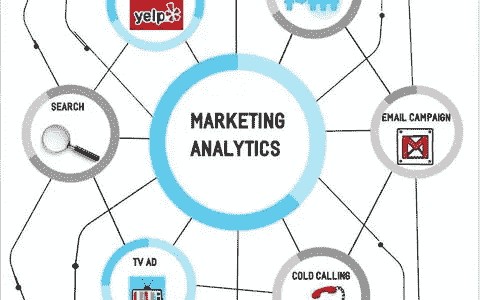
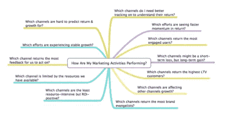
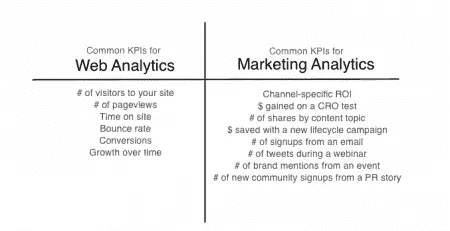

# 商业智能如何为销售和营销服务

> 原文：<https://medium.datadriveninvestor.com/how-business-intelligence-works-for-sales-and-marketing-ff1a37934c0c?source=collection_archive---------5----------------------->

在数据分析时代，商业企业正在根据从基于网络的分析和社交媒体渠道收集的见解做出重要决策。问题是这是否足够？[随着营销渠道数量的增加](https://resources.datanyze.com/blog/marketing-channels-to-boost-sales)，营销人员必须考虑来自多个渠道的日益增长的营销数据可用性，而不是只关注任何一个渠道。这就是营销分析发挥作用的地方。

# 什么是营销分析？

简单来说，营销分析是数据分析的一个分支，用于衡量任何商业企业营销计划的绩效。它可用于回答与营销相关的问题，例如:

 [## 数据科学和软件工程哪个更有前途？数据驱动的投资者

### 大约一个月前，当我坐在咖啡馆里为一个客户开发网站时，我发现了这个女人…

www.datadriveninvestor.com](https://www.datadriveninvestor.com/2019/01/23/which-is-more-promising-data-science-or-software-engineering/) 

*   我的营销计划今天表现如何？长期会有效果吗？
*   今天，哪些营销渠道回报最好？以及应该在哪些渠道投入更多的时间和金钱？
*   与竞争对手相比，我的营销工作进展如何？他们在投资哪些营销渠道？

除了在线指标，营销分析还关注其他指标，包括离线指标和营销工具，以呈现更具包容性的企业营销图景。为了确定营销的整体效果，营销分析评估其他与业务相关的因素，如投资回报(ROI)和业务增长，以提供更准确的衡量标准。

# 为什么营销分析如此重要？

那么，为什么营销分析如此重要，为什么它应该成为商业公司数据分析的一个组成部分？

*   **在营销中提供基于数据的决策:**作为任何营销团队的一员，您都希望您的高层管理人员能够认识到您的营销提案和计划的整体价值，并做出能够推动您的营销工作的正确决策。最好的方法是提供数据驱动的证据来支持你的营销想法和建议。营销分析是提供这些数据的最佳方式。
*   **提高营销活动的影响力:**营销分析使企业能够监控营销活动的效果，并比较各营销渠道的结果。[据麦肯锡公司](https://www.mckinsey.com/business-functions/marketing-and-sales/our-insights/using-marketing-analytics-to-drive-superior-growth)称，整合的分析方法可以减少 15-20%的营销预算，从而提高你的底线增长。广告商可以利用营销分析数据从他们的广告支出中获得更多的货币价值和投资回报率。

营销分析并不简单地关注任何特定的营销活动或计划，而是从更长时间内和多渠道的多个活动中获得更深刻的见解。

# 如何最好地实施营销分析？

现在，我们已经了解了营销分析的价值，让我们深入研究如何实施它以获得业务收益:

*   **使用高质量的数据:**营销分析的成功取决于数据的质量，这些数据应该从多个来源而不是单一来源获取。除此之外，您还必须基于所有类型的过去和现在的数据建立有效的营销模型。

*   **在分析中使用有意义的 KPI:**当企业试图在他们的分析工具中包含尽可能多的指标和 KPI 时，数据分析就会失败。定义你的营销目标，只包括那些能产生对你的业务有影响的结果的 KPI。为了提高效率，最好从最小数量的 KPI 开始，然后根据您的业务需求增加(数量)。

*   **根据见解采取行动:**营销分析可以有效地用于改善你的营销策略，但它的成功取决于你如何根据得出的见解采取行动。例如，通过转换营销活动产生的销售线索，您可以确定哪些营销活动对您的销售转换贡献最大。基于营销分析的数据洞察，企业可以实施其他行动计划，包括供需规划、营销渠道改进、营销策略和优化产品定价。

凭借其在为电子商务客户定制基于云的数据分析方面的丰富专业知识，Countants 是实施[云分析](https://www.countants.com/services/cloud-analytics/?utm_medium=social&utm_source=Medium&utm_campaign=Traffic)和[云可视化](https://www.countants.com/services/cloud-visualization/?utm_medium=social&utm_source=Medium&utm_campaign=Traffic)项目的合适解决方案提供商。

您是否希望为您的电子商务商店利用[云计算分析](https://www.countants.com/blogs/ways-in-which-artificial-intelligence-is-impacting-ecommerce-business/?utm_medium=social&utm_source=Medium&utm_campaign=Traffic)的巨大潜力？然后到了[给我们打电话](https://www.countants.com/contact-us/?utm_medium=social&utm_source=Medium&utm_campaign=Traffic)的时候了。