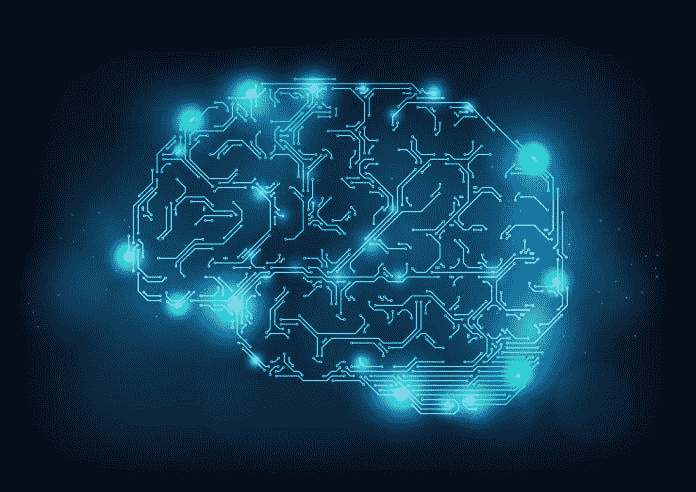

# AI 和人类如何协同工作？

> 原文：<https://medium.datadriveninvestor.com/how-can-ai-and-humans-work-together-bc89afef66f7?source=collection_archive---------1----------------------->

在电影《两百周年纪念人》中，罗宾·威廉姆斯扮演了一个机器人，它通过帮助人们更容易地完成日常任务来改变人们的生活——比如开窗、做饭和打扫房间。尽管预告片宣称，到 2005 年，每个家庭都将拥有一个多功能机器人，但能做这些事情的商业化、被广泛采用的机器人仍然很遥远。

然而，机器人的几个功能可以作为尖端的人工智能技术。以 Roomba 614 自充电机器人吸尘器为例。它的高度为 3.6 英寸，可以清洁厨房中最难触及的地方，让您的生活更加轻松。像二百周年纪念人一样，iRobot Roomba 是人类和人工智能应该如何合作的典型例子。人工智能应该让我们的生活更容易，我们应该让它顺其自然。

有些人担心技术正在夺走人们的职业道德，就像电影《瓦力》中描绘的未来一样。在电影中，每个人都最终登上了宇宙飞船，因为地球变成了一个无法居住的充满垃圾的有毒荒地。人们居住的宇宙飞船充满了无数的自动化功能，使他们的日常任务变得毫无意义。电影中的许多人变得肥胖，因为一切都变得如此自动化，人们不必做任何事情。

这两种不同的情况提出了一个问题，我们在过度依赖技术和仅仅为了改善我们的生活而使用技术之间划了一条线？

技术和 AI 真的能发展进步太多吗？我的答案是否定的。一个人可能有太多的人工智能产品或过于依赖人工智能——Siri:送我上楼，让我睡觉。然而，人工智能在自动化方面仍有很大的增长空间，我们不应为此感到兴奋。

人们认为技术将取代人类。在某种程度上，他们是对的，但不完全对。是的，自助结账可能会取代几乎所有杂货店的收银员。然而，想想制造自助结账的新工作和新公司？想想像 [Instacart](https://www.instacart.com/) 这样取代购物者而不是收银员的应用。

工业通过技术更新和发展。我们的工作是跟上潮流，让新兴求职者学习最需要的技能。

我们必须与人工智能合作，而不是反对它。它的地位只会上升，这是不可避免的。世界将变得更加自动化。但我们不能因为害怕变得太懒或过度依赖而对抗这场技术革命。我们应该与它合作，利用 AI 开发我们的祖先只能梦想的东西。

*关闭思想。*

随着对奇点的探索将在未来二十年内实现，人们越来越好奇人工智能和人类如何才能和平共处。然而，事实是我们已经开始与人工智能一起工作，慢慢改变我们生活的世界。

*原载于 2018 年 8 月 2 日*[*【www.datadriveninvestor.com】*](http://www.datadriveninvestor.com/2018/08/02/how-can-ai-and-humans-work-together/)*。*