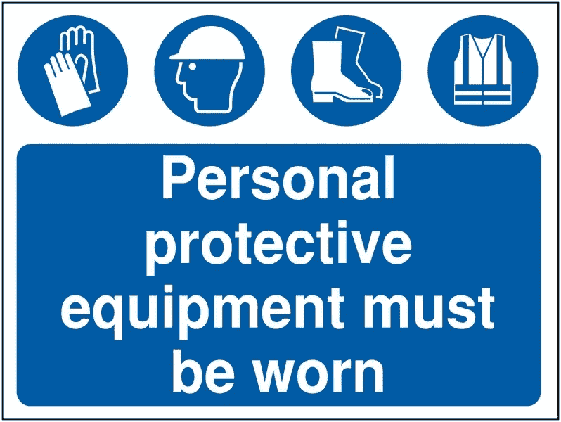

# 人工智能如何用于支持建筑行业的健康与安全？

> 原文：<https://medium.datadriveninvestor.com/how-can-ai-be-used-to-support-health-safety-in-construction-acc7b5210d30?source=collection_archive---------8----------------------->

在这篇文章中，我讨论了建筑行业对安全设备的要求，这些规定的手动执行，以及如何使用人工智能来自动改善建筑工地上安全设备的使用。

尽管本文的大部分内容是基于英国的要求，但这些规则和解决方案在欧洲和美国几乎无处不在。

 [## 医疗保健的未来正在被一场大型技术入侵所塑造|数据驱动型投资者

### 过去十年，全球经济的所有部门都经历了大规模的数字颠覆，而卫生部门现在…

www.datadriveninvestor.com](https://www.datadriveninvestor.com/2018/11/02/the-future-of-healthcare-is-being-shaped-by-a-big-tech-invasion/) 

按照英国 1992 年《工作中个人防护设备条例》的规定，雇主和访客有义务在施工现场穿戴适当的安全设备；“每个雇主都应确保向工作时可能面临健康或安全风险的雇员提供适当的个人防护设备……”

在建筑工地，这包括防护手套、帽子、靴子和高能见度背心。欧盟通过了第 2016/425 号法规，美国有与职业安全和健康相关的联邦和州立法。

这些法律旨在保护雇员免受与其各自职业相关的各种身体危害。

根据英国健康与安全执行局 2018/19 年度的数据，建筑行业有 30 起死亡记录。据报道，有超过 50 万起工伤事故，其中建筑行业是最大的原因之一。

虽然就其本身而言，没有证据表明缺乏安全着装是一个促成因素，但毫无疑问，任何可以改善这些数字的措施都是有益的。

为了执行这些规定，各国利用政府检查员。公司要对员工穿戴要求的设备负责，如果员工不这样做，可能会面临法律诉讼。

在 2017/18 年度，英国 HSE 成功判定了近 500 起与安全违规有关的案件以及 11，522 份传票，导致个人和公司的罚款超过 7200 万英镑。

在受伤的情况下，未能穿戴适当的设备也可能导致保险索赔被拒绝。

对政府和公司来说，这些法规的实施成本很高。然而，通过对建筑工地的摄像头输入使用人工智能深度学习模型，可以自动检测出不合规的情况。这些模型可以识别没有佩戴头盔或安全背心的人，并提醒相关人员采取行动。

虽然训练有素的深度学习模型很容易通过使用高清摄像机在建筑工地上识别帽子和背心，但安全鞋和手套的使用却很难检测，并且可以考虑其他物联网类型的解决方案来确保合规性。

实现这些结果的技术需要训练神经网络来识别和分类对象，例如人、头盔和背心。有几种不同的方法来实现这一点，如卷积神经网络(CNN)或你只看一次(YOLO)来识别戴头盔和没戴头盔的头部以及安全背心的识别。这些都是相当标准的，现在有许多解决方案可以实现高度准确的结果。

我最近参与了一些项目，旨在开发各种解决方案，帮助识别建筑工地上安全设备的使用情况，并在高速公路上检测摩托车手使用头盔的情况。事实证明，我们最初的部署以相对较低的成本提供了高水平的准确性。视频源取自现有的闭路电视安全摄像头，或者传输到云端，或者在本地将警报发送到现有的视频管理系统、电子邮件或专用网页。

虽然有些人猜测人工智能将如何接管世界，但我专注于真实世界的应用，人工智能可以通过拯救生命和保护人类来造福人类。这是人工智能技术可以产生有益影响的一个很好的例子。