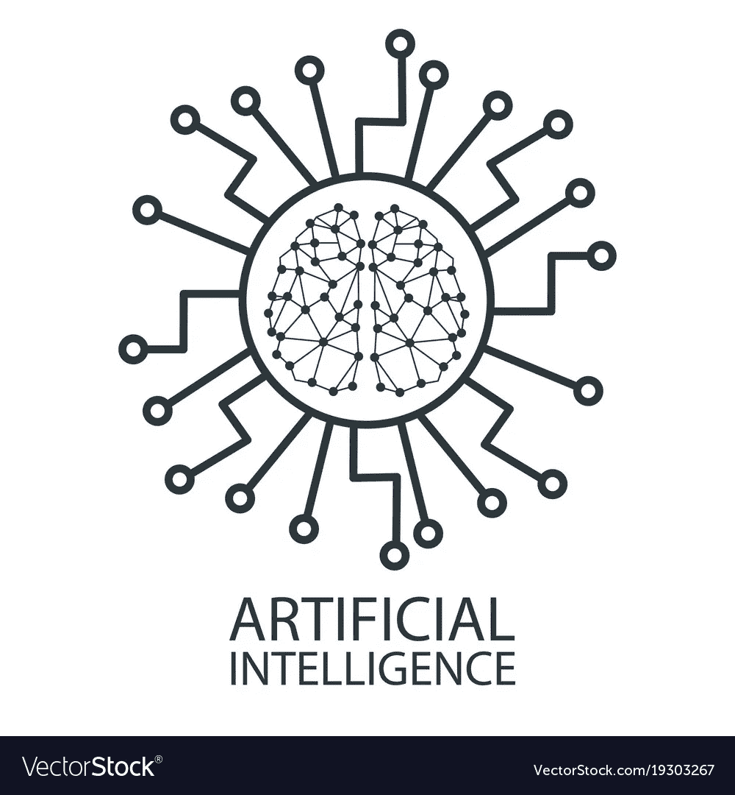
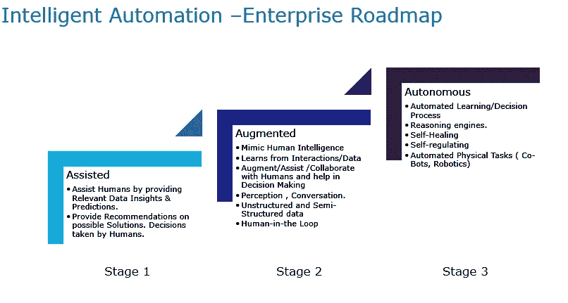

# 人工智能如何为企业启用智能自动化路线图？

> 原文：<https://medium.datadriveninvestor.com/how-can-artificial-intelligence-enable-the-intelligent-automation-road-map-for-enterprises-fce99493ea1f?source=collection_archive---------8----------------------->

围绕人工智能以及它将如何在企业中实现下一波自动化和数字工人，人们的兴趣和炒作日益增加。forester-2019 年人工智能预测预测，RPA 和人工智能技术创新将联手为超过 40%的企业创造数字工人。但是，企业究竟如何应用人工智能来实现这种转变。AI 能提供哪些能力，在企业场景中如何应用？如何应用 AI 为企业构建更大的智能自动化路线图？这篇博客旨在澄清这一点。

 [## 值得购买的 4 大人工智能股票及其原因——数据驱动型投资者

### 人工智能(AI)在 2019 年继续进入大众意识。通过应用程序…

www.datadriveninvestor.com](https://www.datadriveninvestor.com/2019/03/06/top-4-artificial-intelligence-stocks-to-buy-and-why/) 

企业采用*人工智能主要是利用特定的人工智能技术，如语音识别、自然语言处理、计算机视觉、模式识别，为任何企业流程提供以下层/功能。*

**交互—** 人工智能技术可以使用语音、文本、视觉或传感器与用户进行交互，并可以实现多种对话模式，例如:虚拟助理、语音助理。

**感知—**人工智能技术可以带来自然语言理解、语音识别、图像/对象识别、情感检测，并可以实现智能感知:例如，基于增强现实的智能手册、联络中心语音代理和用于从图像和文档中捕捉内容的感知机器人。

**学习和推理** **—** 人工智能技术有能力从不同的交互/数据/传感器和企业知识中学习。它可以使用机器学习、深度学习、强化学习和推理从交互/数据中学习，以创建决策模型，并通过人机反馈回路进行增强。这使得人工智能能够模仿人类大脑的工作方式，以协助、增强决策，以及一度为人类保留的基于感知和判断的任务。

**决策制定—** 人工智能支持的决策制定模型可用于提供预测性洞察、建议、选择/分类、模式识别故障排除或诊断，或流程监控和控制(例如，自动化票据解决、欺诈检测、风险和合规性、自动化索赔处理)。

人工智能提供的不同功能使企业能够跨越自动化的这三个阶段:

**阶段 1 —辅助**

o 通过提供相关的数据洞察和预测来帮助人类。就可能的解决方案提供建议。决策继续由人类做出。示例:金融服务的客户行为模式分析、票据和事件分析和洞察、故障模式分析、根据事件和建议寻找正确的解决方案

**第二阶段——增强的**

o 人工智能驱动的技术和工具可以通过从交互/数据中学习来增强人类的能力。可以实现人机协作决策。示例:针对 IT 服务管理、欺诈检测和风险合规性、索赔处理的自动化事件管理

**第三阶段——自主**

o 人工智能驱动的系统能够在没有人类干预的情况下独立完成任务。机器决策。例如:视频流和媒体及娱乐行业的自主推荐引擎，自主股票交易。

我们如何跨越智能应用管理、人工智能支持的运营、智能现场服务管理和智能网络安全这三个智能自动化阶段，实现自动化之旅？我将在下一系列文章中讨论这些内容。敬请期待！