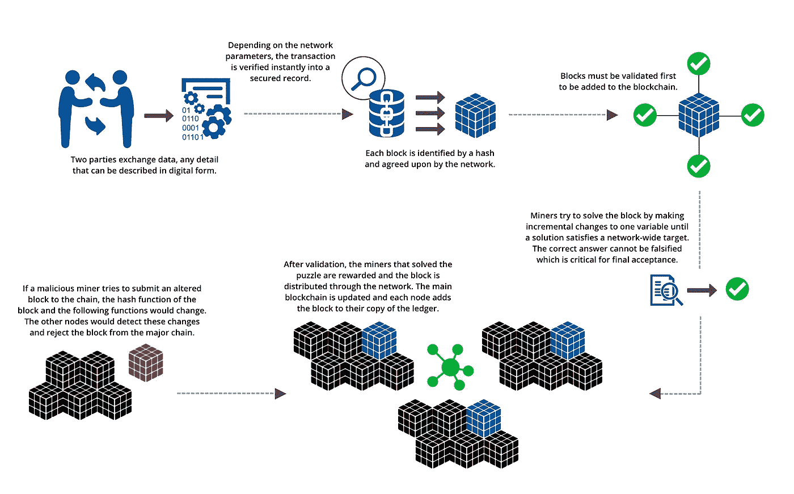

# 区块链科技如何颠覆汽车行业？

> 原文：<https://medium.datadriveninvestor.com/how-can-blockchain-technology-disrupt-the-auto-industry-8bfe091467c3?source=collection_archive---------0----------------------->

一段时间以来，区块链技术一直是“区块”上的新生事物，在实现新货币时尤其热门，这些货币最近经历了过山车式的变化。然而，区块链并不仅限于加密货币，还被其他行业广泛采用，尤其是汽车行业。根据 Frost and Sullivan 的数据，到 2025 年，预计将有 10–15%的联网汽车交易发生在区块链。[丰田](http://corporatenews.pressroom.toyota.com/releases/toyota+research+institute+explores+blockchain+technology.htm)正在与麻省理工学院媒体实验室合作探索区块链技术，以开发一个新的移动生态系统，该生态系统可以加速自动驾驶技术的发展，特别是在安全数据共享、汽车/乘车共享交易和基于使用的保险方面。[德国供应商 ZF 和 IBM](http://www.autonews.com/article/20170914/MOBILITY/170919841/zf-ibm-to-use-blockchain-for-mobility-services) 在 2017 年宣布，他们正在联合开发 Car eWallet，这是一项针对未来移动服务的支付技术。据两家公司称，汽车制造商和服务提供商可以使用汽车电子钱包来处理通行费、停车、电动汽车充电、汽车共享和车内服务。这只是区块链在全球汽车行业众多投资中的几笔。现在，让我们看看什么是区块链技术，以及它如何用于联网和自动驾驶汽车。

## 什么是区块链？

一个[区块链](https://en.wikipedia.org/wiki/Blockchain)是一个分散和分布式的公共数字分类帐，用于存储许多计算机上的静态记录和动态交易数据，以便在没有所有后续块的更改和网络共谋的情况下，记录不能被追溯性地更改。使用基于共识的机制来认证这些交易的有效性。今天，区块链的不同安排是可用的，从公共开源网络到需要明确的读写权限的私有区块链。下图描述了向公共区块链添加新块的过程。

*Blockchain — Technologies for the Automotive Industry, Ginkgo Research, 2017*

通过跨网络存储数据，区块链消除了数据集中存储带来的风险。由于区块链是透明的，它们被广泛采用，以实现联网车辆或车辆与基础设施之间的安全通信和数字支付，如前所述。区块链技术在汽车行业获得了很大的发展势头，在下面的章节中，我们将介绍自动驾驶汽车最近在区块链的一些发展。

## 多式联运平台

区块链技术正在帮助解决核心的移动问题，如可扩展的共享车辆所有权和多个移动利益相关者的整合，包括消费者、原始设备制造商、移动和运输提供商、城市和基础设施提供商等。2017 年， [EY 推出了 Tesseract](http://www.ey.com/gl/en/newsroom/news-releases/news-ey-advancing-future-of-transportation-with-launch-of-blockchain-based-integrated-mobility-platform) ，这是一个总部位于区块链的综合移动平台，平台上提供从单车到车队的运输服务。区块链对车辆和行程进行数字记录，车主、运营商和第三方服务提供商通过单一来源、基于使用的支付系统自动结算交易。该平台还将提供各种按需移动解决方案。

## 点对点(P2P)共享经济

[位于区块链的交通平台 DAV](https://dav.network/) ，允许自动驾驶汽车发现彼此，以及它们周围的服务提供商和客户。该公司使用不依赖于中央服务器的对等协议来实现分散式节点发现。该公司旨在开发一个平台，最终允许客户出租他们的自动驾驶汽车供他人使用。[丰田](https://www.trustnodes.com/2017/05/28/toyota-prototypes-ethereum-blockchain-based-car-sharing-uber-alternative)正在开发专门针对数据共享和点对点交流的概念验证应用。这个汽车和乘坐共享平台将允许个人和车队车主短期租赁他们的车辆。经过认证的骑手可以[通过移动应用程序访问平台](https://youtu.be/BZzOhujlmk4)，该应用程序可以找到可用的车辆。汽车可以使用区块链技术预订和付款。该应用程序与汽车通信，允许用户只需点击一个按钮即可解锁汽车。数据以分散的方式存储，因此应用程序知道对使用收取多少费用，交易安全地在区块链上进行。

## 智能合同

区块链技术确保与数字资产相关的每一笔记录交易都可以在未来的任何给定时间得到验证，从而实现新的[基于合同的交易](https://www.ginkgo.com/wp-content/uploads/2017/06/WP_Blockchain-online.pdf)。这些自动化交易由智能合约发起和监管，智能合约基本上是代表预定义条件自动执行的计算机程序，并且无需金融机构等中介即可实现完整和决定性的验证。通过基于区块链的智能合同，自动驾驶汽车能够与其环境进行双向通信，并能够自行处理交易。[智能合同](https://www.iotcoresoft.com/iot-knowlegde-center/how-blockchain-based-smart-contracts-work-in-todays-digital-world)将帮助自动驾驶汽车识别经过认证的乘客，并建立电池充电时间表和价格等交易。智能合同使 Innogy SE 能够通过其电动汽车创业公司 [Share & Charge](https://bitcoinmagazine.com/articles/innogy-charges-new-electric-car-fleet-using-ethereum-blockchain/) 在全德推出数百个区块链供电的电动汽车充电站。电动汽车社区平台使所有利益相关者能够选择加入，同时加快电动汽车的采用。有了智能合约，[例如，Streamr 平台上的自动驾驶汽车](https://www.cio.com/article/3235138/data-protection/how-blockchain-is-hastening-the-advance-of-autonomous-cars.html)可以自动从其他车辆、气象站、交通频道和其他来源购买数据，以供其驾驶。它还可以将数据回售给与它在地面收集的数据相同的来源。

## 数字支付

比特币、以太坊、Ripple、莱特币和其他加密货币都基于区块链技术，如今已经变得非常流行。 [AT & T](https://www.coindesk.com/att-explores-cryptocurrency-car-payments-new-patent-filing/) 正在探索通过这些数字货币进行车载支付。像 [DAV](https://dav.network/) 和 [Helbiz](https://bitcoinmagazine.com/articles/interview-helbiz-ceo-salvatore-palella/) 这样的少数初创公司正在开发自己的令牌系统或 ICOs(首次硬币发行)，以实现自动驾驶汽车中的数字支付。IBM 和 ZF 展示了他们的[汽车电子钱包](https://youtu.be/-lgaBlTeC6g),作为汽车中的一个创新的数字助理，允许在旅途中安全方便地支付，独立执行任务和授权支付，而无需用户自己活动。[博世最近与 IOTA](https://cryptovest.com/news/bosch-sees-a-future-with-iota-and-autonomous-driving-vehicles/) 合作，探索基于区块链的自动驾驶汽车微支付。区块链技术实现了安全和自动的数字支付，这反过来又使自动驾驶汽车能够无缝地支付通行费、停车费、电动汽车充电、汽车共享和车载服务。

## 基于使用的保险

基于使用的保险是汽车保险公司最近的一项创新，它将驾驶行为与汽车保险费更紧密地联系在一起。使用车载远程信息系统跟踪里程和驾驶行为。 [Gem](https://techcrunch.com/2017/05/22/toyota-pushes-into-blockchain-tech-to-enable-the-next-generation-of-cars/) 与丰田合作，通过实施区块链技术，专门致力于与车载远程信息技术相关的基于使用的保险产品。自动驾驶汽车也将安装由政府授权的[黑匣子](http://theinstitute.ieee.org/ieee-roundup/blogs/blog/united-states-germany-take-the-lead-in-requiring-black-boxes-for-selfdriving-vehicles)，以跟踪自动驾驶行为。与索赔数据相关的黑匣子和智能合同可以[通过自动化索赔支付以及根据智能合同上记录的安全信息提交和裁定索赔来简化保险流程](https://blog.kpmg.ch/insurers-drive-value-with-blockchain-and-telematics/)。这将降低成本，提高支付速度，并提供新的创新商业模式，如按驾驶付费和按驾驶付费模式。这些很可能成为计算保险费的首选指标。除此之外，由于数据分析的更大影响，2020 年以后，诸如管理驾驶方式等新选项将获得动力。弗罗斯特和沙利文认为，基于使用的保险政策预计到 2020 年将达到近 1 亿司机，主要是意大利、英国和美国。

## 汽车安全和隐私

随着互联和自动驾驶汽车的不断发展，控制汽车所需的软件代码越来越多，生态系统中互联设备的数量也在增加，潜在安全漏洞的数量也在增加。澳大利亚联邦科学与工业研究组织(CSIRO)、新南威尔士大学和虚拟汽车研究中心(Virtual Vehicle Research Center)的专家利用区块链技术解决了汽车安全问题，研究表明，智能汽车连接应该采用分散模式，以避免与单点故障相关的问题。他们提出了一种系统，可以在车辆、智能家居、软件供应商和其他人之间安全地交换数据，并通过区块链技术为车主提供隐私，确保适当的访问控制、身份管理和数据完整性。一种有趣的汽车网络安全方法是将区块链技术与软件定义的边界(SDPs)相结合的 T2，这是一种新的网络安全方法，旨在提供按需、动态配置的安全网络分段，通过在世界任何地方(无论是在云还是在数据中心)创建边界网络来减少基于网络的攻击。如果情况需要双向链接，可以从车辆到云资源提供 SDP 连接，一旦建立，区块链技术可以用于在内部车辆系统之间传输消息。这些位于区块链的安全系统可以保护联网和自动驾驶汽车免受网络攻击和隐私泄露。 [Cube](https://cubeint.io/) 也在开发一个基于区块链技术、深度学习和量子哈希密码术的自动驾驶汽车安全平台。

## 简化的供应链

汽车供应链极其复杂，由众多类型的零件、硬件/软件/固件供应商、分销商、经销商、监管机构和保险公司组成。值得信赖的供应商经过精心挑选和管理，并经过质量、可靠性和一致性方面的检查和认证。[区块链技术](https://www.ginkgo.com/wp-content/uploads/2017/06/WP_Blockchain-online.pdf)实现了从原材料来源到制造方式和地点的安全数字产品记忆记录的开发，包括它们的维护和召回历史。产品和组件所有权、真实性、交易、购买和每个组件的许可使用都可以通过区块链得到保护，从而允许多个供应链合作伙伴轻松协作。区块链可以显著简化供应链流程，尤其是那些依赖监管和合规审批的流程。

区块链技术是一项基础技术，为汽车行业开辟了一个充满创新机会的世界。原始设备制造商可以利用区块链技术作为平台，增强车辆的整体网络安全，验证软件材料清单，实现安全的小额支付，加强身份管理和改进数据验证。区块链将增加自动驾驶未来所必需的信任和安全水平。

**免责声明:本文表达的观点和意见仅代表我个人，不代表任何其他人或公司。所有内容都受版权保护。*