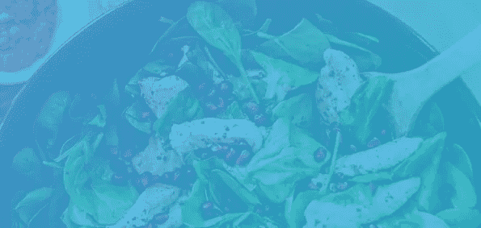
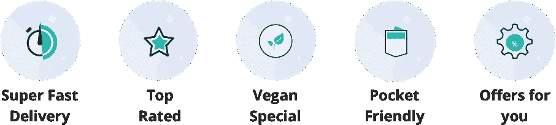
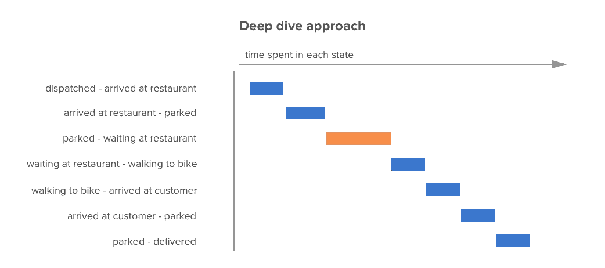
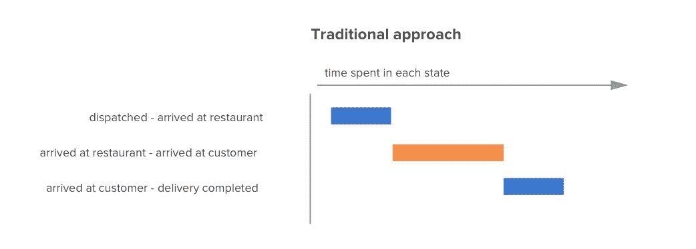
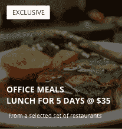
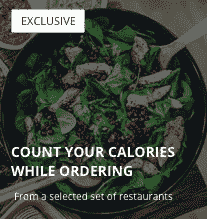
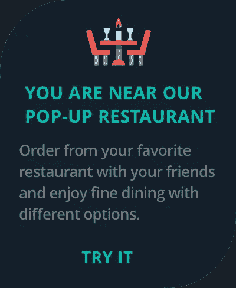

# 产品和 UX 抢食建议

> 原文：<https://medium.datadriveninvestor.com/how-can-grab-food-improve-its-application-d73905114779?source=collection_archive---------10----------------------->

**执行摘要**

基于我对食品配送行业的研究和了解，我为 Grab foods 编制了一份功能和改进列表。

1.  **重新定义搜索和推荐引擎**

*   向餐厅和菜肴添加元数据和标签
*   知识图谱
*   从搜索查询中学习
*   查询扩展
*   健康市场
*   快速过滤器

2.**服务质量因素**

3.**餐点优惠**

4.**健康意识餐**

5.**弹出餐厅**

# **简介**

主要目标是通过为所有相关利益方创建增值应用程序，在全球不断增长的食品交付平台中占有一席之地。由于食品送货上门的增长速度比美食市场快 10 倍，Grab Food 和其他在线食品送货上门服务将迎来进一步的巨大增长阶段，因此利用数据来改善“应用内”用户体验、餐厅关系、送货主管满意度、客户服务和创造差异化点将决定谁是明显的赢家。

# 生态系统

为了可持续发展，Grab Food 需要了解并满足订餐生态系统中利益相关者的需求和愿望:

**消费者在抢食网上点餐:**

*   交付的可靠性和速度
*   餐厅和菜肴的多样性和质量
*   抓取食物的无缝发现和购买体验

**送货主管:**

*   功能强大、直观的交付应用
*   更高的运营效率导致更高的每日支出
*   工资单的透明度和可靠性
*   针对支出问题、应用程序问题等问题和棘手问题的支持系统。

**餐厅:**

*   推动更高的订单量和销售额
*   提高餐厅的精益时间效率
*   支付和对账的透明度和可靠性
*   非侵入式无缝集成到现有供应商工作流程中
*   增值服务——餐厅的商业智能和分析。

# **建议**

要构建一个以用户为中心的应用程序，有两个品质——第一，打好基础&把基础做好，第二，用最后的润色来润色它。考虑到这一原则，我以类似的方式排列了我的建议。

**重新定义搜索和推荐引擎**

选择是 Grab Food 应用体验的基础。在任何一个地方，都可能有成千上万的餐馆，甚至有更多的菜单供顾客选择。许多因素会影响他们的选择。例如，一天中的时间，他们的烹饪偏好，以及当前的情绪都可以发挥作用。用最少的努力帮助顾客找到他们想要的食物是很重要的。以下是改善餐厅发现体验的几种方法:

1.  向餐厅和菜肴添加元数据和标签
2.  查询扩展
3.  健康市场
4.  快速过滤器

# **1。给餐馆和菜肴添加元数据&标签**

构建一个强大的搜索、推荐和发现引擎最重要的是围绕餐馆和菜肴的结构良好的数据。有两种方法可以向餐馆和菜肴添加元数据和信息。

*   使用在线信息创建知识图表
*   从客户搜索查询中学习

**知识图谱**

知识图表将帮助我们更好地理解客户的搜索。为了有效地构建知识图，我们应该构建一个足够灵活的结构来添加更多的标签，而且它应该不仅仅是一个数据块。例如，当客户查询“亚洲”美食时，图形可以推断“中国”和“日本”是“亚洲”的子集，并显示相关的餐馆。这同样适用于菜肴。如果客户搜索面条，我们将显示乌冬面和荞麦面。这将是监督标记。

**从搜索查询中学习**

使用表示学习算法来学习餐馆和菜肴的特征。为了做到这一点，我们可以使用手套算法来理解单词之间的距离。客户的搜索和客户的购买行为作为学习的数据点。导致来自不同餐馆的订单的查询意味着那些餐馆在距离上更近。如果顾客搜索鸡肉面，并从两家不同的餐厅购买，这将有助于我们了解这些餐厅有一些共同点——中国/亚洲美食，甚至在菜肴层面。但是，这需要大量的 A/B/N 测试来提高模型的准确性。

# **2。查询扩展**

查询扩展在以下两种情况下特别有用

1.  客户搜索的目的不明确，并且不能被查询本身完全捕获
2.  从查询中检索到的结果的质量是有限的。例如，当客户搜索“黄油鸡”时，很可能客户也对印度食物感兴趣。

当顾客搜索“黄油鸡”但顾客所在地附近没有卖黄油鸡的餐馆时。查询扩展使我们能够检索和排列与扩展查询相关的结果，例如“印度”、“旁遮普”和“北印度食物”，而不是返回零个结果在后端，原始查询被扩展为相似的查询，并且来自扩展查询的相关餐馆首先被检索，然后在呈现给客户之前被组合和排序。

# **3。健康市场**

为了维持一个健康高效的市场，确保所有相关利益方满意是至关重要的。仅对订单转换进行优化会导致级联问题。例如，如果大多数订单都集中在某个餐厅，因为该餐厅被推荐给所有客户，这也会导致问题。餐厅可能无法处理突然增加的订单，因此食物准备可能会延迟，甚至更糟的是，食物的质量可能会受到影响。即使餐馆能及时准备好所有的订单，我们也可能没有足够的附近送货伙伴来取食物并送到顾客手中。因此，要么订单无法履行，要么我们派出一名送货伙伴，但他离得太远，无法及时取货。

**解决方案**

不是基于单目标优化(即订单转换)来对餐厅推荐进行排序，而是基于涉及所有利益相关方的多目标优化:

*   客户满意度—例如，使用协作过滤可以提高相关性
*   市场公平性——例如，新餐馆应该使用 MAB 进行排名，以便在推荐中获得公平的曝光率。当对新餐馆的印象数量增加时，排名变平
*   交付主管的交付可靠性。(**服务质量**稍后讨论)
*   餐馆总预订量

# **4。快速过滤器**

**需要:**

对目录进行切片所需的过滤和排序非常多，必须放在一个单独的页面中，但这也造成了用户无法快速找到他们想要的餐馆的问题。为了解决这个用例，我们考虑引入几个关键的快速过滤器。

**目标:**

轻松发现餐厅和菜肴

*   减少结账时间
*   减少花费在餐厅列表页面和菜肴列表页面的结账时间
*   减少餐厅列表页面和菜品列表页面的点击率

# **交付质量因素**

65%的客户反映交付时间对应用程序的整体体验有很大影响。为了确保交付时间得到优化，我们引入了一个名为 Threshold 的参数。阈值是特定区域中交付主管可以处理的订单数量。有多种方法可以提高交付质量系数:

1.  **通过优化交付时间提高区域门槛** —我们的业务逻辑做出的优化交付时间的决策对交付主管可以完成的行程数量有着重大影响，最终影响他们的收入潜力。在传统的方法中，派遣送货主管去取订单是优化的主要焦点。然而，在传统方法中，我们遗漏了多个因素。在深入研究方法中，我们将通过解决以下问题来优化 ML 中的多个状态:

*   哪些餐厅停车时间最长，为什么？
*   送货员走到餐厅需要多长时间？
*   一家餐厅的送货主管的提货流程有困难吗？
*   我们应该什么时候派送货主管去取订单
*   送货主管是否在向客户送货时遇到了麻烦

2.如果我们达到了特定区域的阈值，我们可以用两种方式来处理它:

*   适度降级—我们为客户优化搜索结果。餐厅将根据距离、快速订单交付时间、协作过滤、菜肴差异等进行排名。
*   停止该区域的服务，直到送货主管有空。

# **上班族套餐**

2016 年，82%的送货上门服务是在家中进行的，而只有 16%的送货上门服务是在工作场所进行的。可以清楚地看到，由于各种原因，用户更喜欢在家订购；主要原因是做出购买决定所需的时间。通过引入套餐计划，他们不必每天计划从哪里订餐以及需要多长时间送货。他们可以简单地在一周的五天里满足所有的渴望。套餐计划提供超过 5 天免费送货上门的定制套餐。用户必须在他们的膳食计划开始前一天计划将多份膳食送到他们的工作中。办公室常客现在可以享受前所未有的服务，并有助于获取食物，占领一个未开发的市场。这为顾客提供了更容易的选择，也减少了再次购买的不确定性，降低了运输成本，增加了顾客的终身价值。

# **卡路里基础餐**

随着健身意识的增强，消费者对卡路里越来越敏感。很少有餐馆开始在菜单上显示每一道菜的卡路里含量。因此，Grab Food 可以与餐馆合作，了解他们提供的食物的卡路里含量。通过 A/B 测试，这将作为一个新的功能介绍给那些想注意饮食的顾客。该功能将最终创造最理想的免费推广和公关。

# **弹出餐馆**

让一家餐厅成为一家餐厅的主要亮点不仅仅是食物，而是它提供的氛围和体验。餐饮业一直欢迎新的创新和体验。根据《福布斯》的一篇文章，弹出式餐厅是市场的新热点。这一理念旨在引入无厨房的美食体验。

想法是在多个城市的市中心开一家弹出式餐厅。这是一个理想的品牌延伸，让顾客体验 Grab Food 所代表的意义。这个概念与公司的品牌价值非常契合。顾客可以进入餐厅，通过抓取食物应用程序从他们最喜欢的餐厅点菜。

这个想法是为个人提供多种美食的用餐体验，而不必牺牲他们作为一个群体外出过夜时的偏好。可以理解的是，这个概念在初始阶段可能有点令人困惑，但如果正确实施，其潜力可以重塑餐饮业和食品配送市场。

# **结论**

这些仅仅是想法和功能，使我个人的创造性思维在现实生活中创造一个抓取食物的差异。最重要的是，我可以带回家的主要知识是，创造用户体验的过程是动态的，变化很快，成为变化的一部分是一个公司能够为其用户群做出的最好贡献。