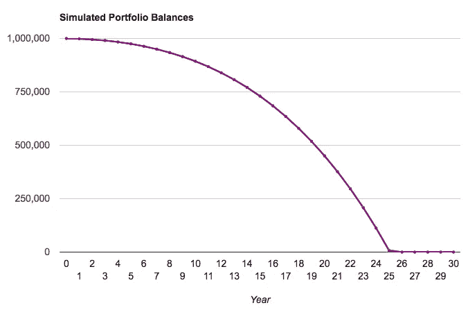
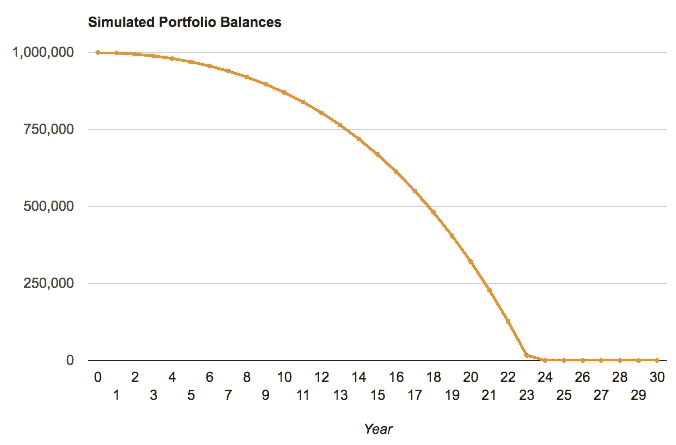
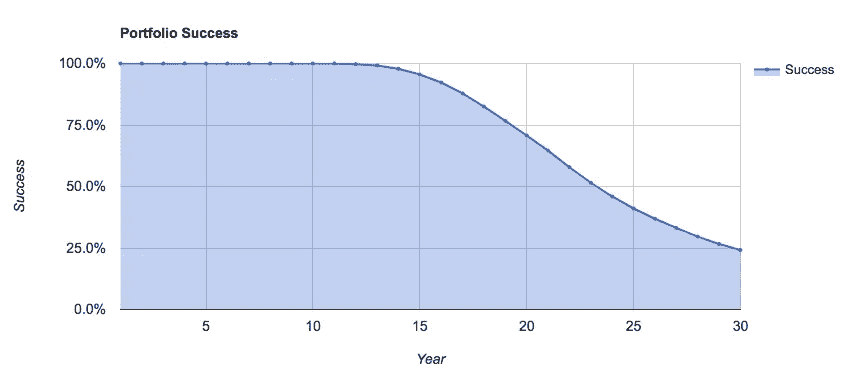
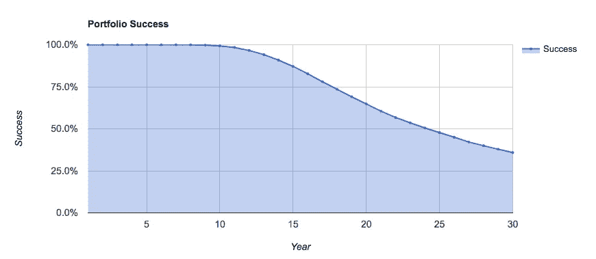
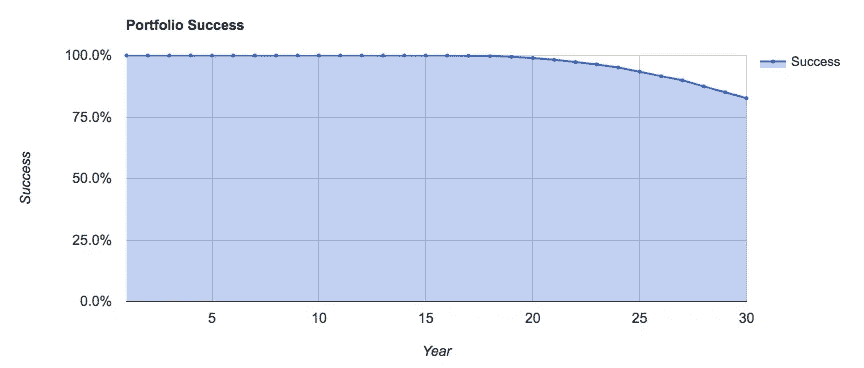

# 退休时平均回报率 6%怎么会把钱用完？

> 原文：<https://medium.datadriveninvestor.com/how-can-i-run-out-of-money-if-i-earn-6-average-return-in-retirement-4407d9d9bb01?source=collection_archive---------5----------------------->

Photo by [Harli Marten](https://unsplash.com/photos/M9jrKDXOQoU?utm_source=unsplash&utm_medium=referral&utm_content=creditCopyText) on [Unsplash](https://unsplash.com/search/photos/retirement?utm_source=unsplash&utm_medium=referral&utm_content=creditCopyText)

这是我最近收到的一个很棒的问题。

这里做大量工作的关键词是“平均”。但是让我们打开包装。

假设你 65 岁，准备退休。你期望再活 25 年，直到 90 岁，需要每年 9 万美元(税前)才能过得舒服。

让我们假设你从社会保障福利中得到 30，000 美元。这意味着 60，000 美元必须从你的退休储蓄中拿出来。为了简单起见，假设你准备退休时已经存了 100 万美元。

 [## 为什么数据将改变投资管理——数据驱动的投资者

### 有人称之为“新石油”虽然它与黑金没有什么相似之处，但它的不断商品化…

www.datadriveninvestor.com](https://www.datadriveninvestor.com/2019/01/25/why-data-will-transform-investment-management/) 

当一个顾问说每年平均有 6%的回报时，你会说:

“完美！100 万美元的 6%可以让我每年得到 6 万美元。我们准备好了，因为我不会把钱花光。我可以把剩下的本金留给我的受益人。

对吗？"

不完全是。缺少了一些东西:通货膨胀和可变性。

通货膨胀会带来很大的影响

如果我们假设未来 25-30 年的通货膨胀率为 2.5%，那么当你开始退休时，你需要的 60，000 美元相当于你 90 岁时的 111，000 美元。

下图显示了你的投资组合余额。随着你开始从投资组合中提取越来越多的资金以跟上通货膨胀，这条曲线开始快速下降。

当你 85 岁，也就是退休 20 年的时候，你的投资组合余额会下降到大约 45 万美元。在你 90 岁的时候，你的投资组合余额将会下降到不到 10，000 美元。这意味着这笔钱将在整整 25 年内用完(曲线为零)。

如果你仍然精力充沛，身体健康，比原计划多活几年呢？

实际上，到你 88 岁(第 23 年)的时候，情况可能会变得可怕，那时你的投资组合余额刚刚超过 20 万美元。尤其是考虑到通货膨胀因素，你每年将会提取 11 万美元。

当然，通货膨胀率可能低于 2.5%，但如果更高呢？如果我们假设通货膨胀率为 3 %,这就是图表的样子。

在这种情况下，这笔钱会在你退休 23 年后用完，也就是你 88 岁的时候。

这只是通货膨胀的一部分。如果你还记得的话，我在这篇文章开始时说标题中的“平均”这个词做了很多工作。

现实是，没有一项简单的投资(至少现在)能让你在 25 到 30 年内获得 6%的回报。任何投资都会有可变性。

**可变性的影响**

我说的可变性是什么意思？你的年度投资组合回报可能是这样的:

18%，7%，-25%，30%，15%，0%等等…

它可能最终“平均”达到每年 6%，这是通常所说的。但是正如你所看到的，你不可能每年都得到 6%的回报。

举个例子，一个“平衡的”60/40 投资组合* (60%投资于全球股票，40%投资于债券)在 2004 年至 2018 年的 15 年间，平均年回报率**接近 6%。

然而，这伴随着显著的可变性。最高的年回报率是 22%(2009 年)，最差的一年是 2008 年，投资组合损失了近 25%。这个 60/40 投资组合的统计可变性，或者熟悉统计的人的标准偏差，几乎是每年 9%。

可变性造成了巨大的差异。

让我们回到之前的练习，说明如果你每年提取 60，000 美元(并调整 2.5%的通货膨胀)，100 万美元的退休可以持续多长时间。我们仍将假设 6%的平均回报率，但现在引入每年 9%的变异系数。

包含可变性的一个问题是，我们不能像以前那样得到一个简洁的答案。问题是特定的回报序列可能看起来像

18%，7%，-25%，30%，15%，0%等等…,

而另一个可能是

20%，-18%，7%，0%，4%，10%等等。

所以我们用计算机模拟得出 10，000 个这样的序列。然后我们计算成功序列的数量——这些序列中的钱持续到退休。这给了我们一个“*成功概率*，即成功序列数除以 10，000。

让我们来看看这种情况下的“成功概率”图，而不是投资组合平衡图(如下所示)。它告诉你的是，在 10，000 个序列中，只有 4，106 个序列的资金持续了 25 年(当你达到 90 岁时)，即 41.06%的成功概率。只有在 2417 个序列中，投资组合经历了 30 年的撤回——成功概率为 24.17%。

事实上，如果你再看一遍图表，你会发现只有 70%的可能性这笔钱能持续 20 年(85 岁)。

这就引出了一个问题:如何提高成功概率？达到 80-90%左右是最理想的，更不用说 100%了！

**提高成功几率**

一种方法是扩张以获得更高的回报。问题是，这可能只会出现在更激进的投资组合中，一个有更多可变性的投资组合。

2004 年至 2018 年*的 15 年间，全球股票投资组合的平均年回报率接近 7%。该投资组合中根本没有债券，因此每年的波动性飙升至 14.5%。最高的年回报率是 33%(2009 年)，最差的一年是 2008 年，投资组合损失了近 41%。

但是为了便于说明，让我们试试这个。

其他一切都和之前一样。但我们假设平均回报率为 7%，而不是 6%。并将变异系数从 9%增加到 14.5%。

如下图所示，情况几乎没有改善。活到 90 岁(25 岁)而不缺钱的概率现在是 47.76%，这意味着 10000 个序列中有 4776 个成功。

我就省去你向上滚动的麻烦了。早了 41.06%。

这个投资组合在 30 年内成功的概率是 35.9%。这比我们之前看到的 24.17%要好，但很难让人感到安慰。

好消息是还有一些事情在你的控制之下。

1.  取款金额。
2.  退休开始时的储蓄总额。
3.  后来退休了。

让我们假设你稍微缩减退休生活开支，每年只拿出 50000 美元，而不是 60000 美元。这相当于每月少花 833.33 美元。

此外，让我们将最初的退休储蓄投资组合提高到 125 万美元。也就是说，在你工作的几年里，你可以多存 25%的钱。

我们重新运行一切，但回到稍微保守一点的投资组合假设:6%的平均回报率，每年 9%的可变性。

结果如下。这笔钱一直运行到 90 岁(25 岁)的概率攀升至 93.4%。

这笔钱持续到退休后 30 年的概率是 82.65%。当然不是 100%,但情况已经好多了。

显然，我们可以尝试其他几种组合。比如保持 60，000 美元的提取额，并进一步增加退休储蓄。或者两三年后退休。

我们甚至可以进行“压力测试”,比如:如果通货膨胀率是 3%而不是 2.5%会怎么样？

然而，主要的想法是，除了浪费投资回报本身(这在很大程度上不在我们的控制范围内)，我们还可以做更多的事情。

比如存更多的钱以确保退休金更大，或者削减开支以增加成功的几率。

***脚注***

**平衡 60/40 投资组合:标准普尔 500 指数 33%，摩根士丹利资本国际 EAFE 指数(net)21%，摩根士丹利资本国际新兴市场指数(net)6%，彭博巴克莱美国综合指数 40%。*

*全球股票投资组合:55%的标准普尔 500 指数，35%的摩根士丹利资本国际 EAFE 指数(净值)，10%的摩根士丹利资本国际新兴市场指数(净值)。*

*投资组合在 2004 年 1 月至 2018 年 12 月期间每月进行再平衡。*

*退货数据依赖于假设指数，不包括所有费用和支出。回报假设所有股息的再投资。投资指数是不可能的，过去的表现也不能保证未来的结果。*

** *平均回报是指复合的年几何平均回报，而不是简单的算术平均回报。*

** *投资组合可视化工具用于本文中的所有模拟。不考虑税收、交易成本和其他费用。*