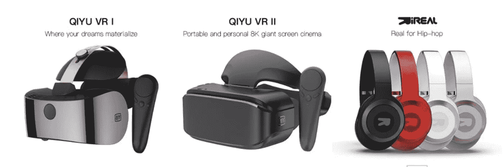
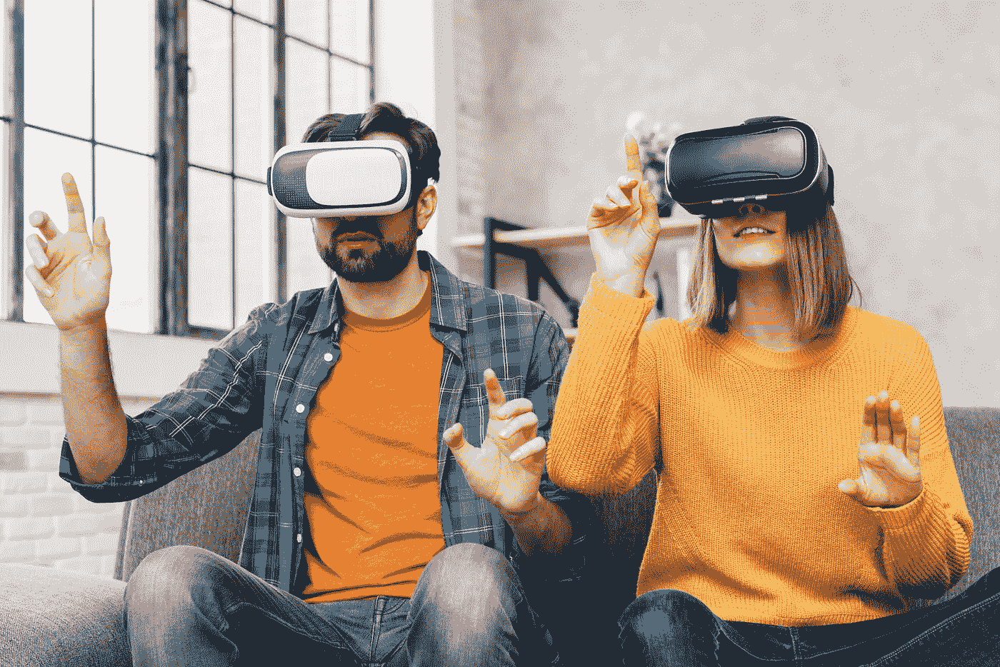
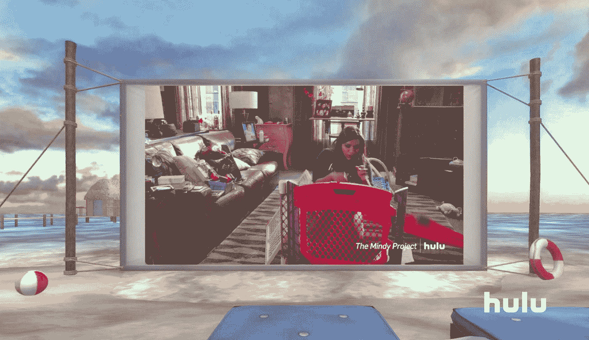
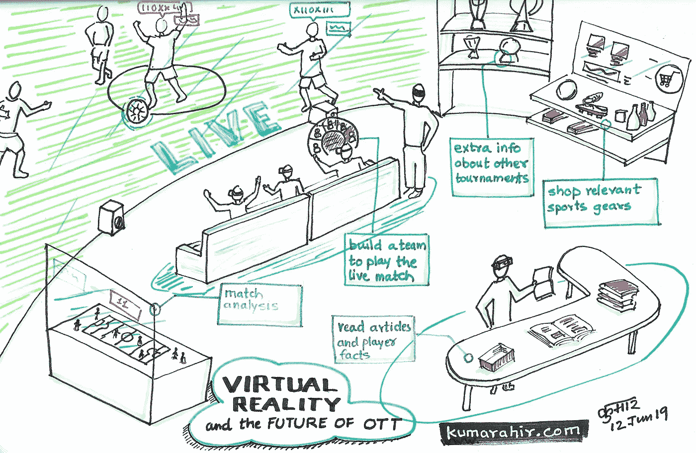

# OTT 如何用虚拟现实战胜下一个娱乐方式？

> 原文：<https://medium.datadriveninvestor.com/how-can-ott-trump-the-next-way-of-entertainment-with-virtual-reality-6a8d1e86a8c?source=collection_archive---------3----------------------->

## 虚拟现实将通过 OTT 平台和服务为下一个内容娱乐媒体铺平道路

虚拟现实作为一种媒介已经慢慢开始进入 OTT 领域，并有机会成为观众参与和内容分发的新方式，并提供更好的反馈。

 [## 人工智能和虚拟现实的融合-你能期待什么-数据驱动的投资者

### 在技术领域，融合是合乎逻辑的一步。就在几十年前，你可能需要一个专门的…

www.datadriveninvestor.com](https://www.datadriveninvestor.com/2018/08/30/the-convergence-of-ai-rv-what-you-can-expect/) 

OTT 公司要么将不得不依赖其他硬件制造商来分发 VR 头戴设备，要么将其作为他们服务的一部分。请记住，他们已经提供了机顶盒或宽带路由器来提供内容和服务。

## 最新— OTT 推出 VR 耳机

QIYU VR range

一年前，中国视频娱乐公司爱奇艺[发布了一款 4k 分辨率的 VR 耳机](https://www.vrfocus.com/2018/04/iqiyi-to-release-worlds-first-4k-vr-integrated-headset-with-8k-video-playback-support/)。作为服务订阅的一部分，它将赠送这款耳机，额外费用为 294 美元。嗯，不确定有多少会被选中，除非它的图表上有一些好的虚拟现实内容。然而，这将使爱奇艺以独特的方式与用户互动。对于一家专注于制作和分发娱乐节目的大公司来说，推出自己的 VR 头戴设备是一个新颖的步骤。

## OTT——内容场景

Originals Production content by different OTT players

许多像网飞、Hotstar、亚马逊这样的公司已经建立了自己的制作公司，以不同的格式向观众提供内容。我们还没有看到任何来自 TataSky、Airtel、Reliance JIO 电视台、Dish TV 等的品牌内容。但随着交付格式领域从碟形天线转向宽带互联网，从客厅转向任何移动设备，我确信这些基础设施公司将不得不与内容创作者密切合作，以提升他们的产品。

随着年轻人成为印度的主要人口，以及他们的人口统计数据和移动使用的变化，内容消费模式已经从客厅电视完全转变为移动电话。这些不断变化的内容交付和消费模式将推动人们接受新的虚拟现实媒体。

> 年轻观众对内容的参与和互动是由他们独特的行为驱动的，即渴望探索、社交分享和移动。

[LiveLikeVR](https://www.livelikevr.com/)

OTT 最重要的内容部分之一是体育，这使得它成为 OTT 上社交观众的一个很好的使用案例。在最近的一场板球比赛中，Hotstar 上的同时观看人数达到了近 1000 万。想象一下，如果这些观众中有 10%能够在虚拟现实中观看整场比赛，就好像坐在体育场内一样。

但是，内容观看仍然是坐以待毙。它现在被同时发生的许多其他活动所补充。比如在观看表演/电影/运动时点披萨，或者评论某个场景，或者提及某个场景中使用的某个产品，或者想要了解场景中使用的地方或材料的更多信息。

Hotstar 在技术探索方面处于领先地位，是印度第一家在虚拟现实中提供一些体育赛事的公司。虽然它是通过其 OTT 渠道提供内容的媒介，但它在构建整个内容生态系统的基础设施方面发挥着重要作用，以实现更好的交付、参与和体验，最重要的是创新的盈利模式。

## 面向 OTT 的虚拟现实

[https://www.freepik.com/free-photo/portrait-young-couple-touching-air-wearing-virtual-reality-glasses_4503162.htm](https://www.freepik.com/free-photo/portrait-young-couple-touching-air-wearing-virtual-reality-glasses_4503162.htm)

那么虚拟现实对 OTT 流媒体服务和公司有什么作用呢？虚拟现实提供身临其境的体验，提升品牌参与度。它允许内容分发商了解他们的体验模式，以便他们可以推送相关内容，并基于产品和服务的广告改善他们的盈利模式。观众也能以同样或更好的方式感受到演员在汽车展厅中的行走。这比仅仅展示展厅的照片或视频更有吸引力。作为观众，我可以暂停实际场景，在虚拟环境中直接体验产品。在这种情况下，广告不再是一种干扰，而是嵌入在故事情节本身中。

借助硬件，游戏发行公司可以让广告商提供独特的体验，这可能是 Vive 或 Oculus 等纯硬件公司无法实现的。想象一个场景，其中康卡斯特或网飞或塔塔斯基为 Oculus Quest 设备提供年度频道订阅，这使他们能够在广告的沉浸式环境中提供内容。或者嵌入了广告产品的虚拟现实内容，以供探索和购买。

TataSky 是 Dish enabled D2H，拥有约 1.2%的用户，相反，Hotstar 是唯一的互联网分发平台，拥有 7.5%的用户。因此，很明显，Hotstar 是一个通过其平台提供 VR 内容来升级游戏的合适平台。它有足够的杠杆和规模来试验这种新媒体，获得牵引力，并在未来树立其旗舰地位。

Hotstar 从一开始就是第一家移动公司，其主要内容由个人观众在这个平台上观看。这使得它成为首先在移动设备上分发 VR 内容的 apt 公司和渠道(如果与移动 VR 耳机一起使用，则部分是 VR 设备)，然后通过 Oculus Quest 或 HTC Vive focus 或 Valve Index 等房间规模的 VR 设备。

当前形式的虚拟现实硬件可能会被误解为更像一种游戏设备，但它肯定也是一种丰富的媒体消费设备。而网飞的竞争对手 Hulu 更了解这一点。

另一方面，YouTube 默默地增加了查看 360 个视频内容的惊人列表的功能。360 视频可以在它的移动应用程序以及 Oculus Go、Rift 和 Quest 设备上的 VR 应用程序上看到，这使它成为实验内容分发和测试平台中最强的玩家。

## 一个明显的假设场景

想象一下，看一部像《达文密码》这样的古代神秘惊悚片，它在电影中呈现了不同的事实，观众想了解更多关于这个地方或书或遗迹的信息。有了虚拟现实，观众可以参观这个地方，环顾四周，更有意义，或者观看 3D 的密码筒及其工作。

Sketchfab model of Cryptex

通过嵌入适当的货币化模型，这些艺术品可以直接从体验中购买！

Conceptual Rendering of VR OTT setup

## 最终拍摄

> 这么多小时的编程要铺开，内容游戏才刚刚开始。这为更大规模和更高质量的内容奠定了基础，使 OTT 行业的未来一片光明，正如亚马逊印度 Prime Video 内容总监兼主管 Vijay Subramanium 所总结的那样，“客户对娱乐有着巨大的需求。印度的流媒体视频领域正在快速发展，这主要是由移动宽带的增长、较低的数据费用以及对数字媒体生态系统的大量投资所推动的。流媒体行业的未来看起来很光明。”—摘自[交易所 4Media](https://www.exchange4media.com/digital-news/2018-a-turning-point-for-original-content-on-ott-92458.html)

# 挑战

**虚拟现实耳机**并不是每个人都能买到，因为这种媒体在消费者领域仍处于萌芽阶段。这也是爱奇艺向其客户提供 VR 耳机的主要原因。

**VR 硬件人体工程学**不太适合长时间观看，让体验不舒服。移动 VR 耳机正被瞄准以达到规模，但这些低成本的耳机在使用 30-45 秒后会产生恶心的感觉。好一点的真的很贵(大约 200，000)并且需要一个完整的房间设置。

**存储和分发基础设施**是 4k 内容的 4 倍，这使得运营成本飙升，制片公司难以为继。 [Star India 在支持这种媒体方面迈出了真正的一步。](https://www.fortuneindia.com/technology/hotstars-vr-venture-novelty-or-game-changer/101726)哦，当流量激增时(1000 万人同时观看)，基础设施的扩展成为主要障碍。

**移动互联网速度**不够快，无法直播内容。这是现场体验这项运动的一大挫折。体育赛事最大的吸引力之一就是现场观看。即使是像短片这样的其他类型的内容，在播放前下载也是雪上加霜。流式传输 360 视频的繁重负载(大小是普通视频的 4 倍)需要稳定快速的互联网连接。5G 互联网将成为这里的救世主。

**内容**专为观众沉浸和参与而设计和打造。目前的一系列内容都是按照一个拍摄角度拍摄的。有了新的格式，导演需要制作吸引观众的内容，而不是让他们感到困惑。

**独特的观看界面**在采用的道路上制造了一个小小的障碍。然而，随着客厅动态的变化，这可能被视为是暂时的。此外，该平台还构建了许多功能来支持社交活动。

## 参考

 [## Hotstar 的虚拟现实探索

blog.hotstar.com](https://blog.hotstar.com/in-case-you-didnt-hear-about-this-last-year-in-october-2016-we-launched-the-first-live-streaming-3acb1acdaa31)  [## Hotstar 的 VR 创业:新奇还是游戏改变者？

### 这并不是 Hotstar 的第一次 VR 体验。它以立体 3D 虚拟方式直播了 2016 年卡巴迪世界杯比赛…

www.fortuneindia.com](https://www.fortuneindia.com/technology/hotstars-vr-venture-novelty-or-game-changer/101726)  [## 2018 OTT-exchange 4 media 上原创内容的转折点

### 据说网飞每年为印度原创内容投入 600 卢比，亚马逊投入 2230 卢比…

www.exchange4media.com](https://www.exchange4media.com/digital-news/2018-a-turning-point-for-original-content-on-ott-92458.html)  [## 设计腕表系列

### 从被动观众到主动玩家——我们如何让 VIVO IPL 成为一种更加激烈和引人入胜的体验？观看比赛…

blog.hotstar.com](https://blog.hotstar.com/designing-watch-n-play-256453f54e6a) 

[*Kumar Ahir*](https://www.kumarahir.com)*是沉浸式技术、产品设计、设计领导力和战略领域的独立顾问。他正在通过积极举办关于设计思维、AR 和 VR 设计、混合现实技术原型制作的研讨会，传播沉浸式技术和 UX 的设计。*

他的目标是为沉浸式技术创造一个更好的设计生态系统。

*在*[*【KumarAhir.com】*](https://www.kumarahir.com)*[*LinkedIn*](https://www.linkedin.com/in/kumarahir)*[*Twitter*](https://twitter.com/kernel_kumar)**

# **别忘了给我们你的👏！**

****