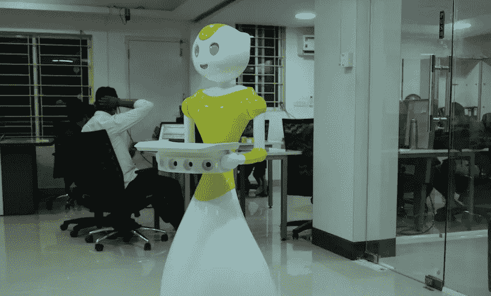

# 机器人如何提高工作效率，减少餐馆中的重复性工作？

> 原文：<https://medium.datadriveninvestor.com/how-can-robots-bring-more-productivity-reduce-less-repetitive-tasks-in-restaurants-d471fac15a?source=collection_archive---------12----------------------->

在过去的几十年里，各种行业已经慢慢过渡到机器人技术，餐饮业也不例外。

机器人技术的颠覆，尽管还没有完全成熟，但已经成为新闻。

在这个以激烈竞争著称的行业，急于获得最大业务是常事。因此，世界各地的餐馆都在努力削减成本，并推出各种手段来吸引顾客，为他们提供更好的用餐体验。

因此，在一点重新想象和人工智能的帮助下，这些公司正试图帮助餐馆以一种更“自动化”的方式实现他们的目标。

到目前为止，我们已经有了自动订购的药片和机器人手臂，它们可以通过编程选择最好的配料，做出美味的饭菜。

A service robot: Mitri can help restaraunt owners identify better opportunities among existing customer while attracting newer ones.

看完这一切绝对让人觉得厨师快灭绝了。然而，情况可能是这样的，因为餐馆继续大量雇用厨师。

主要原因还是顾客的选择。虽然有些人喜欢科技融合的用餐体验，但仍有很大一部分人喜欢由人类而不是机器来正确烹饪他们的食物。

在德国和瑞典等国家，机器人的采用率甚至远高于美国和中国，没有任何大规模失业的消息。《哈佛商业评论》(Harvard Business Review)的一份报告称，在 1996 年至 2016 年期间，这两个国家总共只损失了 19%的就业岗位。

这个事实有效地指出了一个事实，机器人绝对不会接管这个行业，让人们大规模失业。但是，他们将在这里合作和提高生产力，使菜单更智能，使用餐成为一种有趣的用户体验。

*原载于 2018 年 10 月 6 日*[*【www.mitrarobot.com】*](http://www.mitrarobot.com/how-can-robots-bring-more-productivity-reduce-less-repetitive-tasks-in-restaurants/)*。*