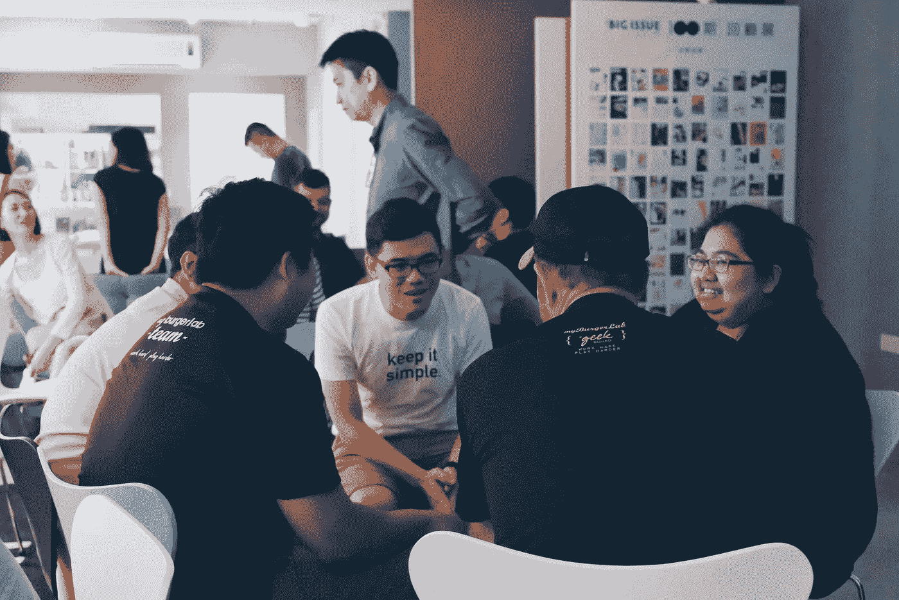

# 我们如何才能建立一个真正连接人们的社区？

> 原文：<https://medium.datadriveninvestor.com/how-can-we-build-a-community-that-actually-connects-people-9a83d28775f8?source=collection_archive---------14----------------------->

世界著名历史学家尤瓦·诺亚·哈拉里(Yuvah Noah Harari)在他的全球畅销书《智人》(Sapiens)中说，我们智人之所以能够主宰世界，是因为我们非常擅长两件事——讲故事和合作。

这些正是使我们能够彼此建立信任和联系的成分，这样我们就可以形成一个基于共同特征(如信仰、价值观或身份)的社区。

 [## 对于社区建设，游戏基于数据驱动的投资者

### 从任何意义上来说，珀尔·莫伯斯都是一个游戏玩家。一名活动家、艺术家、角色扮演者和社交媒体项目经理…

www.datadriveninvestor.com](https://www.datadriveninvestor.com/2018/11/16/for-community-building-game-on/) 

然而，随着世界的繁荣，更高水平的财富并不意味着更高水平的幸福。世卫组织表示，世界上每四个人中就有一个人会在一生中的某个时刻受到精神疾病的影响。

在[哈佛大学](http://www.miamiherald.com/living/health-fitness/article145098474.html)、[伦敦经济学院](http://www.lse.ac.uk/website-archive/newsAndMedia/newsArchives/2016/12/Relationships-and-happiness.aspx)和其他研究机构的研究一致认为，不幸福的根源在于缺乏有意义的关系。

为什么人口密度越大，我们就越孤立？我们可以做些什么来建立一个连接人们的社区？

# **为真实的讲故事创造一个安全的空间**

自狩猎采集时代以来，讲故事是一个社区不可或缺的基础，在那个时代，我们的祖先相互警告危险或分享统一的神话。

今天，讲故事是一座桥梁，帮助我们相互理解，庆祝我们的“人性”。当我们不再需要“完美”时，我们就能创造一个安全的空间去拥抱不完美和挣扎，这是个人发展的自然部分。

在布伦·布朗的 TED 演讲“脆弱的力量”中，她揭示了我们所有人在生活中的某个时刻都会默默地经历的“羞耻”，指出真正的联系是建立在脆弱、不完美和破碎的空间中的。

当我们不加判断地接受恐惧和失败时，我们会在脆弱的空间相遇，并看清彼此的真实面目。然后，我们能够以同理心化解分歧，创造一个包容那些看不同事物、吃不同食物、说不同语言、过不同生活的人的社区。

# **让每个人都有发言权**

2018 年，28 岁的越南裔美国人阿曼达·阮(Amanda Nguyen)被提名诺贝尔和平奖。她有一个从悲剧开始的捍卫社会正义的令人信服的故事。

当阿曼达在 2014 年被强奸时，她意识到从法律的角度来看，强奸犯比她更有权利。那时，她有一个选择——遵守法律或改写法律。作为一名 23 岁的女性，她与性侵幸存者群体并肩作战，并使该法律获得一致通过。从那以后，她创立了 [RISE](https://www.risenow.us/) ，这是美国最成功的立法改革运动，在 21 个月内通过了 21 项法律。

阿曼达的名言是“你的声音是你拥有的最强大的工具”。在 RISE 中，他们为社区成员赋权的第一步是叙事训练。

讲述我们自己的故事只是等式的一半。同样重要的是，给我们生活中的所有事件赋予积极的意义，将奋斗转化为力量，这样我们就可以用我们的故事让更多的人拥有自己的故事。

正是在我们分享的故事中，我们定义了我们的集体意义和身份，培养了一种归属感，在这种归属感中，我们可以在他人身上看到自己。

# **促进共同创作和分享经验**

在 TED 演讲[“孤立是梦想杀手，而不是你的态度](https://www.youtube.com/watch?v=H2rG4Dg6xyI)”中，芭芭拉·谢尔强调没有疯狂的目标或愚蠢的梦想。当我们聚在一起分享我们的梦想和障碍时，很有可能有人知道谁能让事情发生。

想一想，有没有一个公司，一个运动，或者一个产品是靠一个人的努力建立起来的？

用科学术语来说，马特·里德利说，“人类的成就基于集体智慧——人类神经网络中的节点就是人本身。通过每个人做一件事并变得擅长，然后通过交流分享和结合结果，人们变得有能力做他们甚至不理解的事情。"

WEF 社会参与团队的负责人表示，为了实现一个目标而一起做一些事情会创造共享的经历，这是在不同背景的人之间建立联系的一种强有力的方式。在艰难的挑战中，有一个与其他人一起克服某些东西的因素，它加速了友谊和信任的发展。

# 为了改变你的世界，你愿意冒什么样的风险？

每一个社区，每一个创造，每一次互动的存在都是为了做一件事:让改变发生。

当我们与社区中的其他人发展深厚而有意义的关系时，它会增强我们的情绪状态和整体幸福感，这样，我们就创造了一个与社区成员合作并支持他们的空间，从而取得比我们任何一个人单独完成的都要多的成就。

圣雄甘地曾经说过，“成为你想看到的改变”。

作为一个个体，我们应该认识到我们的力量，并利用它来创造我们自己也想成为其中一员的社区。

***大家好，我是《拥有你的故事的艺术*** ***》一书的作者伊莎贝，我写的是关于有意识的生活和个人成长，建立了一个名为“拥有你的故事”的播客。可以跳上***[***www.isabellethye.com***](http://www.isabellethye.com)***阅读更多文章。***

如果你喜欢你所读的，你的掌声对我来说意义重大！谢谢:)