# 怎样才能导出一个低维空间？

> 原文：<https://medium.datadriveninvestor.com/how-can-we-derive-a-low-dimensional-space-f94d35b15529?source=collection_archive---------1----------------------->

> 这篇文章是出于教育目的的论文综述。

Photo by [NASA](https://unsplash.com/photos/_SFJhRPzJHs?utm_source=unsplash&utm_medium=referral&utm_content=creditCopyText) on [Unsplash](https://unsplash.com/?utm_source=unsplash&utm_medium=referral&utm_content=creditCopyText)

在这篇文章中，我们将看看如何通过将高维数据简化为低维数据来高效地进行数据分析。

分析高维数据的一种方法是将数据转换到低维空间。如果我们创建一个反映高维数据特征的低维空间，那么分析数据会更容易。

 [## 描述性统计与推断性统计。有什么区别？-数据驱动型投资者

### 想象一下。你拥有一家餐馆，想知道人们对你的生意有什么看法。所以，你给一个…

www.datadriveninvestor.com](https://www.datadriveninvestor.com/2019/02/28/descriptive-vs-inferential-statistics-whats-the-difference/) 

> 我们能得到这些功能吗？如果有，我怎么得到？

我们将在本帖中介绍一个答案。本文介绍了“通过学习不变映射进行降维”，并于 2006 年由计算机视觉和模式识别(CVPR)引入。虽然这是一个有点老的概念，但这项研究可以被视为数据降维技术发展的一个进步。

本文的主要贡献如下

1.  我们只把高维数据映射到只有相邻数据信息(如类标签)的低维空间。
2.  使用了学习机(比如 CNN)，所以测试中不需要重新训练参数。
3.  您还可以学习非线性变换的不变函数，如光照变化和几何失真。(其实这是我们生活在深跑时代显而易见的)

让我们看看映射到低维流形(或子空间)的对比损失，同时反映数据的特征。

我们将把映射到低维流形的映射函数定义为 *G* ，假设用 *W* 参数化。我们的主要目标是训练一个参数( *W)* of *G* ，该参数将一组高维输入映射到低维流形。

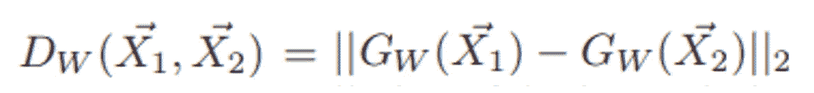

**Equation 1.** Relationships between points represented by Euclidean distances on the manifold

也就是说，定义为流形上的欧几里德距离的等式 1 应该反映输入数据的语义相似性。

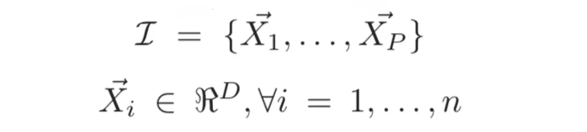

**Figure 1.** Independently sampled D-dimensional data set

**Figure 2.** Dimensionality reduction performed by the mapping function *G*_w

首先，构建一个数据集，如图 1 所示。输入数据集的维度是 *D* 维度，我们的目标是将 *D* 维度的数据集映射到 *d* 维度的空间，如图 2 所示。

> 从高维空间到低维空间的有意义的映射将相似的输入向量映射到输出流形上的附近点，将不相似的向量映射到远处点。

然后我们设计一个降维损失函数如下。

我们构建数据对，如上面的 *I* 所示。基于这些对的关系，我们学习在低维空间中构造有意义的子空间。数据对的关系是基于欧几里德距离定义的，如等式所示。(2).

**Equation 2.** Data pair relationship defined based on Euclidean distance

因此，总损耗函数由等式给出。(3).Y 是二进制信号，其中如果两对标签相同，Y = 0，否则 Y = 1。L_S 是一对相似点的部分损失函数，L_D 是一对相异点的部分损失函数。

**Equation 3.** Contrastive loss function

L_S 和 L_D 的设计必须使 L 相对于 W 最小化，从而导致相似线对的 D_W 值较低，不同线对的 D_W 值较高。

> 我们可以将最终损失函数改写为等式。(4).在 Eq 中。(4)具有相同标签的对相互吸引并且标签被学习，使得其他对相互远离。

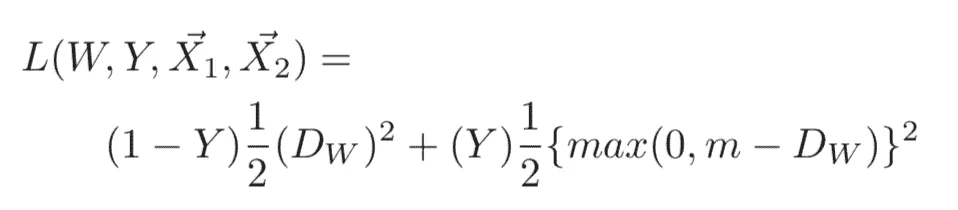

**Equation 4\.** Exact loss function

情商的作用。(4)如下所示。红色虚线表示标签相同时的部分损耗(L_S)，蓝色实线表示标签不同时的部分损耗(L_D)。

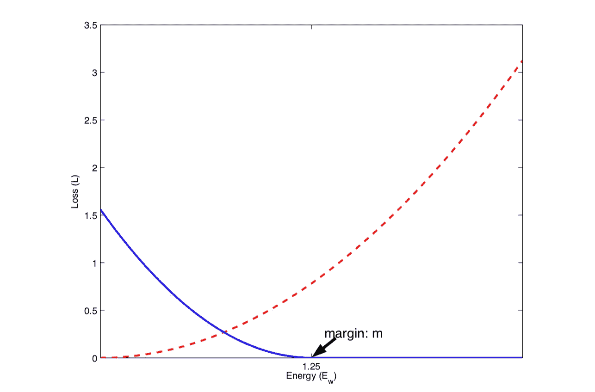

**Figure 3\.** Graph of the contrastive loss function (L)

让我们仔细看看图 3。L_S 的微分值如等式所示。5，并且数据对的距离越大，惩罚越大。也就是学会让两个数据对相互靠近。

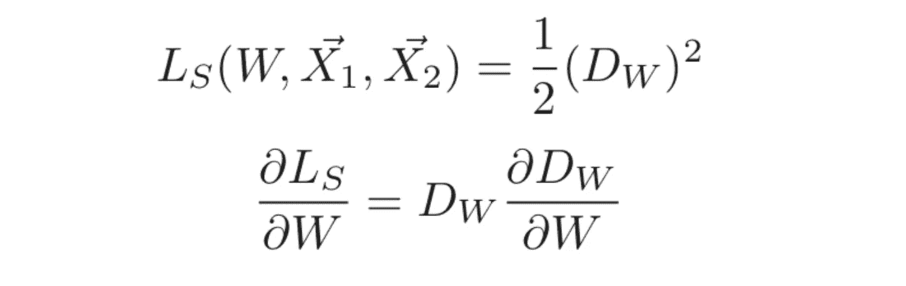

**Equation 5.** Partial loss function of similar pairs

L_D 的导数值如等式所示。(6)，并且数据对的距离越小，惩罚越大。但是，如果数据对之间的距离超过裕度值( *m* )，则不会给出惩罚。此外，由于(-)符号，等式。(6)作用方向与等式相反。(5).

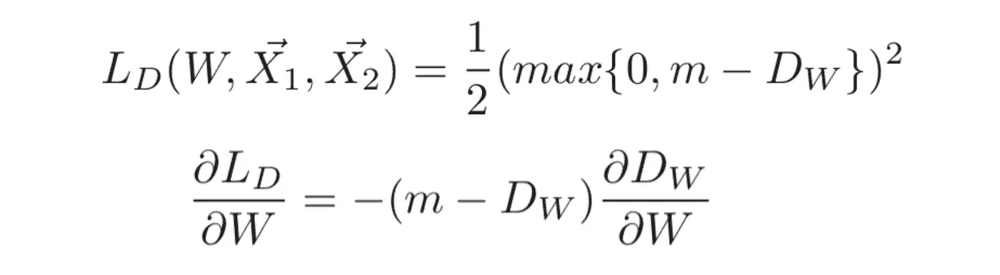

**Equation 6.** Partial loss function of dissimilar pairs

图 4 显示了部分损失函数对样本的影响。

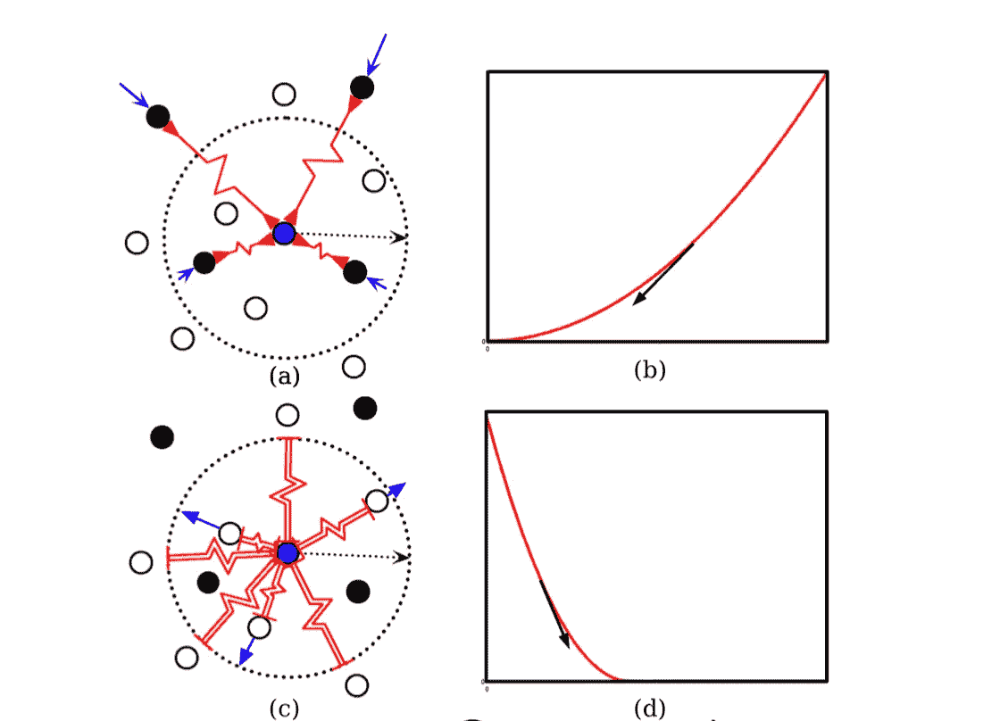

**Figure 4.** Analysis of contrastive loss function

图 5 显示了上述学习过程的整体算法。

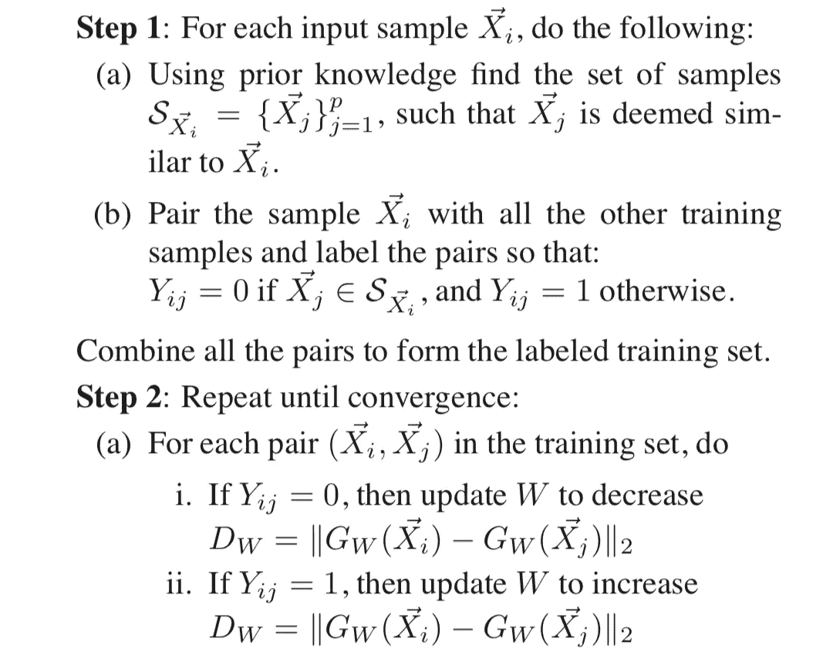

**Figure 5.** Overall algorithm

现在我们来看实验部分。实验中使用的网络是卷积神经网络(CNN)。它由两层卷积层、两层子采样层和全连接层组成。这个时候，他们并没有像现在这样使用高效的随机梯度下降方案。

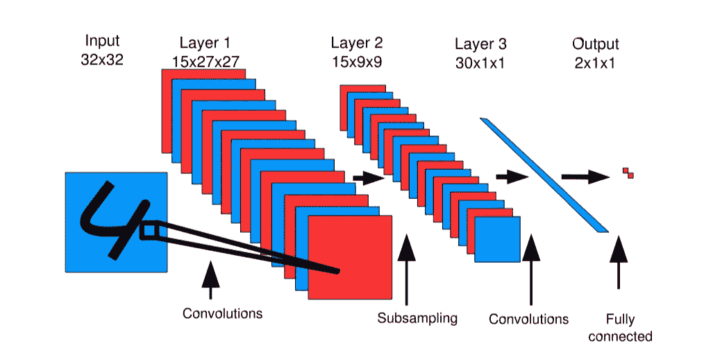

**Figure 6.** Architecture of the proposed method

图 7 显示了 MNIST 数据集中 2D 流形(或子空间)上的“4”和“9”标签的数据。这是一个即使观看也很难区分的数据集。

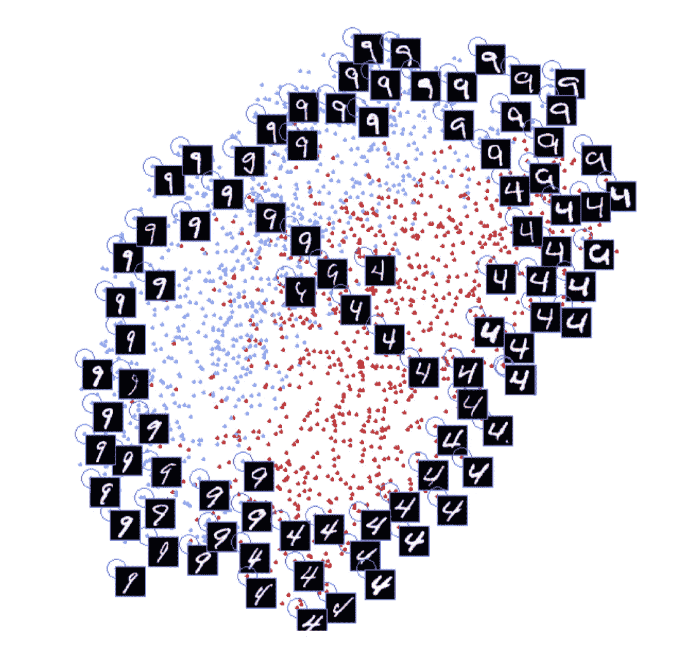

**Figure 7.** Experimental result of 2D manifold on MNIST.

图 8 显示了通过在 2D 流形上的 MNIST 数据集中在水平方向上平移对应于“4”和“9”标签的数据而获得的数据。正如所预期的，对应于“4”和“9”标签的样本彼此远离，而小的翻译样本彼此靠近。

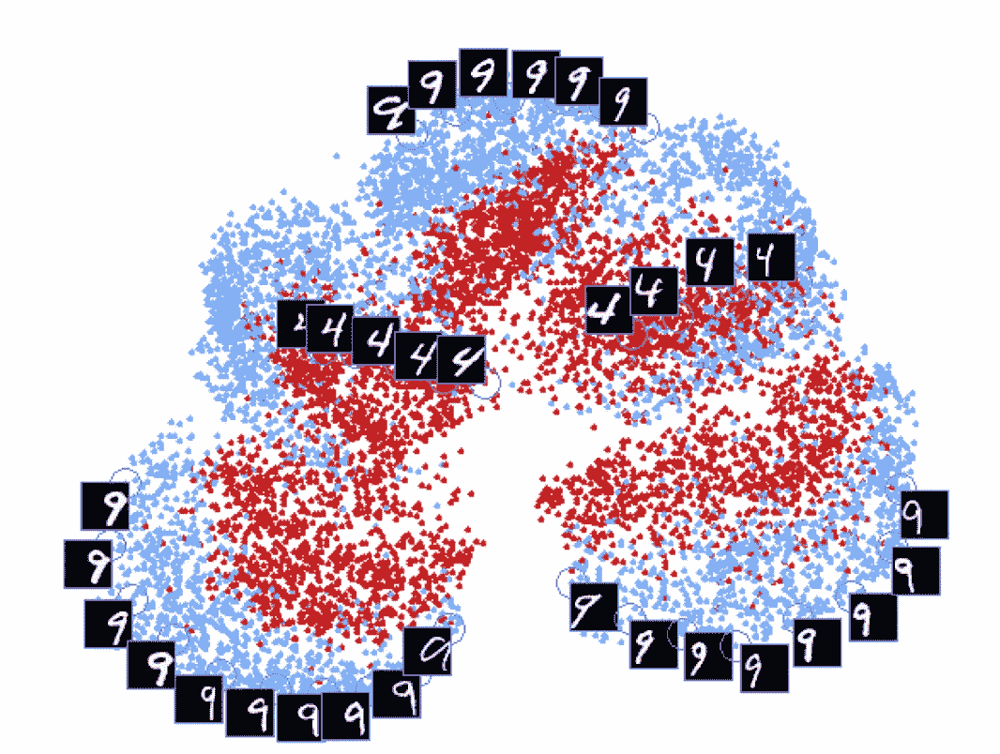

**Figure 8.** Experimental result of small translation on MNIST

以下是将基于 NORB 数据集的 3D 流形上的结果与 LLE(局部线性嵌入)进行比较的结果。对比损失井表示数据集的方位角和 3D 流形上的相机仰角。然而，在 LLE，不可能在流形上表达数据的特征，并且可以检查过度装配照明的结果。

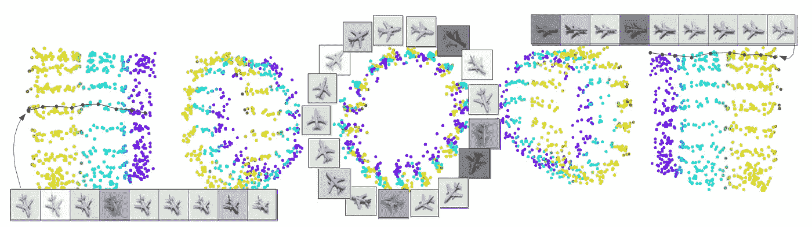

**Figure 9.** Experimental results of proposed method on 3D manifold

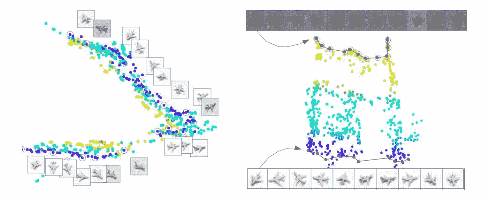

**Figure 10.** Experimental results of LLE method on 3D manifold

通过这篇文章，我们看到了如何根据数据样本的关系来降低维度。根据类别标签学习数据样本关系的对比损失是在*深度度量学习*中用作基线的代表性技术。

最后，对比损失的两个缺点可以说。第一，这个损失是基于欧氏距离学习的，这是一个非常基础的关系方法。第二，数据样本对的构造非常简单，并且对学习过程中的数据异常值敏感。

在未来，我们将研究其他深度度量学习技术。

## 参考

R.Hadsell 等人通过学习不变映射进行维数约简。在 *CVPR* 2006 年。**([http://yann . le Cun . com/exdb/publis/pdf/hadsell-Chopra-le Cun-06 . pdf](http://yann.lecun.com/exdb/publis/pdf/hadsell-chopra-lecun-06.pdf))**