# 我们如何使用聚类方法识别客户群？

> 原文：<https://medium.datadriveninvestor.com/how-can-we-identify-customer-segments-using-cluster-method-94a58ddba772?source=collection_archive---------1----------------------->

[](http://www.track.datadriveninvestor.com/1B9E)

# 1.介绍

对于许多公司来说，寻找目标客户是一项至关重要的任务。通过了解什么类型的人更有可能成为顾客，公司可以制定有针对性的广告策略，从而节省数百万美元。

幸运的是，我们可以使用聚类方法来识别客户群，然后确定我们的目标。通过对一般人群进行聚类，并将其与核心客户群分布进行比较，我们可以清楚地了解我们的客户是谁。

[](https://www.datadriveninvestor.com/2019/02/07/8-skills-you-need-to-become-a-data-scientist/) [## 成为数据科学家所需的 8 项技能——数据驱动型投资者

### 数字吓不倒你？没有什么比一张漂亮的 excel 表更令人满意的了？你会说几种语言…

www.datadriveninvestor.com](https://www.datadriveninvestor.com/2019/02/07/8-skills-you-need-to-become-a-data-scientist/) 

## 1.1 目标

目标是使用无监督学习技术来识别构成德国一家邮购销售公司的核心客户群的人群。

然后，这些细分可用于针对具有最高预期回报率的受众开展营销活动。所使用的数据由贝塔斯曼 Arvato Analytics 提供。

该项目的完整代码可以在[这里](https://github.com/haataa/Identify_Customer_Segments)找到。

## 1.2 数据

德国一般人口的人口统计数据记录在 Udacity_AZDIAS_Subset.csv 文件中，该文件包含 891211 人(行)x 85 个特征。

邮购公司客户的人口统计数据记录在 Udacity_CUSTOMERS_Subset.csv 文件中。其中包含 191652 个人(行)x 85 个特征(列)。

关于特征的信息记录在 Data_Dictionary.md 和 AZDIAS_Feature_Summary.csv 中。

# 2.数据 EDA

## 2.1 加载数据

```
# Load in the general demographics data.
azdias = **pd.read_csv**('./data/Udacity_AZDIAS_Subset.csv', sep=';')# Load in the feature summary file.
feat_info = pd.read_csv('./data/AZDIAS_Feature_Summary.csv', sep=';')
```

## 2.2 检查基本

我得到新数据的第一件事就是看一看。我使用以下命令。

```
# Check the structure of the data after it’s loaded.
# azdias data has shape (891221, 85)
print(azdias.**shape**)
print(azdias.**info()**)
# check first two rows
print(azdias.**head(2)**)
# check null number for each col
print(azdias.**isnull().sum()**)
# check feat_info data
print(feat_info.head(5))
```

从结果中，我可以看到数据存在一些缺失值问题。显然，每一列的值类型是不同的。

## 2.3 评估缺失数据

所以现在我开始处理缺失数据。缺失的数据有三个方面。

## 恢复丢失的值

请注意，缺少的值可能看起来并不“缺少”，某些值(如-1)可能表示某些列中缺少值。缺失信息存储在 feat_info 中，如下所示:

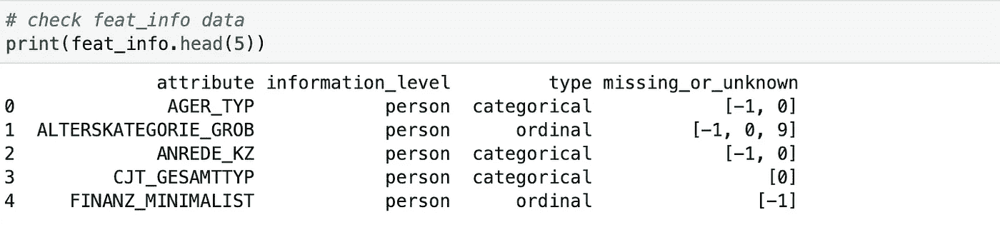

为了恢复丢失的值，对于每一列，我找到假定丢失值的行索引，并用 NA 替换该值

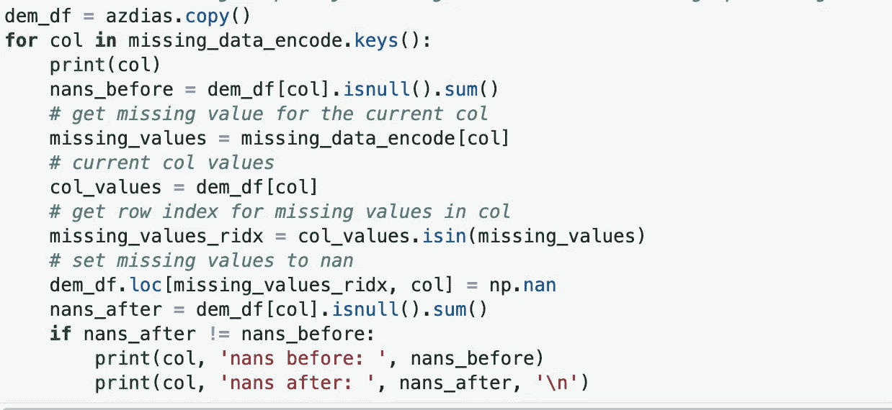

输出如下所示:

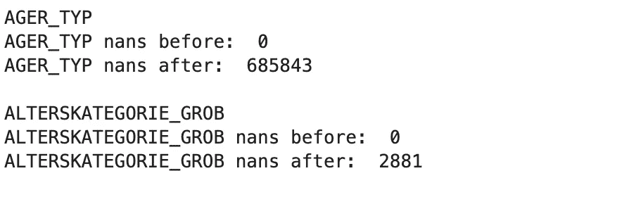

显然，一些列的缺失值只是峰值。完成这一步后，我就可以开始处理真正缺失的值了。

## 2.3.2 评估每一栏中缺失的数据

首先，我简单地检查了每一列的缺失情况。

```
col_miss_per = (dem_df.isnull().mean())
print(col_miss_per.describe())
```

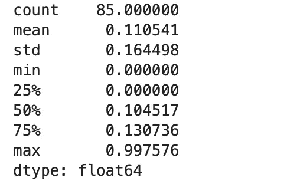

结果显示，平均有 11%的数据丢失。最大缺失率的列高达 99.8%。很明显，一些列的缺失值是奇怪的，最好删除掉。

接下来，我绘制丢失率直方图，以确定丢失率的正常值。

```
# plot histgram to visualize distribution of missing rate
plt.hist(col_miss_per.misspre)
```

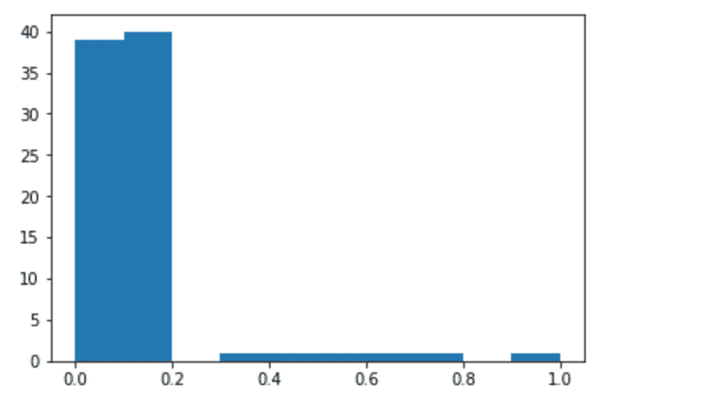

根据这个数字，我决定丢弃缺失率大于 20%的列。

```
# find colnames that have high missing rate
cols_remove = col_miss_per[col_miss_per.misspre > 0.2].colname
dem_df = dem_df.drop(cols_remove, axis=1)
```

## 2.3.3 评估每行中缺失的数据

类似于列中的缺失数据，我们绘制了行缺失率的直方图，并确定了高缺失率。然后我们将数据分成两组:丢失率低的行和丢失率高的行。

然后我们比较这两组，看看它们之间的列分布是否一致。如果是连贯的，丢弃那些高漏检率的行也是可以的。如果不是，特别关注这些数据可能是明智的。

```
# draw count plot to compare between two groups
def draw_compare(colname,dem_df_lowna,dem_df_highna):
    fig, axes = plt.subplots(1,2, figsize=(12, 3))
    ax1 = plt.subplot(1,2,1)
    ax1 = sns.countplot(dem_df_lowna[colname],color=’g’)
    ax2 = plt.subplot(1,2,2,sharey=ax1)
    ax2 = sns.countplot(dem_df_highna[colname],color=’r’)
    plt.show()

for col in common_col:
 draw_compare(col,dem_df_lowna,dem_df_highna)
```

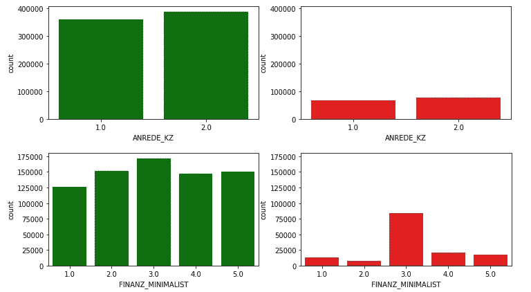

看起来两组之间的列分布确实不同。丢弃这些行可能会导致一些潜在的问题。

## 2.4 选择和重新编码特征

现在该处理**的分类**和**的混合型特征**了。对于数字和序数特征，我们可以保持不变。首先，我检查每个特征类型的数量。

```
# How many features are there of each data type?
# drop the dropped colunms
feat_info = feat_info[feat_info.attribute.isin(dem_df.columns)]
# group by type and count
feat_info.groupby(‘type’).attribute.count()
```

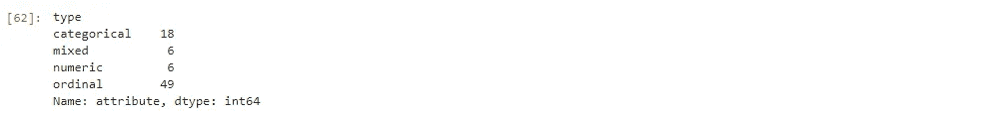

仔细看看分类特征，看看它们到底有多少个类别。

```
# Assess categorical variables: which are binary, 
# which are multi-level, and which one needs to be re-encoded?
col_cate_num = dem_df[feat_info[feat_info.type==’categorical’].attribute].nunique().sort_values()
col_cate_num = col_cate_num.to_frame()
col_cate_num.reset_index(level=0, inplace=True)
col_cate_num.columns = [‘colname’,’uniquen’]
col_cate_num[‘type’] = list(dem_df[list(col_cate_num.colname)].dtypes)
print(col_cate_num)
```

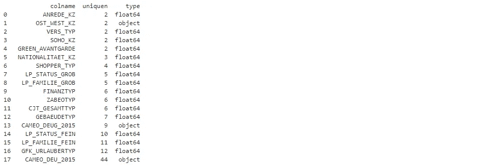

请注意，列“OST_WEST_KZ”是一个对象，这意味着我们需要将其转换为数值。

```
# re-encode OST_WEST_KZ
dem_df[‘OST_WEST_KZ’] = dem_df[‘OST_WEST_KZ’].map({‘O’:0,’W’:1})
# check value change
dem_df['OST_WEST_KZ'].unique()
```

然后我重新编码多类特征。

```
# function to one hot encoding categorical features
def cate_one_hot(df,colname):
    dummies = pd.get_dummies(df[colname])
    dummies.columns = [colname+str(s) for s in dummies.columns]
    df.drop(colname,inplace=True, axis=1)
    df = pd.concat([df, dummies], axis=1)
    return df# find multi-category columns
muti_cate_col = col_cate_num[col_cate_num.uniquen>2].colname
# one hot encoding for every multi category column
for cname in muti_cate_col:
    dem_df = cate_one_hot(dem_df,cname)
```

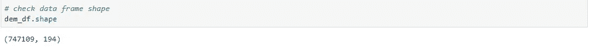

接下来，我们需要处理混合类型的特性。混合类型特征是包含多级信息的特征。最好将混合信息分解成独立的特征。

例如，功能“PRAEGENDE _ JUGENDJAHRE”包含两个级别的信息:十年和运动

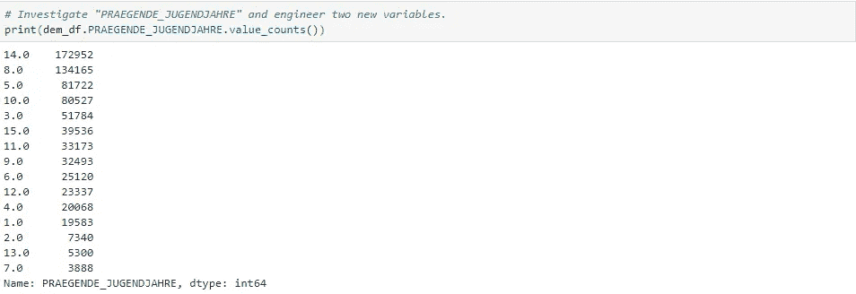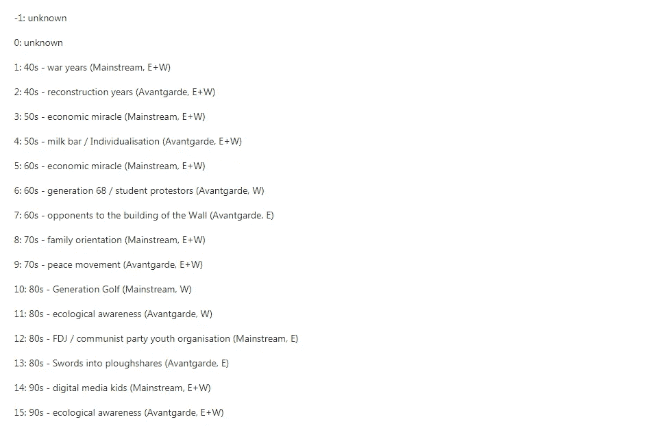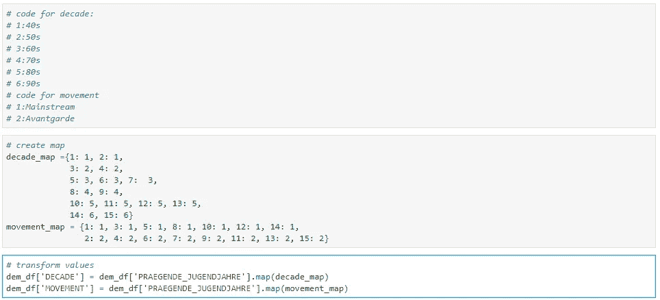

最后，我只需要将清洗过程包装成一个函数。

# 3.特征转换

在我们对数据应用降维技术之前，我们需要执行特征缩放，以便主成分向量不受特征在尺度上的自然差异的影响。

## 3.1 应用特征缩放

在我们开始之前仍然有 NA 值。我决定在输入 NA 值之前安装 scaler。好处是方差不会受到估算平均值的影响，估算平均值肯定会减少方差。

```
# computue possible scaling with temporarily removing missing values
scaler = **StandardScaler**()
scaler.fit(dem_df.dropna(axis=0))
# imput missing values with mean
imp = **Imputer**(missing_values=np.nan , strategy=’mean’, axis=0)
dem_impute = imp.fit_transform(dem_df)# Apply feature scaling to the general population demographics data.
# transform data with the fitted scaler
dem_scale = scaler.transform(dem_impute)
dem_scale = pd.DataFrame(dem_scale, columns=dem_df.columns)
dem_scale.describe()
```

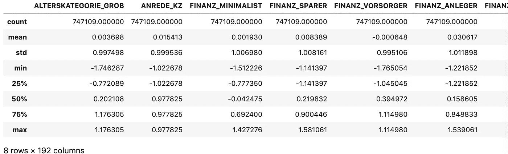

## 3.2 执行降维

现在是对数据应用主成分分析的时候了，从而找到数据中最大方差的向量。要了解可变性的总体趋势，需要计算所有组件。视觉效果如下所示。

```
# Apply PCA to the data.
pca = PCA()
dem_pca = pca.fit_transform(dem_scale)
# check components number should be the same as total features
components_total = len(pca.explained_variance_ratio_)
# generate sequence for plotting
components = np.arange(components_total)# Investigate the variance accounted for by each principal component.
fig, ax1 = plt.subplots(figsize=(15,5))ax1.bar(components,pca.explained_variance_ratio_)
ax1.set_ylabel('Explained Variance', color="blue")
ax1.set_xlabel('Number of Components')ax2 = ax1.twinx() 
ax2.plot(np.cumsum(pca.explained_variance_ratio_), color="red",marker='o')
ax2.set_ylabel('Cumulative Explained Variance', color="red")
plt.title("Cumulative Explained Variance vs No. of Principal Components")
```


由于前 50 个分量给出了 62%的总方差，我决定选择使用 50 个分量。

## 3.3 解释主要成分

现在是时候了解每个组件的含义了。首先，我们需要获得每个特征的分量权重。

```
def get_cpn_feat_wgt(pca,dem_scale,cpn_num):
    “””Give feature weight of n-th component of pca object

    Args:
    pca: pca object. The fitted pca. 
    dem_scale: data frame. Original feature data frame.
    cpn_num: int. n-th component.

    Returns:
    weight_n: data frame. Feature weight of n-th component.
    “””

    weights = pd.DataFrame(np.round(pca.components_, 4), 
    columns = dem_scale.columns)
    weight_n = weights.iloc[cpn_num — 1, :].sort_values()
    weight_n = weight_n.to_frame()
    weight_n.reset_index(level=0, inplace=True)
    weight_n.columns = [‘colname’,’weight’]
    return weight_n
```

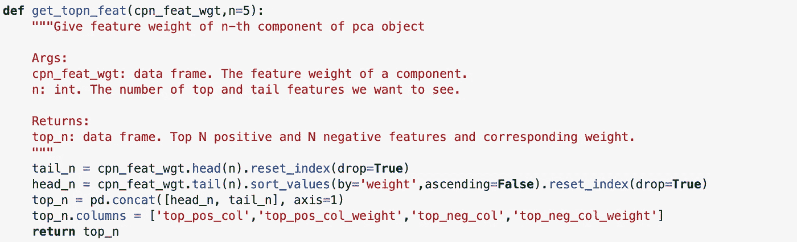

以第一个组件为例。以下是 5 大正面和负面特征。

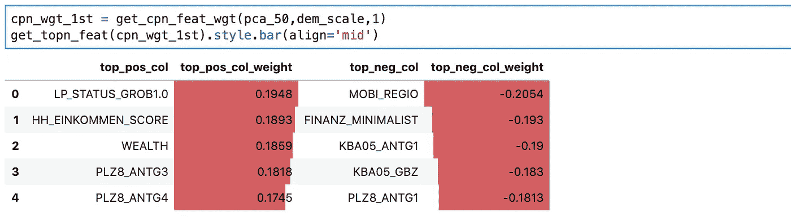

第一部分的前 5 个阳性结果是:

*   LP_STATUS_GROB1.0:低收入者
*   HH_EINKOMMEN_SCORE:估计的家庭净收入(1:最高收入，6:非常低的收入)
*   财富:家庭财富——工程(1:富裕家庭，5:贫困家庭)
*   plz 8 _ ant G3:plz 8 地区 6-10 户家庭住宅的数量(0:没有 6-10 户家庭住宅，3:6-10 户家庭住宅的高份额)
*   plz 8 _ ant G4:plz 8 地区 10+家庭住宅的数量(0:没有 10+家庭住宅，2:—10+家庭住宅的高比例)

第一部分的前 5 个负面因素是:

*   MOBI _ 区域:运动模式(1:非常高的运动，6:无)
*   FINANZ_MINIMALIST:财务类型— MINIMALIST:财务兴趣低(1:非常高，5:非常低)
*   KBA05_ANTG1:微小区中 1-2 户家庭住宅的数量(0:没有 1-2 户家庭住宅，4:1-2 户家庭住宅的比例非常高)
*   KBA05_GBZ:微蜂窝中的建筑数量(1:1–2 建筑；5: >=23 栋建筑)
*   plz 8 _ ant G1:plz 8 地区 1-2 户家庭住房的数量(0:没有 1-2 户家庭住房，4:1-2 户家庭住房的比例非常高)

因此，第一个要素是人口密度和收入。

# 4.使聚集

## 4.1 应用聚类

现在，是时候看看主成分空间中的数据聚类了。在这一步中，我将 k-means 聚类应用于数据集，并使用从每个点到其分配的聚类质心的平均聚类内距离来决定要保留的聚类数。

```
# For different cluster counts run k-means clustering on the data 
# and compute the average within-cluster distances to 
# select a final number of clusters
max_cluster = 20 
scores = {}
for i in range(2, max_cluster):
    # run k-means clustering on the data and keep the score
    print(i)
    scores[i] = np.abs(KMeans(n_clusters=i).fit(
                dem_pca_50).score(dem_pca_50))
```

然后根据 SSE 绘制聚类数。

```
# Investigate the change in within-cluster distance 
# across number of clusters.
fig, ax = plt.subplots(figsize=(16,10)) 
ax = pd.Series(scores).plot(marker=’o’, color=’slategray’)
ax.set_xticks(np.arange(2, max_cluster), minor=False);
ax.set_xlabel(“Number of Clusters”)
ax.set_ylabel(“SSE”)
```

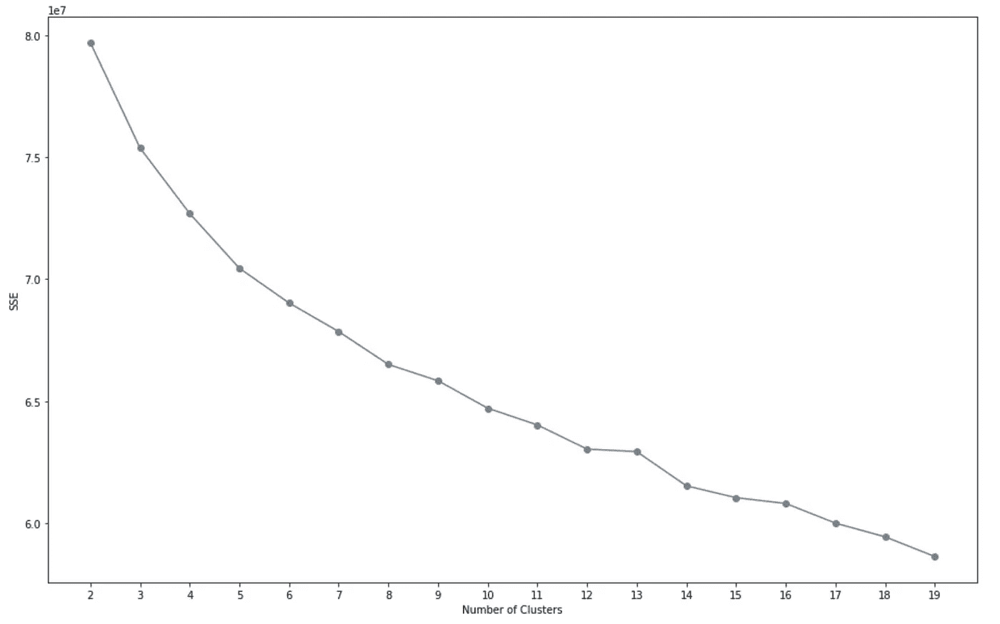

从这个图中，看起来 SSE 在 7 到 11 个集群的范围内下降。所以我决定使用 10 个集群。

**4.2 比较客户数据和人口统计数据**

现在考虑每个集群中的人在总体人口中所占的比例，以及在客户中所占的比例。

如果公司的客户群是通用的，那么两者之间的集群分配比例应该相当相似。如果只有特定的人群对公司的产品感兴趣，那么我们应该看到他们之间的不匹配。

```
def count_group(df, group_name):
    “””Compute the proportion of data points in 
    each cluster for the data

    Args:
    df: data.frame. The clustered data
    group_name: char. The name of the data 

    Returns:
    per_group: data.frame. The percentage of each group of the data

   “””
   per_group = pd.DataFrame(itemfreq(df[“labels”]),
               columns= [‘label’,’freq’])
   per_group[‘group’] = group_name
   per_group[‘freq’] = per_group[‘freq’]/per_group[‘freq’].sum()
   return per_group
```

在计算了聚类分布之后，我画了一个图

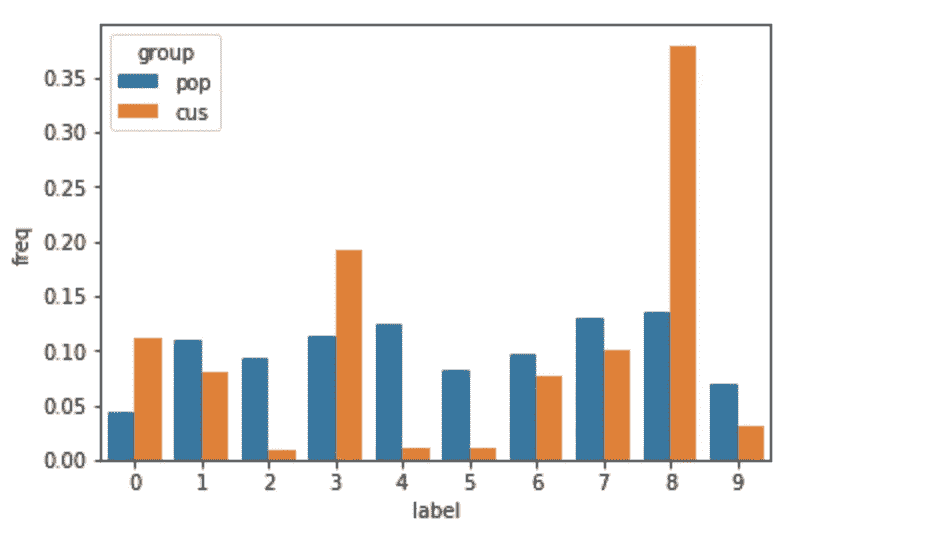

从该图中可以明显看出，普通人群和公司客户之间的聚类分布非常不同。为了看到每个聚类的不同，我画了另一个图。

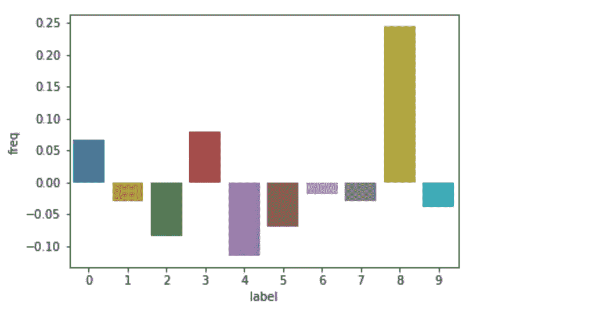

客户群过多地代表了第 8 类，而第 4 类代表不足。

为了查看群集 8 代表什么，我需要获得群集 8 的质心。

```
def map_cluster_to_feats(kmeans, df, cnum):
    ‘’’Map pca weights to individual features
    and return two pd.Series on with the highest
    positive weights and one with the lowest negative
    weights

    Args:
    kmeans: kmeans object.
    df: data frame. The pca data frame of original data.
    cnum: int. The n-th cluster.

    Returns:
    top_pca_feat: data frame. The top N positive and negative 
    pca features. 
    ‘’’

    # get coordinates of cluster centers
    weights = pd.DataFrame(np.round(kmeans.cluster_centers_, 4), 
              columns=df.keys())
    # the centroid of cluster cnum
    centroid = weights.iloc[cnum, :]
    # postive pca feature
    cent_pos = centroid[centroid > 0
               ].sort_values(ascending=False).to_frame()
    cent_pos.reset_index(level=0, inplace=True)
    cent_pos.columns = [‘top_pos_col’,’top_pos_col_weight’]
    # negative pca feature
    cent_neg = centroid[centroid < 0
    ].sort_values(ascending=True).to_frame()
    cent_neg.reset_index(level=0, inplace=True)
    cent_neg.columns = [‘top_neg_col’,’top_neg_col_weight’]
    # concat postive and negative
    top_pca_feat = pd.concat([cent_pos, cent_neg], axis=1)
    top_pca_feat[‘top_neg_col’] = top_pca_feat[‘top_neg_col’
                                  ].apply(str)
    top_pca_feat[‘top_pos_col’] = top_pca_feat[‘top_pos_col’
                                  ].apply(str)
    return top_pca_feat
```

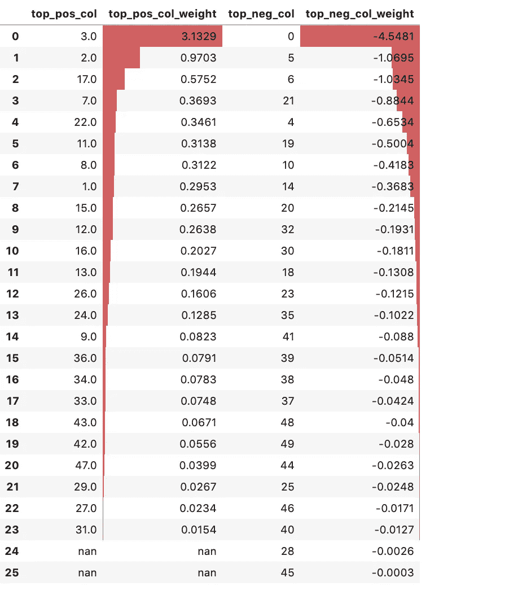

很明显，组件 3 和 2 具有最高的正效应，而组件 0 具有最高的负效应。

对于任职人数最少的群组:

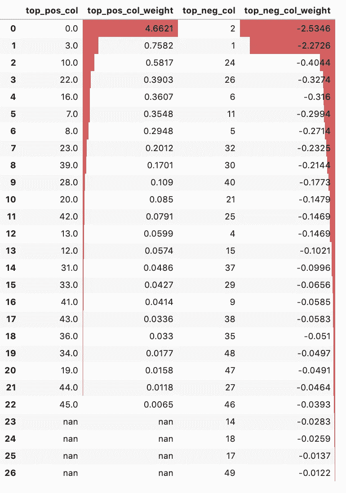

为了对我们的集群有一个直观的认识，我用两个重要的特征来描绘集群的分布:绿色前卫和金融极简主义。从下图可以看出，代表过多的群组 8 和代表不足的群组 4 沿对角线分布。这意味着，绿色先锋成员中财务状况较好的人更容易成为公司客户。

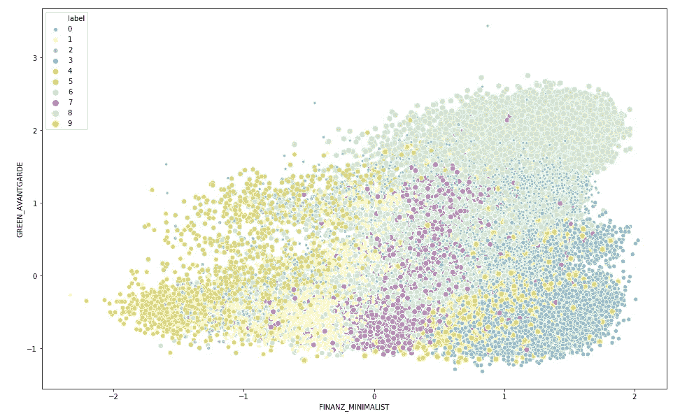

# 5.结论

从上面的结果可以明显看出，在过度代表的第 8 类人群中，第一个因素具有最大的负面影响，这意味着那些低流动性、居住在不太密集的地区、经济状况良好的人以及绿色先锋成员是目标用户。