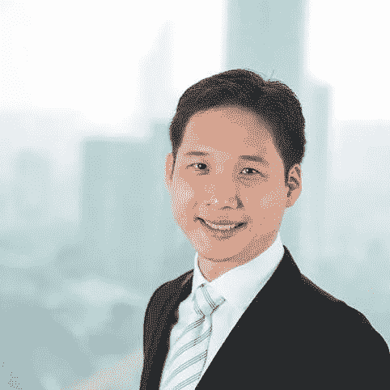

# “改变你的想法”如何改变你的生活

> 原文：<https://medium.datadriveninvestor.com/how-changing-your-mind-can-change-your-life-b3459e8a9811?source=collection_archive---------26----------------------->

为“拥有你的故事”播客采访 Jayshen 是一次有趣的经历，唤醒了我的极客意识。

从用电子游戏取代正规学习的意图到推动人类文明，选择这个“开箱即用”的大脑并了解他的思维过程是非常有趣的。

杰伊目前是初创企业的“商业心理医生”，他非常适合宣传他坚信的心态的重要性。

# **1|意向超过结果**

当我问杰伊，为什么他放弃了在一家跨国公司的高薪职业，转而投身于未知的创业领域时，他的回答令人震惊。

决定开始他的审计职业生涯是为了一个非常具体的目的——这样他就可以采访公司里的任何人，了解企业是如何运作的。

这反过来又有一个更深层次的目的——让他有一天可以建立一个用视频游戏取代正规教育的企业。

我很惊讶他的踏脚石花了很多年才做成。

# **2|你的心态如何为人类文明做出贡献？**

作为一名商业顾问，杰伊认为“心态”是一种催化剂，可以成就或摧毁一家企业。

如果一个企业家认识到有一些他们不知道的东西，这种心态将为他们节省时间和到达目的地的痛苦。

> 拉尔夫·瓦尔多·爱默生说:“思想一旦被新的思想所拉伸，就再也不会回到它最初的维度。”

当谈到他自己的主要心态变化时，杰伦说，当他问自己，“在我有生之年，我能为 1 型(行星)文明做些什么？”时，卡尔达舍夫等级[改变了他的世界观](https://en.wikipedia.org/wiki/Kardashev_scale)

# **3|投资自己的成长**

杰伊认为每个人都有不同的潜力来源，擅长不同的事情。

为了达到我们最高的表达，重要的是要经常问——对方知道什么我不知道的？

当我们的思想对新信息开放时，就有大量的机会从不同的角度了解我们自己和这个世界。

从杰伦自己的经历来看，在地面上工作的短暂时间和在艰苦的劳动中弄脏双手是从不同的角度看待生活的宝贵一课。

# **4|建立成功的企业并不意味着成功**

谈到“成功”，杰伊指出，对每个人来说，定义我们在生活中想要的成功是很重要的，因为它会随着时间和生活经历的变化而变化。

例如，一个年轻的专业人士可能将成功定义为年收入范围，而一个 60 岁的人可能将健康视为成功。

不管我们对成功的定义是什么，成功最重要的潜在特征是我们的声誉和正直。

归根结底，建立一个成功的企业并不意味着作为一个没有正确美德的人取得成功。

# **用正确的心态构建我们想要生活的世界**

生活在一个技术飞速发展的时代，对每个人来说，采用正确的思维方式比以往任何时候都更重要，这样我们才能以造福于所有人的方式来引导技术的应用。

无论我们的目标是什么，重要的是，我们要保持开放的心态，不断学习，以突破目前的地位，取得更好的结果。

***大家好，我是《拥有你的故事的艺术*** ***》一书的作者伊莎贝拉，我写的是关于有意识的生活和个人成长，建立了一个名为“拥有你的故事”的播客。你可以在这里听我采访 Jayshen*******，或者跳上***[***【www.isabellethye.com】***](http://www.isabellethye.com)***阅读更多文章。****

*如果你喜欢你所读的，你的掌声对我来说意义重大！谢谢:)*