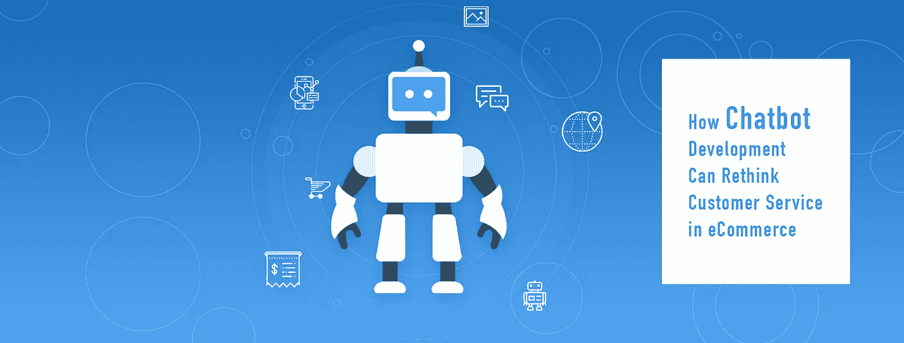

# 聊天机器人开发如何反思电子商务中的客户服务？

> 原文：<https://medium.datadriveninvestor.com/how-chatbot-development-can-rethink-customer-service-in-ecommerce-17f8249a2442?source=collection_archive---------41----------------------->

"你应该为电子商务制作你自己的聊天机器人吗？"

是的，我们说！

聊天机器人被誉为 2018 年及以后的电子商务趋势之一。显而易见，为什么零售商投入大量时间和金钱来构建一个聊天机器人，以重新想象他们的客户服务质量。

> 3Cinteractive Chatbot Progress 报告发现，大约“77%的受访消费者表示，与聊天机器人的积极互动让他们更频繁地购物。”

无论是为了增加收入，还是为了提供更好的客户服务，甚至是为了实现内部操作的自动化，电子商务聊天机器人都有大量的应用。

# 为什么零售商应该建立一个电子商务聊天机器人？

**他们个性化客户体验**

从第一次访问到结账，电子商务聊天机器人可以是一个具有人类逻辑和机器记忆的虚拟个人**助理**。为了量化这种可能性，智能聊天机器人将能够通过聊天机器人驱动的访客参与推动高达 30%的转化率(来源:VentureHarbour)。

机器学习和 NLP 功能将有助于构建最佳的电子商务聊天机器人，使聊天机器人能够分析客户过去的偏好，预测他们的下一次购买意图，并提供量身定制的产品推荐。大数据等先进的数据处理技术将进一步增强聊天机器人的能力，以提供有针对性的客户体验，从而提高品牌参与度。

聊天机器人将有助于克服电子邮件营销等传统营销策略的最大挑战之一。这些策略通常会向客户提供断章取义的信息或过度宣传的内容。聊天机器人可以向客户提供与客户偏好更相关的内容。事实上，研究证明，顾客愿意为聊天机器人推荐的产品花费高达 314 美元。

**多访客参与**

与人类工作人员不同，聊天机器人可以同时帮助多个访问者。他们可以对重复出现的查询提供固定的响应，甚至可以根据个人客户的交易历史为其提供量身定制的动态响应。

聊天机器人开发服务这为电子商务零售商带来了双重优势。与客户的持续互动将有助于将跳出率降至最低。第二，以个性化方式处理问题的访问者更有可能转化为付费客户。全球智库 Gartner 预测，到 2019 年，*20%的用户与智能手机的互动将通过虚拟个人助理(VPAs)进行*。

**用于客户情感分析的数据挖掘**

客户的询问充满焦虑还是大多数用户倾向于问的常见问题？智能聊天机器人将能够通过推断文本模式来对查询进行正面、负面或中性的评级，从而进行准确的情感分析。

数据挖掘客户互动和客户与聊天机器人之间交换的文本输入将有助于预测客户情绪。这将有助于提供可预测的客户服务，从而巩固品牌忠诚度。

**快速解决客户问题**

聊天机器人可以被训练*从文本中提取实体*。从文本中提取实体意味着识别信息，如人名、位置、商店名称、设备名称、唯一标识号等。这将有助于聊天机器人主动回答客户的询问，而不会问更多的问题。

例如，一个客户引用了他的设备的唯一标识号，聊天机器人就可以用他的母语为他服务。聊天机器人可以提供更多信息，如产品的过去服务历史、保修期、最近的授权服务中心，而不会纠缠客户太多的信息。

**异常检测**

零售商饱受不法分子利用系统漏洞策划的欺诈交易风险的困扰。例如，有缺陷的退货政策允许顾客即使在保修期后也可以退货。或者导致更多退货或递送尝试失败的有缺陷的递送过程。

使用异常检测，聊天机器人将能够挑出这样的实例进行进一步的调查。这将使零售商能够完善销售过程，避免收入流失。聊天机器人提供的优于人工分析的好处是，与人类数据科学家不同，它们有能力在这种情况发生之前预测它们。

# 接近中

随着机器学习和人工学习作为负担得起的技术日趋成熟，建造聊天机器人的成本也大幅降低。零售商可以依靠聊天机器人将他们的业务量提升到新的高度。聊天机器人是零售商可以使用这些技术的最容易关联的表现形式。

从巩固稳固的客户关系到减轻员工的客户服务负担，chabots 可以在零售商不断面临挑战的几个领域提供高水平的服务。与可靠的 [**聊天机器人开发公司**](https://www.ziffity.com/technology/ai-chatbots/) 合作是必须的，他们可以提供专业知识和技术援助。

从获得洞察力到提供即时价值，chabot 可以成为电子商务零售商永恒的价值来源。

> [源链接](https://www.ziffity.com/how-chatbot-development-can-rethink-customer-service-in-ecommerce/)