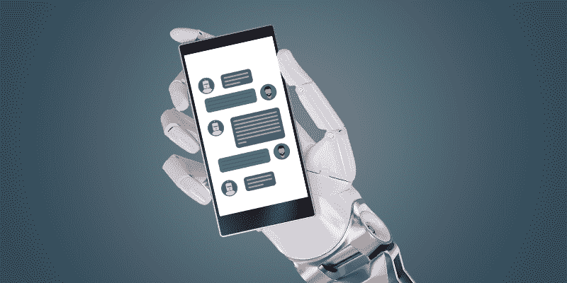
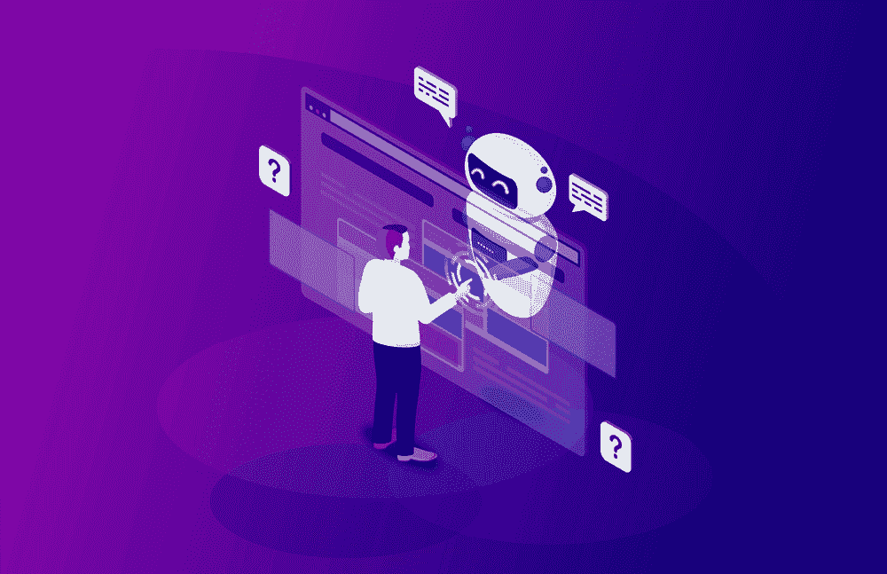
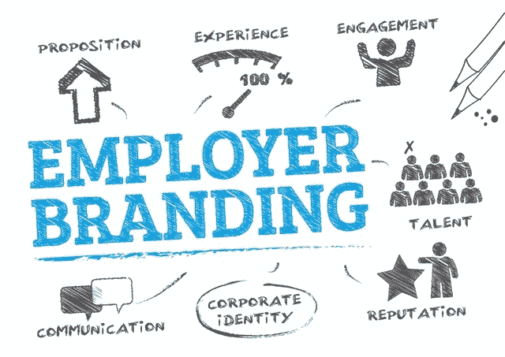
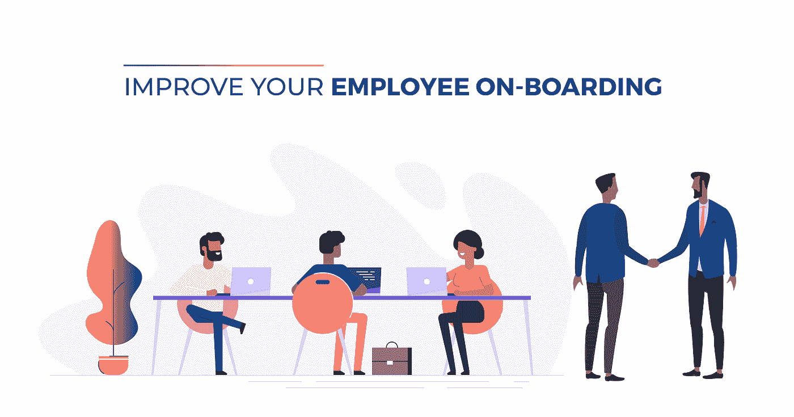
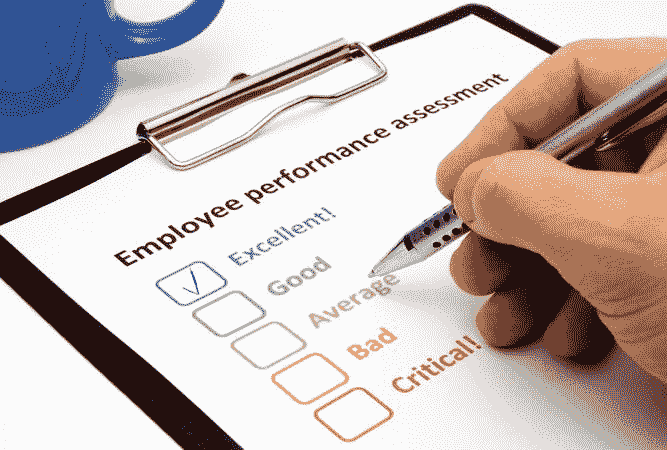
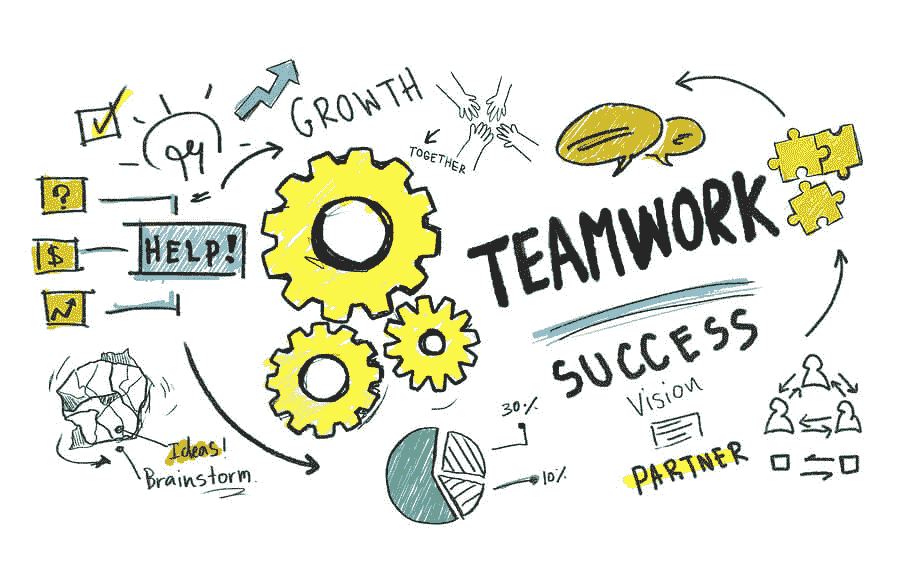

# 聊天机器人和人工智能如何改变人力资源的格局？

> 原文：<https://medium.datadriveninvestor.com/how-chatbots-and-ai-are-changing-the-landscape-of-human-resource-58f3c49046a?source=collection_archive---------4----------------------->

以人性化的方式管理资源是任何组织的人力资源部门的主要目标。然而，我们已经看到自动化接管了几乎每个垂直领域的劳动力，包括招聘、员工入职等等。AI(人工智能)和聊天机器人已经成为彼此的代名词。人工智能聊天机器人驱动的劳动力一直在与成本和效率作斗争，这是数字化转型战略的核心要素之一。

数字化转型战略中的智能自动化使人力资源改变了当前的劳动力，增强了能力，减少了负债。

 [## 对话式人工智能的兴起将如何影响世界|数据驱动的投资者

### 从不同的专业服务，保险，教育，金融，旅游，电信，到建筑，银行，和…

www.datadriveninvestor.com](https://www.datadriveninvestor.com/2019/02/07/how-the-rise-of-conversational-ai-will-impact-the-world/) 

**人力资源的数字化转型值得大肆宣传吗？**

让我们试着找出答案吧！

根据最近的 [Forrester 调查](https://www.amdocs.com/media-room/consumers-want-female-and-funny-not-youthful-chatbots)，据说在五年内，企业内近 85%的客户交互将与软件机器人进行，87%的首席执行官希望通过构建人工智能机器人来扩大他们的人工智能劳动力。

这些数据再次证明了通过人工智能聊天机器人实现自动化劳动力互动的重要性。**这样的转变有助于让人力资源更人性化吗？**

**聊天机器人如何让 HR 更人性化？**

在组织层级中，人力资源被认为是一个更人性化的部门，在更深的层次上与员工联系，通过人性化的方法解决不满。

## 在这种情况下，人工智能机器人如何提供帮助？

人工智能聊天机器人只能用于交流和解决问题，但没有人情味。

**这种方法有助于解决查询吗？**

**答案是肯定的**。

它肯定有助于以更快的速度解决查询，而没有太多的障碍。这种方法将有助于消除低效率，也有助于减轻人力资源部门在问题、日程安排等方面的工作量。

为了消除效率低下和成为错误回复的回应者的风险，您可以始终围绕**混合代理+人工智能技术**的选项工作。在这项技术中，每当有新的遭遇时，聊天机器人都可以向人类代理学习。每当聊天机器人面临一个超出其逻辑和计算能力的新问题或互动时，就会有一个人类代理加入到这个过程中。这将确保聊天机器人在基于人工智能+混合代理技术的人类逻辑交互中占据优势。

**忽略如果你没有或者如果你正在寻找专家聊天机器人开发外包合作伙伴**，那么我建议你联系这些专家。

 [## 印度和美国顶级移动应用开发公司| iOS 和 Android 应用开发商| Appinventiv

### Appinventiv 是印度和美国领先的移动应用程序开发公司，面向初创企业和企业，专注于高质量…

appinventiv.com](https://appinventiv.com/)  [## 雇佣聊天机器人开发者|印度聊天机器人开发公司

### 建立互动和定制的聊天机器人，这是人工智能供电和机器学习编码。我们的聊天机器人开发者构建…

www.valuecoders.com](https://www.valuecoders.com/hire-developers/hire-chatbot-developers)  [## Bitbot 工作室|聊天机器人开发者|我们构建和设计定制聊天机器人

### 当我们第一次冒险进入人工智能技术的世界时，BitBot 团队是一个出色的团队。我们的使用案例…

bitbotstudios.co](https://bitbotstudios.co/) 

**以下是你的人力资源部门将从聊天机器人人工智能支持的通信和数字化转型中受益的一些方式:**

# **招兵买马**

招聘过程自动化将有助于减少人力资源问题。这将有助于最初的筛选过程，因为人力资源部门必须一次分析几份简历，这将减轻沉重的负担，同时最大限度地减少持续的简历筛选和过滤。不仅仅是最初的筛选，它还可以帮助你进行背景调查，这是核实员工背景和以前工作经历记录等的重要而繁琐的过程之一。人工智能聊天机器人可以帮助你调查员工的背景，并寻找合适的候选人。

# **雇主品牌**

为你的组织吸引适量的人才并不像听起来那么容易。对于潜在和可行的候选人来说，向前看并在候选人心目中树立积极的品牌形象是至关重要的。积极的品牌形象和雇主品牌将有助于吸引合适的候选人。人工智能聊天机器人招聘过程的影响可以区分公司对每个候选人的态度。统一和标准化的方法有助于在沟通和品牌方面实现一致性，以满足候选人的需求。

# **员工入职**

对于员工入职，人力资源人员需要收集基本文档信息，如公积金扣除、税收、基本员工信息文档等。对于人力资源专业人员来说，一次招聘几名员工是一项耗时的工作。使用支持人工智能的聊天机器人总是可取的，这些机器人可以通过对话界面帮助与新员工联系，新员工可以在对话界面中提出问题并解决最初的疑问。它还可以通过收集员工信息、填写表格和协助在线注册来帮助加快员工入职流程。

# **员工培训**

人工智能聊天机器人在员工培训中发挥着重要作用，如销售培训、软件培训、业务培训、软技能培训等。由于时间有限，个人培训不会产生更大的影响。牢记这些限制，现代聊天机器人提供了一个可喜的变化。人工智能聊天机器人拥有提供个性化和基于实用程序的内容的能力，可以帮助分离信息，从而满足员工的需求。为了提供交互式和基于实用程序的内容，支持人工智能的聊天机器人可以帮助你完成员工培训模块，这些模块与标准培训模块不同，标准培训模块的观看演示不足以引起员工对这些模块的关注和反应。

# **年度自我评估/审查**

大多数人力资源人员都面临着与自我评估和审查相关的问题。58%的人力资源人员认为传统的审核流程已经过时，无法通过评估和自我评估反馈周期评估个人的绩效晴雨表。支持人工智能的聊天机器人可以帮助提供即时反馈、建议和绩效见解，使员工能够通过不断的评估和反馈实施保持最佳状态。

# **团队协助**

人工智能聊天机器人不仅有助于人力资源招聘，还可以同时帮助其他团队。人工智能聊天机器人不仅可以帮助现有的人力资源运作和调度，而且还可以并行地帮助其他团队。通过实现自动化和团队协助，这将大大减轻人力资源运营端的负担。

# **报销政策**

管理数量庞大的劳动力并不像听起来那么容易。它需要人力资源部门的大量集体努力来解决问题，并让他们了解报销政策，这需要在操作层面进行计算。有时，员工对即将发生的问题感到沮丧，因此导致员工保留率低，这不符合公司的需要。因此，通过人工智能聊天机器人实现人力资源自动化将有助于解决这些问题，并且当员工和人力资源在月底计算费用时，他们将从他们的脑海中卸下大量负担。

最后一点:人工智能聊天机器人真的有所作为吗？

人力资源部门的人工智能聊天机器人自动化确实在简化企业运营方面发挥了作用，无论是与人力资源相关的运营，如调度、计算工资、管理费用等。人工智能支持的自动化不会帮助人力资源部门，但它也将有助于同步其他部门。

支持人工智能的聊天机器人已经得到了更广泛的采用，我们可以预计，随着企业期待投资聊天机器人和人工智能的自动化，近年来将会有更大的采用。

希望有帮助！

感谢阅读！