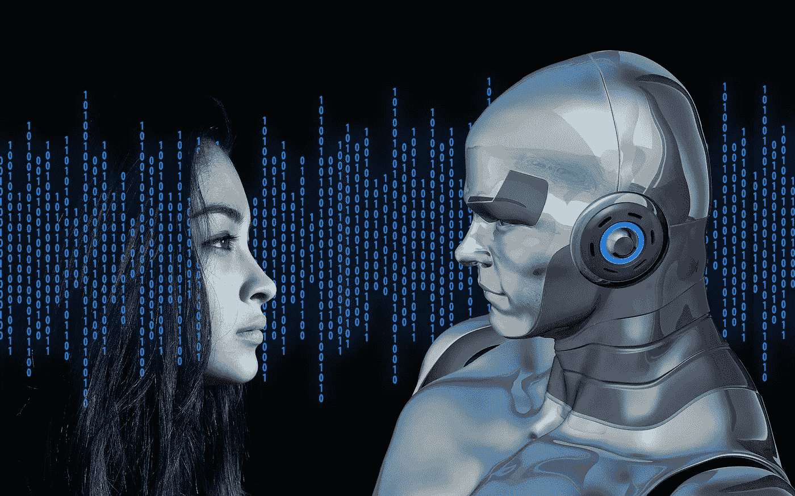
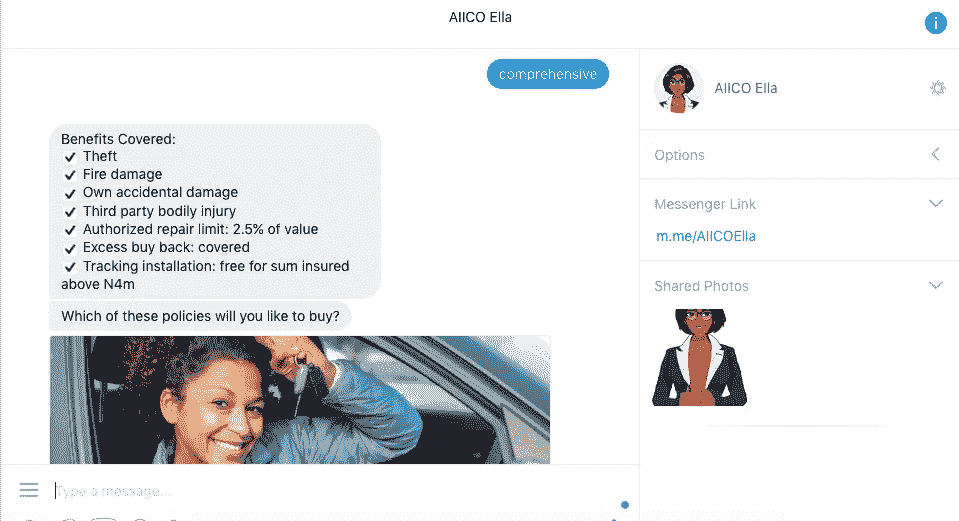
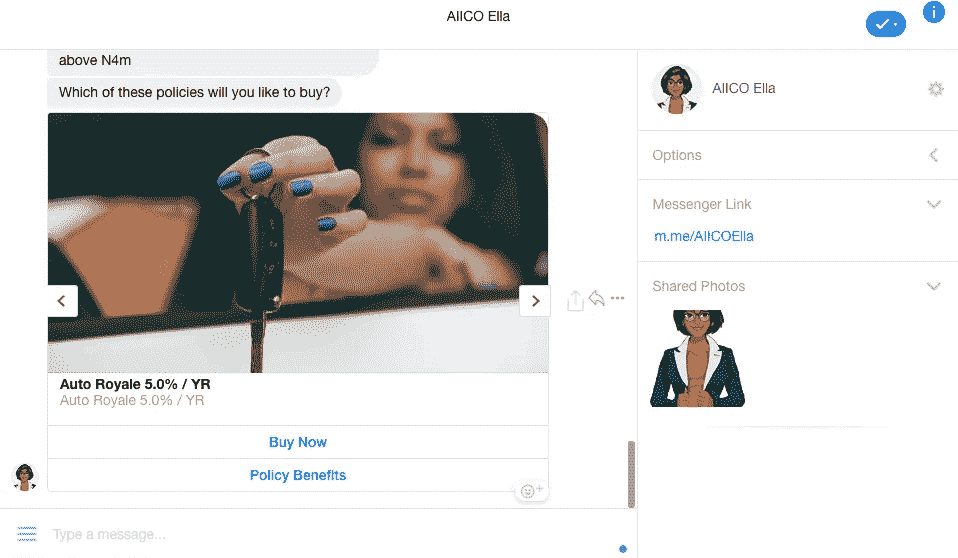
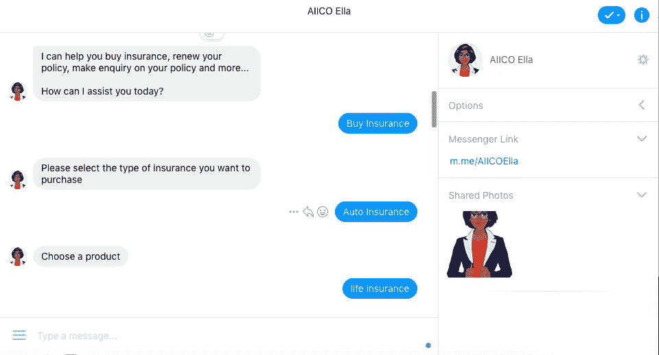

# 聊天机器人如何改变保险游戏？

> 原文：<https://medium.datadriveninvestor.com/how-chatbots-are-changing-the-insurance-gameplay-3423ab3071f3?source=collection_archive---------2----------------------->

> 到 2025 年，人工智能机器人将驱动 95%的客户服务互动
> 
> 来源:[服务](http://servion.com/)

我和我的一位开发人员朋友聊到了将人工智能聊天机器人集成到他正在开发的任何服务中的可能性。

聊天机器人是一个平台，旨在像人一样理解、学习和交谈，并实时回答特定的查询。聊天机器人可以很容易地修改对话，使其更个性化，更受客户欢迎。

我们观察了人工智能机器人的不同行业和用例，其中一个特定的领域不断出现。

**保险**。

在尼日利亚，有几家保险公司使用聊天机器人。

AIICO ELLA 和联合保险有限公司与 Max 聊天机器人

I had a chat with AIICO ELLA and asked for comprehensive insurance

我是一个名为 Accion venture lab[Company builder 的技术加速器项目的成员。](https://medium.com/@daramolabola/take-a-shot-at-accion-venture-lab-company-builder-program-586585c1187)我们花了几周时间与 14 位企业家一起在尼日利亚确定、验证和推出面向消费者的金融科技商业模式。

我注意到保险是最少被谈论的，被认为是新玩家难以进入的领域。今天经过一番研究，我明白了为什么保险行业需要人工智能。

使用自动化，购买汽车和旅游保险既快又容易。

谈到保险，首先想到的是冗长的表格、问卷、背景调查和有限的客户支持服务。研究表明，与银行、教堂和超市相比，世界上大多数客户都不太信任保险业。

人工智能提供的改进将使保险公司在竞争中处于领先地位。随着聊天机器人变得越来越智能，它们为保险业带来了效率和客户满意度的新标准。

这些聊天机器人能够在机器人无法回答复杂问题的情况下，将聊天重定向到人类。

我第一次接触聊天机器人是在 [kudi.ai](https://kudi.ai) 上。我试着通过他们的聊天机器人转账，速度很快，感觉我 50%的时间都在和一个真人交谈。

使用聊天机器人现在被视为一种恭维。聊天机器人可以帮助客户入职和欺诈索赔。它通过简化生活、汽车和旅游政策查询来做到这一点。他们有助于避免无所事事，因为他们可以快速分析从客户那里收集的数据，从而计算出与他们的档案相关的风险。

与聊天机器人互动的消费者可以全天候获得他们需要的信息。它提供了一种定制的构建体验，因为机器人有能力提出正确的问题，并理解它们收到的信息。

聊天机器人正在扰乱保险业。

它们是个性化的，易于部署。

我在公司提供的最接近 24/7 客户支持的服务是通过 [drift](http://www.drift.com) 实时聊天完成的。让一台机器取代我或增加我与客户的互动和效率的想法让这个兔子洞成为一个有趣的地方。

在看了尼日利亚的其他保险机器人之后，我会推荐 AIICO ELLA。

他们的聊天机器人是 Ella，AIICO 的 24/7 虚拟助手，负责购买保险、续保和索赔报告。

Different Auto Insurance options on AIICO

我发现 Ella 目前只在 [Facebook Messenger](https://www.messenger.com/t/AIICOElla.) 上可用，我希望他们尽快找到这个帖子并部署到 WhatsApp 等其他平台上。这将有助于增加他们的市场份额，从而比竞争对手更有优势。

包括人工智能(AI)在内的尖端技术一定会给 AIICO 保险带来巨大的机遇。

不愿利用这项技术的保险公司可能会错过大量渴望投保并带来更多业务的客户。

比赛场地仍然敞开着，只有那些正在比赛的人才能真正获胜。

> 我期待 2025 年！