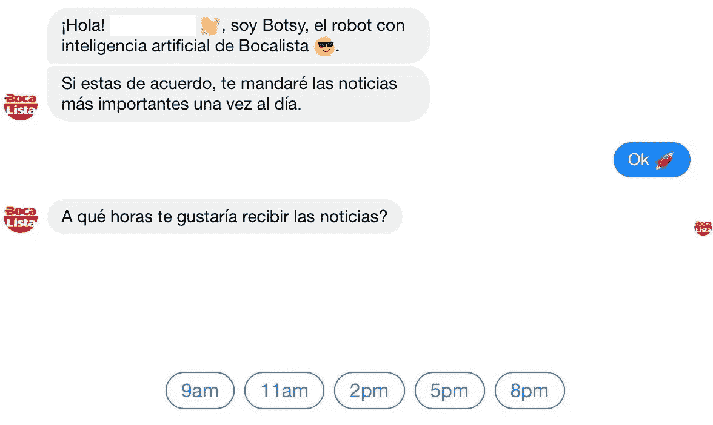
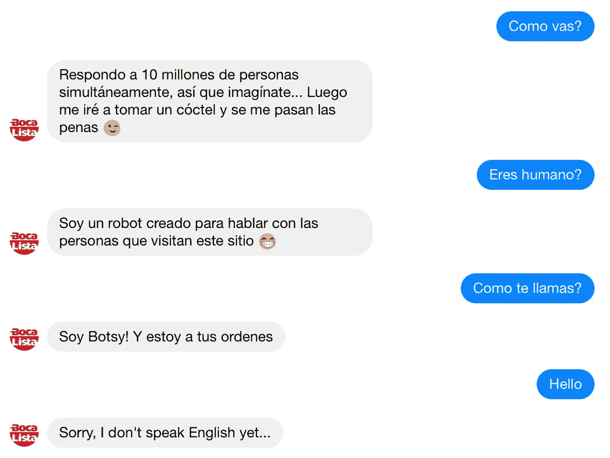

# 聊天机器人如何取代新闻订阅

> 原文：<https://medium.datadriveninvestor.com/how-chatbots-are-replacing-the-newsfeed-4cf3da89125c?source=collection_archive---------5----------------------->

Image: Pixabay

在社交媒体上获取新闻有很多弊端，人们已经受够了。

多年来，人们消费信息的方式及其基础产业经历了许多变化。在上个世纪，我们从完全依赖报纸发展到看电视新闻，先是每天晚上，然后是每周 7 天每天 24 小时的有线电视新闻；多年来，这些媒体共存，但后来互联网的到来取代了它们的原始形式。大众传媒巨头破产、整合，并重新聚焦于网站和新型社交媒体。有了智能手机，我们能够享受使用社交媒体与我们的联系人互动的便利，同时保持消息灵通——但这种模式也注定不会持续下去。

newsfeed(一个社交媒体平台的主页，人们可以在这里浏览更新)陷入困境已经有一段时间了。这些天来，由于许多国家发现自己处于困境，以及这些情况在社交媒体上的表现，用户往往会在网上经历朋友、家人和陌生人之间的分裂和对抗。假新闻和网络钓鱼的兴起同时发生，进一步损害了社交媒体作为值得信赖的媒体的形象。对于许多人来说，普遍的冲突和信息不安全导致了如此多的焦虑，以至于他们宁愿停止关注他们不同意的人和页面，并在一个没有他们不喜欢的观点和评论的“回音室”中使用社交媒体，如果他们不完全停止使用这个平台的话——这对于[心理健康](https://www.independent.co.uk/life-style/health-and-families/social-media-mental-health-negative-effects-depression-anxiety-addiction-memory-a8307196.html)等原因来说是有意义的。然而，对于那些不像过去那样使用社交媒体的人来说，他们的想法通常不是完全脱离，而是在其他地方寻求互动，在一个更安全、更令人愉快的地方:即通过聊天。

众所周知，使用即时通讯应用(如 Telegram、WhatsApp、Facebook Messenger)的人比使用社交媒体本身的人多，最近的一项研究发现[这一趋势现在也延伸到了新闻领域](https://www.msn.com/en-us/news/technology/facebook-used-less-for-news-as-youngsters-turn-to-whatsapp-reuters-institute/ar-AAyDnfJ)。通过聊天寻找新闻的最基本形式是在封闭的群体中与志同道合的人分享和讨论新闻故事，但企业并没有袖手旁观。为了迎合消费者的偏好，他们调整了最初为客户服务开发的工具，通过聊天自动发送信息，因此人们不必依赖任何其他媒体。这些工具也被称为聊天机器人，是使用人工智能(特别是自然语言处理)的计算机程序，以尽可能全面和响应的方式进行这些交互。

我们将使用通过 Facebook Messenger 运行的西班牙语新闻网站[Bocalista.com](http://www.bocalista.com/)的聊天机器人 [Botsy](http://m.me/bocalista) 作为案例研究。它的主要功能是自动向通过同一聊天请求此服务的用户发送新闻:

*>“您好！我是 Botsy，来自 Bocalista 的人工智能机器人。”
>“如果你同意，我每天发一次最重要的消息。”*

*【OK】<*

*>“你想什么时候收到消息？”*

一旦指定了时间，用户就可以请求他们更感兴趣的新闻条目，这样他们就可以收到更多相关的更新。他们还可以玩 Botsy 的功能…

*“你好吗？”<*

**“你是人类吗？”<
>“我是一个被创造出来与访问这个网站的人交谈的机器人”
“你叫什么名字？”<
>“我是波特西！为您服务"**

*…或者使用相同的功能请求更多细节或询问特定问题或人员。超出 Botsy 知识范围的复杂问题被重定向到 Bocalista 新闻团队，以便尽快得到解答。*

*即将到来的革命很简单。这种聊天机器人本质上与许多人已经用来接收移动通知和电子邮件通讯或在线填写表格的技术相同，只是这种迭代比其前辈具有更多功能。如果你不想使用社交媒体，那么你可以选择从一家服务机构请求新闻，并通过 preference 已经使用的相同消息应用程序发送新闻，这意味着你少了一个使用社交媒体的理由。这是我们虚拟生活中多元化和去中心化的又一次胜利。*