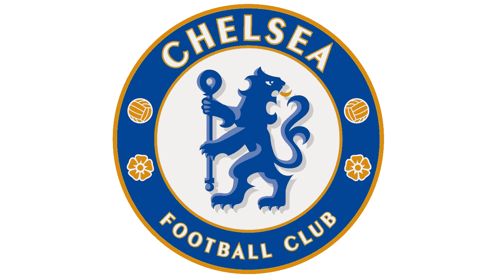
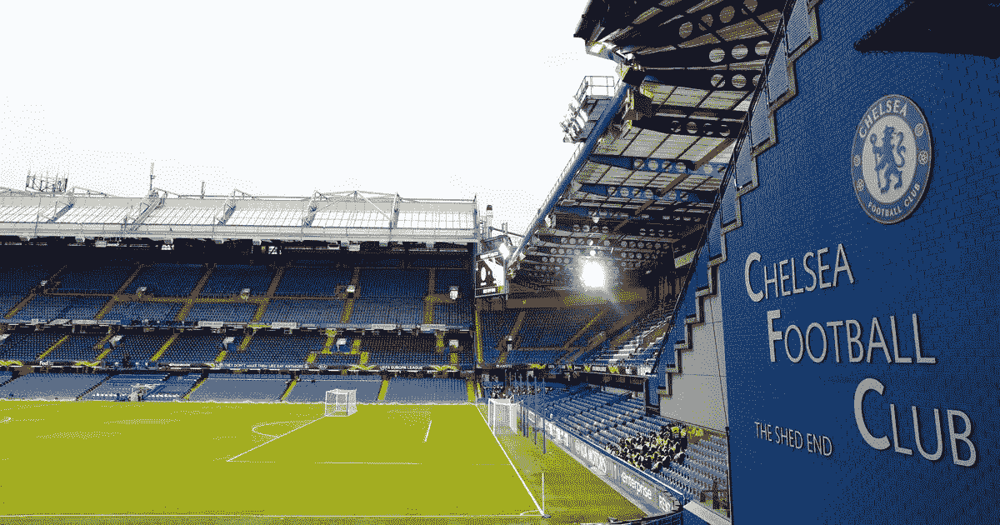
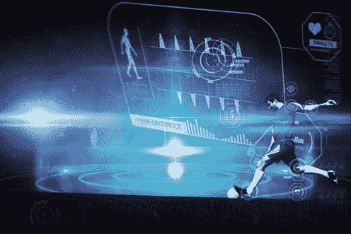
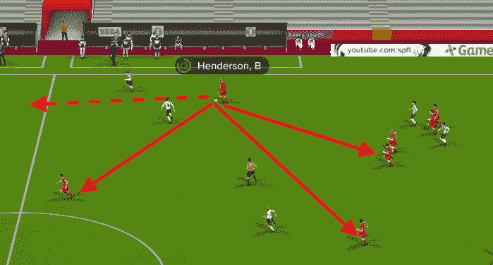

# 切尔西如何使用人工智能…

> 原文：<https://medium.datadriveninvestor.com/how-chelsea-is-using-ai-3aaffdd53800?source=collection_archive---------4----------------------->

C.c 罗，L .梅西等。并不流行，因为他们有极端的技术，但他们有冷静的反应和瞬间移动，这使他们成为最伟大的足球运动员。那么，俱乐部有没有可能帮助球员训练身体的同时也训练大脑呢？
嗯，根据[(点击供图)](https://www.mdpi.com/2075-4663/6/4/130)发表于 2018 年 10 月的论文*伦敦拉夫堡大学，切尔西的 FC 使用人工智能开发了一个系统来衡量这些决策技能。*

**

*训练数据是几个赛季的球员和球在每场比赛中的轨迹，然后创建不同比赛位置的模型。然后，我们可以想象一个玩家在不同的位置可能采取的不同的移动。就像如果一名球员传球，那么我们的机器可以考虑力量等因素产生运球的替代结果。*

* [## 深度学习用 7 个步骤解释-更新|数据驱动的投资者

### 在深度学习的帮助下，自动驾驶汽车、Alexa、医学成像-小工具正在我们周围变得超级智能…

www.datadriveninvestor.com](https://www.datadriveninvestor.com/2019/01/23/deep-learning-explained-in-7-steps/) 

正如我们所知，一个[监督的](https://towardsdatascience.com/supervised-vs-unsupervised-learning-14f68e32ea8d)或[非监督的](https://towardsdatascience.com/supervised-vs-unsupervised-learning-14f68e32ea8d)机器学习方法在这里是行不通的。我们需要强化学习-RL 类型的方法。它基本上是一个代理人试图在一个前所未见的环境中最大化它的回报(而且是基于时间的)。在这里检查一下学校的 Ai 课程[。](https://www.theschool.ai/)

在这里，他们使用了一个被称为[模仿学习](https://dl.acm.org/citation.cfm?id=3054912) -IL 的特定分支，这是学习顺序决策政策的强化学习的一个强大而实用的替代方法。模仿学习受益于核心学习技术的最新进展，演示数据的可用性&保真度的提高，以及深度学习带来的计算进步。

如果你想深入了解，这里有[资源](https://sites.google.com/view/icml2018-imitation-learning/)。

嗯，用 IL 代替 RL 是有原因的。在 RL 中，在像[深蓝](https://en.wikipedia.org/wiki/Deep_Blue_(chess_computer))、 [AlphaGo](https://deepmind.com/research/alphago/) 等情况下，通过反复尝试移动直到它收到反馈说它已经做了正确的事情，就像我们通过给它奖励来训练狗做某事一样。但是大多数现实世界的场景都没有具体的奖励。

另一方面，模仿学习试图通过观察专家如何执行任务来理解潜在的决策政策，然后试图模仿专家。

我们都知道艾登·佩德罗是怎么玩的。他们用自己的职业技能快速做出决定，关注其他玩家，同时对他们和许多事情做出反应，使这样的人工智能很难编程。

谈数据，要尽可能反映真实世界。它不应该只是显示球员如何相对于彼此和球移动，还应该捕捉他们有多少耐力，他们在比赛中的某一点有多累。例如，球员们是想进攻还是防守，或者他们想在 90 分钟时间不足的情况下取得胜利/平局。

还有一些先进的(人工智能方法)情况，比如在锦标赛中，一支球队可能[想要输掉](https://www.telegraph.co.uk/world-cup/2018/06/28/england-should-want-lose-against-belgium/)一场比赛，这样他们在下一轮的位置就给了他们一个更容易的对手。

拉夫堡大学的研究人员已经建立了一个系统，可以创建一个球员相对于彼此和球的运动模型，用于研究表现。(*方法&算法还没有开源，我希望它一出来就做一个新的博客*。)

他们现在计划通过添加玩家的身体姿势、心率(代表疲劳)和游戏天气(如下雨、下雪、晴天等)的细节来使模型更加真实。他们正在进一步打造一个系统来衡量当前玩家的技能，并希望在两年内拥有一个功能齐全的系统。

这将对足球以及 ML 产生巨大的影响。会影响球员和教练分析比赛的方式，尤其是赛前或赛后分析。这将有助于玩家通过看到他们的行为如何产生影响而更加反思。

这也将改善选拔过程，因为球探和俱乐部将能够使用关于这些重要决策技能的数据来选择球员和识别人才。

我们人类非常善于适应复杂多变的环境，并在其中做出决策。因此，通过学习模仿人类决策，人工智能将能够应对各种人们不总是遵守规则的陌生环境。

多年来，人工智能一直被用于预测足球比赛的结果，但以这种方式使用人工智能，似乎像哈利·波特一样的幻想成真了。* 

**原载于 2019 年 1 月 2 日*[*【blog.lipishala.com】*](https://blog.lipishala.com/2019/01/02/how-chelsea-is-using-ai/)*。**