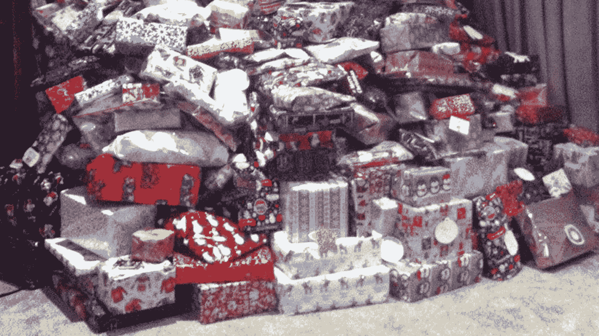
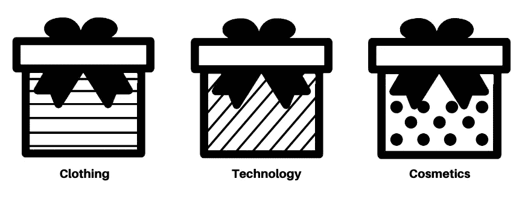
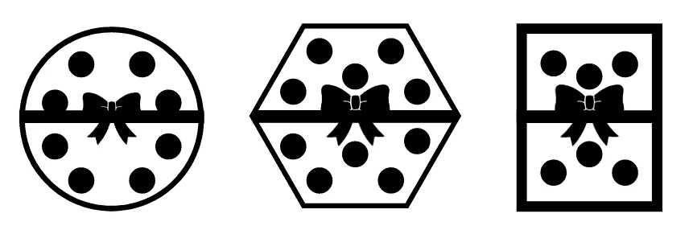
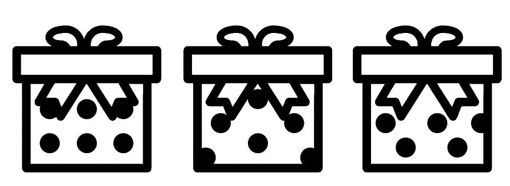
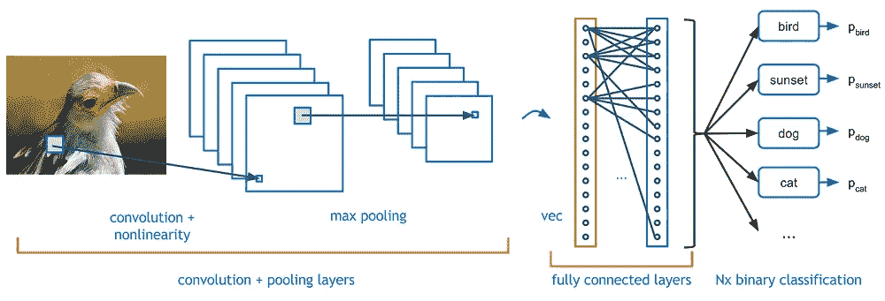
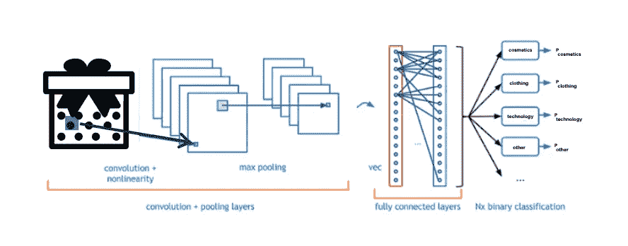

# 卷积神经网络如何拯救圣诞节

> 原文：<https://medium.datadriveninvestor.com/how-convolutional-neural-networks-saved-christmas-6260faca3e0e?source=collection_archive---------5----------------------->

> 答:本文假设对人工智能和神经网络有一个基本的了解——作为背景，[查看这个](https://medium.com/datadriveninvestor/neural-networks-demystified-34bee0c45fb7)。

又快到一年的这个时候了……**圣诞节**！走到外面，你会看到冰雪，听到欢快的歌曲，差点冻死！因为谁不喜欢❄️零下的好天气呢？

但是对于许多孩子，甚至一些成年人来说，节日最精彩的部分当然是礼物。圣诞老人对华而不实的小玩意、酷玩具和针织毛衣的承诺听起来棒极了！

为了实现他们的愿望，圣诞老人和他的小精灵们不知疲倦地制造、分类和运送礼物给“好名单”上的每一个人。

不幸的是，今年，精灵们搞混了，犯了一些错误。现在，**几万份礼物完全乱了套**，精灵们超级不知所措！

This… times 100

不要害怕——虽然组织一切对精灵来说似乎令人生畏，但对深度学习框架来说这没什么。今天，我们将利用这项技术来拯救圣诞节！

# 酷！但是深度学习是什么意思呢？

伟大的问题，强大的帮手！深度学习指的是具有不止一个隐藏层的神经网络。通过使用 multiple，我们有能力用我们的模型解决和处理更困难的任务。比如整理成千上万的礼物！

“神经网络”仍然相当宽泛。毕竟，我们有几种类型的方法，都用于不同类型的问题。我们在这里用哪个？

正如你可能从标题中猜到的，美国助手将使用*卷积*神经网络。这就启用了*计算机视觉！*对我们有利的是，**计算机视觉**被设计用来执行**物体检测**和**图像分类。**

怎么会？因为，正如“计算机视觉”这个名字所暗示的，它赋予了我们的计算机看的能力！

我们将用它来分类不同种类的礼物。

这里需要深度学习，因为用简单的 if/else 语句，我们的程序在实践中往往会不准确。并不是所有的礼物看起来都一样，位置都一样，或者框起来都一样，所以我们的代码对于不同于它所针对的单个例子的礼物照片变得脆弱。使用神经网络我们避免了这些问题，因为我们在多张不同的照片上训练我们的模型！

# 我们需要将礼物按照它们的样式分类。

不打开礼物就看不到里面的东西，这对我们的精灵来说可不是一个选择。幸运的是，他们设计了一种方法，通过使用礼品包装图案，根据礼物的内容进行分类。你看不到盒子里面，但你可以看到外面。

通过给不同类型的礼物分配独特设计的礼品包装，我们聪明的精灵们有了先见之明，可以防止礼物被弄乱时造成大规模混乱。不幸的是，这发生了。

Types of gifts and their corresponding gift wrap

但是不要害怕！我们可以教我们的卷积神经网络将我们的礼物分类，方法是将这个分类系统变成一个数据集。我们将把这个展示给我们的 CNN，从而教会它理解每种礼物对应的模式。然后，它将能够查看我们所有的礼物并为我们分类，这样圣诞老人的精灵就不需要手动整理成千上万的礼物了！

# 扩充数据集

在我们开始构建模型之前，我们需要更多的“训练数据”。训练数据指的是我们向我们的计算机展示的东西，以便它学习如何区分某些类型的礼物。通过获得更多的训练数据，我们的计算机可以在礼物分类方面做得越来越好，这样孩子们就不会有他们没有要求的东西了！

这个过程被称为**数据扩充**，我们有简单的方法来使用它。

并非所有的礼物都采用相同的形式，所以我们可以*重塑*我们的训练数据。

Reshaped variants of cosmetic presents

一些孩子运气好，收到的礼物比其他孩子大。考虑到这一点，让我们*调整*我们的训练数据。

Resized variants of clothing presents

最后，礼品包装并不是每次都放在同一个地方*->让我们来看看其他看起来不一样的例子*！

Wrapped variants of cosmetic presents

厉害！我们现在准备建立我们的卷积神经网络！

# 构建 CNN

> 答:这一部分假设你对 CNN 有相当直观的理解。关于背景，[看看这个](https://medium.com/datadriveninvestor/a-beginners-guide-to-convolutional-neural-networks-49384c75d1a?source=your_stories_page---------------------------)。

我们现在需要建立我们的网络！这是一个关于 ConvNet 架构的视觉提示。

然而，我们不是在给动物分类…我们想给我们的礼物分类！这是我们的卷积神经网络的样子。

在我们的模型中，我们的数据集分为训练数据和测试数据。测试数据是为我们的 CNN 确定它在分类礼物的看不见的例子照片上有多准确。

我们的 CNN 从我们的训练数据中训练和学习，每次都通过反向传播提高其准确性。然后，它对训练数据样本进行自我测试，以测量其*验证准确性*。这个指标代表我们的卷积网络在真实礼物上的表现有多准确，因为我们希望尽可能有效地解决我们的混杂礼物问题，所以我们希望得到尽可能高的验证准确度分数。

# 拯救圣诞节！

我们现在可以通过实施我们的 CNN 来帮助那些在圣诞老人工作室的人！精灵是熟练的工人，他们制作了一台起重机来帮助我们搬运和分类礼物。我们的深度学习模型控制这个系统，通过图像分类告诉它每个区域要放哪些礼物。

我们的礼物目前乱七八糟地堆在车间中央。

This… times 100

然而，由我们的模型控制的机械臂正在稳定地聚集它们。首先对礼物的一个区域拍照，它对它们中的哪一个属于哪一种类型进行分类(例如，水平线->衣服)，并实际地将礼物移动到那里。

大约 15 分钟后，我们超高效的起重机为我们清理并分类了所有的礼物！这都归功于计算机视觉和 CNN 的力量！

现在，世界各地的孩子们将会准时收到他们想要的礼物。非常感谢你的帮助，节日快乐！

*如果你喜欢这篇文章，请随时在 joshuapayne1275@gmail.com 的* [*LinkedIn*](https://www.linkedin.com/in/joshua-payne-0bb2a7194/) *联系我。感谢阅读！*