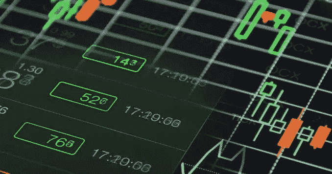
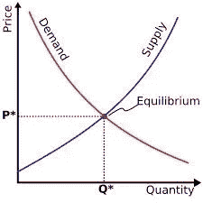

# 解释了加密货币的价格如何运作以及是什么决定了它的价格。

> 原文：<https://medium.datadriveninvestor.com/how-cryptocurrency-prices-work-and-what-determines-its-prices-explained-68be3fe03a1e?source=collection_archive---------23----------------------->

法定货币和加密货币有什么不同？
法定货币和加密货币价值最显著的区别在于，法定货币由一个国家的中央银行和中央政府支持，被认为是合法的。法定货币在今天的交换媒介中有价值的原因是中央政府宣布它有价值，人们信任这种货币来购买商品和服务。

今天所有被认可的国家都在法定货币体系下运行，货币储备和中央银行控制着货币供应，因此，间接地，有时甚至是直接地控制着通货膨胀。他们如何直接控制通货膨胀？基本上，货币的数量是印刷出来的，或者是中央银行发放的贷款的数量。

例如第一次世界大战后的德国，他们试图通过印刷钞票来偿还凡尔赛条约后强加给他们的债务，这导致他们的法定货币贬值，因为市场上有更多的货币。1922 年 11 月，面包的价格是 163 马克，整整一年后，1923 年 11 月，面包的价格变成了 2000 亿马克，疯狂吧？还有更多关于中央银行如何控制货币价值的例子，但更多在以后。

**另一方面**，加密货币不受当局或中央政府控制，在大多数地区不被接受为法定货币。此外，几乎所有的加密货币(如果不是全部的话)都有固定的供应量，因此，加密货币的贬值在通货膨胀中基本不存在。

**除了那个**，加密货币和法币都是由几乎相同的特征支持的。这两种方法都可以用来购买商品和服务，并且两种方法都有相对的价值储存。

**为什么加密货币的价值波动如此之大？**
加密货币的整个概念、技术及其市场都是全新的。许多人甚至还没有听说过它，许多听说过它的人直到今天还不明白它是什么以及它是如何工作的。

新生市场有一些特质使其如此不稳定。
每天都有大量的人加入加密货币市场。事实上，在 2018 年初，加密货币交易所报告称，他们每天增加约 10 万名新用户。这导致了市场波动性的增加，因为这些新来者中的许多人将在加密货币的价值上升或下降中获得巨大的既得利益。
其次，与外汇市场等传统经济相比，加密市场的流动性有限。由于加密市场仍然是新的，它有一个非常薄的市场，自然会快速移动，这增加了加密货币价格的波动性。

加密货币价格的最大决定因素是供应和需求概念。基本上，如果一个代币在有限的供给下有很高的需求，它的价值自然会上升。另一个巨大的因素是媒体。例如，在 2017 年末，大约在 12 月份，比特币的价格最高。媒体唯一谈论的是比特币，我无意中听到的几乎所有对话都是关于比特币以及每个人都想投资比特币。所有这些宣传是促使人们在 2017 年投资这项新技术的原因之一。

**我们，** [Biditex](https://medium.com/@biditex) 团队，每天发布有关其新闻的加密相关文章，每周市场回顾和信息性文章。

*如果您想了解更多，请访问 BIDITEX 页面并提出您的问题，关注我们的*[*Twitter*](https://twitter.com/biditex_com)*，* [*脸书*](https://www.facebook.com/biditex/) *，* [*中型*](https://medium.com/@biditex) *，* [*电报*](https://t.me/biditex%20%28edited%29) *等。投标变更用***。**

## *DDI:*

* [## 为什么数据会改变投资管理

### 有人称之为“新石油”虽然它与黑金没有什么相似之处，但它的不断商品化…

medium.com](https://medium.com/datadriveninvestor/why-data-will-transform-investment-management-4a60966c1c81)  [## 投资算法快速指南

### 让我们想象一下 30 年前的股市…

medium.com](https://medium.com/datadriveninvestor/a-quick-guide-to-investment-algorithms-628450b9dc55)*